# Sea Ice Diagnostics in ACCESS-ESM1.6

As far as possible, the default configurations of ACCESS-ESM1.6 output sea ice diagnostics in 
the format requested for CMIP7 as native output.

### Masking over time and space


It's import to note that CMIP 6/7 sea ice diagnostics are averaged using two different methods, as described in Notz et al. 2016:

- _extensive_ : for variables proportional to sea ice concentation (area fraction), these are averaged over all time and ocean cells. These are marked with the `cell_methods` : `area: mean where sea time: mean`

- _intensive_ : for variables not proportional to sea ice concentration, these are averaged only when there is sea ice in the cell. These are marked with `cell_methods`: `area: time: mean where sea_ice (mask=siconc)`. 

Using a `siflcondtop` as an example, intensive diagnostics are calculated as: 

$$ siflcondtop = \frac{\displaystyle\sum_{n=0}^N (aice * fcondtop)}{\displaystyle\sum_{n=0}^N (aice)} $$

where N is the number of timesteps in the averaging interval, `aice` is the sea ice fraction in the timestep, and `fcondtop` is the conductive heat flux in that timestep.

Therefore intensive variables should be interpreted as the average over only the proportion of the averaging interval that sea ice was present. It is possible to convert between extensive and intensive variables by multiplying by sea ice conentration averaged at the same frequency, which returns a grid cell average for the variable:

$$ siflcondtop * \frac{siconc}{100} = \frac{\displaystyle\sum_{n=0}^N (aice * T_{surface})}{\displaystyle\sum_{n=0}^N (aice)} *  \frac{\displaystyle\sum_{n=0}^N (aice)} {N} 
= \frac{\displaystyle\sum_{n=0}^N (aice * T_{surface})} {N}
$$

The use of _intensive_ variables has the impact that sometimes diagnostics may have the
same or similar descriptions but be masked differently.

e.g. 

There are seperate ocean and sea ice variable labelled *Water Flux into Sea Water Due to Sea Ice Thermodynamics* 
 - siflfwbot is masked only where sea_ice (in time and space)
 - fsithem (as an ocean diagnostic) is in all wet cells for all time
 
both are reported in `kg m-2 s-1` but the areas and time they are calculated for are different

*Thickness*
- sivol is Sea-Ice Volume per Area, calculated using grid cell area
- sithick is a true Sea-Ice Thickness (alternative description would be Sea Ice Volume per Sea Ice Area)

both are repored in `m`

In the sections below, we provide some general comment and validation of diagnostics, split into groupings by diagnostic purpose

### Load Data

To demonstrate some concepts, we are going to load some data.


```python
PATH = "/g/data/p73/archive/CMIP7/ACCESS-ESM1-6/spinup/Nov25-NewNitrogen/output280/"

import xarray as xr
import cf_xarray
from matplotlib import pyplot as plt
```


```python
daily_ds = xr.open_mfdataset(f'{PATH}/ice/iceh-1daily-mean_*.nc', decode_times=xr.coders.CFDatetimeCoder(use_cftime=True))

monthly_ds = xr.open_mfdataset(f'{PATH}/ice/iceh-1monthly-mean_*.nc', decode_times=xr.coders.CFDatetimeCoder(use_cftime=True))

ds = monthly_ds.isel(time=0)
```


```python
# divide hemishperes exactly
NJ = len(ds.nj)
sh = {'slice':slice(0,int(NJ/2)), 'name':'sh', 'title':'Antarctic'}
nh = {'slice':slice(int(NJ/2),None), 'name':'nh', 'title':'Arctic'}
```


```python
monthly_ds
```


<div><svg style="position: absolute; width: 0; height: 0; overflow: hidden">
<defs>
<symbol id="icon-database" viewBox="0 0 32 32">
<path d="M16 0c-8.837 0-16 2.239-16 5v4c0 2.761 7.163 5 16 5s16-2.239 16-5v-4c0-2.761-7.163-5-16-5z"></path>
<path d="M16 17c-8.837 0-16-2.239-16-5v6c0 2.761 7.163 5 16 5s16-2.239 16-5v-6c0 2.761-7.163 5-16 5z"></path>
<path d="M16 26c-8.837 0-16-2.239-16-5v6c0 2.761 7.163 5 16 5s16-2.239 16-5v-6c0 2.761-7.163 5-16 5z"></path>
</symbol>
<symbol id="icon-file-text2" viewBox="0 0 32 32">
<path d="M28.681 7.159c-0.694-0.947-1.662-2.053-2.724-3.116s-2.169-2.030-3.116-2.724c-1.612-1.182-2.393-1.319-2.841-1.319h-15.5c-1.378 0-2.5 1.121-2.5 2.5v27c0 1.378 1.122 2.5 2.5 2.5h23c1.378 0 2.5-1.122 2.5-2.5v-19.5c0-0.448-0.137-1.23-1.319-2.841zM24.543 5.457c0.959 0.959 1.712 1.825 2.268 2.543h-4.811v-4.811c0.718 0.556 1.584 1.309 2.543 2.268zM28 29.5c0 0.271-0.229 0.5-0.5 0.5h-23c-0.271 0-0.5-0.229-0.5-0.5v-27c0-0.271 0.229-0.5 0.5-0.5 0 0 15.499-0 15.5 0v7c0 0.552 0.448 1 1 1h7v19.5z"></path>
<path d="M23 26h-14c-0.552 0-1-0.448-1-1s0.448-1 1-1h14c0.552 0 1 0.448 1 1s-0.448 1-1 1z"></path>
<path d="M23 22h-14c-0.552 0-1-0.448-1-1s0.448-1 1-1h14c0.552 0 1 0.448 1 1s-0.448 1-1 1z"></path>
<path d="M23 18h-14c-0.552 0-1-0.448-1-1s0.448-1 1-1h14c0.552 0 1 0.448 1 1s-0.448 1-1 1z"></path>
</symbol>
</defs>
</svg>
<style>/* CSS stylesheet for displaying xarray objects in jupyterlab.
 *
 */

:root {
  --xr-font-color0: var(
    --jp-content-font-color0,
    var(--pst-color-text-base rgba(0, 0, 0, 1))
  );
  --xr-font-color2: var(
    --jp-content-font-color2,
    var(--pst-color-text-base, rgba(0, 0, 0, 0.54))
  );
  --xr-font-color3: var(
    --jp-content-font-color3,
    var(--pst-color-text-base, rgba(0, 0, 0, 0.38))
  );
  --xr-border-color: var(
    --jp-border-color2,
    hsl(from var(--pst-color-on-background, white) h s calc(l - 10))
  );
  --xr-disabled-color: var(
    --jp-layout-color3,
    hsl(from var(--pst-color-on-background, white) h s calc(l - 40))
  );
  --xr-background-color: var(
    --jp-layout-color0,
    var(--pst-color-on-background, white)
  );
  --xr-background-color-row-even: var(
    --jp-layout-color1,
    hsl(from var(--pst-color-on-background, white) h s calc(l - 5))
  );
  --xr-background-color-row-odd: var(
    --jp-layout-color2,
    hsl(from var(--pst-color-on-background, white) h s calc(l - 15))
  );
}

html[theme="dark"],
html[data-theme="dark"],
body[data-theme="dark"],
body.vscode-dark {
  --xr-font-color0: var(
    --jp-content-font-color0,
    var(--pst-color-text-base, rgba(255, 255, 255, 1))
  );
  --xr-font-color2: var(
    --jp-content-font-color2,
    var(--pst-color-text-base, rgba(255, 255, 255, 0.54))
  );
  --xr-font-color3: var(
    --jp-content-font-color3,
    var(--pst-color-text-base, rgba(255, 255, 255, 0.38))
  );
  --xr-border-color: var(
    --jp-border-color2,
    hsl(from var(--pst-color-on-background, #111111) h s calc(l + 10))
  );
  --xr-disabled-color: var(
    --jp-layout-color3,
    hsl(from var(--pst-color-on-background, #111111) h s calc(l + 40))
  );
  --xr-background-color: var(
    --jp-layout-color0,
    var(--pst-color-on-background, #111111)
  );
  --xr-background-color-row-even: var(
    --jp-layout-color1,
    hsl(from var(--pst-color-on-background, #111111) h s calc(l + 5))
  );
  --xr-background-color-row-odd: var(
    --jp-layout-color2,
    hsl(from var(--pst-color-on-background, #111111) h s calc(l + 15))
  );
}

.xr-wrap {
  display: block !important;
  min-width: 300px;
  max-width: 700px;
}

.xr-text-repr-fallback {
  /* fallback to plain text repr when CSS is not injected (untrusted notebook) */
  display: none;
}

.xr-header {
  padding-top: 6px;
  padding-bottom: 6px;
  margin-bottom: 4px;
  border-bottom: solid 1px var(--xr-border-color);
}

.xr-header > div,
.xr-header > ul {
  display: inline;
  margin-top: 0;
  margin-bottom: 0;
}

.xr-obj-type,
.xr-array-name {
  margin-left: 2px;
  margin-right: 10px;
}

.xr-obj-type {
  color: var(--xr-font-color2);
}

.xr-sections {
  padding-left: 0 !important;
  display: grid;
  grid-template-columns: 150px auto auto 1fr 0 20px 0 20px;
}

.xr-section-item {
  display: contents;
}

.xr-section-item input {
  display: inline-block;
  opacity: 0;
  height: 0;
}

.xr-section-item input + label {
  color: var(--xr-disabled-color);
  border: 2px solid transparent !important;
}

.xr-section-item input:enabled + label {
  cursor: pointer;
  color: var(--xr-font-color2);
}

.xr-section-item input:focus + label {
  border: 2px solid var(--xr-font-color0) !important;
}

.xr-section-item input:enabled + label:hover {
  color: var(--xr-font-color0);
}

.xr-section-summary {
  grid-column: 1;
  color: var(--xr-font-color2);
  font-weight: 500;
}

.xr-section-summary > span {
  display: inline-block;
  padding-left: 0.5em;
}

.xr-section-summary-in:disabled + label {
  color: var(--xr-font-color2);
}

.xr-section-summary-in + label:before {
  display: inline-block;
  content: "►";
  font-size: 11px;
  width: 15px;
  text-align: center;
}

.xr-section-summary-in:disabled + label:before {
  color: var(--xr-disabled-color);
}

.xr-section-summary-in:checked + label:before {
  content: "▼";
}

.xr-section-summary-in:checked + label > span {
  display: none;
}

.xr-section-summary,
.xr-section-inline-details {
  padding-top: 4px;
  padding-bottom: 4px;
}

.xr-section-inline-details {
  grid-column: 2 / -1;
}

.xr-section-details {
  display: none;
  grid-column: 1 / -1;
  margin-bottom: 5px;
}

.xr-section-summary-in:checked ~ .xr-section-details {
  display: contents;
}

.xr-array-wrap {
  grid-column: 1 / -1;
  display: grid;
  grid-template-columns: 20px auto;
}

.xr-array-wrap > label {
  grid-column: 1;
  vertical-align: top;
}

.xr-preview {
  color: var(--xr-font-color3);
}

.xr-array-preview,
.xr-array-data {
  padding: 0 5px !important;
  grid-column: 2;
}

.xr-array-data,
.xr-array-in:checked ~ .xr-array-preview {
  display: none;
}

.xr-array-in:checked ~ .xr-array-data,
.xr-array-preview {
  display: inline-block;
}

.xr-dim-list {
  display: inline-block !important;
  list-style: none;
  padding: 0 !important;
  margin: 0;
}

.xr-dim-list li {
  display: inline-block;
  padding: 0;
  margin: 0;
}

.xr-dim-list:before {
  content: "(";
}

.xr-dim-list:after {
  content: ")";
}

.xr-dim-list li:not(:last-child):after {
  content: ",";
  padding-right: 5px;
}

.xr-has-index {
  font-weight: bold;
}

.xr-var-list,
.xr-var-item {
  display: contents;
}

.xr-var-item > div,
.xr-var-item label,
.xr-var-item > .xr-var-name span {
  background-color: var(--xr-background-color-row-even);
  border-color: var(--xr-background-color-row-odd);
  margin-bottom: 0;
  padding-top: 2px;
}

.xr-var-item > .xr-var-name:hover span {
  padding-right: 5px;
}

.xr-var-list > li:nth-child(odd) > div,
.xr-var-list > li:nth-child(odd) > label,
.xr-var-list > li:nth-child(odd) > .xr-var-name span {
  background-color: var(--xr-background-color-row-odd);
  border-color: var(--xr-background-color-row-even);
}

.xr-var-name {
  grid-column: 1;
}

.xr-var-dims {
  grid-column: 2;
}

.xr-var-dtype {
  grid-column: 3;
  text-align: right;
  color: var(--xr-font-color2);
}

.xr-var-preview {
  grid-column: 4;
}

.xr-index-preview {
  grid-column: 2 / 5;
  color: var(--xr-font-color2);
}

.xr-var-name,
.xr-var-dims,
.xr-var-dtype,
.xr-preview,
.xr-attrs dt {
  white-space: nowrap;
  overflow: hidden;
  text-overflow: ellipsis;
  padding-right: 10px;
}

.xr-var-name:hover,
.xr-var-dims:hover,
.xr-var-dtype:hover,
.xr-attrs dt:hover {
  overflow: visible;
  width: auto;
  z-index: 1;
}

.xr-var-attrs,
.xr-var-data,
.xr-index-data {
  display: none;
  border-top: 2px dotted var(--xr-background-color);
  padding-bottom: 20px !important;
  padding-top: 10px !important;
}

.xr-var-attrs-in + label,
.xr-var-data-in + label,
.xr-index-data-in + label {
  padding: 0 1px;
}

.xr-var-attrs-in:checked ~ .xr-var-attrs,
.xr-var-data-in:checked ~ .xr-var-data,
.xr-index-data-in:checked ~ .xr-index-data {
  display: block;
}

.xr-var-data > table {
  float: right;
}

.xr-var-data > pre,
.xr-index-data > pre,
.xr-var-data > table > tbody > tr {
  background-color: transparent !important;
}

.xr-var-name span,
.xr-var-data,
.xr-index-name div,
.xr-index-data,
.xr-attrs {
  padding-left: 25px !important;
}

.xr-attrs,
.xr-var-attrs,
.xr-var-data,
.xr-index-data {
  grid-column: 1 / -1;
}

dl.xr-attrs {
  padding: 0;
  margin: 0;
  display: grid;
  grid-template-columns: 125px auto;
}

.xr-attrs dt,
.xr-attrs dd {
  padding: 0;
  margin: 0;
  float: left;
  padding-right: 10px;
  width: auto;
}

.xr-attrs dt {
  font-weight: normal;
  grid-column: 1;
}

.xr-attrs dt:hover span {
  display: inline-block;
  background: var(--xr-background-color);
  padding-right: 10px;
}

.xr-attrs dd {
  grid-column: 2;
  white-space: pre-wrap;
  word-break: break-all;
}

.xr-icon-database,
.xr-icon-file-text2,
.xr-no-icon {
  display: inline-block;
  vertical-align: middle;
  width: 1em;
  height: 1.5em !important;
  stroke-width: 0;
  stroke: currentColor;
  fill: currentColor;
}

.xr-var-attrs-in:checked + label > .xr-icon-file-text2,
.xr-var-data-in:checked + label > .xr-icon-database,
.xr-index-data-in:checked + label > .xr-icon-database {
  color: var(--xr-font-color0);
  filter: drop-shadow(1px 1px 5px var(--xr-font-color2));
  stroke-width: 0.8px;
}
</style><pre class='xr-text-repr-fallback'>&lt;xarray.Dataset&gt; Size: 313MB
Dimensions:           (time: 12, d2: 2, nkice: 1, nksnow: 1, nkbio: 2, nj: 300,
                       ni: 360, nc: 5)
Coordinates:
  * time              (time) object 96B 2425-01-16 12:00:00 ... 2425-12-16 12...
    TLON              (nj, ni) float32 432kB dask.array&lt;chunksize=(300, 360), meta=np.ndarray&gt;
    TLAT              (nj, ni) float32 432kB dask.array&lt;chunksize=(300, 360), meta=np.ndarray&gt;
    ULON              (nj, ni) float32 432kB dask.array&lt;chunksize=(300, 360), meta=np.ndarray&gt;
    ULAT              (nj, ni) float32 432kB dask.array&lt;chunksize=(300, 360), meta=np.ndarray&gt;
    NCAT              (nc) float32 20B dask.array&lt;chunksize=(5,), meta=np.ndarray&gt;
Dimensions without coordinates: d2, nkice, nksnow, nkbio, nj, ni, nc
Data variables: (12/60)
    time_bounds       (time, d2) object 192B dask.array&lt;chunksize=(1, 2), meta=np.ndarray&gt;
    VGRDi             (time, nkice) float32 48B dask.array&lt;chunksize=(1, 1), meta=np.ndarray&gt;
    VGRDs             (time, nksnow) float32 48B dask.array&lt;chunksize=(1, 1), meta=np.ndarray&gt;
    VGRDb             (time, nkbio) float32 96B dask.array&lt;chunksize=(1, 2), meta=np.ndarray&gt;
    tmask             (time, nj, ni) float32 5MB dask.array&lt;chunksize=(1, 300, 360), meta=np.ndarray&gt;
    tarea             (time, nj, ni) float32 5MB dask.array&lt;chunksize=(1, 300, 360), meta=np.ndarray&gt;
    ...                ...
    siflsensbot       (time, nj, ni) float32 5MB dask.array&lt;chunksize=(1, 300, 360), meta=np.ndarray&gt;
    siflcondtop       (time, nj, ni) float32 5MB dask.array&lt;chunksize=(1, 300, 360), meta=np.ndarray&gt;
    siflcondbot       (time, nj, ni) float32 5MB dask.array&lt;chunksize=(1, 300, 360), meta=np.ndarray&gt;
    siflfwbot         (time, nj, ni) float32 5MB dask.array&lt;chunksize=(1, 300, 360), meta=np.ndarray&gt;
    sisaltmass        (time, nj, ni) float32 5MB dask.array&lt;chunksize=(1, 300, 360), meta=np.ndarray&gt;
    siitdconc         (time, nc, nj, ni) float32 26MB dask.array&lt;chunksize=(1, 5, 300, 360), meta=np.ndarray&gt;
Attributes:
    title:      sea ice model output for CICE
    contents:   Diagnostic and Prognostic Variables
    source:     Los Alamos Sea Ice Model (CICE) Version 5
    comment:    This year has 365 days
    comment2:   File started on model date 24250201
    history:    This dataset was created on 2025-12-10 at 23:33:08.9
    io_flavor:  io_netcdf</pre><div class='xr-wrap' style='display:none'><div class='xr-header'><div class='xr-obj-type'>xarray.Dataset</div></div><ul class='xr-sections'><li class='xr-section-item'><input id='section-2007ec21-b126-455e-8a7a-09572799f489' class='xr-section-summary-in' type='checkbox' disabled ><label for='section-2007ec21-b126-455e-8a7a-09572799f489' class='xr-section-summary'  title='Expand/collapse section'>Dimensions:</label><div class='xr-section-inline-details'><ul class='xr-dim-list'><li><span class='xr-has-index'>time</span>: 12</li><li><span>d2</span>: 2</li><li><span>nkice</span>: 1</li><li><span>nksnow</span>: 1</li><li><span>nkbio</span>: 2</li><li><span>nj</span>: 300</li><li><span>ni</span>: 360</li><li><span>nc</span>: 5</li></ul></div><div class='xr-section-details'></div></li><li class='xr-section-item'><input id='section-8e0986fe-d3b4-4fa5-94a1-781de3ce99fb' class='xr-section-summary-in' type='checkbox'  checked><label for='section-8e0986fe-d3b4-4fa5-94a1-781de3ce99fb' class='xr-section-summary' >Coordinates: <span>(6)</span></label><div class='xr-section-inline-details'></div><div class='xr-section-details'><ul class='xr-var-list'><li class='xr-var-item'><div class='xr-var-name'><span class='xr-has-index'>time</span></div><div class='xr-var-dims'>(time)</div><div class='xr-var-dtype'>object</div><div class='xr-var-preview xr-preview'>2425-01-16 12:00:00 ... 2425-12-...</div><input id='attrs-883870c4-f5c6-49a8-91af-3d3d796a2a7a' class='xr-var-attrs-in' type='checkbox' ><label for='attrs-883870c4-f5c6-49a8-91af-3d3d796a2a7a' title='Show/Hide attributes'><svg class='icon xr-icon-file-text2'><use xlink:href='#icon-file-text2'></use></svg></label><input id='data-3bc24369-7483-406d-b6a1-613d5483247f' class='xr-var-data-in' type='checkbox'><label for='data-3bc24369-7483-406d-b6a1-613d5483247f' title='Show/Hide data repr'><svg class='icon xr-icon-database'><use xlink:href='#icon-database'></use></svg></label><div class='xr-var-attrs'><dl class='xr-attrs'><dt><span>long_name :</span></dt><dd>model time</dd><dt><span>bounds :</span></dt><dd>time_bounds</dd></dl></div><div class='xr-var-data'><pre>array([cftime.DatetimeProlepticGregorian(2425, 1, 16, 12, 0, 0, 0, has_year_zero=True),
       cftime.DatetimeProlepticGregorian(2425, 2, 15, 0, 0, 0, 0, has_year_zero=True),
       cftime.DatetimeProlepticGregorian(2425, 3, 16, 12, 0, 0, 0, has_year_zero=True),
       cftime.DatetimeProlepticGregorian(2425, 4, 16, 0, 0, 0, 0, has_year_zero=True),
       cftime.DatetimeProlepticGregorian(2425, 5, 16, 12, 0, 0, 0, has_year_zero=True),
       cftime.DatetimeProlepticGregorian(2425, 6, 16, 0, 0, 0, 0, has_year_zero=True),
       cftime.DatetimeProlepticGregorian(2425, 7, 16, 12, 0, 0, 0, has_year_zero=True),
       cftime.DatetimeProlepticGregorian(2425, 8, 16, 12, 0, 0, 0, has_year_zero=True),
       cftime.DatetimeProlepticGregorian(2425, 9, 16, 0, 0, 0, 0, has_year_zero=True),
       cftime.DatetimeProlepticGregorian(2425, 10, 16, 12, 0, 0, 0, has_year_zero=True),
       cftime.DatetimeProlepticGregorian(2425, 11, 16, 0, 0, 0, 0, has_year_zero=True),
       cftime.DatetimeProlepticGregorian(2425, 12, 16, 12, 0, 0, 0, has_year_zero=True)],
      dtype=object)</pre></div></li><li class='xr-var-item'><div class='xr-var-name'><span>TLON</span></div><div class='xr-var-dims'>(nj, ni)</div><div class='xr-var-dtype'>float32</div><div class='xr-var-preview xr-preview'>dask.array&lt;chunksize=(300, 360), meta=np.ndarray&gt;</div><input id='attrs-4daede27-7115-4fe0-a022-edff916f3744' class='xr-var-attrs-in' type='checkbox' ><label for='attrs-4daede27-7115-4fe0-a022-edff916f3744' title='Show/Hide attributes'><svg class='icon xr-icon-file-text2'><use xlink:href='#icon-file-text2'></use></svg></label><input id='data-4e94482c-c66e-4e13-ab0b-600ec8cd0403' class='xr-var-data-in' type='checkbox'><label for='data-4e94482c-c66e-4e13-ab0b-600ec8cd0403' title='Show/Hide data repr'><svg class='icon xr-icon-database'><use xlink:href='#icon-database'></use></svg></label><div class='xr-var-attrs'><dl class='xr-attrs'><dt><span>long_name :</span></dt><dd>T grid center longitude</dd><dt><span>units :</span></dt><dd>degrees_east</dd></dl></div><div class='xr-var-data'><table>
    <tr>
        <td>
            <table style="border-collapse: collapse;">
                <thead>
                    <tr>
                        <td> </td>
                        <th> Array </th>
                        <th> Chunk </th>
                    </tr>
                </thead>
                <tbody>

                    <tr>
                        <th> Bytes </th>
                        <td> 421.88 kiB </td>
                        <td> 421.88 kiB </td>
                    </tr>

                    <tr>
                        <th> Shape </th>
                        <td> (300, 360) </td>
                        <td> (300, 360) </td>
                    </tr>
                    <tr>
                        <th> Dask graph </th>
                        <td colspan="2"> 1 chunks in 55 graph layers </td>
                    </tr>
                    <tr>
                        <th> Data type </th>
                        <td colspan="2"> float32 numpy.ndarray </td>
                    </tr>
                </tbody>
            </table>
        </td>
        <td>
        <svg width="170" height="150" style="stroke:rgb(0,0,0);stroke-width:1" >

  <!-- Horizontal lines -->
  <line x1="0" y1="0" x2="120" y2="0" style="stroke-width:2" />
  <line x1="0" y1="100" x2="120" y2="100" style="stroke-width:2" />

  <!-- Vertical lines -->
  <line x1="0" y1="0" x2="0" y2="100" style="stroke-width:2" />
  <line x1="120" y1="0" x2="120" y2="100" style="stroke-width:2" />

  <!-- Colored Rectangle -->
  <polygon points="0.0,0.0 120.0,0.0 120.0,100.0 0.0,100.0" style="fill:#ECB172A0;stroke-width:0"/>

  <!-- Text -->
  <text x="60.000000" y="120.000000" font-size="1.0rem" font-weight="100" text-anchor="middle" >360</text>
  <text x="140.000000" y="50.000000" font-size="1.0rem" font-weight="100" text-anchor="middle" transform="rotate(-90,140.000000,50.000000)">300</text>
</svg>
        </td>
    </tr>
</table></div></li><li class='xr-var-item'><div class='xr-var-name'><span>TLAT</span></div><div class='xr-var-dims'>(nj, ni)</div><div class='xr-var-dtype'>float32</div><div class='xr-var-preview xr-preview'>dask.array&lt;chunksize=(300, 360), meta=np.ndarray&gt;</div><input id='attrs-bd2fede2-2523-4444-803e-dd8b33d03c9d' class='xr-var-attrs-in' type='checkbox' ><label for='attrs-bd2fede2-2523-4444-803e-dd8b33d03c9d' title='Show/Hide attributes'><svg class='icon xr-icon-file-text2'><use xlink:href='#icon-file-text2'></use></svg></label><input id='data-fec49ce1-1d07-47bc-a958-6a9db027c9b3' class='xr-var-data-in' type='checkbox'><label for='data-fec49ce1-1d07-47bc-a958-6a9db027c9b3' title='Show/Hide data repr'><svg class='icon xr-icon-database'><use xlink:href='#icon-database'></use></svg></label><div class='xr-var-attrs'><dl class='xr-attrs'><dt><span>long_name :</span></dt><dd>T grid center latitude</dd><dt><span>units :</span></dt><dd>degrees_north</dd></dl></div><div class='xr-var-data'><table>
    <tr>
        <td>
            <table style="border-collapse: collapse;">
                <thead>
                    <tr>
                        <td> </td>
                        <th> Array </th>
                        <th> Chunk </th>
                    </tr>
                </thead>
                <tbody>

                    <tr>
                        <th> Bytes </th>
                        <td> 421.88 kiB </td>
                        <td> 421.88 kiB </td>
                    </tr>

                    <tr>
                        <th> Shape </th>
                        <td> (300, 360) </td>
                        <td> (300, 360) </td>
                    </tr>
                    <tr>
                        <th> Dask graph </th>
                        <td colspan="2"> 1 chunks in 55 graph layers </td>
                    </tr>
                    <tr>
                        <th> Data type </th>
                        <td colspan="2"> float32 numpy.ndarray </td>
                    </tr>
                </tbody>
            </table>
        </td>
        <td>
        <svg width="170" height="150" style="stroke:rgb(0,0,0);stroke-width:1" >

  <!-- Horizontal lines -->
  <line x1="0" y1="0" x2="120" y2="0" style="stroke-width:2" />
  <line x1="0" y1="100" x2="120" y2="100" style="stroke-width:2" />

  <!-- Vertical lines -->
  <line x1="0" y1="0" x2="0" y2="100" style="stroke-width:2" />
  <line x1="120" y1="0" x2="120" y2="100" style="stroke-width:2" />

  <!-- Colored Rectangle -->
  <polygon points="0.0,0.0 120.0,0.0 120.0,100.0 0.0,100.0" style="fill:#ECB172A0;stroke-width:0"/>

  <!-- Text -->
  <text x="60.000000" y="120.000000" font-size="1.0rem" font-weight="100" text-anchor="middle" >360</text>
  <text x="140.000000" y="50.000000" font-size="1.0rem" font-weight="100" text-anchor="middle" transform="rotate(-90,140.000000,50.000000)">300</text>
</svg>
        </td>
    </tr>
</table></div></li><li class='xr-var-item'><div class='xr-var-name'><span>ULON</span></div><div class='xr-var-dims'>(nj, ni)</div><div class='xr-var-dtype'>float32</div><div class='xr-var-preview xr-preview'>dask.array&lt;chunksize=(300, 360), meta=np.ndarray&gt;</div><input id='attrs-65c448a8-bcbf-4cc1-950e-1220c84162bf' class='xr-var-attrs-in' type='checkbox' ><label for='attrs-65c448a8-bcbf-4cc1-950e-1220c84162bf' title='Show/Hide attributes'><svg class='icon xr-icon-file-text2'><use xlink:href='#icon-file-text2'></use></svg></label><input id='data-f6dde524-f316-4fda-9c39-e2eb0e74fdf6' class='xr-var-data-in' type='checkbox'><label for='data-f6dde524-f316-4fda-9c39-e2eb0e74fdf6' title='Show/Hide data repr'><svg class='icon xr-icon-database'><use xlink:href='#icon-database'></use></svg></label><div class='xr-var-attrs'><dl class='xr-attrs'><dt><span>long_name :</span></dt><dd>U grid center longitude</dd><dt><span>units :</span></dt><dd>degrees_east</dd></dl></div><div class='xr-var-data'><table>
    <tr>
        <td>
            <table style="border-collapse: collapse;">
                <thead>
                    <tr>
                        <td> </td>
                        <th> Array </th>
                        <th> Chunk </th>
                    </tr>
                </thead>
                <tbody>

                    <tr>
                        <th> Bytes </th>
                        <td> 421.88 kiB </td>
                        <td> 421.88 kiB </td>
                    </tr>

                    <tr>
                        <th> Shape </th>
                        <td> (300, 360) </td>
                        <td> (300, 360) </td>
                    </tr>
                    <tr>
                        <th> Dask graph </th>
                        <td colspan="2"> 1 chunks in 55 graph layers </td>
                    </tr>
                    <tr>
                        <th> Data type </th>
                        <td colspan="2"> float32 numpy.ndarray </td>
                    </tr>
                </tbody>
            </table>
        </td>
        <td>
        <svg width="170" height="150" style="stroke:rgb(0,0,0);stroke-width:1" >

  <!-- Horizontal lines -->
  <line x1="0" y1="0" x2="120" y2="0" style="stroke-width:2" />
  <line x1="0" y1="100" x2="120" y2="100" style="stroke-width:2" />

  <!-- Vertical lines -->
  <line x1="0" y1="0" x2="0" y2="100" style="stroke-width:2" />
  <line x1="120" y1="0" x2="120" y2="100" style="stroke-width:2" />

  <!-- Colored Rectangle -->
  <polygon points="0.0,0.0 120.0,0.0 120.0,100.0 0.0,100.0" style="fill:#ECB172A0;stroke-width:0"/>

  <!-- Text -->
  <text x="60.000000" y="120.000000" font-size="1.0rem" font-weight="100" text-anchor="middle" >360</text>
  <text x="140.000000" y="50.000000" font-size="1.0rem" font-weight="100" text-anchor="middle" transform="rotate(-90,140.000000,50.000000)">300</text>
</svg>
        </td>
    </tr>
</table></div></li><li class='xr-var-item'><div class='xr-var-name'><span>ULAT</span></div><div class='xr-var-dims'>(nj, ni)</div><div class='xr-var-dtype'>float32</div><div class='xr-var-preview xr-preview'>dask.array&lt;chunksize=(300, 360), meta=np.ndarray&gt;</div><input id='attrs-331c6a1f-af98-43c1-b6af-4cd102b66759' class='xr-var-attrs-in' type='checkbox' ><label for='attrs-331c6a1f-af98-43c1-b6af-4cd102b66759' title='Show/Hide attributes'><svg class='icon xr-icon-file-text2'><use xlink:href='#icon-file-text2'></use></svg></label><input id='data-fbb10b5a-bccd-46bf-8495-59718a5d29f0' class='xr-var-data-in' type='checkbox'><label for='data-fbb10b5a-bccd-46bf-8495-59718a5d29f0' title='Show/Hide data repr'><svg class='icon xr-icon-database'><use xlink:href='#icon-database'></use></svg></label><div class='xr-var-attrs'><dl class='xr-attrs'><dt><span>long_name :</span></dt><dd>U grid center latitude</dd><dt><span>units :</span></dt><dd>degrees_north</dd><dt><span>comment :</span></dt><dd>Latitude of NE corner of T grid cell</dd></dl></div><div class='xr-var-data'><table>
    <tr>
        <td>
            <table style="border-collapse: collapse;">
                <thead>
                    <tr>
                        <td> </td>
                        <th> Array </th>
                        <th> Chunk </th>
                    </tr>
                </thead>
                <tbody>

                    <tr>
                        <th> Bytes </th>
                        <td> 421.88 kiB </td>
                        <td> 421.88 kiB </td>
                    </tr>

                    <tr>
                        <th> Shape </th>
                        <td> (300, 360) </td>
                        <td> (300, 360) </td>
                    </tr>
                    <tr>
                        <th> Dask graph </th>
                        <td colspan="2"> 1 chunks in 55 graph layers </td>
                    </tr>
                    <tr>
                        <th> Data type </th>
                        <td colspan="2"> float32 numpy.ndarray </td>
                    </tr>
                </tbody>
            </table>
        </td>
        <td>
        <svg width="170" height="150" style="stroke:rgb(0,0,0);stroke-width:1" >

  <!-- Horizontal lines -->
  <line x1="0" y1="0" x2="120" y2="0" style="stroke-width:2" />
  <line x1="0" y1="100" x2="120" y2="100" style="stroke-width:2" />

  <!-- Vertical lines -->
  <line x1="0" y1="0" x2="0" y2="100" style="stroke-width:2" />
  <line x1="120" y1="0" x2="120" y2="100" style="stroke-width:2" />

  <!-- Colored Rectangle -->
  <polygon points="0.0,0.0 120.0,0.0 120.0,100.0 0.0,100.0" style="fill:#ECB172A0;stroke-width:0"/>

  <!-- Text -->
  <text x="60.000000" y="120.000000" font-size="1.0rem" font-weight="100" text-anchor="middle" >360</text>
  <text x="140.000000" y="50.000000" font-size="1.0rem" font-weight="100" text-anchor="middle" transform="rotate(-90,140.000000,50.000000)">300</text>
</svg>
        </td>
    </tr>
</table></div></li><li class='xr-var-item'><div class='xr-var-name'><span>NCAT</span></div><div class='xr-var-dims'>(nc)</div><div class='xr-var-dtype'>float32</div><div class='xr-var-preview xr-preview'>dask.array&lt;chunksize=(5,), meta=np.ndarray&gt;</div><input id='attrs-64554666-eb8a-4346-9e08-21f602ddf018' class='xr-var-attrs-in' type='checkbox' ><label for='attrs-64554666-eb8a-4346-9e08-21f602ddf018' title='Show/Hide attributes'><svg class='icon xr-icon-file-text2'><use xlink:href='#icon-file-text2'></use></svg></label><input id='data-c7cd14dd-380d-47d9-abf3-beab0bb063b6' class='xr-var-data-in' type='checkbox'><label for='data-c7cd14dd-380d-47d9-abf3-beab0bb063b6' title='Show/Hide data repr'><svg class='icon xr-icon-database'><use xlink:href='#icon-database'></use></svg></label><div class='xr-var-attrs'><dl class='xr-attrs'><dt><span>long_name :</span></dt><dd>category maximum thickness</dd><dt><span>units :</span></dt><dd>m</dd></dl></div><div class='xr-var-data'><table>
    <tr>
        <td>
            <table style="border-collapse: collapse;">
                <thead>
                    <tr>
                        <td> </td>
                        <th> Array </th>
                        <th> Chunk </th>
                    </tr>
                </thead>
                <tbody>

                    <tr>
                        <th> Bytes </th>
                        <td> 20 B </td>
                        <td> 20 B </td>
                    </tr>

                    <tr>
                        <th> Shape </th>
                        <td> (5,) </td>
                        <td> (5,) </td>
                    </tr>
                    <tr>
                        <th> Dask graph </th>
                        <td colspan="2"> 1 chunks in 55 graph layers </td>
                    </tr>
                    <tr>
                        <th> Data type </th>
                        <td colspan="2"> float32 numpy.ndarray </td>
                    </tr>
                </tbody>
            </table>
        </td>
        <td>
        <svg width="170" height="92" style="stroke:rgb(0,0,0);stroke-width:1" >

  <!-- Horizontal lines -->
  <line x1="0" y1="0" x2="120" y2="0" style="stroke-width:2" />
  <line x1="0" y1="42" x2="120" y2="42" style="stroke-width:2" />

  <!-- Vertical lines -->
  <line x1="0" y1="0" x2="0" y2="42" style="stroke-width:2" />
  <line x1="120" y1="0" x2="120" y2="42" style="stroke-width:2" />

  <!-- Colored Rectangle -->
  <polygon points="0.0,0.0 120.0,0.0 120.0,42.00989029700999 0.0,42.00989029700999" style="fill:#ECB172A0;stroke-width:0"/>

  <!-- Text -->
  <text x="60.000000" y="62.009890" font-size="1.0rem" font-weight="100" text-anchor="middle" >5</text>
  <text x="140.000000" y="21.004945" font-size="1.0rem" font-weight="100" text-anchor="middle" transform="rotate(0,140.000000,21.004945)">1</text>
</svg>
        </td>
    </tr>
</table></div></li></ul></div></li><li class='xr-section-item'><input id='section-4ad4bdfe-aa29-42c5-aec7-c241d0907e0a' class='xr-section-summary-in' type='checkbox'  ><label for='section-4ad4bdfe-aa29-42c5-aec7-c241d0907e0a' class='xr-section-summary' >Data variables: <span>(60)</span></label><div class='xr-section-inline-details'></div><div class='xr-section-details'><ul class='xr-var-list'><li class='xr-var-item'><div class='xr-var-name'><span>time_bounds</span></div><div class='xr-var-dims'>(time, d2)</div><div class='xr-var-dtype'>object</div><div class='xr-var-preview xr-preview'>dask.array&lt;chunksize=(1, 2), meta=np.ndarray&gt;</div><input id='attrs-572e5fa2-4173-43c9-9455-f8a2eb523a1d' class='xr-var-attrs-in' type='checkbox' ><label for='attrs-572e5fa2-4173-43c9-9455-f8a2eb523a1d' title='Show/Hide attributes'><svg class='icon xr-icon-file-text2'><use xlink:href='#icon-file-text2'></use></svg></label><input id='data-47eb1d8d-2b15-4d2c-b459-a65f98a3429a' class='xr-var-data-in' type='checkbox'><label for='data-47eb1d8d-2b15-4d2c-b459-a65f98a3429a' title='Show/Hide data repr'><svg class='icon xr-icon-database'><use xlink:href='#icon-database'></use></svg></label><div class='xr-var-attrs'><dl class='xr-attrs'><dt><span>long_name :</span></dt><dd>boundaries for time-averaging interval</dd></dl></div><div class='xr-var-data'><table>
    <tr>
        <td>
            <table style="border-collapse: collapse;">
                <thead>
                    <tr>
                        <td> </td>
                        <th> Array </th>
                        <th> Chunk </th>
                    </tr>
                </thead>
                <tbody>

                    <tr>
                        <th> Bytes </th>
                        <td> 192 B </td>
                        <td> 16 B </td>
                    </tr>

                    <tr>
                        <th> Shape </th>
                        <td> (12, 2) </td>
                        <td> (1, 2) </td>
                    </tr>
                    <tr>
                        <th> Dask graph </th>
                        <td colspan="2"> 12 chunks in 25 graph layers </td>
                    </tr>
                    <tr>
                        <th> Data type </th>
                        <td colspan="2"> object numpy.ndarray </td>
                    </tr>
                </tbody>
            </table>
        </td>
        <td>
        <svg width="91" height="170" style="stroke:rgb(0,0,0);stroke-width:1" >

  <!-- Horizontal lines -->
  <line x1="0" y1="0" x2="41" y2="0" style="stroke-width:2" />
  <line x1="0" y1="10" x2="41" y2="10" />
  <line x1="0" y1="20" x2="41" y2="20" />
  <line x1="0" y1="30" x2="41" y2="30" />
  <line x1="0" y1="40" x2="41" y2="40" />
  <line x1="0" y1="50" x2="41" y2="50" />
  <line x1="0" y1="60" x2="41" y2="60" />
  <line x1="0" y1="70" x2="41" y2="70" />
  <line x1="0" y1="80" x2="41" y2="80" />
  <line x1="0" y1="90" x2="41" y2="90" />
  <line x1="0" y1="100" x2="41" y2="100" />
  <line x1="0" y1="110" x2="41" y2="110" />
  <line x1="0" y1="120" x2="41" y2="120" style="stroke-width:2" />

  <!-- Vertical lines -->
  <line x1="0" y1="0" x2="0" y2="120" style="stroke-width:2" />
  <line x1="41" y1="0" x2="41" y2="120" style="stroke-width:2" />

  <!-- Colored Rectangle -->
  <polygon points="0.0,0.0 41.20382942136741,0.0 41.20382942136741,120.0 0.0,120.0" style="fill:#ECB172A0;stroke-width:0"/>

  <!-- Text -->
  <text x="20.601915" y="140.000000" font-size="1.0rem" font-weight="100" text-anchor="middle" >2</text>
  <text x="61.203829" y="60.000000" font-size="1.0rem" font-weight="100" text-anchor="middle" transform="rotate(0,61.203829,60.000000)">12</text>
</svg>
        </td>
    </tr>
</table></div></li><li class='xr-var-item'><div class='xr-var-name'><span>VGRDi</span></div><div class='xr-var-dims'>(time, nkice)</div><div class='xr-var-dtype'>float32</div><div class='xr-var-preview xr-preview'>dask.array&lt;chunksize=(1, 1), meta=np.ndarray&gt;</div><input id='attrs-9edbb408-0569-4acd-9605-7096b81fd53f' class='xr-var-attrs-in' type='checkbox' ><label for='attrs-9edbb408-0569-4acd-9605-7096b81fd53f' title='Show/Hide attributes'><svg class='icon xr-icon-file-text2'><use xlink:href='#icon-file-text2'></use></svg></label><input id='data-3b44b26a-4591-4e1d-93b1-1d29ae5dc238' class='xr-var-data-in' type='checkbox'><label for='data-3b44b26a-4591-4e1d-93b1-1d29ae5dc238' title='Show/Hide data repr'><svg class='icon xr-icon-database'><use xlink:href='#icon-database'></use></svg></label><div class='xr-var-attrs'><dl class='xr-attrs'><dt><span>long_name :</span></dt><dd>vertical ice levels</dd><dt><span>units :</span></dt><dd>1</dd></dl></div><div class='xr-var-data'><table>
    <tr>
        <td>
            <table style="border-collapse: collapse;">
                <thead>
                    <tr>
                        <td> </td>
                        <th> Array </th>
                        <th> Chunk </th>
                    </tr>
                </thead>
                <tbody>

                    <tr>
                        <th> Bytes </th>
                        <td> 48 B </td>
                        <td> 4 B </td>
                    </tr>

                    <tr>
                        <th> Shape </th>
                        <td> (12, 1) </td>
                        <td> (1, 1) </td>
                    </tr>
                    <tr>
                        <th> Dask graph </th>
                        <td colspan="2"> 12 chunks in 37 graph layers </td>
                    </tr>
                    <tr>
                        <th> Data type </th>
                        <td colspan="2"> float32 numpy.ndarray </td>
                    </tr>
                </tbody>
            </table>
        </td>
        <td>
        <svg width="87" height="170" style="stroke:rgb(0,0,0);stroke-width:1" >

  <!-- Horizontal lines -->
  <line x1="0" y1="0" x2="37" y2="0" style="stroke-width:2" />
  <line x1="0" y1="10" x2="37" y2="10" />
  <line x1="0" y1="20" x2="37" y2="20" />
  <line x1="0" y1="30" x2="37" y2="30" />
  <line x1="0" y1="40" x2="37" y2="40" />
  <line x1="0" y1="50" x2="37" y2="50" />
  <line x1="0" y1="60" x2="37" y2="60" />
  <line x1="0" y1="70" x2="37" y2="70" />
  <line x1="0" y1="80" x2="37" y2="80" />
  <line x1="0" y1="90" x2="37" y2="90" />
  <line x1="0" y1="100" x2="37" y2="100" />
  <line x1="0" y1="110" x2="37" y2="110" />
  <line x1="0" y1="120" x2="37" y2="120" style="stroke-width:2" />

  <!-- Vertical lines -->
  <line x1="0" y1="0" x2="0" y2="120" style="stroke-width:2" />
  <line x1="37" y1="0" x2="37" y2="120" style="stroke-width:2" />

  <!-- Colored Rectangle -->
  <polygon points="0.0,0.0 37.56358655585696,0.0 37.56358655585696,120.0 0.0,120.0" style="fill:#ECB172A0;stroke-width:0"/>

  <!-- Text -->
  <text x="18.781793" y="140.000000" font-size="1.0rem" font-weight="100" text-anchor="middle" >1</text>
  <text x="57.563587" y="60.000000" font-size="1.0rem" font-weight="100" text-anchor="middle" transform="rotate(0,57.563587,60.000000)">12</text>
</svg>
        </td>
    </tr>
</table></div></li><li class='xr-var-item'><div class='xr-var-name'><span>VGRDs</span></div><div class='xr-var-dims'>(time, nksnow)</div><div class='xr-var-dtype'>float32</div><div class='xr-var-preview xr-preview'>dask.array&lt;chunksize=(1, 1), meta=np.ndarray&gt;</div><input id='attrs-8128143c-6fc3-4c2a-bd03-64edf2a7c5a9' class='xr-var-attrs-in' type='checkbox' ><label for='attrs-8128143c-6fc3-4c2a-bd03-64edf2a7c5a9' title='Show/Hide attributes'><svg class='icon xr-icon-file-text2'><use xlink:href='#icon-file-text2'></use></svg></label><input id='data-5be8fc79-1763-4a27-8c3b-afd808a2e375' class='xr-var-data-in' type='checkbox'><label for='data-5be8fc79-1763-4a27-8c3b-afd808a2e375' title='Show/Hide data repr'><svg class='icon xr-icon-database'><use xlink:href='#icon-database'></use></svg></label><div class='xr-var-attrs'><dl class='xr-attrs'><dt><span>long_name :</span></dt><dd>vertical snow levels</dd><dt><span>units :</span></dt><dd>1</dd></dl></div><div class='xr-var-data'><table>
    <tr>
        <td>
            <table style="border-collapse: collapse;">
                <thead>
                    <tr>
                        <td> </td>
                        <th> Array </th>
                        <th> Chunk </th>
                    </tr>
                </thead>
                <tbody>

                    <tr>
                        <th> Bytes </th>
                        <td> 48 B </td>
                        <td> 4 B </td>
                    </tr>

                    <tr>
                        <th> Shape </th>
                        <td> (12, 1) </td>
                        <td> (1, 1) </td>
                    </tr>
                    <tr>
                        <th> Dask graph </th>
                        <td colspan="2"> 12 chunks in 37 graph layers </td>
                    </tr>
                    <tr>
                        <th> Data type </th>
                        <td colspan="2"> float32 numpy.ndarray </td>
                    </tr>
                </tbody>
            </table>
        </td>
        <td>
        <svg width="87" height="170" style="stroke:rgb(0,0,0);stroke-width:1" >

  <!-- Horizontal lines -->
  <line x1="0" y1="0" x2="37" y2="0" style="stroke-width:2" />
  <line x1="0" y1="10" x2="37" y2="10" />
  <line x1="0" y1="20" x2="37" y2="20" />
  <line x1="0" y1="30" x2="37" y2="30" />
  <line x1="0" y1="40" x2="37" y2="40" />
  <line x1="0" y1="50" x2="37" y2="50" />
  <line x1="0" y1="60" x2="37" y2="60" />
  <line x1="0" y1="70" x2="37" y2="70" />
  <line x1="0" y1="80" x2="37" y2="80" />
  <line x1="0" y1="90" x2="37" y2="90" />
  <line x1="0" y1="100" x2="37" y2="100" />
  <line x1="0" y1="110" x2="37" y2="110" />
  <line x1="0" y1="120" x2="37" y2="120" style="stroke-width:2" />

  <!-- Vertical lines -->
  <line x1="0" y1="0" x2="0" y2="120" style="stroke-width:2" />
  <line x1="37" y1="0" x2="37" y2="120" style="stroke-width:2" />

  <!-- Colored Rectangle -->
  <polygon points="0.0,0.0 37.56358655585696,0.0 37.56358655585696,120.0 0.0,120.0" style="fill:#ECB172A0;stroke-width:0"/>

  <!-- Text -->
  <text x="18.781793" y="140.000000" font-size="1.0rem" font-weight="100" text-anchor="middle" >1</text>
  <text x="57.563587" y="60.000000" font-size="1.0rem" font-weight="100" text-anchor="middle" transform="rotate(0,57.563587,60.000000)">12</text>
</svg>
        </td>
    </tr>
</table></div></li><li class='xr-var-item'><div class='xr-var-name'><span>VGRDb</span></div><div class='xr-var-dims'>(time, nkbio)</div><div class='xr-var-dtype'>float32</div><div class='xr-var-preview xr-preview'>dask.array&lt;chunksize=(1, 2), meta=np.ndarray&gt;</div><input id='attrs-4464a219-a8e3-4d46-8b7c-c012106d3b8f' class='xr-var-attrs-in' type='checkbox' ><label for='attrs-4464a219-a8e3-4d46-8b7c-c012106d3b8f' title='Show/Hide attributes'><svg class='icon xr-icon-file-text2'><use xlink:href='#icon-file-text2'></use></svg></label><input id='data-c86a900d-323d-4441-a7cb-34e47a3f8f18' class='xr-var-data-in' type='checkbox'><label for='data-c86a900d-323d-4441-a7cb-34e47a3f8f18' title='Show/Hide data repr'><svg class='icon xr-icon-database'><use xlink:href='#icon-database'></use></svg></label><div class='xr-var-attrs'><dl class='xr-attrs'><dt><span>long_name :</span></dt><dd>vertical ice-bio levels</dd><dt><span>units :</span></dt><dd>1</dd></dl></div><div class='xr-var-data'><table>
    <tr>
        <td>
            <table style="border-collapse: collapse;">
                <thead>
                    <tr>
                        <td> </td>
                        <th> Array </th>
                        <th> Chunk </th>
                    </tr>
                </thead>
                <tbody>

                    <tr>
                        <th> Bytes </th>
                        <td> 96 B </td>
                        <td> 8 B </td>
                    </tr>

                    <tr>
                        <th> Shape </th>
                        <td> (12, 2) </td>
                        <td> (1, 2) </td>
                    </tr>
                    <tr>
                        <th> Dask graph </th>
                        <td colspan="2"> 12 chunks in 37 graph layers </td>
                    </tr>
                    <tr>
                        <th> Data type </th>
                        <td colspan="2"> float32 numpy.ndarray </td>
                    </tr>
                </tbody>
            </table>
        </td>
        <td>
        <svg width="91" height="170" style="stroke:rgb(0,0,0);stroke-width:1" >

  <!-- Horizontal lines -->
  <line x1="0" y1="0" x2="41" y2="0" style="stroke-width:2" />
  <line x1="0" y1="10" x2="41" y2="10" />
  <line x1="0" y1="20" x2="41" y2="20" />
  <line x1="0" y1="30" x2="41" y2="30" />
  <line x1="0" y1="40" x2="41" y2="40" />
  <line x1="0" y1="50" x2="41" y2="50" />
  <line x1="0" y1="60" x2="41" y2="60" />
  <line x1="0" y1="70" x2="41" y2="70" />
  <line x1="0" y1="80" x2="41" y2="80" />
  <line x1="0" y1="90" x2="41" y2="90" />
  <line x1="0" y1="100" x2="41" y2="100" />
  <line x1="0" y1="110" x2="41" y2="110" />
  <line x1="0" y1="120" x2="41" y2="120" style="stroke-width:2" />

  <!-- Vertical lines -->
  <line x1="0" y1="0" x2="0" y2="120" style="stroke-width:2" />
  <line x1="41" y1="0" x2="41" y2="120" style="stroke-width:2" />

  <!-- Colored Rectangle -->
  <polygon points="0.0,0.0 41.20382942136741,0.0 41.20382942136741,120.0 0.0,120.0" style="fill:#ECB172A0;stroke-width:0"/>

  <!-- Text -->
  <text x="20.601915" y="140.000000" font-size="1.0rem" font-weight="100" text-anchor="middle" >2</text>
  <text x="61.203829" y="60.000000" font-size="1.0rem" font-weight="100" text-anchor="middle" transform="rotate(0,61.203829,60.000000)">12</text>
</svg>
        </td>
    </tr>
</table></div></li><li class='xr-var-item'><div class='xr-var-name'><span>tmask</span></div><div class='xr-var-dims'>(time, nj, ni)</div><div class='xr-var-dtype'>float32</div><div class='xr-var-preview xr-preview'>dask.array&lt;chunksize=(1, 300, 360), meta=np.ndarray&gt;</div><input id='attrs-f38771a5-cc13-4165-9ff3-e2c54df66bde' class='xr-var-attrs-in' type='checkbox' ><label for='attrs-f38771a5-cc13-4165-9ff3-e2c54df66bde' title='Show/Hide attributes'><svg class='icon xr-icon-file-text2'><use xlink:href='#icon-file-text2'></use></svg></label><input id='data-eb55e1c6-0125-410a-9e01-f4da62e9783f' class='xr-var-data-in' type='checkbox'><label for='data-eb55e1c6-0125-410a-9e01-f4da62e9783f' title='Show/Hide data repr'><svg class='icon xr-icon-database'><use xlink:href='#icon-database'></use></svg></label><div class='xr-var-attrs'><dl class='xr-attrs'><dt><span>long_name :</span></dt><dd>ocean grid mask</dd><dt><span>comment :</span></dt><dd>0 = land, 1 = ocean</dd></dl></div><div class='xr-var-data'><table>
    <tr>
        <td>
            <table style="border-collapse: collapse;">
                <thead>
                    <tr>
                        <td> </td>
                        <th> Array </th>
                        <th> Chunk </th>
                    </tr>
                </thead>
                <tbody>

                    <tr>
                        <th> Bytes </th>
                        <td> 4.94 MiB </td>
                        <td> 421.88 kiB </td>
                    </tr>

                    <tr>
                        <th> Shape </th>
                        <td> (12, 300, 360) </td>
                        <td> (1, 300, 360) </td>
                    </tr>
                    <tr>
                        <th> Dask graph </th>
                        <td colspan="2"> 12 chunks in 37 graph layers </td>
                    </tr>
                    <tr>
                        <th> Data type </th>
                        <td colspan="2"> float32 numpy.ndarray </td>
                    </tr>
                </tbody>
            </table>
        </td>
        <td>
        <svg width="198" height="168" style="stroke:rgb(0,0,0);stroke-width:1" >

  <!-- Horizontal lines -->
  <line x1="10" y1="0" x2="28" y2="18" style="stroke-width:2" />
  <line x1="10" y1="100" x2="28" y2="118" style="stroke-width:2" />

  <!-- Vertical lines -->
  <line x1="10" y1="0" x2="10" y2="100" style="stroke-width:2" />
  <line x1="11" y1="1" x2="11" y2="101" />
  <line x1="13" y1="3" x2="13" y2="103" />
  <line x1="14" y1="4" x2="14" y2="104" />
  <line x1="16" y1="6" x2="16" y2="106" />
  <line x1="17" y1="7" x2="17" y2="107" />
  <line x1="19" y1="9" x2="19" y2="109" />
  <line x1="20" y1="10" x2="20" y2="110" />
  <line x1="22" y1="12" x2="22" y2="112" />
  <line x1="24" y1="14" x2="24" y2="114" />
  <line x1="25" y1="15" x2="25" y2="115" />
  <line x1="27" y1="17" x2="27" y2="117" />
  <line x1="28" y1="18" x2="28" y2="118" style="stroke-width:2" />

  <!-- Colored Rectangle -->
  <polygon points="10.0,0.0 28.83785440829468,18.83785440829468 28.83785440829468,118.83785440829467 10.0,100.0" style="fill:#ECB172A0;stroke-width:0"/>

  <!-- Horizontal lines -->
  <line x1="10" y1="0" x2="130" y2="0" style="stroke-width:2" />
  <line x1="11" y1="1" x2="131" y2="1" />
  <line x1="13" y1="3" x2="133" y2="3" />
  <line x1="14" y1="4" x2="134" y2="4" />
  <line x1="16" y1="6" x2="136" y2="6" />
  <line x1="17" y1="7" x2="137" y2="7" />
  <line x1="19" y1="9" x2="139" y2="9" />
  <line x1="20" y1="10" x2="140" y2="10" />
  <line x1="22" y1="12" x2="142" y2="12" />
  <line x1="24" y1="14" x2="144" y2="14" />
  <line x1="25" y1="15" x2="145" y2="15" />
  <line x1="27" y1="17" x2="147" y2="17" />
  <line x1="28" y1="18" x2="148" y2="18" style="stroke-width:2" />

  <!-- Vertical lines -->
  <line x1="10" y1="0" x2="28" y2="18" style="stroke-width:2" />
  <line x1="130" y1="0" x2="148" y2="18" style="stroke-width:2" />

  <!-- Colored Rectangle -->
  <polygon points="10.0,0.0 130.0,0.0 148.83785440829467,18.83785440829468 28.83785440829468,18.83785440829468" style="fill:#ECB172A0;stroke-width:0"/>

  <!-- Horizontal lines -->
  <line x1="28" y1="18" x2="148" y2="18" style="stroke-width:2" />
  <line x1="28" y1="118" x2="148" y2="118" style="stroke-width:2" />

  <!-- Vertical lines -->
  <line x1="28" y1="18" x2="28" y2="118" style="stroke-width:2" />
  <line x1="148" y1="18" x2="148" y2="118" style="stroke-width:2" />

  <!-- Colored Rectangle -->
  <polygon points="28.83785440829468,18.83785440829468 148.83785440829467,18.83785440829468 148.83785440829467,118.83785440829467 28.83785440829468,118.83785440829467" style="fill:#ECB172A0;stroke-width:0"/>

  <!-- Text -->
  <text x="88.837854" y="138.837854" font-size="1.0rem" font-weight="100" text-anchor="middle" >360</text>
  <text x="168.837854" y="68.837854" font-size="1.0rem" font-weight="100" text-anchor="middle" transform="rotate(-90,168.837854,68.837854)">300</text>
  <text x="9.418927" y="129.418927" font-size="1.0rem" font-weight="100" text-anchor="middle" transform="rotate(45,9.418927,129.418927)">12</text>
</svg>
        </td>
    </tr>
</table></div></li><li class='xr-var-item'><div class='xr-var-name'><span>tarea</span></div><div class='xr-var-dims'>(time, nj, ni)</div><div class='xr-var-dtype'>float32</div><div class='xr-var-preview xr-preview'>dask.array&lt;chunksize=(1, 300, 360), meta=np.ndarray&gt;</div><input id='attrs-39ad77eb-9675-405b-aef9-1df454f4cd58' class='xr-var-attrs-in' type='checkbox' ><label for='attrs-39ad77eb-9675-405b-aef9-1df454f4cd58' title='Show/Hide attributes'><svg class='icon xr-icon-file-text2'><use xlink:href='#icon-file-text2'></use></svg></label><input id='data-8e8d745d-208a-4107-b1b0-38243888abcb' class='xr-var-data-in' type='checkbox'><label for='data-8e8d745d-208a-4107-b1b0-38243888abcb' title='Show/Hide data repr'><svg class='icon xr-icon-database'><use xlink:href='#icon-database'></use></svg></label><div class='xr-var-attrs'><dl class='xr-attrs'><dt><span>long_name :</span></dt><dd>area of T grid cells</dd><dt><span>units :</span></dt><dd>m^2</dd></dl></div><div class='xr-var-data'><table>
    <tr>
        <td>
            <table style="border-collapse: collapse;">
                <thead>
                    <tr>
                        <td> </td>
                        <th> Array </th>
                        <th> Chunk </th>
                    </tr>
                </thead>
                <tbody>

                    <tr>
                        <th> Bytes </th>
                        <td> 4.94 MiB </td>
                        <td> 421.88 kiB </td>
                    </tr>

                    <tr>
                        <th> Shape </th>
                        <td> (12, 300, 360) </td>
                        <td> (1, 300, 360) </td>
                    </tr>
                    <tr>
                        <th> Dask graph </th>
                        <td colspan="2"> 12 chunks in 37 graph layers </td>
                    </tr>
                    <tr>
                        <th> Data type </th>
                        <td colspan="2"> float32 numpy.ndarray </td>
                    </tr>
                </tbody>
            </table>
        </td>
        <td>
        <svg width="198" height="168" style="stroke:rgb(0,0,0);stroke-width:1" >

  <!-- Horizontal lines -->
  <line x1="10" y1="0" x2="28" y2="18" style="stroke-width:2" />
  <line x1="10" y1="100" x2="28" y2="118" style="stroke-width:2" />

  <!-- Vertical lines -->
  <line x1="10" y1="0" x2="10" y2="100" style="stroke-width:2" />
  <line x1="11" y1="1" x2="11" y2="101" />
  <line x1="13" y1="3" x2="13" y2="103" />
  <line x1="14" y1="4" x2="14" y2="104" />
  <line x1="16" y1="6" x2="16" y2="106" />
  <line x1="17" y1="7" x2="17" y2="107" />
  <line x1="19" y1="9" x2="19" y2="109" />
  <line x1="20" y1="10" x2="20" y2="110" />
  <line x1="22" y1="12" x2="22" y2="112" />
  <line x1="24" y1="14" x2="24" y2="114" />
  <line x1="25" y1="15" x2="25" y2="115" />
  <line x1="27" y1="17" x2="27" y2="117" />
  <line x1="28" y1="18" x2="28" y2="118" style="stroke-width:2" />

  <!-- Colored Rectangle -->
  <polygon points="10.0,0.0 28.83785440829468,18.83785440829468 28.83785440829468,118.83785440829467 10.0,100.0" style="fill:#ECB172A0;stroke-width:0"/>

  <!-- Horizontal lines -->
  <line x1="10" y1="0" x2="130" y2="0" style="stroke-width:2" />
  <line x1="11" y1="1" x2="131" y2="1" />
  <line x1="13" y1="3" x2="133" y2="3" />
  <line x1="14" y1="4" x2="134" y2="4" />
  <line x1="16" y1="6" x2="136" y2="6" />
  <line x1="17" y1="7" x2="137" y2="7" />
  <line x1="19" y1="9" x2="139" y2="9" />
  <line x1="20" y1="10" x2="140" y2="10" />
  <line x1="22" y1="12" x2="142" y2="12" />
  <line x1="24" y1="14" x2="144" y2="14" />
  <line x1="25" y1="15" x2="145" y2="15" />
  <line x1="27" y1="17" x2="147" y2="17" />
  <line x1="28" y1="18" x2="148" y2="18" style="stroke-width:2" />

  <!-- Vertical lines -->
  <line x1="10" y1="0" x2="28" y2="18" style="stroke-width:2" />
  <line x1="130" y1="0" x2="148" y2="18" style="stroke-width:2" />

  <!-- Colored Rectangle -->
  <polygon points="10.0,0.0 130.0,0.0 148.83785440829467,18.83785440829468 28.83785440829468,18.83785440829468" style="fill:#ECB172A0;stroke-width:0"/>

  <!-- Horizontal lines -->
  <line x1="28" y1="18" x2="148" y2="18" style="stroke-width:2" />
  <line x1="28" y1="118" x2="148" y2="118" style="stroke-width:2" />

  <!-- Vertical lines -->
  <line x1="28" y1="18" x2="28" y2="118" style="stroke-width:2" />
  <line x1="148" y1="18" x2="148" y2="118" style="stroke-width:2" />

  <!-- Colored Rectangle -->
  <polygon points="28.83785440829468,18.83785440829468 148.83785440829467,18.83785440829468 148.83785440829467,118.83785440829467 28.83785440829468,118.83785440829467" style="fill:#ECB172A0;stroke-width:0"/>

  <!-- Text -->
  <text x="88.837854" y="138.837854" font-size="1.0rem" font-weight="100" text-anchor="middle" >360</text>
  <text x="168.837854" y="68.837854" font-size="1.0rem" font-weight="100" text-anchor="middle" transform="rotate(-90,168.837854,68.837854)">300</text>
  <text x="9.418927" y="129.418927" font-size="1.0rem" font-weight="100" text-anchor="middle" transform="rotate(45,9.418927,129.418927)">12</text>
</svg>
        </td>
    </tr>
</table></div></li><li class='xr-var-item'><div class='xr-var-name'><span>uarea</span></div><div class='xr-var-dims'>(time, nj, ni)</div><div class='xr-var-dtype'>float32</div><div class='xr-var-preview xr-preview'>dask.array&lt;chunksize=(1, 300, 360), meta=np.ndarray&gt;</div><input id='attrs-b894b155-25b7-4256-8a5c-3aa5a404be7f' class='xr-var-attrs-in' type='checkbox' ><label for='attrs-b894b155-25b7-4256-8a5c-3aa5a404be7f' title='Show/Hide attributes'><svg class='icon xr-icon-file-text2'><use xlink:href='#icon-file-text2'></use></svg></label><input id='data-116e91b6-f9ab-42ce-8220-867cbacdc2b5' class='xr-var-data-in' type='checkbox'><label for='data-116e91b6-f9ab-42ce-8220-867cbacdc2b5' title='Show/Hide data repr'><svg class='icon xr-icon-database'><use xlink:href='#icon-database'></use></svg></label><div class='xr-var-attrs'><dl class='xr-attrs'><dt><span>long_name :</span></dt><dd>area of U grid cells</dd><dt><span>units :</span></dt><dd>m^2</dd></dl></div><div class='xr-var-data'><table>
    <tr>
        <td>
            <table style="border-collapse: collapse;">
                <thead>
                    <tr>
                        <td> </td>
                        <th> Array </th>
                        <th> Chunk </th>
                    </tr>
                </thead>
                <tbody>

                    <tr>
                        <th> Bytes </th>
                        <td> 4.94 MiB </td>
                        <td> 421.88 kiB </td>
                    </tr>

                    <tr>
                        <th> Shape </th>
                        <td> (12, 300, 360) </td>
                        <td> (1, 300, 360) </td>
                    </tr>
                    <tr>
                        <th> Dask graph </th>
                        <td colspan="2"> 12 chunks in 37 graph layers </td>
                    </tr>
                    <tr>
                        <th> Data type </th>
                        <td colspan="2"> float32 numpy.ndarray </td>
                    </tr>
                </tbody>
            </table>
        </td>
        <td>
        <svg width="198" height="168" style="stroke:rgb(0,0,0);stroke-width:1" >

  <!-- Horizontal lines -->
  <line x1="10" y1="0" x2="28" y2="18" style="stroke-width:2" />
  <line x1="10" y1="100" x2="28" y2="118" style="stroke-width:2" />

  <!-- Vertical lines -->
  <line x1="10" y1="0" x2="10" y2="100" style="stroke-width:2" />
  <line x1="11" y1="1" x2="11" y2="101" />
  <line x1="13" y1="3" x2="13" y2="103" />
  <line x1="14" y1="4" x2="14" y2="104" />
  <line x1="16" y1="6" x2="16" y2="106" />
  <line x1="17" y1="7" x2="17" y2="107" />
  <line x1="19" y1="9" x2="19" y2="109" />
  <line x1="20" y1="10" x2="20" y2="110" />
  <line x1="22" y1="12" x2="22" y2="112" />
  <line x1="24" y1="14" x2="24" y2="114" />
  <line x1="25" y1="15" x2="25" y2="115" />
  <line x1="27" y1="17" x2="27" y2="117" />
  <line x1="28" y1="18" x2="28" y2="118" style="stroke-width:2" />

  <!-- Colored Rectangle -->
  <polygon points="10.0,0.0 28.83785440829468,18.83785440829468 28.83785440829468,118.83785440829467 10.0,100.0" style="fill:#ECB172A0;stroke-width:0"/>

  <!-- Horizontal lines -->
  <line x1="10" y1="0" x2="130" y2="0" style="stroke-width:2" />
  <line x1="11" y1="1" x2="131" y2="1" />
  <line x1="13" y1="3" x2="133" y2="3" />
  <line x1="14" y1="4" x2="134" y2="4" />
  <line x1="16" y1="6" x2="136" y2="6" />
  <line x1="17" y1="7" x2="137" y2="7" />
  <line x1="19" y1="9" x2="139" y2="9" />
  <line x1="20" y1="10" x2="140" y2="10" />
  <line x1="22" y1="12" x2="142" y2="12" />
  <line x1="24" y1="14" x2="144" y2="14" />
  <line x1="25" y1="15" x2="145" y2="15" />
  <line x1="27" y1="17" x2="147" y2="17" />
  <line x1="28" y1="18" x2="148" y2="18" style="stroke-width:2" />

  <!-- Vertical lines -->
  <line x1="10" y1="0" x2="28" y2="18" style="stroke-width:2" />
  <line x1="130" y1="0" x2="148" y2="18" style="stroke-width:2" />

  <!-- Colored Rectangle -->
  <polygon points="10.0,0.0 130.0,0.0 148.83785440829467,18.83785440829468 28.83785440829468,18.83785440829468" style="fill:#ECB172A0;stroke-width:0"/>

  <!-- Horizontal lines -->
  <line x1="28" y1="18" x2="148" y2="18" style="stroke-width:2" />
  <line x1="28" y1="118" x2="148" y2="118" style="stroke-width:2" />

  <!-- Vertical lines -->
  <line x1="28" y1="18" x2="28" y2="118" style="stroke-width:2" />
  <line x1="148" y1="18" x2="148" y2="118" style="stroke-width:2" />

  <!-- Colored Rectangle -->
  <polygon points="28.83785440829468,18.83785440829468 148.83785440829467,18.83785440829468 148.83785440829467,118.83785440829467 28.83785440829468,118.83785440829467" style="fill:#ECB172A0;stroke-width:0"/>

  <!-- Text -->
  <text x="88.837854" y="138.837854" font-size="1.0rem" font-weight="100" text-anchor="middle" >360</text>
  <text x="168.837854" y="68.837854" font-size="1.0rem" font-weight="100" text-anchor="middle" transform="rotate(-90,168.837854,68.837854)">300</text>
  <text x="9.418927" y="129.418927" font-size="1.0rem" font-weight="100" text-anchor="middle" transform="rotate(45,9.418927,129.418927)">12</text>
</svg>
        </td>
    </tr>
</table></div></li><li class='xr-var-item'><div class='xr-var-name'><span>aice</span></div><div class='xr-var-dims'>(time, nj, ni)</div><div class='xr-var-dtype'>float32</div><div class='xr-var-preview xr-preview'>dask.array&lt;chunksize=(1, 300, 360), meta=np.ndarray&gt;</div><input id='attrs-a332bdcf-2c10-4078-abe7-80aaaf458233' class='xr-var-attrs-in' type='checkbox' ><label for='attrs-a332bdcf-2c10-4078-abe7-80aaaf458233' title='Show/Hide attributes'><svg class='icon xr-icon-file-text2'><use xlink:href='#icon-file-text2'></use></svg></label><input id='data-23a9ec6a-7045-4595-9918-9f345eb19d2d' class='xr-var-data-in' type='checkbox'><label for='data-23a9ec6a-7045-4595-9918-9f345eb19d2d' title='Show/Hide data repr'><svg class='icon xr-icon-database'><use xlink:href='#icon-database'></use></svg></label><div class='xr-var-attrs'><dl class='xr-attrs'><dt><span>units :</span></dt><dd>1</dd><dt><span>long_name :</span></dt><dd>ice area  (aggregate)</dd><dt><span>cell_measures :</span></dt><dd>area: tarea</dd><dt><span>cell_methods :</span></dt><dd>time: mean</dd><dt><span>time_rep :</span></dt><dd>averaged</dd></dl></div><div class='xr-var-data'><table>
    <tr>
        <td>
            <table style="border-collapse: collapse;">
                <thead>
                    <tr>
                        <td> </td>
                        <th> Array </th>
                        <th> Chunk </th>
                    </tr>
                </thead>
                <tbody>

                    <tr>
                        <th> Bytes </th>
                        <td> 4.94 MiB </td>
                        <td> 421.88 kiB </td>
                    </tr>

                    <tr>
                        <th> Shape </th>
                        <td> (12, 300, 360) </td>
                        <td> (1, 300, 360) </td>
                    </tr>
                    <tr>
                        <th> Dask graph </th>
                        <td colspan="2"> 12 chunks in 25 graph layers </td>
                    </tr>
                    <tr>
                        <th> Data type </th>
                        <td colspan="2"> float32 numpy.ndarray </td>
                    </tr>
                </tbody>
            </table>
        </td>
        <td>
        <svg width="198" height="168" style="stroke:rgb(0,0,0);stroke-width:1" >

  <!-- Horizontal lines -->
  <line x1="10" y1="0" x2="28" y2="18" style="stroke-width:2" />
  <line x1="10" y1="100" x2="28" y2="118" style="stroke-width:2" />

  <!-- Vertical lines -->
  <line x1="10" y1="0" x2="10" y2="100" style="stroke-width:2" />
  <line x1="11" y1="1" x2="11" y2="101" />
  <line x1="13" y1="3" x2="13" y2="103" />
  <line x1="14" y1="4" x2="14" y2="104" />
  <line x1="16" y1="6" x2="16" y2="106" />
  <line x1="17" y1="7" x2="17" y2="107" />
  <line x1="19" y1="9" x2="19" y2="109" />
  <line x1="20" y1="10" x2="20" y2="110" />
  <line x1="22" y1="12" x2="22" y2="112" />
  <line x1="24" y1="14" x2="24" y2="114" />
  <line x1="25" y1="15" x2="25" y2="115" />
  <line x1="27" y1="17" x2="27" y2="117" />
  <line x1="28" y1="18" x2="28" y2="118" style="stroke-width:2" />

  <!-- Colored Rectangle -->
  <polygon points="10.0,0.0 28.83785440829468,18.83785440829468 28.83785440829468,118.83785440829467 10.0,100.0" style="fill:#ECB172A0;stroke-width:0"/>

  <!-- Horizontal lines -->
  <line x1="10" y1="0" x2="130" y2="0" style="stroke-width:2" />
  <line x1="11" y1="1" x2="131" y2="1" />
  <line x1="13" y1="3" x2="133" y2="3" />
  <line x1="14" y1="4" x2="134" y2="4" />
  <line x1="16" y1="6" x2="136" y2="6" />
  <line x1="17" y1="7" x2="137" y2="7" />
  <line x1="19" y1="9" x2="139" y2="9" />
  <line x1="20" y1="10" x2="140" y2="10" />
  <line x1="22" y1="12" x2="142" y2="12" />
  <line x1="24" y1="14" x2="144" y2="14" />
  <line x1="25" y1="15" x2="145" y2="15" />
  <line x1="27" y1="17" x2="147" y2="17" />
  <line x1="28" y1="18" x2="148" y2="18" style="stroke-width:2" />

  <!-- Vertical lines -->
  <line x1="10" y1="0" x2="28" y2="18" style="stroke-width:2" />
  <line x1="130" y1="0" x2="148" y2="18" style="stroke-width:2" />

  <!-- Colored Rectangle -->
  <polygon points="10.0,0.0 130.0,0.0 148.83785440829467,18.83785440829468 28.83785440829468,18.83785440829468" style="fill:#ECB172A0;stroke-width:0"/>

  <!-- Horizontal lines -->
  <line x1="28" y1="18" x2="148" y2="18" style="stroke-width:2" />
  <line x1="28" y1="118" x2="148" y2="118" style="stroke-width:2" />

  <!-- Vertical lines -->
  <line x1="28" y1="18" x2="28" y2="118" style="stroke-width:2" />
  <line x1="148" y1="18" x2="148" y2="118" style="stroke-width:2" />

  <!-- Colored Rectangle -->
  <polygon points="28.83785440829468,18.83785440829468 148.83785440829467,18.83785440829468 148.83785440829467,118.83785440829467 28.83785440829468,118.83785440829467" style="fill:#ECB172A0;stroke-width:0"/>

  <!-- Text -->
  <text x="88.837854" y="138.837854" font-size="1.0rem" font-weight="100" text-anchor="middle" >360</text>
  <text x="168.837854" y="68.837854" font-size="1.0rem" font-weight="100" text-anchor="middle" transform="rotate(-90,168.837854,68.837854)">300</text>
  <text x="9.418927" y="129.418927" font-size="1.0rem" font-weight="100" text-anchor="middle" transform="rotate(45,9.418927,129.418927)">12</text>
</svg>
        </td>
    </tr>
</table></div></li><li class='xr-var-item'><div class='xr-var-name'><span>dvsdtt</span></div><div class='xr-var-dims'>(time, nj, ni)</div><div class='xr-var-dtype'>float32</div><div class='xr-var-preview xr-preview'>dask.array&lt;chunksize=(1, 300, 360), meta=np.ndarray&gt;</div><input id='attrs-a3e8ca2b-8637-4103-9177-5bd8f974e571' class='xr-var-attrs-in' type='checkbox' ><label for='attrs-a3e8ca2b-8637-4103-9177-5bd8f974e571' title='Show/Hide attributes'><svg class='icon xr-icon-file-text2'><use xlink:href='#icon-file-text2'></use></svg></label><input id='data-8eaa3e2d-e9aa-439d-b59d-e28b8a5f36ec' class='xr-var-data-in' type='checkbox'><label for='data-8eaa3e2d-e9aa-439d-b59d-e28b8a5f36ec' title='Show/Hide data repr'><svg class='icon xr-icon-database'><use xlink:href='#icon-database'></use></svg></label><div class='xr-var-attrs'><dl class='xr-attrs'><dt><span>units :</span></dt><dd>cm/day</dd><dt><span>long_name :</span></dt><dd>snow volume tendency thermo</dd><dt><span>cell_measures :</span></dt><dd>area: tarea</dd><dt><span>cell_methods :</span></dt><dd>time: mean</dd><dt><span>time_rep :</span></dt><dd>averaged</dd></dl></div><div class='xr-var-data'><table>
    <tr>
        <td>
            <table style="border-collapse: collapse;">
                <thead>
                    <tr>
                        <td> </td>
                        <th> Array </th>
                        <th> Chunk </th>
                    </tr>
                </thead>
                <tbody>

                    <tr>
                        <th> Bytes </th>
                        <td> 4.94 MiB </td>
                        <td> 421.88 kiB </td>
                    </tr>

                    <tr>
                        <th> Shape </th>
                        <td> (12, 300, 360) </td>
                        <td> (1, 300, 360) </td>
                    </tr>
                    <tr>
                        <th> Dask graph </th>
                        <td colspan="2"> 12 chunks in 25 graph layers </td>
                    </tr>
                    <tr>
                        <th> Data type </th>
                        <td colspan="2"> float32 numpy.ndarray </td>
                    </tr>
                </tbody>
            </table>
        </td>
        <td>
        <svg width="198" height="168" style="stroke:rgb(0,0,0);stroke-width:1" >

  <!-- Horizontal lines -->
  <line x1="10" y1="0" x2="28" y2="18" style="stroke-width:2" />
  <line x1="10" y1="100" x2="28" y2="118" style="stroke-width:2" />

  <!-- Vertical lines -->
  <line x1="10" y1="0" x2="10" y2="100" style="stroke-width:2" />
  <line x1="11" y1="1" x2="11" y2="101" />
  <line x1="13" y1="3" x2="13" y2="103" />
  <line x1="14" y1="4" x2="14" y2="104" />
  <line x1="16" y1="6" x2="16" y2="106" />
  <line x1="17" y1="7" x2="17" y2="107" />
  <line x1="19" y1="9" x2="19" y2="109" />
  <line x1="20" y1="10" x2="20" y2="110" />
  <line x1="22" y1="12" x2="22" y2="112" />
  <line x1="24" y1="14" x2="24" y2="114" />
  <line x1="25" y1="15" x2="25" y2="115" />
  <line x1="27" y1="17" x2="27" y2="117" />
  <line x1="28" y1="18" x2="28" y2="118" style="stroke-width:2" />

  <!-- Colored Rectangle -->
  <polygon points="10.0,0.0 28.83785440829468,18.83785440829468 28.83785440829468,118.83785440829467 10.0,100.0" style="fill:#ECB172A0;stroke-width:0"/>

  <!-- Horizontal lines -->
  <line x1="10" y1="0" x2="130" y2="0" style="stroke-width:2" />
  <line x1="11" y1="1" x2="131" y2="1" />
  <line x1="13" y1="3" x2="133" y2="3" />
  <line x1="14" y1="4" x2="134" y2="4" />
  <line x1="16" y1="6" x2="136" y2="6" />
  <line x1="17" y1="7" x2="137" y2="7" />
  <line x1="19" y1="9" x2="139" y2="9" />
  <line x1="20" y1="10" x2="140" y2="10" />
  <line x1="22" y1="12" x2="142" y2="12" />
  <line x1="24" y1="14" x2="144" y2="14" />
  <line x1="25" y1="15" x2="145" y2="15" />
  <line x1="27" y1="17" x2="147" y2="17" />
  <line x1="28" y1="18" x2="148" y2="18" style="stroke-width:2" />

  <!-- Vertical lines -->
  <line x1="10" y1="0" x2="28" y2="18" style="stroke-width:2" />
  <line x1="130" y1="0" x2="148" y2="18" style="stroke-width:2" />

  <!-- Colored Rectangle -->
  <polygon points="10.0,0.0 130.0,0.0 148.83785440829467,18.83785440829468 28.83785440829468,18.83785440829468" style="fill:#ECB172A0;stroke-width:0"/>

  <!-- Horizontal lines -->
  <line x1="28" y1="18" x2="148" y2="18" style="stroke-width:2" />
  <line x1="28" y1="118" x2="148" y2="118" style="stroke-width:2" />

  <!-- Vertical lines -->
  <line x1="28" y1="18" x2="28" y2="118" style="stroke-width:2" />
  <line x1="148" y1="18" x2="148" y2="118" style="stroke-width:2" />

  <!-- Colored Rectangle -->
  <polygon points="28.83785440829468,18.83785440829468 148.83785440829467,18.83785440829468 148.83785440829467,118.83785440829467 28.83785440829468,118.83785440829467" style="fill:#ECB172A0;stroke-width:0"/>

  <!-- Text -->
  <text x="88.837854" y="138.837854" font-size="1.0rem" font-weight="100" text-anchor="middle" >360</text>
  <text x="168.837854" y="68.837854" font-size="1.0rem" font-weight="100" text-anchor="middle" transform="rotate(-90,168.837854,68.837854)">300</text>
  <text x="9.418927" y="129.418927" font-size="1.0rem" font-weight="100" text-anchor="middle" transform="rotate(45,9.418927,129.418927)">12</text>
</svg>
        </td>
    </tr>
</table></div></li><li class='xr-var-item'><div class='xr-var-name'><span>dvsdtd</span></div><div class='xr-var-dims'>(time, nj, ni)</div><div class='xr-var-dtype'>float32</div><div class='xr-var-preview xr-preview'>dask.array&lt;chunksize=(1, 300, 360), meta=np.ndarray&gt;</div><input id='attrs-9091e2d6-1ee2-43c3-b8e8-077382300388' class='xr-var-attrs-in' type='checkbox' ><label for='attrs-9091e2d6-1ee2-43c3-b8e8-077382300388' title='Show/Hide attributes'><svg class='icon xr-icon-file-text2'><use xlink:href='#icon-file-text2'></use></svg></label><input id='data-1ba61faa-93dd-4d56-b6e0-ed4d21e146c5' class='xr-var-data-in' type='checkbox'><label for='data-1ba61faa-93dd-4d56-b6e0-ed4d21e146c5' title='Show/Hide data repr'><svg class='icon xr-icon-database'><use xlink:href='#icon-database'></use></svg></label><div class='xr-var-attrs'><dl class='xr-attrs'><dt><span>units :</span></dt><dd>cm/day</dd><dt><span>long_name :</span></dt><dd>snow volume tendency dynamics</dd><dt><span>cell_measures :</span></dt><dd>area: tarea</dd><dt><span>cell_methods :</span></dt><dd>time: mean</dd><dt><span>time_rep :</span></dt><dd>averaged</dd></dl></div><div class='xr-var-data'><table>
    <tr>
        <td>
            <table style="border-collapse: collapse;">
                <thead>
                    <tr>
                        <td> </td>
                        <th> Array </th>
                        <th> Chunk </th>
                    </tr>
                </thead>
                <tbody>

                    <tr>
                        <th> Bytes </th>
                        <td> 4.94 MiB </td>
                        <td> 421.88 kiB </td>
                    </tr>

                    <tr>
                        <th> Shape </th>
                        <td> (12, 300, 360) </td>
                        <td> (1, 300, 360) </td>
                    </tr>
                    <tr>
                        <th> Dask graph </th>
                        <td colspan="2"> 12 chunks in 25 graph layers </td>
                    </tr>
                    <tr>
                        <th> Data type </th>
                        <td colspan="2"> float32 numpy.ndarray </td>
                    </tr>
                </tbody>
            </table>
        </td>
        <td>
        <svg width="198" height="168" style="stroke:rgb(0,0,0);stroke-width:1" >

  <!-- Horizontal lines -->
  <line x1="10" y1="0" x2="28" y2="18" style="stroke-width:2" />
  <line x1="10" y1="100" x2="28" y2="118" style="stroke-width:2" />

  <!-- Vertical lines -->
  <line x1="10" y1="0" x2="10" y2="100" style="stroke-width:2" />
  <line x1="11" y1="1" x2="11" y2="101" />
  <line x1="13" y1="3" x2="13" y2="103" />
  <line x1="14" y1="4" x2="14" y2="104" />
  <line x1="16" y1="6" x2="16" y2="106" />
  <line x1="17" y1="7" x2="17" y2="107" />
  <line x1="19" y1="9" x2="19" y2="109" />
  <line x1="20" y1="10" x2="20" y2="110" />
  <line x1="22" y1="12" x2="22" y2="112" />
  <line x1="24" y1="14" x2="24" y2="114" />
  <line x1="25" y1="15" x2="25" y2="115" />
  <line x1="27" y1="17" x2="27" y2="117" />
  <line x1="28" y1="18" x2="28" y2="118" style="stroke-width:2" />

  <!-- Colored Rectangle -->
  <polygon points="10.0,0.0 28.83785440829468,18.83785440829468 28.83785440829468,118.83785440829467 10.0,100.0" style="fill:#ECB172A0;stroke-width:0"/>

  <!-- Horizontal lines -->
  <line x1="10" y1="0" x2="130" y2="0" style="stroke-width:2" />
  <line x1="11" y1="1" x2="131" y2="1" />
  <line x1="13" y1="3" x2="133" y2="3" />
  <line x1="14" y1="4" x2="134" y2="4" />
  <line x1="16" y1="6" x2="136" y2="6" />
  <line x1="17" y1="7" x2="137" y2="7" />
  <line x1="19" y1="9" x2="139" y2="9" />
  <line x1="20" y1="10" x2="140" y2="10" />
  <line x1="22" y1="12" x2="142" y2="12" />
  <line x1="24" y1="14" x2="144" y2="14" />
  <line x1="25" y1="15" x2="145" y2="15" />
  <line x1="27" y1="17" x2="147" y2="17" />
  <line x1="28" y1="18" x2="148" y2="18" style="stroke-width:2" />

  <!-- Vertical lines -->
  <line x1="10" y1="0" x2="28" y2="18" style="stroke-width:2" />
  <line x1="130" y1="0" x2="148" y2="18" style="stroke-width:2" />

  <!-- Colored Rectangle -->
  <polygon points="10.0,0.0 130.0,0.0 148.83785440829467,18.83785440829468 28.83785440829468,18.83785440829468" style="fill:#ECB172A0;stroke-width:0"/>

  <!-- Horizontal lines -->
  <line x1="28" y1="18" x2="148" y2="18" style="stroke-width:2" />
  <line x1="28" y1="118" x2="148" y2="118" style="stroke-width:2" />

  <!-- Vertical lines -->
  <line x1="28" y1="18" x2="28" y2="118" style="stroke-width:2" />
  <line x1="148" y1="18" x2="148" y2="118" style="stroke-width:2" />

  <!-- Colored Rectangle -->
  <polygon points="28.83785440829468,18.83785440829468 148.83785440829467,18.83785440829468 148.83785440829467,118.83785440829467 28.83785440829468,118.83785440829467" style="fill:#ECB172A0;stroke-width:0"/>

  <!-- Text -->
  <text x="88.837854" y="138.837854" font-size="1.0rem" font-weight="100" text-anchor="middle" >360</text>
  <text x="168.837854" y="68.837854" font-size="1.0rem" font-weight="100" text-anchor="middle" transform="rotate(-90,168.837854,68.837854)">300</text>
  <text x="9.418927" y="129.418927" font-size="1.0rem" font-weight="100" text-anchor="middle" transform="rotate(45,9.418927,129.418927)">12</text>
</svg>
        </td>
    </tr>
</table></div></li><li class='xr-var-item'><div class='xr-var-name'><span>siconc</span></div><div class='xr-var-dims'>(time, nj, ni)</div><div class='xr-var-dtype'>float32</div><div class='xr-var-preview xr-preview'>dask.array&lt;chunksize=(1, 300, 360), meta=np.ndarray&gt;</div><input id='attrs-df9cc6bd-47c4-4e6b-a541-8e84745630a4' class='xr-var-attrs-in' type='checkbox' ><label for='attrs-df9cc6bd-47c4-4e6b-a541-8e84745630a4' title='Show/Hide attributes'><svg class='icon xr-icon-file-text2'><use xlink:href='#icon-file-text2'></use></svg></label><input id='data-c21fffd9-8b41-40d8-a442-219fa8df015c' class='xr-var-data-in' type='checkbox'><label for='data-c21fffd9-8b41-40d8-a442-219fa8df015c' title='Show/Hide data repr'><svg class='icon xr-icon-database'><use xlink:href='#icon-database'></use></svg></label><div class='xr-var-attrs'><dl class='xr-attrs'><dt><span>units :</span></dt><dd>%</dd><dt><span>long_name :</span></dt><dd>Sea-Ice Area Percentage (Ocean Grid)</dd><dt><span>cell_measures :</span></dt><dd>area: tarea</dd><dt><span>cell_methods :</span></dt><dd>area: mean where sea time: mean</dd><dt><span>time_rep :</span></dt><dd>averaged</dd></dl></div><div class='xr-var-data'><table>
    <tr>
        <td>
            <table style="border-collapse: collapse;">
                <thead>
                    <tr>
                        <td> </td>
                        <th> Array </th>
                        <th> Chunk </th>
                    </tr>
                </thead>
                <tbody>

                    <tr>
                        <th> Bytes </th>
                        <td> 4.94 MiB </td>
                        <td> 421.88 kiB </td>
                    </tr>

                    <tr>
                        <th> Shape </th>
                        <td> (12, 300, 360) </td>
                        <td> (1, 300, 360) </td>
                    </tr>
                    <tr>
                        <th> Dask graph </th>
                        <td colspan="2"> 12 chunks in 25 graph layers </td>
                    </tr>
                    <tr>
                        <th> Data type </th>
                        <td colspan="2"> float32 numpy.ndarray </td>
                    </tr>
                </tbody>
            </table>
        </td>
        <td>
        <svg width="198" height="168" style="stroke:rgb(0,0,0);stroke-width:1" >

  <!-- Horizontal lines -->
  <line x1="10" y1="0" x2="28" y2="18" style="stroke-width:2" />
  <line x1="10" y1="100" x2="28" y2="118" style="stroke-width:2" />

  <!-- Vertical lines -->
  <line x1="10" y1="0" x2="10" y2="100" style="stroke-width:2" />
  <line x1="11" y1="1" x2="11" y2="101" />
  <line x1="13" y1="3" x2="13" y2="103" />
  <line x1="14" y1="4" x2="14" y2="104" />
  <line x1="16" y1="6" x2="16" y2="106" />
  <line x1="17" y1="7" x2="17" y2="107" />
  <line x1="19" y1="9" x2="19" y2="109" />
  <line x1="20" y1="10" x2="20" y2="110" />
  <line x1="22" y1="12" x2="22" y2="112" />
  <line x1="24" y1="14" x2="24" y2="114" />
  <line x1="25" y1="15" x2="25" y2="115" />
  <line x1="27" y1="17" x2="27" y2="117" />
  <line x1="28" y1="18" x2="28" y2="118" style="stroke-width:2" />

  <!-- Colored Rectangle -->
  <polygon points="10.0,0.0 28.83785440829468,18.83785440829468 28.83785440829468,118.83785440829467 10.0,100.0" style="fill:#ECB172A0;stroke-width:0"/>

  <!-- Horizontal lines -->
  <line x1="10" y1="0" x2="130" y2="0" style="stroke-width:2" />
  <line x1="11" y1="1" x2="131" y2="1" />
  <line x1="13" y1="3" x2="133" y2="3" />
  <line x1="14" y1="4" x2="134" y2="4" />
  <line x1="16" y1="6" x2="136" y2="6" />
  <line x1="17" y1="7" x2="137" y2="7" />
  <line x1="19" y1="9" x2="139" y2="9" />
  <line x1="20" y1="10" x2="140" y2="10" />
  <line x1="22" y1="12" x2="142" y2="12" />
  <line x1="24" y1="14" x2="144" y2="14" />
  <line x1="25" y1="15" x2="145" y2="15" />
  <line x1="27" y1="17" x2="147" y2="17" />
  <line x1="28" y1="18" x2="148" y2="18" style="stroke-width:2" />

  <!-- Vertical lines -->
  <line x1="10" y1="0" x2="28" y2="18" style="stroke-width:2" />
  <line x1="130" y1="0" x2="148" y2="18" style="stroke-width:2" />

  <!-- Colored Rectangle -->
  <polygon points="10.0,0.0 130.0,0.0 148.83785440829467,18.83785440829468 28.83785440829468,18.83785440829468" style="fill:#ECB172A0;stroke-width:0"/>

  <!-- Horizontal lines -->
  <line x1="28" y1="18" x2="148" y2="18" style="stroke-width:2" />
  <line x1="28" y1="118" x2="148" y2="118" style="stroke-width:2" />

  <!-- Vertical lines -->
  <line x1="28" y1="18" x2="28" y2="118" style="stroke-width:2" />
  <line x1="148" y1="18" x2="148" y2="118" style="stroke-width:2" />

  <!-- Colored Rectangle -->
  <polygon points="28.83785440829468,18.83785440829468 148.83785440829467,18.83785440829468 148.83785440829467,118.83785440829467 28.83785440829468,118.83785440829467" style="fill:#ECB172A0;stroke-width:0"/>

  <!-- Text -->
  <text x="88.837854" y="138.837854" font-size="1.0rem" font-weight="100" text-anchor="middle" >360</text>
  <text x="168.837854" y="68.837854" font-size="1.0rem" font-weight="100" text-anchor="middle" transform="rotate(-90,168.837854,68.837854)">300</text>
  <text x="9.418927" y="129.418927" font-size="1.0rem" font-weight="100" text-anchor="middle" transform="rotate(45,9.418927,129.418927)">12</text>
</svg>
        </td>
    </tr>
</table></div></li><li class='xr-var-item'><div class='xr-var-name'><span>sitimefrac</span></div><div class='xr-var-dims'>(time, nj, ni)</div><div class='xr-var-dtype'>float32</div><div class='xr-var-preview xr-preview'>dask.array&lt;chunksize=(1, 300, 360), meta=np.ndarray&gt;</div><input id='attrs-3f2ab368-c765-4a8e-bb2b-a585356751a9' class='xr-var-attrs-in' type='checkbox' ><label for='attrs-3f2ab368-c765-4a8e-bb2b-a585356751a9' title='Show/Hide attributes'><svg class='icon xr-icon-file-text2'><use xlink:href='#icon-file-text2'></use></svg></label><input id='data-315fe62f-ba68-41b5-a513-5040d078bce8' class='xr-var-data-in' type='checkbox'><label for='data-315fe62f-ba68-41b5-a513-5040d078bce8' title='Show/Hide data repr'><svg class='icon xr-icon-database'><use xlink:href='#icon-database'></use></svg></label><div class='xr-var-attrs'><dl class='xr-attrs'><dt><span>units :</span></dt><dd>1</dd><dt><span>long_name :</span></dt><dd>fraction of time-avg interval that ice is present</dd><dt><span>cell_measures :</span></dt><dd>area: tarea</dd><dt><span>comment :</span></dt><dd>ice extent flag</dd><dt><span>cell_methods :</span></dt><dd>area: mean where sea time: mean</dd><dt><span>time_rep :</span></dt><dd>averaged</dd></dl></div><div class='xr-var-data'><table>
    <tr>
        <td>
            <table style="border-collapse: collapse;">
                <thead>
                    <tr>
                        <td> </td>
                        <th> Array </th>
                        <th> Chunk </th>
                    </tr>
                </thead>
                <tbody>

                    <tr>
                        <th> Bytes </th>
                        <td> 4.94 MiB </td>
                        <td> 421.88 kiB </td>
                    </tr>

                    <tr>
                        <th> Shape </th>
                        <td> (12, 300, 360) </td>
                        <td> (1, 300, 360) </td>
                    </tr>
                    <tr>
                        <th> Dask graph </th>
                        <td colspan="2"> 12 chunks in 25 graph layers </td>
                    </tr>
                    <tr>
                        <th> Data type </th>
                        <td colspan="2"> float32 numpy.ndarray </td>
                    </tr>
                </tbody>
            </table>
        </td>
        <td>
        <svg width="198" height="168" style="stroke:rgb(0,0,0);stroke-width:1" >

  <!-- Horizontal lines -->
  <line x1="10" y1="0" x2="28" y2="18" style="stroke-width:2" />
  <line x1="10" y1="100" x2="28" y2="118" style="stroke-width:2" />

  <!-- Vertical lines -->
  <line x1="10" y1="0" x2="10" y2="100" style="stroke-width:2" />
  <line x1="11" y1="1" x2="11" y2="101" />
  <line x1="13" y1="3" x2="13" y2="103" />
  <line x1="14" y1="4" x2="14" y2="104" />
  <line x1="16" y1="6" x2="16" y2="106" />
  <line x1="17" y1="7" x2="17" y2="107" />
  <line x1="19" y1="9" x2="19" y2="109" />
  <line x1="20" y1="10" x2="20" y2="110" />
  <line x1="22" y1="12" x2="22" y2="112" />
  <line x1="24" y1="14" x2="24" y2="114" />
  <line x1="25" y1="15" x2="25" y2="115" />
  <line x1="27" y1="17" x2="27" y2="117" />
  <line x1="28" y1="18" x2="28" y2="118" style="stroke-width:2" />

  <!-- Colored Rectangle -->
  <polygon points="10.0,0.0 28.83785440829468,18.83785440829468 28.83785440829468,118.83785440829467 10.0,100.0" style="fill:#ECB172A0;stroke-width:0"/>

  <!-- Horizontal lines -->
  <line x1="10" y1="0" x2="130" y2="0" style="stroke-width:2" />
  <line x1="11" y1="1" x2="131" y2="1" />
  <line x1="13" y1="3" x2="133" y2="3" />
  <line x1="14" y1="4" x2="134" y2="4" />
  <line x1="16" y1="6" x2="136" y2="6" />
  <line x1="17" y1="7" x2="137" y2="7" />
  <line x1="19" y1="9" x2="139" y2="9" />
  <line x1="20" y1="10" x2="140" y2="10" />
  <line x1="22" y1="12" x2="142" y2="12" />
  <line x1="24" y1="14" x2="144" y2="14" />
  <line x1="25" y1="15" x2="145" y2="15" />
  <line x1="27" y1="17" x2="147" y2="17" />
  <line x1="28" y1="18" x2="148" y2="18" style="stroke-width:2" />

  <!-- Vertical lines -->
  <line x1="10" y1="0" x2="28" y2="18" style="stroke-width:2" />
  <line x1="130" y1="0" x2="148" y2="18" style="stroke-width:2" />

  <!-- Colored Rectangle -->
  <polygon points="10.0,0.0 130.0,0.0 148.83785440829467,18.83785440829468 28.83785440829468,18.83785440829468" style="fill:#ECB172A0;stroke-width:0"/>

  <!-- Horizontal lines -->
  <line x1="28" y1="18" x2="148" y2="18" style="stroke-width:2" />
  <line x1="28" y1="118" x2="148" y2="118" style="stroke-width:2" />

  <!-- Vertical lines -->
  <line x1="28" y1="18" x2="28" y2="118" style="stroke-width:2" />
  <line x1="148" y1="18" x2="148" y2="118" style="stroke-width:2" />

  <!-- Colored Rectangle -->
  <polygon points="28.83785440829468,18.83785440829468 148.83785440829467,18.83785440829468 148.83785440829467,118.83785440829467 28.83785440829468,118.83785440829467" style="fill:#ECB172A0;stroke-width:0"/>

  <!-- Text -->
  <text x="88.837854" y="138.837854" font-size="1.0rem" font-weight="100" text-anchor="middle" >360</text>
  <text x="168.837854" y="68.837854" font-size="1.0rem" font-weight="100" text-anchor="middle" transform="rotate(-90,168.837854,68.837854)">300</text>
  <text x="9.418927" y="129.418927" font-size="1.0rem" font-weight="100" text-anchor="middle" transform="rotate(45,9.418927,129.418927)">12</text>
</svg>
        </td>
    </tr>
</table></div></li><li class='xr-var-item'><div class='xr-var-name'><span>sivol</span></div><div class='xr-var-dims'>(time, nj, ni)</div><div class='xr-var-dtype'>float32</div><div class='xr-var-preview xr-preview'>dask.array&lt;chunksize=(1, 300, 360), meta=np.ndarray&gt;</div><input id='attrs-a4594b40-e6b9-4866-80ea-3376ba0ea962' class='xr-var-attrs-in' type='checkbox' ><label for='attrs-a4594b40-e6b9-4866-80ea-3376ba0ea962' title='Show/Hide attributes'><svg class='icon xr-icon-file-text2'><use xlink:href='#icon-file-text2'></use></svg></label><input id='data-8e0f72e9-68d6-492a-94ed-fc189d016028' class='xr-var-data-in' type='checkbox'><label for='data-8e0f72e9-68d6-492a-94ed-fc189d016028' title='Show/Hide data repr'><svg class='icon xr-icon-database'><use xlink:href='#icon-database'></use></svg></label><div class='xr-var-attrs'><dl class='xr-attrs'><dt><span>units :</span></dt><dd>m</dd><dt><span>long_name :</span></dt><dd>Sea-Ice Volume per Area</dd><dt><span>cell_measures :</span></dt><dd>area: tarea</dd><dt><span>comment :</span></dt><dd>ice volume per unit grid cell area</dd><dt><span>cell_methods :</span></dt><dd>area: mean where sea time: mean</dd><dt><span>time_rep :</span></dt><dd>averaged</dd></dl></div><div class='xr-var-data'><table>
    <tr>
        <td>
            <table style="border-collapse: collapse;">
                <thead>
                    <tr>
                        <td> </td>
                        <th> Array </th>
                        <th> Chunk </th>
                    </tr>
                </thead>
                <tbody>

                    <tr>
                        <th> Bytes </th>
                        <td> 4.94 MiB </td>
                        <td> 421.88 kiB </td>
                    </tr>

                    <tr>
                        <th> Shape </th>
                        <td> (12, 300, 360) </td>
                        <td> (1, 300, 360) </td>
                    </tr>
                    <tr>
                        <th> Dask graph </th>
                        <td colspan="2"> 12 chunks in 25 graph layers </td>
                    </tr>
                    <tr>
                        <th> Data type </th>
                        <td colspan="2"> float32 numpy.ndarray </td>
                    </tr>
                </tbody>
            </table>
        </td>
        <td>
        <svg width="198" height="168" style="stroke:rgb(0,0,0);stroke-width:1" >

  <!-- Horizontal lines -->
  <line x1="10" y1="0" x2="28" y2="18" style="stroke-width:2" />
  <line x1="10" y1="100" x2="28" y2="118" style="stroke-width:2" />

  <!-- Vertical lines -->
  <line x1="10" y1="0" x2="10" y2="100" style="stroke-width:2" />
  <line x1="11" y1="1" x2="11" y2="101" />
  <line x1="13" y1="3" x2="13" y2="103" />
  <line x1="14" y1="4" x2="14" y2="104" />
  <line x1="16" y1="6" x2="16" y2="106" />
  <line x1="17" y1="7" x2="17" y2="107" />
  <line x1="19" y1="9" x2="19" y2="109" />
  <line x1="20" y1="10" x2="20" y2="110" />
  <line x1="22" y1="12" x2="22" y2="112" />
  <line x1="24" y1="14" x2="24" y2="114" />
  <line x1="25" y1="15" x2="25" y2="115" />
  <line x1="27" y1="17" x2="27" y2="117" />
  <line x1="28" y1="18" x2="28" y2="118" style="stroke-width:2" />

  <!-- Colored Rectangle -->
  <polygon points="10.0,0.0 28.83785440829468,18.83785440829468 28.83785440829468,118.83785440829467 10.0,100.0" style="fill:#ECB172A0;stroke-width:0"/>

  <!-- Horizontal lines -->
  <line x1="10" y1="0" x2="130" y2="0" style="stroke-width:2" />
  <line x1="11" y1="1" x2="131" y2="1" />
  <line x1="13" y1="3" x2="133" y2="3" />
  <line x1="14" y1="4" x2="134" y2="4" />
  <line x1="16" y1="6" x2="136" y2="6" />
  <line x1="17" y1="7" x2="137" y2="7" />
  <line x1="19" y1="9" x2="139" y2="9" />
  <line x1="20" y1="10" x2="140" y2="10" />
  <line x1="22" y1="12" x2="142" y2="12" />
  <line x1="24" y1="14" x2="144" y2="14" />
  <line x1="25" y1="15" x2="145" y2="15" />
  <line x1="27" y1="17" x2="147" y2="17" />
  <line x1="28" y1="18" x2="148" y2="18" style="stroke-width:2" />

  <!-- Vertical lines -->
  <line x1="10" y1="0" x2="28" y2="18" style="stroke-width:2" />
  <line x1="130" y1="0" x2="148" y2="18" style="stroke-width:2" />

  <!-- Colored Rectangle -->
  <polygon points="10.0,0.0 130.0,0.0 148.83785440829467,18.83785440829468 28.83785440829468,18.83785440829468" style="fill:#ECB172A0;stroke-width:0"/>

  <!-- Horizontal lines -->
  <line x1="28" y1="18" x2="148" y2="18" style="stroke-width:2" />
  <line x1="28" y1="118" x2="148" y2="118" style="stroke-width:2" />

  <!-- Vertical lines -->
  <line x1="28" y1="18" x2="28" y2="118" style="stroke-width:2" />
  <line x1="148" y1="18" x2="148" y2="118" style="stroke-width:2" />

  <!-- Colored Rectangle -->
  <polygon points="28.83785440829468,18.83785440829468 148.83785440829467,18.83785440829468 148.83785440829467,118.83785440829467 28.83785440829468,118.83785440829467" style="fill:#ECB172A0;stroke-width:0"/>

  <!-- Text -->
  <text x="88.837854" y="138.837854" font-size="1.0rem" font-weight="100" text-anchor="middle" >360</text>
  <text x="168.837854" y="68.837854" font-size="1.0rem" font-weight="100" text-anchor="middle" transform="rotate(-90,168.837854,68.837854)">300</text>
  <text x="9.418927" y="129.418927" font-size="1.0rem" font-weight="100" text-anchor="middle" transform="rotate(45,9.418927,129.418927)">12</text>
</svg>
        </td>
    </tr>
</table></div></li><li class='xr-var-item'><div class='xr-var-name'><span>sithick</span></div><div class='xr-var-dims'>(time, nj, ni)</div><div class='xr-var-dtype'>float32</div><div class='xr-var-preview xr-preview'>dask.array&lt;chunksize=(1, 300, 360), meta=np.ndarray&gt;</div><input id='attrs-4851367f-abed-4e35-be60-902d99a031d2' class='xr-var-attrs-in' type='checkbox' ><label for='attrs-4851367f-abed-4e35-be60-902d99a031d2' title='Show/Hide attributes'><svg class='icon xr-icon-file-text2'><use xlink:href='#icon-file-text2'></use></svg></label><input id='data-0c6726d1-e9b3-4f8a-af29-7a60c1a2fe58' class='xr-var-data-in' type='checkbox'><label for='data-0c6726d1-e9b3-4f8a-af29-7a60c1a2fe58' title='Show/Hide data repr'><svg class='icon xr-icon-database'><use xlink:href='#icon-database'></use></svg></label><div class='xr-var-attrs'><dl class='xr-attrs'><dt><span>units :</span></dt><dd>m</dd><dt><span>long_name :</span></dt><dd>Sea-Ice Thickness</dd><dt><span>cell_measures :</span></dt><dd>area: tarea</dd><dt><span>comment :</span></dt><dd>area weighted average of volume divided by ice area</dd><dt><span>cell_methods :</span></dt><dd>area: time: mean where sea_ice (mask=siconc)</dd><dt><span>time_rep :</span></dt><dd>averaged</dd></dl></div><div class='xr-var-data'><table>
    <tr>
        <td>
            <table style="border-collapse: collapse;">
                <thead>
                    <tr>
                        <td> </td>
                        <th> Array </th>
                        <th> Chunk </th>
                    </tr>
                </thead>
                <tbody>

                    <tr>
                        <th> Bytes </th>
                        <td> 4.94 MiB </td>
                        <td> 421.88 kiB </td>
                    </tr>

                    <tr>
                        <th> Shape </th>
                        <td> (12, 300, 360) </td>
                        <td> (1, 300, 360) </td>
                    </tr>
                    <tr>
                        <th> Dask graph </th>
                        <td colspan="2"> 12 chunks in 25 graph layers </td>
                    </tr>
                    <tr>
                        <th> Data type </th>
                        <td colspan="2"> float32 numpy.ndarray </td>
                    </tr>
                </tbody>
            </table>
        </td>
        <td>
        <svg width="198" height="168" style="stroke:rgb(0,0,0);stroke-width:1" >

  <!-- Horizontal lines -->
  <line x1="10" y1="0" x2="28" y2="18" style="stroke-width:2" />
  <line x1="10" y1="100" x2="28" y2="118" style="stroke-width:2" />

  <!-- Vertical lines -->
  <line x1="10" y1="0" x2="10" y2="100" style="stroke-width:2" />
  <line x1="11" y1="1" x2="11" y2="101" />
  <line x1="13" y1="3" x2="13" y2="103" />
  <line x1="14" y1="4" x2="14" y2="104" />
  <line x1="16" y1="6" x2="16" y2="106" />
  <line x1="17" y1="7" x2="17" y2="107" />
  <line x1="19" y1="9" x2="19" y2="109" />
  <line x1="20" y1="10" x2="20" y2="110" />
  <line x1="22" y1="12" x2="22" y2="112" />
  <line x1="24" y1="14" x2="24" y2="114" />
  <line x1="25" y1="15" x2="25" y2="115" />
  <line x1="27" y1="17" x2="27" y2="117" />
  <line x1="28" y1="18" x2="28" y2="118" style="stroke-width:2" />

  <!-- Colored Rectangle -->
  <polygon points="10.0,0.0 28.83785440829468,18.83785440829468 28.83785440829468,118.83785440829467 10.0,100.0" style="fill:#ECB172A0;stroke-width:0"/>

  <!-- Horizontal lines -->
  <line x1="10" y1="0" x2="130" y2="0" style="stroke-width:2" />
  <line x1="11" y1="1" x2="131" y2="1" />
  <line x1="13" y1="3" x2="133" y2="3" />
  <line x1="14" y1="4" x2="134" y2="4" />
  <line x1="16" y1="6" x2="136" y2="6" />
  <line x1="17" y1="7" x2="137" y2="7" />
  <line x1="19" y1="9" x2="139" y2="9" />
  <line x1="20" y1="10" x2="140" y2="10" />
  <line x1="22" y1="12" x2="142" y2="12" />
  <line x1="24" y1="14" x2="144" y2="14" />
  <line x1="25" y1="15" x2="145" y2="15" />
  <line x1="27" y1="17" x2="147" y2="17" />
  <line x1="28" y1="18" x2="148" y2="18" style="stroke-width:2" />

  <!-- Vertical lines -->
  <line x1="10" y1="0" x2="28" y2="18" style="stroke-width:2" />
  <line x1="130" y1="0" x2="148" y2="18" style="stroke-width:2" />

  <!-- Colored Rectangle -->
  <polygon points="10.0,0.0 130.0,0.0 148.83785440829467,18.83785440829468 28.83785440829468,18.83785440829468" style="fill:#ECB172A0;stroke-width:0"/>

  <!-- Horizontal lines -->
  <line x1="28" y1="18" x2="148" y2="18" style="stroke-width:2" />
  <line x1="28" y1="118" x2="148" y2="118" style="stroke-width:2" />

  <!-- Vertical lines -->
  <line x1="28" y1="18" x2="28" y2="118" style="stroke-width:2" />
  <line x1="148" y1="18" x2="148" y2="118" style="stroke-width:2" />

  <!-- Colored Rectangle -->
  <polygon points="28.83785440829468,18.83785440829468 148.83785440829467,18.83785440829468 148.83785440829467,118.83785440829467 28.83785440829468,118.83785440829467" style="fill:#ECB172A0;stroke-width:0"/>

  <!-- Text -->
  <text x="88.837854" y="138.837854" font-size="1.0rem" font-weight="100" text-anchor="middle" >360</text>
  <text x="168.837854" y="68.837854" font-size="1.0rem" font-weight="100" text-anchor="middle" transform="rotate(-90,168.837854,68.837854)">300</text>
  <text x="9.418927" y="129.418927" font-size="1.0rem" font-weight="100" text-anchor="middle" transform="rotate(45,9.418927,129.418927)">12</text>
</svg>
        </td>
    </tr>
</table></div></li><li class='xr-var-item'><div class='xr-var-name'><span>simass</span></div><div class='xr-var-dims'>(time, nj, ni)</div><div class='xr-var-dtype'>float32</div><div class='xr-var-preview xr-preview'>dask.array&lt;chunksize=(1, 300, 360), meta=np.ndarray&gt;</div><input id='attrs-59e57550-66c9-4db3-9f90-f8de75573c3b' class='xr-var-attrs-in' type='checkbox' ><label for='attrs-59e57550-66c9-4db3-9f90-f8de75573c3b' title='Show/Hide attributes'><svg class='icon xr-icon-file-text2'><use xlink:href='#icon-file-text2'></use></svg></label><input id='data-7db03a13-91a5-430f-b273-ccf74c525a0c' class='xr-var-data-in' type='checkbox'><label for='data-7db03a13-91a5-430f-b273-ccf74c525a0c' title='Show/Hide data repr'><svg class='icon xr-icon-database'><use xlink:href='#icon-database'></use></svg></label><div class='xr-var-attrs'><dl class='xr-attrs'><dt><span>units :</span></dt><dd>kg m^-2</dd><dt><span>long_name :</span></dt><dd>Sea-Ice Mass</dd><dt><span>cell_measures :</span></dt><dd>area: tarea</dd><dt><span>comment :</span></dt><dd>ice mass per unit grid cell area</dd><dt><span>cell_methods :</span></dt><dd>area: mean where sea time: mean</dd><dt><span>time_rep :</span></dt><dd>averaged</dd></dl></div><div class='xr-var-data'><table>
    <tr>
        <td>
            <table style="border-collapse: collapse;">
                <thead>
                    <tr>
                        <td> </td>
                        <th> Array </th>
                        <th> Chunk </th>
                    </tr>
                </thead>
                <tbody>

                    <tr>
                        <th> Bytes </th>
                        <td> 4.94 MiB </td>
                        <td> 421.88 kiB </td>
                    </tr>

                    <tr>
                        <th> Shape </th>
                        <td> (12, 300, 360) </td>
                        <td> (1, 300, 360) </td>
                    </tr>
                    <tr>
                        <th> Dask graph </th>
                        <td colspan="2"> 12 chunks in 25 graph layers </td>
                    </tr>
                    <tr>
                        <th> Data type </th>
                        <td colspan="2"> float32 numpy.ndarray </td>
                    </tr>
                </tbody>
            </table>
        </td>
        <td>
        <svg width="198" height="168" style="stroke:rgb(0,0,0);stroke-width:1" >

  <!-- Horizontal lines -->
  <line x1="10" y1="0" x2="28" y2="18" style="stroke-width:2" />
  <line x1="10" y1="100" x2="28" y2="118" style="stroke-width:2" />

  <!-- Vertical lines -->
  <line x1="10" y1="0" x2="10" y2="100" style="stroke-width:2" />
  <line x1="11" y1="1" x2="11" y2="101" />
  <line x1="13" y1="3" x2="13" y2="103" />
  <line x1="14" y1="4" x2="14" y2="104" />
  <line x1="16" y1="6" x2="16" y2="106" />
  <line x1="17" y1="7" x2="17" y2="107" />
  <line x1="19" y1="9" x2="19" y2="109" />
  <line x1="20" y1="10" x2="20" y2="110" />
  <line x1="22" y1="12" x2="22" y2="112" />
  <line x1="24" y1="14" x2="24" y2="114" />
  <line x1="25" y1="15" x2="25" y2="115" />
  <line x1="27" y1="17" x2="27" y2="117" />
  <line x1="28" y1="18" x2="28" y2="118" style="stroke-width:2" />

  <!-- Colored Rectangle -->
  <polygon points="10.0,0.0 28.83785440829468,18.83785440829468 28.83785440829468,118.83785440829467 10.0,100.0" style="fill:#ECB172A0;stroke-width:0"/>

  <!-- Horizontal lines -->
  <line x1="10" y1="0" x2="130" y2="0" style="stroke-width:2" />
  <line x1="11" y1="1" x2="131" y2="1" />
  <line x1="13" y1="3" x2="133" y2="3" />
  <line x1="14" y1="4" x2="134" y2="4" />
  <line x1="16" y1="6" x2="136" y2="6" />
  <line x1="17" y1="7" x2="137" y2="7" />
  <line x1="19" y1="9" x2="139" y2="9" />
  <line x1="20" y1="10" x2="140" y2="10" />
  <line x1="22" y1="12" x2="142" y2="12" />
  <line x1="24" y1="14" x2="144" y2="14" />
  <line x1="25" y1="15" x2="145" y2="15" />
  <line x1="27" y1="17" x2="147" y2="17" />
  <line x1="28" y1="18" x2="148" y2="18" style="stroke-width:2" />

  <!-- Vertical lines -->
  <line x1="10" y1="0" x2="28" y2="18" style="stroke-width:2" />
  <line x1="130" y1="0" x2="148" y2="18" style="stroke-width:2" />

  <!-- Colored Rectangle -->
  <polygon points="10.0,0.0 130.0,0.0 148.83785440829467,18.83785440829468 28.83785440829468,18.83785440829468" style="fill:#ECB172A0;stroke-width:0"/>

  <!-- Horizontal lines -->
  <line x1="28" y1="18" x2="148" y2="18" style="stroke-width:2" />
  <line x1="28" y1="118" x2="148" y2="118" style="stroke-width:2" />

  <!-- Vertical lines -->
  <line x1="28" y1="18" x2="28" y2="118" style="stroke-width:2" />
  <line x1="148" y1="18" x2="148" y2="118" style="stroke-width:2" />

  <!-- Colored Rectangle -->
  <polygon points="28.83785440829468,18.83785440829468 148.83785440829467,18.83785440829468 148.83785440829467,118.83785440829467 28.83785440829468,118.83785440829467" style="fill:#ECB172A0;stroke-width:0"/>

  <!-- Text -->
  <text x="88.837854" y="138.837854" font-size="1.0rem" font-weight="100" text-anchor="middle" >360</text>
  <text x="168.837854" y="68.837854" font-size="1.0rem" font-weight="100" text-anchor="middle" transform="rotate(-90,168.837854,68.837854)">300</text>
  <text x="9.418927" y="129.418927" font-size="1.0rem" font-weight="100" text-anchor="middle" transform="rotate(45,9.418927,129.418927)">12</text>
</svg>
        </td>
    </tr>
</table></div></li><li class='xr-var-item'><div class='xr-var-name'><span>siage</span></div><div class='xr-var-dims'>(time, nj, ni)</div><div class='xr-var-dtype'>float32</div><div class='xr-var-preview xr-preview'>dask.array&lt;chunksize=(1, 300, 360), meta=np.ndarray&gt;</div><input id='attrs-e5c381f5-7164-4739-b7b6-f0127d4d2c8f' class='xr-var-attrs-in' type='checkbox' ><label for='attrs-e5c381f5-7164-4739-b7b6-f0127d4d2c8f' title='Show/Hide attributes'><svg class='icon xr-icon-file-text2'><use xlink:href='#icon-file-text2'></use></svg></label><input id='data-4e8bcbd4-72f1-40ba-882a-5b664ef9f51e' class='xr-var-data-in' type='checkbox'><label for='data-4e8bcbd4-72f1-40ba-882a-5b664ef9f51e' title='Show/Hide data repr'><svg class='icon xr-icon-database'><use xlink:href='#icon-database'></use></svg></label><div class='xr-var-attrs'><dl class='xr-attrs'><dt><span>units :</span></dt><dd>s</dd><dt><span>long_name :</span></dt><dd>Age of Sea Ice</dd><dt><span>cell_measures :</span></dt><dd>area: tarea</dd><dt><span>comment :</span></dt><dd>area weighted average of age of sea ice</dd><dt><span>cell_methods :</span></dt><dd>area: time: mean where sea_ice (mask=siconc)</dd><dt><span>time_rep :</span></dt><dd>averaged</dd></dl></div><div class='xr-var-data'><table>
    <tr>
        <td>
            <table style="border-collapse: collapse;">
                <thead>
                    <tr>
                        <td> </td>
                        <th> Array </th>
                        <th> Chunk </th>
                    </tr>
                </thead>
                <tbody>

                    <tr>
                        <th> Bytes </th>
                        <td> 4.94 MiB </td>
                        <td> 421.88 kiB </td>
                    </tr>

                    <tr>
                        <th> Shape </th>
                        <td> (12, 300, 360) </td>
                        <td> (1, 300, 360) </td>
                    </tr>
                    <tr>
                        <th> Dask graph </th>
                        <td colspan="2"> 12 chunks in 25 graph layers </td>
                    </tr>
                    <tr>
                        <th> Data type </th>
                        <td colspan="2"> float32 numpy.ndarray </td>
                    </tr>
                </tbody>
            </table>
        </td>
        <td>
        <svg width="198" height="168" style="stroke:rgb(0,0,0);stroke-width:1" >

  <!-- Horizontal lines -->
  <line x1="10" y1="0" x2="28" y2="18" style="stroke-width:2" />
  <line x1="10" y1="100" x2="28" y2="118" style="stroke-width:2" />

  <!-- Vertical lines -->
  <line x1="10" y1="0" x2="10" y2="100" style="stroke-width:2" />
  <line x1="11" y1="1" x2="11" y2="101" />
  <line x1="13" y1="3" x2="13" y2="103" />
  <line x1="14" y1="4" x2="14" y2="104" />
  <line x1="16" y1="6" x2="16" y2="106" />
  <line x1="17" y1="7" x2="17" y2="107" />
  <line x1="19" y1="9" x2="19" y2="109" />
  <line x1="20" y1="10" x2="20" y2="110" />
  <line x1="22" y1="12" x2="22" y2="112" />
  <line x1="24" y1="14" x2="24" y2="114" />
  <line x1="25" y1="15" x2="25" y2="115" />
  <line x1="27" y1="17" x2="27" y2="117" />
  <line x1="28" y1="18" x2="28" y2="118" style="stroke-width:2" />

  <!-- Colored Rectangle -->
  <polygon points="10.0,0.0 28.83785440829468,18.83785440829468 28.83785440829468,118.83785440829467 10.0,100.0" style="fill:#ECB172A0;stroke-width:0"/>

  <!-- Horizontal lines -->
  <line x1="10" y1="0" x2="130" y2="0" style="stroke-width:2" />
  <line x1="11" y1="1" x2="131" y2="1" />
  <line x1="13" y1="3" x2="133" y2="3" />
  <line x1="14" y1="4" x2="134" y2="4" />
  <line x1="16" y1="6" x2="136" y2="6" />
  <line x1="17" y1="7" x2="137" y2="7" />
  <line x1="19" y1="9" x2="139" y2="9" />
  <line x1="20" y1="10" x2="140" y2="10" />
  <line x1="22" y1="12" x2="142" y2="12" />
  <line x1="24" y1="14" x2="144" y2="14" />
  <line x1="25" y1="15" x2="145" y2="15" />
  <line x1="27" y1="17" x2="147" y2="17" />
  <line x1="28" y1="18" x2="148" y2="18" style="stroke-width:2" />

  <!-- Vertical lines -->
  <line x1="10" y1="0" x2="28" y2="18" style="stroke-width:2" />
  <line x1="130" y1="0" x2="148" y2="18" style="stroke-width:2" />

  <!-- Colored Rectangle -->
  <polygon points="10.0,0.0 130.0,0.0 148.83785440829467,18.83785440829468 28.83785440829468,18.83785440829468" style="fill:#ECB172A0;stroke-width:0"/>

  <!-- Horizontal lines -->
  <line x1="28" y1="18" x2="148" y2="18" style="stroke-width:2" />
  <line x1="28" y1="118" x2="148" y2="118" style="stroke-width:2" />

  <!-- Vertical lines -->
  <line x1="28" y1="18" x2="28" y2="118" style="stroke-width:2" />
  <line x1="148" y1="18" x2="148" y2="118" style="stroke-width:2" />

  <!-- Colored Rectangle -->
  <polygon points="28.83785440829468,18.83785440829468 148.83785440829467,18.83785440829468 148.83785440829467,118.83785440829467 28.83785440829468,118.83785440829467" style="fill:#ECB172A0;stroke-width:0"/>

  <!-- Text -->
  <text x="88.837854" y="138.837854" font-size="1.0rem" font-weight="100" text-anchor="middle" >360</text>
  <text x="168.837854" y="68.837854" font-size="1.0rem" font-weight="100" text-anchor="middle" transform="rotate(-90,168.837854,68.837854)">300</text>
  <text x="9.418927" y="129.418927" font-size="1.0rem" font-weight="100" text-anchor="middle" transform="rotate(45,9.418927,129.418927)">12</text>
</svg>
        </td>
    </tr>
</table></div></li><li class='xr-var-item'><div class='xr-var-name'><span>sifb</span></div><div class='xr-var-dims'>(time, nj, ni)</div><div class='xr-var-dtype'>float32</div><div class='xr-var-preview xr-preview'>dask.array&lt;chunksize=(1, 300, 360), meta=np.ndarray&gt;</div><input id='attrs-bfe1beaa-5b8f-4354-8bf9-8cfa0639c4d7' class='xr-var-attrs-in' type='checkbox' ><label for='attrs-bfe1beaa-5b8f-4354-8bf9-8cfa0639c4d7' title='Show/Hide attributes'><svg class='icon xr-icon-file-text2'><use xlink:href='#icon-file-text2'></use></svg></label><input id='data-7430008f-7fb8-4d11-a99d-2c306b47c491' class='xr-var-data-in' type='checkbox'><label for='data-7430008f-7fb8-4d11-a99d-2c306b47c491' title='Show/Hide data repr'><svg class='icon xr-icon-database'><use xlink:href='#icon-database'></use></svg></label><div class='xr-var-attrs'><dl class='xr-attrs'><dt><span>units :</span></dt><dd>m</dd><dt><span>long_name :</span></dt><dd>Sea-Ice Freeboard</dd><dt><span>cell_measures :</span></dt><dd>area: tarea</dd><dt><span>comment :</span></dt><dd>area weighted average of height of sea ice above ocean surface</dd><dt><span>cell_methods :</span></dt><dd>area: time: mean where sea_ice (mask=siconc)</dd><dt><span>time_rep :</span></dt><dd>averaged</dd></dl></div><div class='xr-var-data'><table>
    <tr>
        <td>
            <table style="border-collapse: collapse;">
                <thead>
                    <tr>
                        <td> </td>
                        <th> Array </th>
                        <th> Chunk </th>
                    </tr>
                </thead>
                <tbody>

                    <tr>
                        <th> Bytes </th>
                        <td> 4.94 MiB </td>
                        <td> 421.88 kiB </td>
                    </tr>

                    <tr>
                        <th> Shape </th>
                        <td> (12, 300, 360) </td>
                        <td> (1, 300, 360) </td>
                    </tr>
                    <tr>
                        <th> Dask graph </th>
                        <td colspan="2"> 12 chunks in 25 graph layers </td>
                    </tr>
                    <tr>
                        <th> Data type </th>
                        <td colspan="2"> float32 numpy.ndarray </td>
                    </tr>
                </tbody>
            </table>
        </td>
        <td>
        <svg width="198" height="168" style="stroke:rgb(0,0,0);stroke-width:1" >

  <!-- Horizontal lines -->
  <line x1="10" y1="0" x2="28" y2="18" style="stroke-width:2" />
  <line x1="10" y1="100" x2="28" y2="118" style="stroke-width:2" />

  <!-- Vertical lines -->
  <line x1="10" y1="0" x2="10" y2="100" style="stroke-width:2" />
  <line x1="11" y1="1" x2="11" y2="101" />
  <line x1="13" y1="3" x2="13" y2="103" />
  <line x1="14" y1="4" x2="14" y2="104" />
  <line x1="16" y1="6" x2="16" y2="106" />
  <line x1="17" y1="7" x2="17" y2="107" />
  <line x1="19" y1="9" x2="19" y2="109" />
  <line x1="20" y1="10" x2="20" y2="110" />
  <line x1="22" y1="12" x2="22" y2="112" />
  <line x1="24" y1="14" x2="24" y2="114" />
  <line x1="25" y1="15" x2="25" y2="115" />
  <line x1="27" y1="17" x2="27" y2="117" />
  <line x1="28" y1="18" x2="28" y2="118" style="stroke-width:2" />

  <!-- Colored Rectangle -->
  <polygon points="10.0,0.0 28.83785440829468,18.83785440829468 28.83785440829468,118.83785440829467 10.0,100.0" style="fill:#ECB172A0;stroke-width:0"/>

  <!-- Horizontal lines -->
  <line x1="10" y1="0" x2="130" y2="0" style="stroke-width:2" />
  <line x1="11" y1="1" x2="131" y2="1" />
  <line x1="13" y1="3" x2="133" y2="3" />
  <line x1="14" y1="4" x2="134" y2="4" />
  <line x1="16" y1="6" x2="136" y2="6" />
  <line x1="17" y1="7" x2="137" y2="7" />
  <line x1="19" y1="9" x2="139" y2="9" />
  <line x1="20" y1="10" x2="140" y2="10" />
  <line x1="22" y1="12" x2="142" y2="12" />
  <line x1="24" y1="14" x2="144" y2="14" />
  <line x1="25" y1="15" x2="145" y2="15" />
  <line x1="27" y1="17" x2="147" y2="17" />
  <line x1="28" y1="18" x2="148" y2="18" style="stroke-width:2" />

  <!-- Vertical lines -->
  <line x1="10" y1="0" x2="28" y2="18" style="stroke-width:2" />
  <line x1="130" y1="0" x2="148" y2="18" style="stroke-width:2" />

  <!-- Colored Rectangle -->
  <polygon points="10.0,0.0 130.0,0.0 148.83785440829467,18.83785440829468 28.83785440829468,18.83785440829468" style="fill:#ECB172A0;stroke-width:0"/>

  <!-- Horizontal lines -->
  <line x1="28" y1="18" x2="148" y2="18" style="stroke-width:2" />
  <line x1="28" y1="118" x2="148" y2="118" style="stroke-width:2" />

  <!-- Vertical lines -->
  <line x1="28" y1="18" x2="28" y2="118" style="stroke-width:2" />
  <line x1="148" y1="18" x2="148" y2="118" style="stroke-width:2" />

  <!-- Colored Rectangle -->
  <polygon points="28.83785440829468,18.83785440829468 148.83785440829467,18.83785440829468 148.83785440829467,118.83785440829467 28.83785440829468,118.83785440829467" style="fill:#ECB172A0;stroke-width:0"/>

  <!-- Text -->
  <text x="88.837854" y="138.837854" font-size="1.0rem" font-weight="100" text-anchor="middle" >360</text>
  <text x="168.837854" y="68.837854" font-size="1.0rem" font-weight="100" text-anchor="middle" transform="rotate(-90,168.837854,68.837854)">300</text>
  <text x="9.418927" y="129.418927" font-size="1.0rem" font-weight="100" text-anchor="middle" transform="rotate(45,9.418927,129.418927)">12</text>
</svg>
        </td>
    </tr>
</table></div></li><li class='xr-var-item'><div class='xr-var-name'><span>sisnmass</span></div><div class='xr-var-dims'>(time, nj, ni)</div><div class='xr-var-dtype'>float32</div><div class='xr-var-preview xr-preview'>dask.array&lt;chunksize=(1, 300, 360), meta=np.ndarray&gt;</div><input id='attrs-65dcdb0e-ee0d-4984-a949-8217425b5972' class='xr-var-attrs-in' type='checkbox' ><label for='attrs-65dcdb0e-ee0d-4984-a949-8217425b5972' title='Show/Hide attributes'><svg class='icon xr-icon-file-text2'><use xlink:href='#icon-file-text2'></use></svg></label><input id='data-c0528466-073a-4388-b0dc-8f860cc24130' class='xr-var-data-in' type='checkbox'><label for='data-c0528466-073a-4388-b0dc-8f860cc24130' title='Show/Hide data repr'><svg class='icon xr-icon-database'><use xlink:href='#icon-database'></use></svg></label><div class='xr-var-attrs'><dl class='xr-attrs'><dt><span>units :</span></dt><dd>kg m^-2</dd><dt><span>long_name :</span></dt><dd>Snow Mass per Area</dd><dt><span>cell_measures :</span></dt><dd>area: tarea</dd><dt><span>comment :</span></dt><dd>snow mass per unit grid cell area</dd><dt><span>cell_methods :</span></dt><dd>area: mean where sea time: mean</dd><dt><span>time_rep :</span></dt><dd>averaged</dd></dl></div><div class='xr-var-data'><table>
    <tr>
        <td>
            <table style="border-collapse: collapse;">
                <thead>
                    <tr>
                        <td> </td>
                        <th> Array </th>
                        <th> Chunk </th>
                    </tr>
                </thead>
                <tbody>

                    <tr>
                        <th> Bytes </th>
                        <td> 4.94 MiB </td>
                        <td> 421.88 kiB </td>
                    </tr>

                    <tr>
                        <th> Shape </th>
                        <td> (12, 300, 360) </td>
                        <td> (1, 300, 360) </td>
                    </tr>
                    <tr>
                        <th> Dask graph </th>
                        <td colspan="2"> 12 chunks in 25 graph layers </td>
                    </tr>
                    <tr>
                        <th> Data type </th>
                        <td colspan="2"> float32 numpy.ndarray </td>
                    </tr>
                </tbody>
            </table>
        </td>
        <td>
        <svg width="198" height="168" style="stroke:rgb(0,0,0);stroke-width:1" >

  <!-- Horizontal lines -->
  <line x1="10" y1="0" x2="28" y2="18" style="stroke-width:2" />
  <line x1="10" y1="100" x2="28" y2="118" style="stroke-width:2" />

  <!-- Vertical lines -->
  <line x1="10" y1="0" x2="10" y2="100" style="stroke-width:2" />
  <line x1="11" y1="1" x2="11" y2="101" />
  <line x1="13" y1="3" x2="13" y2="103" />
  <line x1="14" y1="4" x2="14" y2="104" />
  <line x1="16" y1="6" x2="16" y2="106" />
  <line x1="17" y1="7" x2="17" y2="107" />
  <line x1="19" y1="9" x2="19" y2="109" />
  <line x1="20" y1="10" x2="20" y2="110" />
  <line x1="22" y1="12" x2="22" y2="112" />
  <line x1="24" y1="14" x2="24" y2="114" />
  <line x1="25" y1="15" x2="25" y2="115" />
  <line x1="27" y1="17" x2="27" y2="117" />
  <line x1="28" y1="18" x2="28" y2="118" style="stroke-width:2" />

  <!-- Colored Rectangle -->
  <polygon points="10.0,0.0 28.83785440829468,18.83785440829468 28.83785440829468,118.83785440829467 10.0,100.0" style="fill:#ECB172A0;stroke-width:0"/>

  <!-- Horizontal lines -->
  <line x1="10" y1="0" x2="130" y2="0" style="stroke-width:2" />
  <line x1="11" y1="1" x2="131" y2="1" />
  <line x1="13" y1="3" x2="133" y2="3" />
  <line x1="14" y1="4" x2="134" y2="4" />
  <line x1="16" y1="6" x2="136" y2="6" />
  <line x1="17" y1="7" x2="137" y2="7" />
  <line x1="19" y1="9" x2="139" y2="9" />
  <line x1="20" y1="10" x2="140" y2="10" />
  <line x1="22" y1="12" x2="142" y2="12" />
  <line x1="24" y1="14" x2="144" y2="14" />
  <line x1="25" y1="15" x2="145" y2="15" />
  <line x1="27" y1="17" x2="147" y2="17" />
  <line x1="28" y1="18" x2="148" y2="18" style="stroke-width:2" />

  <!-- Vertical lines -->
  <line x1="10" y1="0" x2="28" y2="18" style="stroke-width:2" />
  <line x1="130" y1="0" x2="148" y2="18" style="stroke-width:2" />

  <!-- Colored Rectangle -->
  <polygon points="10.0,0.0 130.0,0.0 148.83785440829467,18.83785440829468 28.83785440829468,18.83785440829468" style="fill:#ECB172A0;stroke-width:0"/>

  <!-- Horizontal lines -->
  <line x1="28" y1="18" x2="148" y2="18" style="stroke-width:2" />
  <line x1="28" y1="118" x2="148" y2="118" style="stroke-width:2" />

  <!-- Vertical lines -->
  <line x1="28" y1="18" x2="28" y2="118" style="stroke-width:2" />
  <line x1="148" y1="18" x2="148" y2="118" style="stroke-width:2" />

  <!-- Colored Rectangle -->
  <polygon points="28.83785440829468,18.83785440829468 148.83785440829467,18.83785440829468 148.83785440829467,118.83785440829467 28.83785440829468,118.83785440829467" style="fill:#ECB172A0;stroke-width:0"/>

  <!-- Text -->
  <text x="88.837854" y="138.837854" font-size="1.0rem" font-weight="100" text-anchor="middle" >360</text>
  <text x="168.837854" y="68.837854" font-size="1.0rem" font-weight="100" text-anchor="middle" transform="rotate(-90,168.837854,68.837854)">300</text>
  <text x="9.418927" y="129.418927" font-size="1.0rem" font-weight="100" text-anchor="middle" transform="rotate(45,9.418927,129.418927)">12</text>
</svg>
        </td>
    </tr>
</table></div></li><li class='xr-var-item'><div class='xr-var-name'><span>sitempbot</span></div><div class='xr-var-dims'>(time, nj, ni)</div><div class='xr-var-dtype'>float32</div><div class='xr-var-preview xr-preview'>dask.array&lt;chunksize=(1, 300, 360), meta=np.ndarray&gt;</div><input id='attrs-64edfe68-b959-4825-8903-193ff10caef3' class='xr-var-attrs-in' type='checkbox' ><label for='attrs-64edfe68-b959-4825-8903-193ff10caef3' title='Show/Hide attributes'><svg class='icon xr-icon-file-text2'><use xlink:href='#icon-file-text2'></use></svg></label><input id='data-1d130b3e-c292-4097-929c-3a7e45edfef0' class='xr-var-data-in' type='checkbox'><label for='data-1d130b3e-c292-4097-929c-3a7e45edfef0' title='Show/Hide data repr'><svg class='icon xr-icon-database'><use xlink:href='#icon-database'></use></svg></label><div class='xr-var-attrs'><dl class='xr-attrs'><dt><span>units :</span></dt><dd>K</dd><dt><span>long_name :</span></dt><dd>Temperature at Ice-Ocean Interface</dd><dt><span>cell_measures :</span></dt><dd>area: tarea</dd><dt><span>comment :</span></dt><dd>area weighted average of ice-ocean interface temperature</dd><dt><span>cell_methods :</span></dt><dd>area: time: mean where sea_ice (mask=siconc)</dd><dt><span>time_rep :</span></dt><dd>averaged</dd></dl></div><div class='xr-var-data'><table>
    <tr>
        <td>
            <table style="border-collapse: collapse;">
                <thead>
                    <tr>
                        <td> </td>
                        <th> Array </th>
                        <th> Chunk </th>
                    </tr>
                </thead>
                <tbody>

                    <tr>
                        <th> Bytes </th>
                        <td> 4.94 MiB </td>
                        <td> 421.88 kiB </td>
                    </tr>

                    <tr>
                        <th> Shape </th>
                        <td> (12, 300, 360) </td>
                        <td> (1, 300, 360) </td>
                    </tr>
                    <tr>
                        <th> Dask graph </th>
                        <td colspan="2"> 12 chunks in 25 graph layers </td>
                    </tr>
                    <tr>
                        <th> Data type </th>
                        <td colspan="2"> float32 numpy.ndarray </td>
                    </tr>
                </tbody>
            </table>
        </td>
        <td>
        <svg width="198" height="168" style="stroke:rgb(0,0,0);stroke-width:1" >

  <!-- Horizontal lines -->
  <line x1="10" y1="0" x2="28" y2="18" style="stroke-width:2" />
  <line x1="10" y1="100" x2="28" y2="118" style="stroke-width:2" />

  <!-- Vertical lines -->
  <line x1="10" y1="0" x2="10" y2="100" style="stroke-width:2" />
  <line x1="11" y1="1" x2="11" y2="101" />
  <line x1="13" y1="3" x2="13" y2="103" />
  <line x1="14" y1="4" x2="14" y2="104" />
  <line x1="16" y1="6" x2="16" y2="106" />
  <line x1="17" y1="7" x2="17" y2="107" />
  <line x1="19" y1="9" x2="19" y2="109" />
  <line x1="20" y1="10" x2="20" y2="110" />
  <line x1="22" y1="12" x2="22" y2="112" />
  <line x1="24" y1="14" x2="24" y2="114" />
  <line x1="25" y1="15" x2="25" y2="115" />
  <line x1="27" y1="17" x2="27" y2="117" />
  <line x1="28" y1="18" x2="28" y2="118" style="stroke-width:2" />

  <!-- Colored Rectangle -->
  <polygon points="10.0,0.0 28.83785440829468,18.83785440829468 28.83785440829468,118.83785440829467 10.0,100.0" style="fill:#ECB172A0;stroke-width:0"/>

  <!-- Horizontal lines -->
  <line x1="10" y1="0" x2="130" y2="0" style="stroke-width:2" />
  <line x1="11" y1="1" x2="131" y2="1" />
  <line x1="13" y1="3" x2="133" y2="3" />
  <line x1="14" y1="4" x2="134" y2="4" />
  <line x1="16" y1="6" x2="136" y2="6" />
  <line x1="17" y1="7" x2="137" y2="7" />
  <line x1="19" y1="9" x2="139" y2="9" />
  <line x1="20" y1="10" x2="140" y2="10" />
  <line x1="22" y1="12" x2="142" y2="12" />
  <line x1="24" y1="14" x2="144" y2="14" />
  <line x1="25" y1="15" x2="145" y2="15" />
  <line x1="27" y1="17" x2="147" y2="17" />
  <line x1="28" y1="18" x2="148" y2="18" style="stroke-width:2" />

  <!-- Vertical lines -->
  <line x1="10" y1="0" x2="28" y2="18" style="stroke-width:2" />
  <line x1="130" y1="0" x2="148" y2="18" style="stroke-width:2" />

  <!-- Colored Rectangle -->
  <polygon points="10.0,0.0 130.0,0.0 148.83785440829467,18.83785440829468 28.83785440829468,18.83785440829468" style="fill:#ECB172A0;stroke-width:0"/>

  <!-- Horizontal lines -->
  <line x1="28" y1="18" x2="148" y2="18" style="stroke-width:2" />
  <line x1="28" y1="118" x2="148" y2="118" style="stroke-width:2" />

  <!-- Vertical lines -->
  <line x1="28" y1="18" x2="28" y2="118" style="stroke-width:2" />
  <line x1="148" y1="18" x2="148" y2="118" style="stroke-width:2" />

  <!-- Colored Rectangle -->
  <polygon points="28.83785440829468,18.83785440829468 148.83785440829467,18.83785440829468 148.83785440829467,118.83785440829467 28.83785440829468,118.83785440829467" style="fill:#ECB172A0;stroke-width:0"/>

  <!-- Text -->
  <text x="88.837854" y="138.837854" font-size="1.0rem" font-weight="100" text-anchor="middle" >360</text>
  <text x="168.837854" y="68.837854" font-size="1.0rem" font-weight="100" text-anchor="middle" transform="rotate(-90,168.837854,68.837854)">300</text>
  <text x="9.418927" y="129.418927" font-size="1.0rem" font-weight="100" text-anchor="middle" transform="rotate(45,9.418927,129.418927)">12</text>
</svg>
        </td>
    </tr>
</table></div></li><li class='xr-var-item'><div class='xr-var-name'><span>siu</span></div><div class='xr-var-dims'>(time, nj, ni)</div><div class='xr-var-dtype'>float32</div><div class='xr-var-preview xr-preview'>dask.array&lt;chunksize=(1, 300, 360), meta=np.ndarray&gt;</div><input id='attrs-6e186445-cdd8-4f95-aa37-ccb547519bd5' class='xr-var-attrs-in' type='checkbox' ><label for='attrs-6e186445-cdd8-4f95-aa37-ccb547519bd5' title='Show/Hide attributes'><svg class='icon xr-icon-file-text2'><use xlink:href='#icon-file-text2'></use></svg></label><input id='data-f0afa077-1dfa-46ae-9853-2cd0e17ad6f1' class='xr-var-data-in' type='checkbox'><label for='data-f0afa077-1dfa-46ae-9853-2cd0e17ad6f1' title='Show/Hide data repr'><svg class='icon xr-icon-database'><use xlink:href='#icon-database'></use></svg></label><div class='xr-var-attrs'><dl class='xr-attrs'><dt><span>units :</span></dt><dd>m/s</dd><dt><span>long_name :</span></dt><dd>X-Component of Sea-Ice Velocity</dd><dt><span>cell_measures :</span></dt><dd>area: uarea</dd><dt><span>comment :</span></dt><dd>area weighted average</dd><dt><span>cell_methods :</span></dt><dd>area: time: mean where sea_ice (mask=siconc)</dd><dt><span>time_rep :</span></dt><dd>averaged</dd></dl></div><div class='xr-var-data'><table>
    <tr>
        <td>
            <table style="border-collapse: collapse;">
                <thead>
                    <tr>
                        <td> </td>
                        <th> Array </th>
                        <th> Chunk </th>
                    </tr>
                </thead>
                <tbody>

                    <tr>
                        <th> Bytes </th>
                        <td> 4.94 MiB </td>
                        <td> 421.88 kiB </td>
                    </tr>

                    <tr>
                        <th> Shape </th>
                        <td> (12, 300, 360) </td>
                        <td> (1, 300, 360) </td>
                    </tr>
                    <tr>
                        <th> Dask graph </th>
                        <td colspan="2"> 12 chunks in 25 graph layers </td>
                    </tr>
                    <tr>
                        <th> Data type </th>
                        <td colspan="2"> float32 numpy.ndarray </td>
                    </tr>
                </tbody>
            </table>
        </td>
        <td>
        <svg width="198" height="168" style="stroke:rgb(0,0,0);stroke-width:1" >

  <!-- Horizontal lines -->
  <line x1="10" y1="0" x2="28" y2="18" style="stroke-width:2" />
  <line x1="10" y1="100" x2="28" y2="118" style="stroke-width:2" />

  <!-- Vertical lines -->
  <line x1="10" y1="0" x2="10" y2="100" style="stroke-width:2" />
  <line x1="11" y1="1" x2="11" y2="101" />
  <line x1="13" y1="3" x2="13" y2="103" />
  <line x1="14" y1="4" x2="14" y2="104" />
  <line x1="16" y1="6" x2="16" y2="106" />
  <line x1="17" y1="7" x2="17" y2="107" />
  <line x1="19" y1="9" x2="19" y2="109" />
  <line x1="20" y1="10" x2="20" y2="110" />
  <line x1="22" y1="12" x2="22" y2="112" />
  <line x1="24" y1="14" x2="24" y2="114" />
  <line x1="25" y1="15" x2="25" y2="115" />
  <line x1="27" y1="17" x2="27" y2="117" />
  <line x1="28" y1="18" x2="28" y2="118" style="stroke-width:2" />

  <!-- Colored Rectangle -->
  <polygon points="10.0,0.0 28.83785440829468,18.83785440829468 28.83785440829468,118.83785440829467 10.0,100.0" style="fill:#ECB172A0;stroke-width:0"/>

  <!-- Horizontal lines -->
  <line x1="10" y1="0" x2="130" y2="0" style="stroke-width:2" />
  <line x1="11" y1="1" x2="131" y2="1" />
  <line x1="13" y1="3" x2="133" y2="3" />
  <line x1="14" y1="4" x2="134" y2="4" />
  <line x1="16" y1="6" x2="136" y2="6" />
  <line x1="17" y1="7" x2="137" y2="7" />
  <line x1="19" y1="9" x2="139" y2="9" />
  <line x1="20" y1="10" x2="140" y2="10" />
  <line x1="22" y1="12" x2="142" y2="12" />
  <line x1="24" y1="14" x2="144" y2="14" />
  <line x1="25" y1="15" x2="145" y2="15" />
  <line x1="27" y1="17" x2="147" y2="17" />
  <line x1="28" y1="18" x2="148" y2="18" style="stroke-width:2" />

  <!-- Vertical lines -->
  <line x1="10" y1="0" x2="28" y2="18" style="stroke-width:2" />
  <line x1="130" y1="0" x2="148" y2="18" style="stroke-width:2" />

  <!-- Colored Rectangle -->
  <polygon points="10.0,0.0 130.0,0.0 148.83785440829467,18.83785440829468 28.83785440829468,18.83785440829468" style="fill:#ECB172A0;stroke-width:0"/>

  <!-- Horizontal lines -->
  <line x1="28" y1="18" x2="148" y2="18" style="stroke-width:2" />
  <line x1="28" y1="118" x2="148" y2="118" style="stroke-width:2" />

  <!-- Vertical lines -->
  <line x1="28" y1="18" x2="28" y2="118" style="stroke-width:2" />
  <line x1="148" y1="18" x2="148" y2="118" style="stroke-width:2" />

  <!-- Colored Rectangle -->
  <polygon points="28.83785440829468,18.83785440829468 148.83785440829467,18.83785440829468 148.83785440829467,118.83785440829467 28.83785440829468,118.83785440829467" style="fill:#ECB172A0;stroke-width:0"/>

  <!-- Text -->
  <text x="88.837854" y="138.837854" font-size="1.0rem" font-weight="100" text-anchor="middle" >360</text>
  <text x="168.837854" y="68.837854" font-size="1.0rem" font-weight="100" text-anchor="middle" transform="rotate(-90,168.837854,68.837854)">300</text>
  <text x="9.418927" y="129.418927" font-size="1.0rem" font-weight="100" text-anchor="middle" transform="rotate(45,9.418927,129.418927)">12</text>
</svg>
        </td>
    </tr>
</table></div></li><li class='xr-var-item'><div class='xr-var-name'><span>siv</span></div><div class='xr-var-dims'>(time, nj, ni)</div><div class='xr-var-dtype'>float32</div><div class='xr-var-preview xr-preview'>dask.array&lt;chunksize=(1, 300, 360), meta=np.ndarray&gt;</div><input id='attrs-76b5c036-2ecc-463c-89bc-d96eaa7c6845' class='xr-var-attrs-in' type='checkbox' ><label for='attrs-76b5c036-2ecc-463c-89bc-d96eaa7c6845' title='Show/Hide attributes'><svg class='icon xr-icon-file-text2'><use xlink:href='#icon-file-text2'></use></svg></label><input id='data-05c16f4a-61fa-4dde-8799-46b076df5a04' class='xr-var-data-in' type='checkbox'><label for='data-05c16f4a-61fa-4dde-8799-46b076df5a04' title='Show/Hide data repr'><svg class='icon xr-icon-database'><use xlink:href='#icon-database'></use></svg></label><div class='xr-var-attrs'><dl class='xr-attrs'><dt><span>units :</span></dt><dd>m/s</dd><dt><span>long_name :</span></dt><dd>Y-Component of Sea-Ice Velocity</dd><dt><span>cell_measures :</span></dt><dd>area: uarea</dd><dt><span>comment :</span></dt><dd>area weighted average</dd><dt><span>cell_methods :</span></dt><dd>area: time: mean where sea_ice (mask=siconc)</dd><dt><span>time_rep :</span></dt><dd>averaged</dd></dl></div><div class='xr-var-data'><table>
    <tr>
        <td>
            <table style="border-collapse: collapse;">
                <thead>
                    <tr>
                        <td> </td>
                        <th> Array </th>
                        <th> Chunk </th>
                    </tr>
                </thead>
                <tbody>

                    <tr>
                        <th> Bytes </th>
                        <td> 4.94 MiB </td>
                        <td> 421.88 kiB </td>
                    </tr>

                    <tr>
                        <th> Shape </th>
                        <td> (12, 300, 360) </td>
                        <td> (1, 300, 360) </td>
                    </tr>
                    <tr>
                        <th> Dask graph </th>
                        <td colspan="2"> 12 chunks in 25 graph layers </td>
                    </tr>
                    <tr>
                        <th> Data type </th>
                        <td colspan="2"> float32 numpy.ndarray </td>
                    </tr>
                </tbody>
            </table>
        </td>
        <td>
        <svg width="198" height="168" style="stroke:rgb(0,0,0);stroke-width:1" >

  <!-- Horizontal lines -->
  <line x1="10" y1="0" x2="28" y2="18" style="stroke-width:2" />
  <line x1="10" y1="100" x2="28" y2="118" style="stroke-width:2" />

  <!-- Vertical lines -->
  <line x1="10" y1="0" x2="10" y2="100" style="stroke-width:2" />
  <line x1="11" y1="1" x2="11" y2="101" />
  <line x1="13" y1="3" x2="13" y2="103" />
  <line x1="14" y1="4" x2="14" y2="104" />
  <line x1="16" y1="6" x2="16" y2="106" />
  <line x1="17" y1="7" x2="17" y2="107" />
  <line x1="19" y1="9" x2="19" y2="109" />
  <line x1="20" y1="10" x2="20" y2="110" />
  <line x1="22" y1="12" x2="22" y2="112" />
  <line x1="24" y1="14" x2="24" y2="114" />
  <line x1="25" y1="15" x2="25" y2="115" />
  <line x1="27" y1="17" x2="27" y2="117" />
  <line x1="28" y1="18" x2="28" y2="118" style="stroke-width:2" />

  <!-- Colored Rectangle -->
  <polygon points="10.0,0.0 28.83785440829468,18.83785440829468 28.83785440829468,118.83785440829467 10.0,100.0" style="fill:#ECB172A0;stroke-width:0"/>

  <!-- Horizontal lines -->
  <line x1="10" y1="0" x2="130" y2="0" style="stroke-width:2" />
  <line x1="11" y1="1" x2="131" y2="1" />
  <line x1="13" y1="3" x2="133" y2="3" />
  <line x1="14" y1="4" x2="134" y2="4" />
  <line x1="16" y1="6" x2="136" y2="6" />
  <line x1="17" y1="7" x2="137" y2="7" />
  <line x1="19" y1="9" x2="139" y2="9" />
  <line x1="20" y1="10" x2="140" y2="10" />
  <line x1="22" y1="12" x2="142" y2="12" />
  <line x1="24" y1="14" x2="144" y2="14" />
  <line x1="25" y1="15" x2="145" y2="15" />
  <line x1="27" y1="17" x2="147" y2="17" />
  <line x1="28" y1="18" x2="148" y2="18" style="stroke-width:2" />

  <!-- Vertical lines -->
  <line x1="10" y1="0" x2="28" y2="18" style="stroke-width:2" />
  <line x1="130" y1="0" x2="148" y2="18" style="stroke-width:2" />

  <!-- Colored Rectangle -->
  <polygon points="10.0,0.0 130.0,0.0 148.83785440829467,18.83785440829468 28.83785440829468,18.83785440829468" style="fill:#ECB172A0;stroke-width:0"/>

  <!-- Horizontal lines -->
  <line x1="28" y1="18" x2="148" y2="18" style="stroke-width:2" />
  <line x1="28" y1="118" x2="148" y2="118" style="stroke-width:2" />

  <!-- Vertical lines -->
  <line x1="28" y1="18" x2="28" y2="118" style="stroke-width:2" />
  <line x1="148" y1="18" x2="148" y2="118" style="stroke-width:2" />

  <!-- Colored Rectangle -->
  <polygon points="28.83785440829468,18.83785440829468 148.83785440829467,18.83785440829468 148.83785440829467,118.83785440829467 28.83785440829468,118.83785440829467" style="fill:#ECB172A0;stroke-width:0"/>

  <!-- Text -->
  <text x="88.837854" y="138.837854" font-size="1.0rem" font-weight="100" text-anchor="middle" >360</text>
  <text x="168.837854" y="68.837854" font-size="1.0rem" font-weight="100" text-anchor="middle" transform="rotate(-90,168.837854,68.837854)">300</text>
  <text x="9.418927" y="129.418927" font-size="1.0rem" font-weight="100" text-anchor="middle" transform="rotate(45,9.418927,129.418927)">12</text>
</svg>
        </td>
    </tr>
</table></div></li><li class='xr-var-item'><div class='xr-var-name'><span>sidmasstranx</span></div><div class='xr-var-dims'>(time, nj, ni)</div><div class='xr-var-dtype'>float32</div><div class='xr-var-preview xr-preview'>dask.array&lt;chunksize=(1, 300, 360), meta=np.ndarray&gt;</div><input id='attrs-8877196c-f744-4c7d-b86e-3dfb9d867b0d' class='xr-var-attrs-in' type='checkbox' ><label for='attrs-8877196c-f744-4c7d-b86e-3dfb9d867b0d' title='Show/Hide attributes'><svg class='icon xr-icon-file-text2'><use xlink:href='#icon-file-text2'></use></svg></label><input id='data-fb6d32e2-29a1-40f5-904f-92562c36f31a' class='xr-var-data-in' type='checkbox'><label for='data-fb6d32e2-29a1-40f5-904f-92562c36f31a' title='Show/Hide data repr'><svg class='icon xr-icon-database'><use xlink:href='#icon-database'></use></svg></label><div class='xr-var-attrs'><dl class='xr-attrs'><dt><span>units :</span></dt><dd>kg/s</dd><dt><span>long_name :</span></dt><dd>X-Component of Sea-Ice Mass Transport</dd><dt><span>cell_measures :</span></dt><dd>area: uarea</dd><dt><span>comment :</span></dt><dd>includes sea-ice and snow transport</dd><dt><span>cell_methods :</span></dt><dd>area: mean where sea time: mean</dd><dt><span>time_rep :</span></dt><dd>averaged</dd></dl></div><div class='xr-var-data'><table>
    <tr>
        <td>
            <table style="border-collapse: collapse;">
                <thead>
                    <tr>
                        <td> </td>
                        <th> Array </th>
                        <th> Chunk </th>
                    </tr>
                </thead>
                <tbody>

                    <tr>
                        <th> Bytes </th>
                        <td> 4.94 MiB </td>
                        <td> 421.88 kiB </td>
                    </tr>

                    <tr>
                        <th> Shape </th>
                        <td> (12, 300, 360) </td>
                        <td> (1, 300, 360) </td>
                    </tr>
                    <tr>
                        <th> Dask graph </th>
                        <td colspan="2"> 12 chunks in 25 graph layers </td>
                    </tr>
                    <tr>
                        <th> Data type </th>
                        <td colspan="2"> float32 numpy.ndarray </td>
                    </tr>
                </tbody>
            </table>
        </td>
        <td>
        <svg width="198" height="168" style="stroke:rgb(0,0,0);stroke-width:1" >

  <!-- Horizontal lines -->
  <line x1="10" y1="0" x2="28" y2="18" style="stroke-width:2" />
  <line x1="10" y1="100" x2="28" y2="118" style="stroke-width:2" />

  <!-- Vertical lines -->
  <line x1="10" y1="0" x2="10" y2="100" style="stroke-width:2" />
  <line x1="11" y1="1" x2="11" y2="101" />
  <line x1="13" y1="3" x2="13" y2="103" />
  <line x1="14" y1="4" x2="14" y2="104" />
  <line x1="16" y1="6" x2="16" y2="106" />
  <line x1="17" y1="7" x2="17" y2="107" />
  <line x1="19" y1="9" x2="19" y2="109" />
  <line x1="20" y1="10" x2="20" y2="110" />
  <line x1="22" y1="12" x2="22" y2="112" />
  <line x1="24" y1="14" x2="24" y2="114" />
  <line x1="25" y1="15" x2="25" y2="115" />
  <line x1="27" y1="17" x2="27" y2="117" />
  <line x1="28" y1="18" x2="28" y2="118" style="stroke-width:2" />

  <!-- Colored Rectangle -->
  <polygon points="10.0,0.0 28.83785440829468,18.83785440829468 28.83785440829468,118.83785440829467 10.0,100.0" style="fill:#ECB172A0;stroke-width:0"/>

  <!-- Horizontal lines -->
  <line x1="10" y1="0" x2="130" y2="0" style="stroke-width:2" />
  <line x1="11" y1="1" x2="131" y2="1" />
  <line x1="13" y1="3" x2="133" y2="3" />
  <line x1="14" y1="4" x2="134" y2="4" />
  <line x1="16" y1="6" x2="136" y2="6" />
  <line x1="17" y1="7" x2="137" y2="7" />
  <line x1="19" y1="9" x2="139" y2="9" />
  <line x1="20" y1="10" x2="140" y2="10" />
  <line x1="22" y1="12" x2="142" y2="12" />
  <line x1="24" y1="14" x2="144" y2="14" />
  <line x1="25" y1="15" x2="145" y2="15" />
  <line x1="27" y1="17" x2="147" y2="17" />
  <line x1="28" y1="18" x2="148" y2="18" style="stroke-width:2" />

  <!-- Vertical lines -->
  <line x1="10" y1="0" x2="28" y2="18" style="stroke-width:2" />
  <line x1="130" y1="0" x2="148" y2="18" style="stroke-width:2" />

  <!-- Colored Rectangle -->
  <polygon points="10.0,0.0 130.0,0.0 148.83785440829467,18.83785440829468 28.83785440829468,18.83785440829468" style="fill:#ECB172A0;stroke-width:0"/>

  <!-- Horizontal lines -->
  <line x1="28" y1="18" x2="148" y2="18" style="stroke-width:2" />
  <line x1="28" y1="118" x2="148" y2="118" style="stroke-width:2" />

  <!-- Vertical lines -->
  <line x1="28" y1="18" x2="28" y2="118" style="stroke-width:2" />
  <line x1="148" y1="18" x2="148" y2="118" style="stroke-width:2" />

  <!-- Colored Rectangle -->
  <polygon points="28.83785440829468,18.83785440829468 148.83785440829467,18.83785440829468 148.83785440829467,118.83785440829467 28.83785440829468,118.83785440829467" style="fill:#ECB172A0;stroke-width:0"/>

  <!-- Text -->
  <text x="88.837854" y="138.837854" font-size="1.0rem" font-weight="100" text-anchor="middle" >360</text>
  <text x="168.837854" y="68.837854" font-size="1.0rem" font-weight="100" text-anchor="middle" transform="rotate(-90,168.837854,68.837854)">300</text>
  <text x="9.418927" y="129.418927" font-size="1.0rem" font-weight="100" text-anchor="middle" transform="rotate(45,9.418927,129.418927)">12</text>
</svg>
        </td>
    </tr>
</table></div></li><li class='xr-var-item'><div class='xr-var-name'><span>sidmasstrany</span></div><div class='xr-var-dims'>(time, nj, ni)</div><div class='xr-var-dtype'>float32</div><div class='xr-var-preview xr-preview'>dask.array&lt;chunksize=(1, 300, 360), meta=np.ndarray&gt;</div><input id='attrs-e3eb3209-4ce7-4c7c-8c71-7afec0a5270c' class='xr-var-attrs-in' type='checkbox' ><label for='attrs-e3eb3209-4ce7-4c7c-8c71-7afec0a5270c' title='Show/Hide attributes'><svg class='icon xr-icon-file-text2'><use xlink:href='#icon-file-text2'></use></svg></label><input id='data-f2c08baf-dbad-48dc-8c5c-ed8762c3ef3b' class='xr-var-data-in' type='checkbox'><label for='data-f2c08baf-dbad-48dc-8c5c-ed8762c3ef3b' title='Show/Hide data repr'><svg class='icon xr-icon-database'><use xlink:href='#icon-database'></use></svg></label><div class='xr-var-attrs'><dl class='xr-attrs'><dt><span>units :</span></dt><dd>kg/s</dd><dt><span>long_name :</span></dt><dd>Y-Component of Sea-Ice Mass Transport</dd><dt><span>cell_measures :</span></dt><dd>area: uarea</dd><dt><span>comment :</span></dt><dd>includes sea-ice and snow transport</dd><dt><span>cell_methods :</span></dt><dd>area: mean where sea time: mean</dd><dt><span>time_rep :</span></dt><dd>averaged</dd></dl></div><div class='xr-var-data'><table>
    <tr>
        <td>
            <table style="border-collapse: collapse;">
                <thead>
                    <tr>
                        <td> </td>
                        <th> Array </th>
                        <th> Chunk </th>
                    </tr>
                </thead>
                <tbody>

                    <tr>
                        <th> Bytes </th>
                        <td> 4.94 MiB </td>
                        <td> 421.88 kiB </td>
                    </tr>

                    <tr>
                        <th> Shape </th>
                        <td> (12, 300, 360) </td>
                        <td> (1, 300, 360) </td>
                    </tr>
                    <tr>
                        <th> Dask graph </th>
                        <td colspan="2"> 12 chunks in 25 graph layers </td>
                    </tr>
                    <tr>
                        <th> Data type </th>
                        <td colspan="2"> float32 numpy.ndarray </td>
                    </tr>
                </tbody>
            </table>
        </td>
        <td>
        <svg width="198" height="168" style="stroke:rgb(0,0,0);stroke-width:1" >

  <!-- Horizontal lines -->
  <line x1="10" y1="0" x2="28" y2="18" style="stroke-width:2" />
  <line x1="10" y1="100" x2="28" y2="118" style="stroke-width:2" />

  <!-- Vertical lines -->
  <line x1="10" y1="0" x2="10" y2="100" style="stroke-width:2" />
  <line x1="11" y1="1" x2="11" y2="101" />
  <line x1="13" y1="3" x2="13" y2="103" />
  <line x1="14" y1="4" x2="14" y2="104" />
  <line x1="16" y1="6" x2="16" y2="106" />
  <line x1="17" y1="7" x2="17" y2="107" />
  <line x1="19" y1="9" x2="19" y2="109" />
  <line x1="20" y1="10" x2="20" y2="110" />
  <line x1="22" y1="12" x2="22" y2="112" />
  <line x1="24" y1="14" x2="24" y2="114" />
  <line x1="25" y1="15" x2="25" y2="115" />
  <line x1="27" y1="17" x2="27" y2="117" />
  <line x1="28" y1="18" x2="28" y2="118" style="stroke-width:2" />

  <!-- Colored Rectangle -->
  <polygon points="10.0,0.0 28.83785440829468,18.83785440829468 28.83785440829468,118.83785440829467 10.0,100.0" style="fill:#ECB172A0;stroke-width:0"/>

  <!-- Horizontal lines -->
  <line x1="10" y1="0" x2="130" y2="0" style="stroke-width:2" />
  <line x1="11" y1="1" x2="131" y2="1" />
  <line x1="13" y1="3" x2="133" y2="3" />
  <line x1="14" y1="4" x2="134" y2="4" />
  <line x1="16" y1="6" x2="136" y2="6" />
  <line x1="17" y1="7" x2="137" y2="7" />
  <line x1="19" y1="9" x2="139" y2="9" />
  <line x1="20" y1="10" x2="140" y2="10" />
  <line x1="22" y1="12" x2="142" y2="12" />
  <line x1="24" y1="14" x2="144" y2="14" />
  <line x1="25" y1="15" x2="145" y2="15" />
  <line x1="27" y1="17" x2="147" y2="17" />
  <line x1="28" y1="18" x2="148" y2="18" style="stroke-width:2" />

  <!-- Vertical lines -->
  <line x1="10" y1="0" x2="28" y2="18" style="stroke-width:2" />
  <line x1="130" y1="0" x2="148" y2="18" style="stroke-width:2" />

  <!-- Colored Rectangle -->
  <polygon points="10.0,0.0 130.0,0.0 148.83785440829467,18.83785440829468 28.83785440829468,18.83785440829468" style="fill:#ECB172A0;stroke-width:0"/>

  <!-- Horizontal lines -->
  <line x1="28" y1="18" x2="148" y2="18" style="stroke-width:2" />
  <line x1="28" y1="118" x2="148" y2="118" style="stroke-width:2" />

  <!-- Vertical lines -->
  <line x1="28" y1="18" x2="28" y2="118" style="stroke-width:2" />
  <line x1="148" y1="18" x2="148" y2="118" style="stroke-width:2" />

  <!-- Colored Rectangle -->
  <polygon points="28.83785440829468,18.83785440829468 148.83785440829467,18.83785440829468 148.83785440829467,118.83785440829467 28.83785440829468,118.83785440829467" style="fill:#ECB172A0;stroke-width:0"/>

  <!-- Text -->
  <text x="88.837854" y="138.837854" font-size="1.0rem" font-weight="100" text-anchor="middle" >360</text>
  <text x="168.837854" y="68.837854" font-size="1.0rem" font-weight="100" text-anchor="middle" transform="rotate(-90,168.837854,68.837854)">300</text>
  <text x="9.418927" y="129.418927" font-size="1.0rem" font-weight="100" text-anchor="middle" transform="rotate(45,9.418927,129.418927)">12</text>
</svg>
        </td>
    </tr>
</table></div></li><li class='xr-var-item'><div class='xr-var-name'><span>sistrxdtop</span></div><div class='xr-var-dims'>(time, nj, ni)</div><div class='xr-var-dtype'>float32</div><div class='xr-var-preview xr-preview'>dask.array&lt;chunksize=(1, 300, 360), meta=np.ndarray&gt;</div><input id='attrs-1e63126f-1d22-43c2-952b-da2b6fda0992' class='xr-var-attrs-in' type='checkbox' ><label for='attrs-1e63126f-1d22-43c2-952b-da2b6fda0992' title='Show/Hide attributes'><svg class='icon xr-icon-file-text2'><use xlink:href='#icon-file-text2'></use></svg></label><input id='data-683b3707-8ff6-47a3-8968-43c0e372f239' class='xr-var-data-in' type='checkbox'><label for='data-683b3707-8ff6-47a3-8968-43c0e372f239' title='Show/Hide data repr'><svg class='icon xr-icon-database'><use xlink:href='#icon-database'></use></svg></label><div class='xr-var-attrs'><dl class='xr-attrs'><dt><span>units :</span></dt><dd>N m^-2</dd><dt><span>long_name :</span></dt><dd>X-Component of Atmospheric Stress on Sea Ice</dd><dt><span>cell_measures :</span></dt><dd>area: uarea</dd><dt><span>comment :</span></dt><dd>area weighted average</dd><dt><span>cell_methods :</span></dt><dd>area: time: mean where sea_ice (mask=siconc)</dd><dt><span>time_rep :</span></dt><dd>averaged</dd></dl></div><div class='xr-var-data'><table>
    <tr>
        <td>
            <table style="border-collapse: collapse;">
                <thead>
                    <tr>
                        <td> </td>
                        <th> Array </th>
                        <th> Chunk </th>
                    </tr>
                </thead>
                <tbody>

                    <tr>
                        <th> Bytes </th>
                        <td> 4.94 MiB </td>
                        <td> 421.88 kiB </td>
                    </tr>

                    <tr>
                        <th> Shape </th>
                        <td> (12, 300, 360) </td>
                        <td> (1, 300, 360) </td>
                    </tr>
                    <tr>
                        <th> Dask graph </th>
                        <td colspan="2"> 12 chunks in 25 graph layers </td>
                    </tr>
                    <tr>
                        <th> Data type </th>
                        <td colspan="2"> float32 numpy.ndarray </td>
                    </tr>
                </tbody>
            </table>
        </td>
        <td>
        <svg width="198" height="168" style="stroke:rgb(0,0,0);stroke-width:1" >

  <!-- Horizontal lines -->
  <line x1="10" y1="0" x2="28" y2="18" style="stroke-width:2" />
  <line x1="10" y1="100" x2="28" y2="118" style="stroke-width:2" />

  <!-- Vertical lines -->
  <line x1="10" y1="0" x2="10" y2="100" style="stroke-width:2" />
  <line x1="11" y1="1" x2="11" y2="101" />
  <line x1="13" y1="3" x2="13" y2="103" />
  <line x1="14" y1="4" x2="14" y2="104" />
  <line x1="16" y1="6" x2="16" y2="106" />
  <line x1="17" y1="7" x2="17" y2="107" />
  <line x1="19" y1="9" x2="19" y2="109" />
  <line x1="20" y1="10" x2="20" y2="110" />
  <line x1="22" y1="12" x2="22" y2="112" />
  <line x1="24" y1="14" x2="24" y2="114" />
  <line x1="25" y1="15" x2="25" y2="115" />
  <line x1="27" y1="17" x2="27" y2="117" />
  <line x1="28" y1="18" x2="28" y2="118" style="stroke-width:2" />

  <!-- Colored Rectangle -->
  <polygon points="10.0,0.0 28.83785440829468,18.83785440829468 28.83785440829468,118.83785440829467 10.0,100.0" style="fill:#ECB172A0;stroke-width:0"/>

  <!-- Horizontal lines -->
  <line x1="10" y1="0" x2="130" y2="0" style="stroke-width:2" />
  <line x1="11" y1="1" x2="131" y2="1" />
  <line x1="13" y1="3" x2="133" y2="3" />
  <line x1="14" y1="4" x2="134" y2="4" />
  <line x1="16" y1="6" x2="136" y2="6" />
  <line x1="17" y1="7" x2="137" y2="7" />
  <line x1="19" y1="9" x2="139" y2="9" />
  <line x1="20" y1="10" x2="140" y2="10" />
  <line x1="22" y1="12" x2="142" y2="12" />
  <line x1="24" y1="14" x2="144" y2="14" />
  <line x1="25" y1="15" x2="145" y2="15" />
  <line x1="27" y1="17" x2="147" y2="17" />
  <line x1="28" y1="18" x2="148" y2="18" style="stroke-width:2" />

  <!-- Vertical lines -->
  <line x1="10" y1="0" x2="28" y2="18" style="stroke-width:2" />
  <line x1="130" y1="0" x2="148" y2="18" style="stroke-width:2" />

  <!-- Colored Rectangle -->
  <polygon points="10.0,0.0 130.0,0.0 148.83785440829467,18.83785440829468 28.83785440829468,18.83785440829468" style="fill:#ECB172A0;stroke-width:0"/>

  <!-- Horizontal lines -->
  <line x1="28" y1="18" x2="148" y2="18" style="stroke-width:2" />
  <line x1="28" y1="118" x2="148" y2="118" style="stroke-width:2" />

  <!-- Vertical lines -->
  <line x1="28" y1="18" x2="28" y2="118" style="stroke-width:2" />
  <line x1="148" y1="18" x2="148" y2="118" style="stroke-width:2" />

  <!-- Colored Rectangle -->
  <polygon points="28.83785440829468,18.83785440829468 148.83785440829467,18.83785440829468 148.83785440829467,118.83785440829467 28.83785440829468,118.83785440829467" style="fill:#ECB172A0;stroke-width:0"/>

  <!-- Text -->
  <text x="88.837854" y="138.837854" font-size="1.0rem" font-weight="100" text-anchor="middle" >360</text>
  <text x="168.837854" y="68.837854" font-size="1.0rem" font-weight="100" text-anchor="middle" transform="rotate(-90,168.837854,68.837854)">300</text>
  <text x="9.418927" y="129.418927" font-size="1.0rem" font-weight="100" text-anchor="middle" transform="rotate(45,9.418927,129.418927)">12</text>
</svg>
        </td>
    </tr>
</table></div></li><li class='xr-var-item'><div class='xr-var-name'><span>sistrydtop</span></div><div class='xr-var-dims'>(time, nj, ni)</div><div class='xr-var-dtype'>float32</div><div class='xr-var-preview xr-preview'>dask.array&lt;chunksize=(1, 300, 360), meta=np.ndarray&gt;</div><input id='attrs-0cb5debc-09c7-4551-a02e-6dd3f98dd37d' class='xr-var-attrs-in' type='checkbox' ><label for='attrs-0cb5debc-09c7-4551-a02e-6dd3f98dd37d' title='Show/Hide attributes'><svg class='icon xr-icon-file-text2'><use xlink:href='#icon-file-text2'></use></svg></label><input id='data-667253ea-6c6b-4c6e-bef3-6575d00abb8f' class='xr-var-data-in' type='checkbox'><label for='data-667253ea-6c6b-4c6e-bef3-6575d00abb8f' title='Show/Hide data repr'><svg class='icon xr-icon-database'><use xlink:href='#icon-database'></use></svg></label><div class='xr-var-attrs'><dl class='xr-attrs'><dt><span>units :</span></dt><dd>N m^-2</dd><dt><span>long_name :</span></dt><dd>Y-Component of Atmospheric Stress on Sea Ice</dd><dt><span>cell_measures :</span></dt><dd>area: uarea</dd><dt><span>comment :</span></dt><dd>area weighted average</dd><dt><span>cell_methods :</span></dt><dd>area: time: mean where sea_ice (mask=siconc)</dd><dt><span>time_rep :</span></dt><dd>averaged</dd></dl></div><div class='xr-var-data'><table>
    <tr>
        <td>
            <table style="border-collapse: collapse;">
                <thead>
                    <tr>
                        <td> </td>
                        <th> Array </th>
                        <th> Chunk </th>
                    </tr>
                </thead>
                <tbody>

                    <tr>
                        <th> Bytes </th>
                        <td> 4.94 MiB </td>
                        <td> 421.88 kiB </td>
                    </tr>

                    <tr>
                        <th> Shape </th>
                        <td> (12, 300, 360) </td>
                        <td> (1, 300, 360) </td>
                    </tr>
                    <tr>
                        <th> Dask graph </th>
                        <td colspan="2"> 12 chunks in 25 graph layers </td>
                    </tr>
                    <tr>
                        <th> Data type </th>
                        <td colspan="2"> float32 numpy.ndarray </td>
                    </tr>
                </tbody>
            </table>
        </td>
        <td>
        <svg width="198" height="168" style="stroke:rgb(0,0,0);stroke-width:1" >

  <!-- Horizontal lines -->
  <line x1="10" y1="0" x2="28" y2="18" style="stroke-width:2" />
  <line x1="10" y1="100" x2="28" y2="118" style="stroke-width:2" />

  <!-- Vertical lines -->
  <line x1="10" y1="0" x2="10" y2="100" style="stroke-width:2" />
  <line x1="11" y1="1" x2="11" y2="101" />
  <line x1="13" y1="3" x2="13" y2="103" />
  <line x1="14" y1="4" x2="14" y2="104" />
  <line x1="16" y1="6" x2="16" y2="106" />
  <line x1="17" y1="7" x2="17" y2="107" />
  <line x1="19" y1="9" x2="19" y2="109" />
  <line x1="20" y1="10" x2="20" y2="110" />
  <line x1="22" y1="12" x2="22" y2="112" />
  <line x1="24" y1="14" x2="24" y2="114" />
  <line x1="25" y1="15" x2="25" y2="115" />
  <line x1="27" y1="17" x2="27" y2="117" />
  <line x1="28" y1="18" x2="28" y2="118" style="stroke-width:2" />

  <!-- Colored Rectangle -->
  <polygon points="10.0,0.0 28.83785440829468,18.83785440829468 28.83785440829468,118.83785440829467 10.0,100.0" style="fill:#ECB172A0;stroke-width:0"/>

  <!-- Horizontal lines -->
  <line x1="10" y1="0" x2="130" y2="0" style="stroke-width:2" />
  <line x1="11" y1="1" x2="131" y2="1" />
  <line x1="13" y1="3" x2="133" y2="3" />
  <line x1="14" y1="4" x2="134" y2="4" />
  <line x1="16" y1="6" x2="136" y2="6" />
  <line x1="17" y1="7" x2="137" y2="7" />
  <line x1="19" y1="9" x2="139" y2="9" />
  <line x1="20" y1="10" x2="140" y2="10" />
  <line x1="22" y1="12" x2="142" y2="12" />
  <line x1="24" y1="14" x2="144" y2="14" />
  <line x1="25" y1="15" x2="145" y2="15" />
  <line x1="27" y1="17" x2="147" y2="17" />
  <line x1="28" y1="18" x2="148" y2="18" style="stroke-width:2" />

  <!-- Vertical lines -->
  <line x1="10" y1="0" x2="28" y2="18" style="stroke-width:2" />
  <line x1="130" y1="0" x2="148" y2="18" style="stroke-width:2" />

  <!-- Colored Rectangle -->
  <polygon points="10.0,0.0 130.0,0.0 148.83785440829467,18.83785440829468 28.83785440829468,18.83785440829468" style="fill:#ECB172A0;stroke-width:0"/>

  <!-- Horizontal lines -->
  <line x1="28" y1="18" x2="148" y2="18" style="stroke-width:2" />
  <line x1="28" y1="118" x2="148" y2="118" style="stroke-width:2" />

  <!-- Vertical lines -->
  <line x1="28" y1="18" x2="28" y2="118" style="stroke-width:2" />
  <line x1="148" y1="18" x2="148" y2="118" style="stroke-width:2" />

  <!-- Colored Rectangle -->
  <polygon points="28.83785440829468,18.83785440829468 148.83785440829467,18.83785440829468 148.83785440829467,118.83785440829467 28.83785440829468,118.83785440829467" style="fill:#ECB172A0;stroke-width:0"/>

  <!-- Text -->
  <text x="88.837854" y="138.837854" font-size="1.0rem" font-weight="100" text-anchor="middle" >360</text>
  <text x="168.837854" y="68.837854" font-size="1.0rem" font-weight="100" text-anchor="middle" transform="rotate(-90,168.837854,68.837854)">300</text>
  <text x="9.418927" y="129.418927" font-size="1.0rem" font-weight="100" text-anchor="middle" transform="rotate(45,9.418927,129.418927)">12</text>
</svg>
        </td>
    </tr>
</table></div></li><li class='xr-var-item'><div class='xr-var-name'><span>sistrxubot</span></div><div class='xr-var-dims'>(time, nj, ni)</div><div class='xr-var-dtype'>float32</div><div class='xr-var-preview xr-preview'>dask.array&lt;chunksize=(1, 300, 360), meta=np.ndarray&gt;</div><input id='attrs-bb399a4a-129e-481f-8642-07733a76d8e7' class='xr-var-attrs-in' type='checkbox' ><label for='attrs-bb399a4a-129e-481f-8642-07733a76d8e7' title='Show/Hide attributes'><svg class='icon xr-icon-file-text2'><use xlink:href='#icon-file-text2'></use></svg></label><input id='data-0eb83d27-e5bc-415e-b78e-7a032ebb3dae' class='xr-var-data-in' type='checkbox'><label for='data-0eb83d27-e5bc-415e-b78e-7a032ebb3dae' title='Show/Hide data repr'><svg class='icon xr-icon-database'><use xlink:href='#icon-database'></use></svg></label><div class='xr-var-attrs'><dl class='xr-attrs'><dt><span>units :</span></dt><dd>N m^-2</dd><dt><span>long_name :</span></dt><dd>X-Component of Ocean Stress on Sea Ice</dd><dt><span>cell_measures :</span></dt><dd>area: uarea</dd><dt><span>comment :</span></dt><dd>area weighted average</dd><dt><span>cell_methods :</span></dt><dd>area: time: mean where sea_ice (mask=siconc)</dd><dt><span>time_rep :</span></dt><dd>averaged</dd></dl></div><div class='xr-var-data'><table>
    <tr>
        <td>
            <table style="border-collapse: collapse;">
                <thead>
                    <tr>
                        <td> </td>
                        <th> Array </th>
                        <th> Chunk </th>
                    </tr>
                </thead>
                <tbody>

                    <tr>
                        <th> Bytes </th>
                        <td> 4.94 MiB </td>
                        <td> 421.88 kiB </td>
                    </tr>

                    <tr>
                        <th> Shape </th>
                        <td> (12, 300, 360) </td>
                        <td> (1, 300, 360) </td>
                    </tr>
                    <tr>
                        <th> Dask graph </th>
                        <td colspan="2"> 12 chunks in 25 graph layers </td>
                    </tr>
                    <tr>
                        <th> Data type </th>
                        <td colspan="2"> float32 numpy.ndarray </td>
                    </tr>
                </tbody>
            </table>
        </td>
        <td>
        <svg width="198" height="168" style="stroke:rgb(0,0,0);stroke-width:1" >

  <!-- Horizontal lines -->
  <line x1="10" y1="0" x2="28" y2="18" style="stroke-width:2" />
  <line x1="10" y1="100" x2="28" y2="118" style="stroke-width:2" />

  <!-- Vertical lines -->
  <line x1="10" y1="0" x2="10" y2="100" style="stroke-width:2" />
  <line x1="11" y1="1" x2="11" y2="101" />
  <line x1="13" y1="3" x2="13" y2="103" />
  <line x1="14" y1="4" x2="14" y2="104" />
  <line x1="16" y1="6" x2="16" y2="106" />
  <line x1="17" y1="7" x2="17" y2="107" />
  <line x1="19" y1="9" x2="19" y2="109" />
  <line x1="20" y1="10" x2="20" y2="110" />
  <line x1="22" y1="12" x2="22" y2="112" />
  <line x1="24" y1="14" x2="24" y2="114" />
  <line x1="25" y1="15" x2="25" y2="115" />
  <line x1="27" y1="17" x2="27" y2="117" />
  <line x1="28" y1="18" x2="28" y2="118" style="stroke-width:2" />

  <!-- Colored Rectangle -->
  <polygon points="10.0,0.0 28.83785440829468,18.83785440829468 28.83785440829468,118.83785440829467 10.0,100.0" style="fill:#ECB172A0;stroke-width:0"/>

  <!-- Horizontal lines -->
  <line x1="10" y1="0" x2="130" y2="0" style="stroke-width:2" />
  <line x1="11" y1="1" x2="131" y2="1" />
  <line x1="13" y1="3" x2="133" y2="3" />
  <line x1="14" y1="4" x2="134" y2="4" />
  <line x1="16" y1="6" x2="136" y2="6" />
  <line x1="17" y1="7" x2="137" y2="7" />
  <line x1="19" y1="9" x2="139" y2="9" />
  <line x1="20" y1="10" x2="140" y2="10" />
  <line x1="22" y1="12" x2="142" y2="12" />
  <line x1="24" y1="14" x2="144" y2="14" />
  <line x1="25" y1="15" x2="145" y2="15" />
  <line x1="27" y1="17" x2="147" y2="17" />
  <line x1="28" y1="18" x2="148" y2="18" style="stroke-width:2" />

  <!-- Vertical lines -->
  <line x1="10" y1="0" x2="28" y2="18" style="stroke-width:2" />
  <line x1="130" y1="0" x2="148" y2="18" style="stroke-width:2" />

  <!-- Colored Rectangle -->
  <polygon points="10.0,0.0 130.0,0.0 148.83785440829467,18.83785440829468 28.83785440829468,18.83785440829468" style="fill:#ECB172A0;stroke-width:0"/>

  <!-- Horizontal lines -->
  <line x1="28" y1="18" x2="148" y2="18" style="stroke-width:2" />
  <line x1="28" y1="118" x2="148" y2="118" style="stroke-width:2" />

  <!-- Vertical lines -->
  <line x1="28" y1="18" x2="28" y2="118" style="stroke-width:2" />
  <line x1="148" y1="18" x2="148" y2="118" style="stroke-width:2" />

  <!-- Colored Rectangle -->
  <polygon points="28.83785440829468,18.83785440829468 148.83785440829467,18.83785440829468 148.83785440829467,118.83785440829467 28.83785440829468,118.83785440829467" style="fill:#ECB172A0;stroke-width:0"/>

  <!-- Text -->
  <text x="88.837854" y="138.837854" font-size="1.0rem" font-weight="100" text-anchor="middle" >360</text>
  <text x="168.837854" y="68.837854" font-size="1.0rem" font-weight="100" text-anchor="middle" transform="rotate(-90,168.837854,68.837854)">300</text>
  <text x="9.418927" y="129.418927" font-size="1.0rem" font-weight="100" text-anchor="middle" transform="rotate(45,9.418927,129.418927)">12</text>
</svg>
        </td>
    </tr>
</table></div></li><li class='xr-var-item'><div class='xr-var-name'><span>sistryubot</span></div><div class='xr-var-dims'>(time, nj, ni)</div><div class='xr-var-dtype'>float32</div><div class='xr-var-preview xr-preview'>dask.array&lt;chunksize=(1, 300, 360), meta=np.ndarray&gt;</div><input id='attrs-5f9be17c-9be2-4f07-bc91-c547cb369e0a' class='xr-var-attrs-in' type='checkbox' ><label for='attrs-5f9be17c-9be2-4f07-bc91-c547cb369e0a' title='Show/Hide attributes'><svg class='icon xr-icon-file-text2'><use xlink:href='#icon-file-text2'></use></svg></label><input id='data-e7044df2-9ccc-4d1b-abea-0f481b3656bb' class='xr-var-data-in' type='checkbox'><label for='data-e7044df2-9ccc-4d1b-abea-0f481b3656bb' title='Show/Hide data repr'><svg class='icon xr-icon-database'><use xlink:href='#icon-database'></use></svg></label><div class='xr-var-attrs'><dl class='xr-attrs'><dt><span>units :</span></dt><dd>N m^-2</dd><dt><span>long_name :</span></dt><dd>Y-Component of Ocean Stress on Sea Ice</dd><dt><span>cell_measures :</span></dt><dd>area: uarea</dd><dt><span>comment :</span></dt><dd>area weighted average</dd><dt><span>cell_methods :</span></dt><dd>area: time: mean where sea_ice (mask=siconc)</dd><dt><span>time_rep :</span></dt><dd>averaged</dd></dl></div><div class='xr-var-data'><table>
    <tr>
        <td>
            <table style="border-collapse: collapse;">
                <thead>
                    <tr>
                        <td> </td>
                        <th> Array </th>
                        <th> Chunk </th>
                    </tr>
                </thead>
                <tbody>

                    <tr>
                        <th> Bytes </th>
                        <td> 4.94 MiB </td>
                        <td> 421.88 kiB </td>
                    </tr>

                    <tr>
                        <th> Shape </th>
                        <td> (12, 300, 360) </td>
                        <td> (1, 300, 360) </td>
                    </tr>
                    <tr>
                        <th> Dask graph </th>
                        <td colspan="2"> 12 chunks in 25 graph layers </td>
                    </tr>
                    <tr>
                        <th> Data type </th>
                        <td colspan="2"> float32 numpy.ndarray </td>
                    </tr>
                </tbody>
            </table>
        </td>
        <td>
        <svg width="198" height="168" style="stroke:rgb(0,0,0);stroke-width:1" >

  <!-- Horizontal lines -->
  <line x1="10" y1="0" x2="28" y2="18" style="stroke-width:2" />
  <line x1="10" y1="100" x2="28" y2="118" style="stroke-width:2" />

  <!-- Vertical lines -->
  <line x1="10" y1="0" x2="10" y2="100" style="stroke-width:2" />
  <line x1="11" y1="1" x2="11" y2="101" />
  <line x1="13" y1="3" x2="13" y2="103" />
  <line x1="14" y1="4" x2="14" y2="104" />
  <line x1="16" y1="6" x2="16" y2="106" />
  <line x1="17" y1="7" x2="17" y2="107" />
  <line x1="19" y1="9" x2="19" y2="109" />
  <line x1="20" y1="10" x2="20" y2="110" />
  <line x1="22" y1="12" x2="22" y2="112" />
  <line x1="24" y1="14" x2="24" y2="114" />
  <line x1="25" y1="15" x2="25" y2="115" />
  <line x1="27" y1="17" x2="27" y2="117" />
  <line x1="28" y1="18" x2="28" y2="118" style="stroke-width:2" />

  <!-- Colored Rectangle -->
  <polygon points="10.0,0.0 28.83785440829468,18.83785440829468 28.83785440829468,118.83785440829467 10.0,100.0" style="fill:#ECB172A0;stroke-width:0"/>

  <!-- Horizontal lines -->
  <line x1="10" y1="0" x2="130" y2="0" style="stroke-width:2" />
  <line x1="11" y1="1" x2="131" y2="1" />
  <line x1="13" y1="3" x2="133" y2="3" />
  <line x1="14" y1="4" x2="134" y2="4" />
  <line x1="16" y1="6" x2="136" y2="6" />
  <line x1="17" y1="7" x2="137" y2="7" />
  <line x1="19" y1="9" x2="139" y2="9" />
  <line x1="20" y1="10" x2="140" y2="10" />
  <line x1="22" y1="12" x2="142" y2="12" />
  <line x1="24" y1="14" x2="144" y2="14" />
  <line x1="25" y1="15" x2="145" y2="15" />
  <line x1="27" y1="17" x2="147" y2="17" />
  <line x1="28" y1="18" x2="148" y2="18" style="stroke-width:2" />

  <!-- Vertical lines -->
  <line x1="10" y1="0" x2="28" y2="18" style="stroke-width:2" />
  <line x1="130" y1="0" x2="148" y2="18" style="stroke-width:2" />

  <!-- Colored Rectangle -->
  <polygon points="10.0,0.0 130.0,0.0 148.83785440829467,18.83785440829468 28.83785440829468,18.83785440829468" style="fill:#ECB172A0;stroke-width:0"/>

  <!-- Horizontal lines -->
  <line x1="28" y1="18" x2="148" y2="18" style="stroke-width:2" />
  <line x1="28" y1="118" x2="148" y2="118" style="stroke-width:2" />

  <!-- Vertical lines -->
  <line x1="28" y1="18" x2="28" y2="118" style="stroke-width:2" />
  <line x1="148" y1="18" x2="148" y2="118" style="stroke-width:2" />

  <!-- Colored Rectangle -->
  <polygon points="28.83785440829468,18.83785440829468 148.83785440829467,18.83785440829468 148.83785440829467,118.83785440829467 28.83785440829468,118.83785440829467" style="fill:#ECB172A0;stroke-width:0"/>

  <!-- Text -->
  <text x="88.837854" y="138.837854" font-size="1.0rem" font-weight="100" text-anchor="middle" >360</text>
  <text x="168.837854" y="68.837854" font-size="1.0rem" font-weight="100" text-anchor="middle" transform="rotate(-90,168.837854,68.837854)">300</text>
  <text x="9.418927" y="129.418927" font-size="1.0rem" font-weight="100" text-anchor="middle" transform="rotate(45,9.418927,129.418927)">12</text>
</svg>
        </td>
    </tr>
</table></div></li><li class='xr-var-item'><div class='xr-var-name'><span>siforcetiltx</span></div><div class='xr-var-dims'>(time, nj, ni)</div><div class='xr-var-dtype'>float32</div><div class='xr-var-preview xr-preview'>dask.array&lt;chunksize=(1, 300, 360), meta=np.ndarray&gt;</div><input id='attrs-6dd9c289-725d-4a55-81ce-40f5277ec609' class='xr-var-attrs-in' type='checkbox' ><label for='attrs-6dd9c289-725d-4a55-81ce-40f5277ec609' title='Show/Hide attributes'><svg class='icon xr-icon-file-text2'><use xlink:href='#icon-file-text2'></use></svg></label><input id='data-3b6df0a7-6d55-428d-9e73-3d2f02e5d7cb' class='xr-var-data-in' type='checkbox'><label for='data-3b6df0a7-6d55-428d-9e73-3d2f02e5d7cb' title='Show/Hide data repr'><svg class='icon xr-icon-database'><use xlink:href='#icon-database'></use></svg></label><div class='xr-var-attrs'><dl class='xr-attrs'><dt><span>units :</span></dt><dd>N m^-2</dd><dt><span>long_name :</span></dt><dd>Sea-Surface Tilt Term in Force Balance (X-Component)</dd><dt><span>cell_measures :</span></dt><dd>area: uarea</dd><dt><span>comment :</span></dt><dd>area weighted average</dd><dt><span>cell_methods :</span></dt><dd>area: time: mean where sea_ice (mask=siconc)</dd><dt><span>time_rep :</span></dt><dd>averaged</dd></dl></div><div class='xr-var-data'><table>
    <tr>
        <td>
            <table style="border-collapse: collapse;">
                <thead>
                    <tr>
                        <td> </td>
                        <th> Array </th>
                        <th> Chunk </th>
                    </tr>
                </thead>
                <tbody>

                    <tr>
                        <th> Bytes </th>
                        <td> 4.94 MiB </td>
                        <td> 421.88 kiB </td>
                    </tr>

                    <tr>
                        <th> Shape </th>
                        <td> (12, 300, 360) </td>
                        <td> (1, 300, 360) </td>
                    </tr>
                    <tr>
                        <th> Dask graph </th>
                        <td colspan="2"> 12 chunks in 25 graph layers </td>
                    </tr>
                    <tr>
                        <th> Data type </th>
                        <td colspan="2"> float32 numpy.ndarray </td>
                    </tr>
                </tbody>
            </table>
        </td>
        <td>
        <svg width="198" height="168" style="stroke:rgb(0,0,0);stroke-width:1" >

  <!-- Horizontal lines -->
  <line x1="10" y1="0" x2="28" y2="18" style="stroke-width:2" />
  <line x1="10" y1="100" x2="28" y2="118" style="stroke-width:2" />

  <!-- Vertical lines -->
  <line x1="10" y1="0" x2="10" y2="100" style="stroke-width:2" />
  <line x1="11" y1="1" x2="11" y2="101" />
  <line x1="13" y1="3" x2="13" y2="103" />
  <line x1="14" y1="4" x2="14" y2="104" />
  <line x1="16" y1="6" x2="16" y2="106" />
  <line x1="17" y1="7" x2="17" y2="107" />
  <line x1="19" y1="9" x2="19" y2="109" />
  <line x1="20" y1="10" x2="20" y2="110" />
  <line x1="22" y1="12" x2="22" y2="112" />
  <line x1="24" y1="14" x2="24" y2="114" />
  <line x1="25" y1="15" x2="25" y2="115" />
  <line x1="27" y1="17" x2="27" y2="117" />
  <line x1="28" y1="18" x2="28" y2="118" style="stroke-width:2" />

  <!-- Colored Rectangle -->
  <polygon points="10.0,0.0 28.83785440829468,18.83785440829468 28.83785440829468,118.83785440829467 10.0,100.0" style="fill:#ECB172A0;stroke-width:0"/>

  <!-- Horizontal lines -->
  <line x1="10" y1="0" x2="130" y2="0" style="stroke-width:2" />
  <line x1="11" y1="1" x2="131" y2="1" />
  <line x1="13" y1="3" x2="133" y2="3" />
  <line x1="14" y1="4" x2="134" y2="4" />
  <line x1="16" y1="6" x2="136" y2="6" />
  <line x1="17" y1="7" x2="137" y2="7" />
  <line x1="19" y1="9" x2="139" y2="9" />
  <line x1="20" y1="10" x2="140" y2="10" />
  <line x1="22" y1="12" x2="142" y2="12" />
  <line x1="24" y1="14" x2="144" y2="14" />
  <line x1="25" y1="15" x2="145" y2="15" />
  <line x1="27" y1="17" x2="147" y2="17" />
  <line x1="28" y1="18" x2="148" y2="18" style="stroke-width:2" />

  <!-- Vertical lines -->
  <line x1="10" y1="0" x2="28" y2="18" style="stroke-width:2" />
  <line x1="130" y1="0" x2="148" y2="18" style="stroke-width:2" />

  <!-- Colored Rectangle -->
  <polygon points="10.0,0.0 130.0,0.0 148.83785440829467,18.83785440829468 28.83785440829468,18.83785440829468" style="fill:#ECB172A0;stroke-width:0"/>

  <!-- Horizontal lines -->
  <line x1="28" y1="18" x2="148" y2="18" style="stroke-width:2" />
  <line x1="28" y1="118" x2="148" y2="118" style="stroke-width:2" />

  <!-- Vertical lines -->
  <line x1="28" y1="18" x2="28" y2="118" style="stroke-width:2" />
  <line x1="148" y1="18" x2="148" y2="118" style="stroke-width:2" />

  <!-- Colored Rectangle -->
  <polygon points="28.83785440829468,18.83785440829468 148.83785440829467,18.83785440829468 148.83785440829467,118.83785440829467 28.83785440829468,118.83785440829467" style="fill:#ECB172A0;stroke-width:0"/>

  <!-- Text -->
  <text x="88.837854" y="138.837854" font-size="1.0rem" font-weight="100" text-anchor="middle" >360</text>
  <text x="168.837854" y="68.837854" font-size="1.0rem" font-weight="100" text-anchor="middle" transform="rotate(-90,168.837854,68.837854)">300</text>
  <text x="9.418927" y="129.418927" font-size="1.0rem" font-weight="100" text-anchor="middle" transform="rotate(45,9.418927,129.418927)">12</text>
</svg>
        </td>
    </tr>
</table></div></li><li class='xr-var-item'><div class='xr-var-name'><span>siforcetilty</span></div><div class='xr-var-dims'>(time, nj, ni)</div><div class='xr-var-dtype'>float32</div><div class='xr-var-preview xr-preview'>dask.array&lt;chunksize=(1, 300, 360), meta=np.ndarray&gt;</div><input id='attrs-346ae036-16fe-4a55-8e9f-098898638ac0' class='xr-var-attrs-in' type='checkbox' ><label for='attrs-346ae036-16fe-4a55-8e9f-098898638ac0' title='Show/Hide attributes'><svg class='icon xr-icon-file-text2'><use xlink:href='#icon-file-text2'></use></svg></label><input id='data-a4e0827a-e450-4822-9a92-e5f8751590ce' class='xr-var-data-in' type='checkbox'><label for='data-a4e0827a-e450-4822-9a92-e5f8751590ce' title='Show/Hide data repr'><svg class='icon xr-icon-database'><use xlink:href='#icon-database'></use></svg></label><div class='xr-var-attrs'><dl class='xr-attrs'><dt><span>units :</span></dt><dd>N m^-2</dd><dt><span>long_name :</span></dt><dd>Sea-Surface Tilt Term in Force Balance (Y-Component)</dd><dt><span>cell_measures :</span></dt><dd>area: uarea</dd><dt><span>comment :</span></dt><dd>area weighted average</dd><dt><span>cell_methods :</span></dt><dd>area: time: mean where sea_ice (mask=siconc)</dd><dt><span>time_rep :</span></dt><dd>averaged</dd></dl></div><div class='xr-var-data'><table>
    <tr>
        <td>
            <table style="border-collapse: collapse;">
                <thead>
                    <tr>
                        <td> </td>
                        <th> Array </th>
                        <th> Chunk </th>
                    </tr>
                </thead>
                <tbody>

                    <tr>
                        <th> Bytes </th>
                        <td> 4.94 MiB </td>
                        <td> 421.88 kiB </td>
                    </tr>

                    <tr>
                        <th> Shape </th>
                        <td> (12, 300, 360) </td>
                        <td> (1, 300, 360) </td>
                    </tr>
                    <tr>
                        <th> Dask graph </th>
                        <td colspan="2"> 12 chunks in 25 graph layers </td>
                    </tr>
                    <tr>
                        <th> Data type </th>
                        <td colspan="2"> float32 numpy.ndarray </td>
                    </tr>
                </tbody>
            </table>
        </td>
        <td>
        <svg width="198" height="168" style="stroke:rgb(0,0,0);stroke-width:1" >

  <!-- Horizontal lines -->
  <line x1="10" y1="0" x2="28" y2="18" style="stroke-width:2" />
  <line x1="10" y1="100" x2="28" y2="118" style="stroke-width:2" />

  <!-- Vertical lines -->
  <line x1="10" y1="0" x2="10" y2="100" style="stroke-width:2" />
  <line x1="11" y1="1" x2="11" y2="101" />
  <line x1="13" y1="3" x2="13" y2="103" />
  <line x1="14" y1="4" x2="14" y2="104" />
  <line x1="16" y1="6" x2="16" y2="106" />
  <line x1="17" y1="7" x2="17" y2="107" />
  <line x1="19" y1="9" x2="19" y2="109" />
  <line x1="20" y1="10" x2="20" y2="110" />
  <line x1="22" y1="12" x2="22" y2="112" />
  <line x1="24" y1="14" x2="24" y2="114" />
  <line x1="25" y1="15" x2="25" y2="115" />
  <line x1="27" y1="17" x2="27" y2="117" />
  <line x1="28" y1="18" x2="28" y2="118" style="stroke-width:2" />

  <!-- Colored Rectangle -->
  <polygon points="10.0,0.0 28.83785440829468,18.83785440829468 28.83785440829468,118.83785440829467 10.0,100.0" style="fill:#ECB172A0;stroke-width:0"/>

  <!-- Horizontal lines -->
  <line x1="10" y1="0" x2="130" y2="0" style="stroke-width:2" />
  <line x1="11" y1="1" x2="131" y2="1" />
  <line x1="13" y1="3" x2="133" y2="3" />
  <line x1="14" y1="4" x2="134" y2="4" />
  <line x1="16" y1="6" x2="136" y2="6" />
  <line x1="17" y1="7" x2="137" y2="7" />
  <line x1="19" y1="9" x2="139" y2="9" />
  <line x1="20" y1="10" x2="140" y2="10" />
  <line x1="22" y1="12" x2="142" y2="12" />
  <line x1="24" y1="14" x2="144" y2="14" />
  <line x1="25" y1="15" x2="145" y2="15" />
  <line x1="27" y1="17" x2="147" y2="17" />
  <line x1="28" y1="18" x2="148" y2="18" style="stroke-width:2" />

  <!-- Vertical lines -->
  <line x1="10" y1="0" x2="28" y2="18" style="stroke-width:2" />
  <line x1="130" y1="0" x2="148" y2="18" style="stroke-width:2" />

  <!-- Colored Rectangle -->
  <polygon points="10.0,0.0 130.0,0.0 148.83785440829467,18.83785440829468 28.83785440829468,18.83785440829468" style="fill:#ECB172A0;stroke-width:0"/>

  <!-- Horizontal lines -->
  <line x1="28" y1="18" x2="148" y2="18" style="stroke-width:2" />
  <line x1="28" y1="118" x2="148" y2="118" style="stroke-width:2" />

  <!-- Vertical lines -->
  <line x1="28" y1="18" x2="28" y2="118" style="stroke-width:2" />
  <line x1="148" y1="18" x2="148" y2="118" style="stroke-width:2" />

  <!-- Colored Rectangle -->
  <polygon points="28.83785440829468,18.83785440829468 148.83785440829467,18.83785440829468 148.83785440829467,118.83785440829467 28.83785440829468,118.83785440829467" style="fill:#ECB172A0;stroke-width:0"/>

  <!-- Text -->
  <text x="88.837854" y="138.837854" font-size="1.0rem" font-weight="100" text-anchor="middle" >360</text>
  <text x="168.837854" y="68.837854" font-size="1.0rem" font-weight="100" text-anchor="middle" transform="rotate(-90,168.837854,68.837854)">300</text>
  <text x="9.418927" y="129.418927" font-size="1.0rem" font-weight="100" text-anchor="middle" transform="rotate(45,9.418927,129.418927)">12</text>
</svg>
        </td>
    </tr>
</table></div></li><li class='xr-var-item'><div class='xr-var-name'><span>siforcecoriolx</span></div><div class='xr-var-dims'>(time, nj, ni)</div><div class='xr-var-dtype'>float32</div><div class='xr-var-preview xr-preview'>dask.array&lt;chunksize=(1, 300, 360), meta=np.ndarray&gt;</div><input id='attrs-5a24b542-a464-4b84-8550-ada397dbec08' class='xr-var-attrs-in' type='checkbox' ><label for='attrs-5a24b542-a464-4b84-8550-ada397dbec08' title='Show/Hide attributes'><svg class='icon xr-icon-file-text2'><use xlink:href='#icon-file-text2'></use></svg></label><input id='data-617d71d2-1f94-4fb9-84b9-e6fd525dfd8a' class='xr-var-data-in' type='checkbox'><label for='data-617d71d2-1f94-4fb9-84b9-e6fd525dfd8a' title='Show/Hide data repr'><svg class='icon xr-icon-database'><use xlink:href='#icon-database'></use></svg></label><div class='xr-var-attrs'><dl class='xr-attrs'><dt><span>units :</span></dt><dd>N m^-2</dd><dt><span>long_name :</span></dt><dd>Coriolis Force Term in Force Balance (X-Component)</dd><dt><span>cell_measures :</span></dt><dd>area: uarea</dd><dt><span>comment :</span></dt><dd>area weighted average</dd><dt><span>cell_methods :</span></dt><dd>area: time: mean where sea_ice (mask=siconc)</dd><dt><span>time_rep :</span></dt><dd>averaged</dd></dl></div><div class='xr-var-data'><table>
    <tr>
        <td>
            <table style="border-collapse: collapse;">
                <thead>
                    <tr>
                        <td> </td>
                        <th> Array </th>
                        <th> Chunk </th>
                    </tr>
                </thead>
                <tbody>

                    <tr>
                        <th> Bytes </th>
                        <td> 4.94 MiB </td>
                        <td> 421.88 kiB </td>
                    </tr>

                    <tr>
                        <th> Shape </th>
                        <td> (12, 300, 360) </td>
                        <td> (1, 300, 360) </td>
                    </tr>
                    <tr>
                        <th> Dask graph </th>
                        <td colspan="2"> 12 chunks in 25 graph layers </td>
                    </tr>
                    <tr>
                        <th> Data type </th>
                        <td colspan="2"> float32 numpy.ndarray </td>
                    </tr>
                </tbody>
            </table>
        </td>
        <td>
        <svg width="198" height="168" style="stroke:rgb(0,0,0);stroke-width:1" >

  <!-- Horizontal lines -->
  <line x1="10" y1="0" x2="28" y2="18" style="stroke-width:2" />
  <line x1="10" y1="100" x2="28" y2="118" style="stroke-width:2" />

  <!-- Vertical lines -->
  <line x1="10" y1="0" x2="10" y2="100" style="stroke-width:2" />
  <line x1="11" y1="1" x2="11" y2="101" />
  <line x1="13" y1="3" x2="13" y2="103" />
  <line x1="14" y1="4" x2="14" y2="104" />
  <line x1="16" y1="6" x2="16" y2="106" />
  <line x1="17" y1="7" x2="17" y2="107" />
  <line x1="19" y1="9" x2="19" y2="109" />
  <line x1="20" y1="10" x2="20" y2="110" />
  <line x1="22" y1="12" x2="22" y2="112" />
  <line x1="24" y1="14" x2="24" y2="114" />
  <line x1="25" y1="15" x2="25" y2="115" />
  <line x1="27" y1="17" x2="27" y2="117" />
  <line x1="28" y1="18" x2="28" y2="118" style="stroke-width:2" />

  <!-- Colored Rectangle -->
  <polygon points="10.0,0.0 28.83785440829468,18.83785440829468 28.83785440829468,118.83785440829467 10.0,100.0" style="fill:#ECB172A0;stroke-width:0"/>

  <!-- Horizontal lines -->
  <line x1="10" y1="0" x2="130" y2="0" style="stroke-width:2" />
  <line x1="11" y1="1" x2="131" y2="1" />
  <line x1="13" y1="3" x2="133" y2="3" />
  <line x1="14" y1="4" x2="134" y2="4" />
  <line x1="16" y1="6" x2="136" y2="6" />
  <line x1="17" y1="7" x2="137" y2="7" />
  <line x1="19" y1="9" x2="139" y2="9" />
  <line x1="20" y1="10" x2="140" y2="10" />
  <line x1="22" y1="12" x2="142" y2="12" />
  <line x1="24" y1="14" x2="144" y2="14" />
  <line x1="25" y1="15" x2="145" y2="15" />
  <line x1="27" y1="17" x2="147" y2="17" />
  <line x1="28" y1="18" x2="148" y2="18" style="stroke-width:2" />

  <!-- Vertical lines -->
  <line x1="10" y1="0" x2="28" y2="18" style="stroke-width:2" />
  <line x1="130" y1="0" x2="148" y2="18" style="stroke-width:2" />

  <!-- Colored Rectangle -->
  <polygon points="10.0,0.0 130.0,0.0 148.83785440829467,18.83785440829468 28.83785440829468,18.83785440829468" style="fill:#ECB172A0;stroke-width:0"/>

  <!-- Horizontal lines -->
  <line x1="28" y1="18" x2="148" y2="18" style="stroke-width:2" />
  <line x1="28" y1="118" x2="148" y2="118" style="stroke-width:2" />

  <!-- Vertical lines -->
  <line x1="28" y1="18" x2="28" y2="118" style="stroke-width:2" />
  <line x1="148" y1="18" x2="148" y2="118" style="stroke-width:2" />

  <!-- Colored Rectangle -->
  <polygon points="28.83785440829468,18.83785440829468 148.83785440829467,18.83785440829468 148.83785440829467,118.83785440829467 28.83785440829468,118.83785440829467" style="fill:#ECB172A0;stroke-width:0"/>

  <!-- Text -->
  <text x="88.837854" y="138.837854" font-size="1.0rem" font-weight="100" text-anchor="middle" >360</text>
  <text x="168.837854" y="68.837854" font-size="1.0rem" font-weight="100" text-anchor="middle" transform="rotate(-90,168.837854,68.837854)">300</text>
  <text x="9.418927" y="129.418927" font-size="1.0rem" font-weight="100" text-anchor="middle" transform="rotate(45,9.418927,129.418927)">12</text>
</svg>
        </td>
    </tr>
</table></div></li><li class='xr-var-item'><div class='xr-var-name'><span>siforcecorioly</span></div><div class='xr-var-dims'>(time, nj, ni)</div><div class='xr-var-dtype'>float32</div><div class='xr-var-preview xr-preview'>dask.array&lt;chunksize=(1, 300, 360), meta=np.ndarray&gt;</div><input id='attrs-82806983-7c8d-4477-8dbf-73793a33d455' class='xr-var-attrs-in' type='checkbox' ><label for='attrs-82806983-7c8d-4477-8dbf-73793a33d455' title='Show/Hide attributes'><svg class='icon xr-icon-file-text2'><use xlink:href='#icon-file-text2'></use></svg></label><input id='data-03466ec0-acfc-4318-90ab-aea6e222cad8' class='xr-var-data-in' type='checkbox'><label for='data-03466ec0-acfc-4318-90ab-aea6e222cad8' title='Show/Hide data repr'><svg class='icon xr-icon-database'><use xlink:href='#icon-database'></use></svg></label><div class='xr-var-attrs'><dl class='xr-attrs'><dt><span>units :</span></dt><dd>N m^-2</dd><dt><span>long_name :</span></dt><dd>Coriolis Force Term in Force Balance (Y-Component)</dd><dt><span>cell_measures :</span></dt><dd>area: uarea</dd><dt><span>comment :</span></dt><dd>area weighted average</dd><dt><span>cell_methods :</span></dt><dd>area: time: mean where sea_ice (mask=siconc)</dd><dt><span>time_rep :</span></dt><dd>averaged</dd></dl></div><div class='xr-var-data'><table>
    <tr>
        <td>
            <table style="border-collapse: collapse;">
                <thead>
                    <tr>
                        <td> </td>
                        <th> Array </th>
                        <th> Chunk </th>
                    </tr>
                </thead>
                <tbody>

                    <tr>
                        <th> Bytes </th>
                        <td> 4.94 MiB </td>
                        <td> 421.88 kiB </td>
                    </tr>

                    <tr>
                        <th> Shape </th>
                        <td> (12, 300, 360) </td>
                        <td> (1, 300, 360) </td>
                    </tr>
                    <tr>
                        <th> Dask graph </th>
                        <td colspan="2"> 12 chunks in 25 graph layers </td>
                    </tr>
                    <tr>
                        <th> Data type </th>
                        <td colspan="2"> float32 numpy.ndarray </td>
                    </tr>
                </tbody>
            </table>
        </td>
        <td>
        <svg width="198" height="168" style="stroke:rgb(0,0,0);stroke-width:1" >

  <!-- Horizontal lines -->
  <line x1="10" y1="0" x2="28" y2="18" style="stroke-width:2" />
  <line x1="10" y1="100" x2="28" y2="118" style="stroke-width:2" />

  <!-- Vertical lines -->
  <line x1="10" y1="0" x2="10" y2="100" style="stroke-width:2" />
  <line x1="11" y1="1" x2="11" y2="101" />
  <line x1="13" y1="3" x2="13" y2="103" />
  <line x1="14" y1="4" x2="14" y2="104" />
  <line x1="16" y1="6" x2="16" y2="106" />
  <line x1="17" y1="7" x2="17" y2="107" />
  <line x1="19" y1="9" x2="19" y2="109" />
  <line x1="20" y1="10" x2="20" y2="110" />
  <line x1="22" y1="12" x2="22" y2="112" />
  <line x1="24" y1="14" x2="24" y2="114" />
  <line x1="25" y1="15" x2="25" y2="115" />
  <line x1="27" y1="17" x2="27" y2="117" />
  <line x1="28" y1="18" x2="28" y2="118" style="stroke-width:2" />

  <!-- Colored Rectangle -->
  <polygon points="10.0,0.0 28.83785440829468,18.83785440829468 28.83785440829468,118.83785440829467 10.0,100.0" style="fill:#ECB172A0;stroke-width:0"/>

  <!-- Horizontal lines -->
  <line x1="10" y1="0" x2="130" y2="0" style="stroke-width:2" />
  <line x1="11" y1="1" x2="131" y2="1" />
  <line x1="13" y1="3" x2="133" y2="3" />
  <line x1="14" y1="4" x2="134" y2="4" />
  <line x1="16" y1="6" x2="136" y2="6" />
  <line x1="17" y1="7" x2="137" y2="7" />
  <line x1="19" y1="9" x2="139" y2="9" />
  <line x1="20" y1="10" x2="140" y2="10" />
  <line x1="22" y1="12" x2="142" y2="12" />
  <line x1="24" y1="14" x2="144" y2="14" />
  <line x1="25" y1="15" x2="145" y2="15" />
  <line x1="27" y1="17" x2="147" y2="17" />
  <line x1="28" y1="18" x2="148" y2="18" style="stroke-width:2" />

  <!-- Vertical lines -->
  <line x1="10" y1="0" x2="28" y2="18" style="stroke-width:2" />
  <line x1="130" y1="0" x2="148" y2="18" style="stroke-width:2" />

  <!-- Colored Rectangle -->
  <polygon points="10.0,0.0 130.0,0.0 148.83785440829467,18.83785440829468 28.83785440829468,18.83785440829468" style="fill:#ECB172A0;stroke-width:0"/>

  <!-- Horizontal lines -->
  <line x1="28" y1="18" x2="148" y2="18" style="stroke-width:2" />
  <line x1="28" y1="118" x2="148" y2="118" style="stroke-width:2" />

  <!-- Vertical lines -->
  <line x1="28" y1="18" x2="28" y2="118" style="stroke-width:2" />
  <line x1="148" y1="18" x2="148" y2="118" style="stroke-width:2" />

  <!-- Colored Rectangle -->
  <polygon points="28.83785440829468,18.83785440829468 148.83785440829467,18.83785440829468 148.83785440829467,118.83785440829467 28.83785440829468,118.83785440829467" style="fill:#ECB172A0;stroke-width:0"/>

  <!-- Text -->
  <text x="88.837854" y="138.837854" font-size="1.0rem" font-weight="100" text-anchor="middle" >360</text>
  <text x="168.837854" y="68.837854" font-size="1.0rem" font-weight="100" text-anchor="middle" transform="rotate(-90,168.837854,68.837854)">300</text>
  <text x="9.418927" y="129.418927" font-size="1.0rem" font-weight="100" text-anchor="middle" transform="rotate(45,9.418927,129.418927)">12</text>
</svg>
        </td>
    </tr>
</table></div></li><li class='xr-var-item'><div class='xr-var-name'><span>siforceintstrx</span></div><div class='xr-var-dims'>(time, nj, ni)</div><div class='xr-var-dtype'>float32</div><div class='xr-var-preview xr-preview'>dask.array&lt;chunksize=(1, 300, 360), meta=np.ndarray&gt;</div><input id='attrs-31ab19ab-f45b-4218-a480-881a3f1c77f3' class='xr-var-attrs-in' type='checkbox' ><label for='attrs-31ab19ab-f45b-4218-a480-881a3f1c77f3' title='Show/Hide attributes'><svg class='icon xr-icon-file-text2'><use xlink:href='#icon-file-text2'></use></svg></label><input id='data-786211d4-f15a-4dcc-9663-487104affbf4' class='xr-var-data-in' type='checkbox'><label for='data-786211d4-f15a-4dcc-9663-487104affbf4' title='Show/Hide data repr'><svg class='icon xr-icon-database'><use xlink:href='#icon-database'></use></svg></label><div class='xr-var-attrs'><dl class='xr-attrs'><dt><span>units :</span></dt><dd>N m^-2</dd><dt><span>long_name :</span></dt><dd>Internal Stress Term in Force Balance (X-Component)</dd><dt><span>cell_measures :</span></dt><dd>area: uarea</dd><dt><span>comment :</span></dt><dd>area weighted average</dd><dt><span>cell_methods :</span></dt><dd>area: time: mean where sea_ice (mask=siconc)</dd><dt><span>time_rep :</span></dt><dd>averaged</dd></dl></div><div class='xr-var-data'><table>
    <tr>
        <td>
            <table style="border-collapse: collapse;">
                <thead>
                    <tr>
                        <td> </td>
                        <th> Array </th>
                        <th> Chunk </th>
                    </tr>
                </thead>
                <tbody>

                    <tr>
                        <th> Bytes </th>
                        <td> 4.94 MiB </td>
                        <td> 421.88 kiB </td>
                    </tr>

                    <tr>
                        <th> Shape </th>
                        <td> (12, 300, 360) </td>
                        <td> (1, 300, 360) </td>
                    </tr>
                    <tr>
                        <th> Dask graph </th>
                        <td colspan="2"> 12 chunks in 25 graph layers </td>
                    </tr>
                    <tr>
                        <th> Data type </th>
                        <td colspan="2"> float32 numpy.ndarray </td>
                    </tr>
                </tbody>
            </table>
        </td>
        <td>
        <svg width="198" height="168" style="stroke:rgb(0,0,0);stroke-width:1" >

  <!-- Horizontal lines -->
  <line x1="10" y1="0" x2="28" y2="18" style="stroke-width:2" />
  <line x1="10" y1="100" x2="28" y2="118" style="stroke-width:2" />

  <!-- Vertical lines -->
  <line x1="10" y1="0" x2="10" y2="100" style="stroke-width:2" />
  <line x1="11" y1="1" x2="11" y2="101" />
  <line x1="13" y1="3" x2="13" y2="103" />
  <line x1="14" y1="4" x2="14" y2="104" />
  <line x1="16" y1="6" x2="16" y2="106" />
  <line x1="17" y1="7" x2="17" y2="107" />
  <line x1="19" y1="9" x2="19" y2="109" />
  <line x1="20" y1="10" x2="20" y2="110" />
  <line x1="22" y1="12" x2="22" y2="112" />
  <line x1="24" y1="14" x2="24" y2="114" />
  <line x1="25" y1="15" x2="25" y2="115" />
  <line x1="27" y1="17" x2="27" y2="117" />
  <line x1="28" y1="18" x2="28" y2="118" style="stroke-width:2" />

  <!-- Colored Rectangle -->
  <polygon points="10.0,0.0 28.83785440829468,18.83785440829468 28.83785440829468,118.83785440829467 10.0,100.0" style="fill:#ECB172A0;stroke-width:0"/>

  <!-- Horizontal lines -->
  <line x1="10" y1="0" x2="130" y2="0" style="stroke-width:2" />
  <line x1="11" y1="1" x2="131" y2="1" />
  <line x1="13" y1="3" x2="133" y2="3" />
  <line x1="14" y1="4" x2="134" y2="4" />
  <line x1="16" y1="6" x2="136" y2="6" />
  <line x1="17" y1="7" x2="137" y2="7" />
  <line x1="19" y1="9" x2="139" y2="9" />
  <line x1="20" y1="10" x2="140" y2="10" />
  <line x1="22" y1="12" x2="142" y2="12" />
  <line x1="24" y1="14" x2="144" y2="14" />
  <line x1="25" y1="15" x2="145" y2="15" />
  <line x1="27" y1="17" x2="147" y2="17" />
  <line x1="28" y1="18" x2="148" y2="18" style="stroke-width:2" />

  <!-- Vertical lines -->
  <line x1="10" y1="0" x2="28" y2="18" style="stroke-width:2" />
  <line x1="130" y1="0" x2="148" y2="18" style="stroke-width:2" />

  <!-- Colored Rectangle -->
  <polygon points="10.0,0.0 130.0,0.0 148.83785440829467,18.83785440829468 28.83785440829468,18.83785440829468" style="fill:#ECB172A0;stroke-width:0"/>

  <!-- Horizontal lines -->
  <line x1="28" y1="18" x2="148" y2="18" style="stroke-width:2" />
  <line x1="28" y1="118" x2="148" y2="118" style="stroke-width:2" />

  <!-- Vertical lines -->
  <line x1="28" y1="18" x2="28" y2="118" style="stroke-width:2" />
  <line x1="148" y1="18" x2="148" y2="118" style="stroke-width:2" />

  <!-- Colored Rectangle -->
  <polygon points="28.83785440829468,18.83785440829468 148.83785440829467,18.83785440829468 148.83785440829467,118.83785440829467 28.83785440829468,118.83785440829467" style="fill:#ECB172A0;stroke-width:0"/>

  <!-- Text -->
  <text x="88.837854" y="138.837854" font-size="1.0rem" font-weight="100" text-anchor="middle" >360</text>
  <text x="168.837854" y="68.837854" font-size="1.0rem" font-weight="100" text-anchor="middle" transform="rotate(-90,168.837854,68.837854)">300</text>
  <text x="9.418927" y="129.418927" font-size="1.0rem" font-weight="100" text-anchor="middle" transform="rotate(45,9.418927,129.418927)">12</text>
</svg>
        </td>
    </tr>
</table></div></li><li class='xr-var-item'><div class='xr-var-name'><span>siforceintstry</span></div><div class='xr-var-dims'>(time, nj, ni)</div><div class='xr-var-dtype'>float32</div><div class='xr-var-preview xr-preview'>dask.array&lt;chunksize=(1, 300, 360), meta=np.ndarray&gt;</div><input id='attrs-8e36263e-3240-445e-b96c-856afbae9174' class='xr-var-attrs-in' type='checkbox' ><label for='attrs-8e36263e-3240-445e-b96c-856afbae9174' title='Show/Hide attributes'><svg class='icon xr-icon-file-text2'><use xlink:href='#icon-file-text2'></use></svg></label><input id='data-344546ab-623b-490f-9af5-b27156472484' class='xr-var-data-in' type='checkbox'><label for='data-344546ab-623b-490f-9af5-b27156472484' title='Show/Hide data repr'><svg class='icon xr-icon-database'><use xlink:href='#icon-database'></use></svg></label><div class='xr-var-attrs'><dl class='xr-attrs'><dt><span>units :</span></dt><dd>N m^-2</dd><dt><span>long_name :</span></dt><dd>Internal Stress Term in Force Balance (Y-Component)</dd><dt><span>cell_measures :</span></dt><dd>area: uarea</dd><dt><span>comment :</span></dt><dd>area weighted average</dd><dt><span>cell_methods :</span></dt><dd>area: time: mean where sea_ice (mask=siconc)</dd><dt><span>time_rep :</span></dt><dd>averaged</dd></dl></div><div class='xr-var-data'><table>
    <tr>
        <td>
            <table style="border-collapse: collapse;">
                <thead>
                    <tr>
                        <td> </td>
                        <th> Array </th>
                        <th> Chunk </th>
                    </tr>
                </thead>
                <tbody>

                    <tr>
                        <th> Bytes </th>
                        <td> 4.94 MiB </td>
                        <td> 421.88 kiB </td>
                    </tr>

                    <tr>
                        <th> Shape </th>
                        <td> (12, 300, 360) </td>
                        <td> (1, 300, 360) </td>
                    </tr>
                    <tr>
                        <th> Dask graph </th>
                        <td colspan="2"> 12 chunks in 25 graph layers </td>
                    </tr>
                    <tr>
                        <th> Data type </th>
                        <td colspan="2"> float32 numpy.ndarray </td>
                    </tr>
                </tbody>
            </table>
        </td>
        <td>
        <svg width="198" height="168" style="stroke:rgb(0,0,0);stroke-width:1" >

  <!-- Horizontal lines -->
  <line x1="10" y1="0" x2="28" y2="18" style="stroke-width:2" />
  <line x1="10" y1="100" x2="28" y2="118" style="stroke-width:2" />

  <!-- Vertical lines -->
  <line x1="10" y1="0" x2="10" y2="100" style="stroke-width:2" />
  <line x1="11" y1="1" x2="11" y2="101" />
  <line x1="13" y1="3" x2="13" y2="103" />
  <line x1="14" y1="4" x2="14" y2="104" />
  <line x1="16" y1="6" x2="16" y2="106" />
  <line x1="17" y1="7" x2="17" y2="107" />
  <line x1="19" y1="9" x2="19" y2="109" />
  <line x1="20" y1="10" x2="20" y2="110" />
  <line x1="22" y1="12" x2="22" y2="112" />
  <line x1="24" y1="14" x2="24" y2="114" />
  <line x1="25" y1="15" x2="25" y2="115" />
  <line x1="27" y1="17" x2="27" y2="117" />
  <line x1="28" y1="18" x2="28" y2="118" style="stroke-width:2" />

  <!-- Colored Rectangle -->
  <polygon points="10.0,0.0 28.83785440829468,18.83785440829468 28.83785440829468,118.83785440829467 10.0,100.0" style="fill:#ECB172A0;stroke-width:0"/>

  <!-- Horizontal lines -->
  <line x1="10" y1="0" x2="130" y2="0" style="stroke-width:2" />
  <line x1="11" y1="1" x2="131" y2="1" />
  <line x1="13" y1="3" x2="133" y2="3" />
  <line x1="14" y1="4" x2="134" y2="4" />
  <line x1="16" y1="6" x2="136" y2="6" />
  <line x1="17" y1="7" x2="137" y2="7" />
  <line x1="19" y1="9" x2="139" y2="9" />
  <line x1="20" y1="10" x2="140" y2="10" />
  <line x1="22" y1="12" x2="142" y2="12" />
  <line x1="24" y1="14" x2="144" y2="14" />
  <line x1="25" y1="15" x2="145" y2="15" />
  <line x1="27" y1="17" x2="147" y2="17" />
  <line x1="28" y1="18" x2="148" y2="18" style="stroke-width:2" />

  <!-- Vertical lines -->
  <line x1="10" y1="0" x2="28" y2="18" style="stroke-width:2" />
  <line x1="130" y1="0" x2="148" y2="18" style="stroke-width:2" />

  <!-- Colored Rectangle -->
  <polygon points="10.0,0.0 130.0,0.0 148.83785440829467,18.83785440829468 28.83785440829468,18.83785440829468" style="fill:#ECB172A0;stroke-width:0"/>

  <!-- Horizontal lines -->
  <line x1="28" y1="18" x2="148" y2="18" style="stroke-width:2" />
  <line x1="28" y1="118" x2="148" y2="118" style="stroke-width:2" />

  <!-- Vertical lines -->
  <line x1="28" y1="18" x2="28" y2="118" style="stroke-width:2" />
  <line x1="148" y1="18" x2="148" y2="118" style="stroke-width:2" />

  <!-- Colored Rectangle -->
  <polygon points="28.83785440829468,18.83785440829468 148.83785440829467,18.83785440829468 148.83785440829467,118.83785440829467 28.83785440829468,118.83785440829467" style="fill:#ECB172A0;stroke-width:0"/>

  <!-- Text -->
  <text x="88.837854" y="138.837854" font-size="1.0rem" font-weight="100" text-anchor="middle" >360</text>
  <text x="168.837854" y="68.837854" font-size="1.0rem" font-weight="100" text-anchor="middle" transform="rotate(-90,168.837854,68.837854)">300</text>
  <text x="9.418927" y="129.418927" font-size="1.0rem" font-weight="100" text-anchor="middle" transform="rotate(45,9.418927,129.418927)">12</text>
</svg>
        </td>
    </tr>
</table></div></li><li class='xr-var-item'><div class='xr-var-name'><span>sicompstren</span></div><div class='xr-var-dims'>(time, nj, ni)</div><div class='xr-var-dtype'>float32</div><div class='xr-var-preview xr-preview'>dask.array&lt;chunksize=(1, 300, 360), meta=np.ndarray&gt;</div><input id='attrs-5922ab05-4741-4393-b2d5-d3b5b7b915a9' class='xr-var-attrs-in' type='checkbox' ><label for='attrs-5922ab05-4741-4393-b2d5-d3b5b7b915a9' title='Show/Hide attributes'><svg class='icon xr-icon-file-text2'><use xlink:href='#icon-file-text2'></use></svg></label><input id='data-16c91eea-cdb1-4f39-8911-e6e7d8043941' class='xr-var-data-in' type='checkbox'><label for='data-16c91eea-cdb1-4f39-8911-e6e7d8043941' title='Show/Hide data repr'><svg class='icon xr-icon-database'><use xlink:href='#icon-database'></use></svg></label><div class='xr-var-attrs'><dl class='xr-attrs'><dt><span>units :</span></dt><dd>N/m</dd><dt><span>long_name :</span></dt><dd>Compressive Sea Ice Strength</dd><dt><span>cell_measures :</span></dt><dd>area: uarea</dd><dt><span>comment :</span></dt><dd>area weighted average</dd><dt><span>cell_methods :</span></dt><dd>area: time: mean where sea_ice (mask=siconc)</dd><dt><span>time_rep :</span></dt><dd>averaged</dd></dl></div><div class='xr-var-data'><table>
    <tr>
        <td>
            <table style="border-collapse: collapse;">
                <thead>
                    <tr>
                        <td> </td>
                        <th> Array </th>
                        <th> Chunk </th>
                    </tr>
                </thead>
                <tbody>

                    <tr>
                        <th> Bytes </th>
                        <td> 4.94 MiB </td>
                        <td> 421.88 kiB </td>
                    </tr>

                    <tr>
                        <th> Shape </th>
                        <td> (12, 300, 360) </td>
                        <td> (1, 300, 360) </td>
                    </tr>
                    <tr>
                        <th> Dask graph </th>
                        <td colspan="2"> 12 chunks in 25 graph layers </td>
                    </tr>
                    <tr>
                        <th> Data type </th>
                        <td colspan="2"> float32 numpy.ndarray </td>
                    </tr>
                </tbody>
            </table>
        </td>
        <td>
        <svg width="198" height="168" style="stroke:rgb(0,0,0);stroke-width:1" >

  <!-- Horizontal lines -->
  <line x1="10" y1="0" x2="28" y2="18" style="stroke-width:2" />
  <line x1="10" y1="100" x2="28" y2="118" style="stroke-width:2" />

  <!-- Vertical lines -->
  <line x1="10" y1="0" x2="10" y2="100" style="stroke-width:2" />
  <line x1="11" y1="1" x2="11" y2="101" />
  <line x1="13" y1="3" x2="13" y2="103" />
  <line x1="14" y1="4" x2="14" y2="104" />
  <line x1="16" y1="6" x2="16" y2="106" />
  <line x1="17" y1="7" x2="17" y2="107" />
  <line x1="19" y1="9" x2="19" y2="109" />
  <line x1="20" y1="10" x2="20" y2="110" />
  <line x1="22" y1="12" x2="22" y2="112" />
  <line x1="24" y1="14" x2="24" y2="114" />
  <line x1="25" y1="15" x2="25" y2="115" />
  <line x1="27" y1="17" x2="27" y2="117" />
  <line x1="28" y1="18" x2="28" y2="118" style="stroke-width:2" />

  <!-- Colored Rectangle -->
  <polygon points="10.0,0.0 28.83785440829468,18.83785440829468 28.83785440829468,118.83785440829467 10.0,100.0" style="fill:#ECB172A0;stroke-width:0"/>

  <!-- Horizontal lines -->
  <line x1="10" y1="0" x2="130" y2="0" style="stroke-width:2" />
  <line x1="11" y1="1" x2="131" y2="1" />
  <line x1="13" y1="3" x2="133" y2="3" />
  <line x1="14" y1="4" x2="134" y2="4" />
  <line x1="16" y1="6" x2="136" y2="6" />
  <line x1="17" y1="7" x2="137" y2="7" />
  <line x1="19" y1="9" x2="139" y2="9" />
  <line x1="20" y1="10" x2="140" y2="10" />
  <line x1="22" y1="12" x2="142" y2="12" />
  <line x1="24" y1="14" x2="144" y2="14" />
  <line x1="25" y1="15" x2="145" y2="15" />
  <line x1="27" y1="17" x2="147" y2="17" />
  <line x1="28" y1="18" x2="148" y2="18" style="stroke-width:2" />

  <!-- Vertical lines -->
  <line x1="10" y1="0" x2="28" y2="18" style="stroke-width:2" />
  <line x1="130" y1="0" x2="148" y2="18" style="stroke-width:2" />

  <!-- Colored Rectangle -->
  <polygon points="10.0,0.0 130.0,0.0 148.83785440829467,18.83785440829468 28.83785440829468,18.83785440829468" style="fill:#ECB172A0;stroke-width:0"/>

  <!-- Horizontal lines -->
  <line x1="28" y1="18" x2="148" y2="18" style="stroke-width:2" />
  <line x1="28" y1="118" x2="148" y2="118" style="stroke-width:2" />

  <!-- Vertical lines -->
  <line x1="28" y1="18" x2="28" y2="118" style="stroke-width:2" />
  <line x1="148" y1="18" x2="148" y2="118" style="stroke-width:2" />

  <!-- Colored Rectangle -->
  <polygon points="28.83785440829468,18.83785440829468 148.83785440829467,18.83785440829468 148.83785440829467,118.83785440829467 28.83785440829468,118.83785440829467" style="fill:#ECB172A0;stroke-width:0"/>

  <!-- Text -->
  <text x="88.837854" y="138.837854" font-size="1.0rem" font-weight="100" text-anchor="middle" >360</text>
  <text x="168.837854" y="68.837854" font-size="1.0rem" font-weight="100" text-anchor="middle" transform="rotate(-90,168.837854,68.837854)">300</text>
  <text x="9.418927" y="129.418927" font-size="1.0rem" font-weight="100" text-anchor="middle" transform="rotate(45,9.418927,129.418927)">12</text>
</svg>
        </td>
    </tr>
</table></div></li><li class='xr-var-item'><div class='xr-var-name'><span>sidivvel</span></div><div class='xr-var-dims'>(time, nj, ni)</div><div class='xr-var-dtype'>float32</div><div class='xr-var-preview xr-preview'>dask.array&lt;chunksize=(1, 300, 360), meta=np.ndarray&gt;</div><input id='attrs-c9ca0e93-58cb-4bc6-bf01-50786831f20f' class='xr-var-attrs-in' type='checkbox' ><label for='attrs-c9ca0e93-58cb-4bc6-bf01-50786831f20f' title='Show/Hide attributes'><svg class='icon xr-icon-file-text2'><use xlink:href='#icon-file-text2'></use></svg></label><input id='data-4c5f957d-9635-410d-9a2d-f32e0b821570' class='xr-var-data-in' type='checkbox'><label for='data-4c5f957d-9635-410d-9a2d-f32e0b821570' title='Show/Hide data repr'><svg class='icon xr-icon-database'><use xlink:href='#icon-database'></use></svg></label><div class='xr-var-attrs'><dl class='xr-attrs'><dt><span>units :</span></dt><dd>1/s</dd><dt><span>long_name :</span></dt><dd>Divergence of the Sea-Ice Velocity Field</dd><dt><span>cell_measures :</span></dt><dd>area: uarea</dd><dt><span>comment :</span></dt><dd>area weighted average</dd><dt><span>cell_methods :</span></dt><dd>area: time: mean where sea_ice (mask=siconc)</dd><dt><span>time_rep :</span></dt><dd>averaged</dd></dl></div><div class='xr-var-data'><table>
    <tr>
        <td>
            <table style="border-collapse: collapse;">
                <thead>
                    <tr>
                        <td> </td>
                        <th> Array </th>
                        <th> Chunk </th>
                    </tr>
                </thead>
                <tbody>

                    <tr>
                        <th> Bytes </th>
                        <td> 4.94 MiB </td>
                        <td> 421.88 kiB </td>
                    </tr>

                    <tr>
                        <th> Shape </th>
                        <td> (12, 300, 360) </td>
                        <td> (1, 300, 360) </td>
                    </tr>
                    <tr>
                        <th> Dask graph </th>
                        <td colspan="2"> 12 chunks in 25 graph layers </td>
                    </tr>
                    <tr>
                        <th> Data type </th>
                        <td colspan="2"> float32 numpy.ndarray </td>
                    </tr>
                </tbody>
            </table>
        </td>
        <td>
        <svg width="198" height="168" style="stroke:rgb(0,0,0);stroke-width:1" >

  <!-- Horizontal lines -->
  <line x1="10" y1="0" x2="28" y2="18" style="stroke-width:2" />
  <line x1="10" y1="100" x2="28" y2="118" style="stroke-width:2" />

  <!-- Vertical lines -->
  <line x1="10" y1="0" x2="10" y2="100" style="stroke-width:2" />
  <line x1="11" y1="1" x2="11" y2="101" />
  <line x1="13" y1="3" x2="13" y2="103" />
  <line x1="14" y1="4" x2="14" y2="104" />
  <line x1="16" y1="6" x2="16" y2="106" />
  <line x1="17" y1="7" x2="17" y2="107" />
  <line x1="19" y1="9" x2="19" y2="109" />
  <line x1="20" y1="10" x2="20" y2="110" />
  <line x1="22" y1="12" x2="22" y2="112" />
  <line x1="24" y1="14" x2="24" y2="114" />
  <line x1="25" y1="15" x2="25" y2="115" />
  <line x1="27" y1="17" x2="27" y2="117" />
  <line x1="28" y1="18" x2="28" y2="118" style="stroke-width:2" />

  <!-- Colored Rectangle -->
  <polygon points="10.0,0.0 28.83785440829468,18.83785440829468 28.83785440829468,118.83785440829467 10.0,100.0" style="fill:#ECB172A0;stroke-width:0"/>

  <!-- Horizontal lines -->
  <line x1="10" y1="0" x2="130" y2="0" style="stroke-width:2" />
  <line x1="11" y1="1" x2="131" y2="1" />
  <line x1="13" y1="3" x2="133" y2="3" />
  <line x1="14" y1="4" x2="134" y2="4" />
  <line x1="16" y1="6" x2="136" y2="6" />
  <line x1="17" y1="7" x2="137" y2="7" />
  <line x1="19" y1="9" x2="139" y2="9" />
  <line x1="20" y1="10" x2="140" y2="10" />
  <line x1="22" y1="12" x2="142" y2="12" />
  <line x1="24" y1="14" x2="144" y2="14" />
  <line x1="25" y1="15" x2="145" y2="15" />
  <line x1="27" y1="17" x2="147" y2="17" />
  <line x1="28" y1="18" x2="148" y2="18" style="stroke-width:2" />

  <!-- Vertical lines -->
  <line x1="10" y1="0" x2="28" y2="18" style="stroke-width:2" />
  <line x1="130" y1="0" x2="148" y2="18" style="stroke-width:2" />

  <!-- Colored Rectangle -->
  <polygon points="10.0,0.0 130.0,0.0 148.83785440829467,18.83785440829468 28.83785440829468,18.83785440829468" style="fill:#ECB172A0;stroke-width:0"/>

  <!-- Horizontal lines -->
  <line x1="28" y1="18" x2="148" y2="18" style="stroke-width:2" />
  <line x1="28" y1="118" x2="148" y2="118" style="stroke-width:2" />

  <!-- Vertical lines -->
  <line x1="28" y1="18" x2="28" y2="118" style="stroke-width:2" />
  <line x1="148" y1="18" x2="148" y2="118" style="stroke-width:2" />

  <!-- Colored Rectangle -->
  <polygon points="28.83785440829468,18.83785440829468 148.83785440829467,18.83785440829468 148.83785440829467,118.83785440829467 28.83785440829468,118.83785440829467" style="fill:#ECB172A0;stroke-width:0"/>

  <!-- Text -->
  <text x="88.837854" y="138.837854" font-size="1.0rem" font-weight="100" text-anchor="middle" >360</text>
  <text x="168.837854" y="68.837854" font-size="1.0rem" font-weight="100" text-anchor="middle" transform="rotate(-90,168.837854,68.837854)">300</text>
  <text x="9.418927" y="129.418927" font-size="1.0rem" font-weight="100" text-anchor="middle" transform="rotate(45,9.418927,129.418927)">12</text>
</svg>
        </td>
    </tr>
</table></div></li><li class='xr-var-item'><div class='xr-var-name'><span>sispeed</span></div><div class='xr-var-dims'>(time, nj, ni)</div><div class='xr-var-dtype'>float32</div><div class='xr-var-preview xr-preview'>dask.array&lt;chunksize=(1, 300, 360), meta=np.ndarray&gt;</div><input id='attrs-15d07801-aef1-434b-88b5-1e874066dff7' class='xr-var-attrs-in' type='checkbox' ><label for='attrs-15d07801-aef1-434b-88b5-1e874066dff7' title='Show/Hide attributes'><svg class='icon xr-icon-file-text2'><use xlink:href='#icon-file-text2'></use></svg></label><input id='data-4379050d-0e40-4bec-b54d-621414299c8e' class='xr-var-data-in' type='checkbox'><label for='data-4379050d-0e40-4bec-b54d-621414299c8e' title='Show/Hide data repr'><svg class='icon xr-icon-database'><use xlink:href='#icon-database'></use></svg></label><div class='xr-var-attrs'><dl class='xr-attrs'><dt><span>units :</span></dt><dd>m/s</dd><dt><span>long_name :</span></dt><dd>Sea-Ice Speed</dd><dt><span>cell_measures :</span></dt><dd>area: uarea</dd><dt><span>comment :</span></dt><dd>area weighted average</dd><dt><span>cell_methods :</span></dt><dd>area: time: mean where sea_ice (mask=siconc)</dd><dt><span>time_rep :</span></dt><dd>averaged</dd></dl></div><div class='xr-var-data'><table>
    <tr>
        <td>
            <table style="border-collapse: collapse;">
                <thead>
                    <tr>
                        <td> </td>
                        <th> Array </th>
                        <th> Chunk </th>
                    </tr>
                </thead>
                <tbody>

                    <tr>
                        <th> Bytes </th>
                        <td> 4.94 MiB </td>
                        <td> 421.88 kiB </td>
                    </tr>

                    <tr>
                        <th> Shape </th>
                        <td> (12, 300, 360) </td>
                        <td> (1, 300, 360) </td>
                    </tr>
                    <tr>
                        <th> Dask graph </th>
                        <td colspan="2"> 12 chunks in 25 graph layers </td>
                    </tr>
                    <tr>
                        <th> Data type </th>
                        <td colspan="2"> float32 numpy.ndarray </td>
                    </tr>
                </tbody>
            </table>
        </td>
        <td>
        <svg width="198" height="168" style="stroke:rgb(0,0,0);stroke-width:1" >

  <!-- Horizontal lines -->
  <line x1="10" y1="0" x2="28" y2="18" style="stroke-width:2" />
  <line x1="10" y1="100" x2="28" y2="118" style="stroke-width:2" />

  <!-- Vertical lines -->
  <line x1="10" y1="0" x2="10" y2="100" style="stroke-width:2" />
  <line x1="11" y1="1" x2="11" y2="101" />
  <line x1="13" y1="3" x2="13" y2="103" />
  <line x1="14" y1="4" x2="14" y2="104" />
  <line x1="16" y1="6" x2="16" y2="106" />
  <line x1="17" y1="7" x2="17" y2="107" />
  <line x1="19" y1="9" x2="19" y2="109" />
  <line x1="20" y1="10" x2="20" y2="110" />
  <line x1="22" y1="12" x2="22" y2="112" />
  <line x1="24" y1="14" x2="24" y2="114" />
  <line x1="25" y1="15" x2="25" y2="115" />
  <line x1="27" y1="17" x2="27" y2="117" />
  <line x1="28" y1="18" x2="28" y2="118" style="stroke-width:2" />

  <!-- Colored Rectangle -->
  <polygon points="10.0,0.0 28.83785440829468,18.83785440829468 28.83785440829468,118.83785440829467 10.0,100.0" style="fill:#ECB172A0;stroke-width:0"/>

  <!-- Horizontal lines -->
  <line x1="10" y1="0" x2="130" y2="0" style="stroke-width:2" />
  <line x1="11" y1="1" x2="131" y2="1" />
  <line x1="13" y1="3" x2="133" y2="3" />
  <line x1="14" y1="4" x2="134" y2="4" />
  <line x1="16" y1="6" x2="136" y2="6" />
  <line x1="17" y1="7" x2="137" y2="7" />
  <line x1="19" y1="9" x2="139" y2="9" />
  <line x1="20" y1="10" x2="140" y2="10" />
  <line x1="22" y1="12" x2="142" y2="12" />
  <line x1="24" y1="14" x2="144" y2="14" />
  <line x1="25" y1="15" x2="145" y2="15" />
  <line x1="27" y1="17" x2="147" y2="17" />
  <line x1="28" y1="18" x2="148" y2="18" style="stroke-width:2" />

  <!-- Vertical lines -->
  <line x1="10" y1="0" x2="28" y2="18" style="stroke-width:2" />
  <line x1="130" y1="0" x2="148" y2="18" style="stroke-width:2" />

  <!-- Colored Rectangle -->
  <polygon points="10.0,0.0 130.0,0.0 148.83785440829467,18.83785440829468 28.83785440829468,18.83785440829468" style="fill:#ECB172A0;stroke-width:0"/>

  <!-- Horizontal lines -->
  <line x1="28" y1="18" x2="148" y2="18" style="stroke-width:2" />
  <line x1="28" y1="118" x2="148" y2="118" style="stroke-width:2" />

  <!-- Vertical lines -->
  <line x1="28" y1="18" x2="28" y2="118" style="stroke-width:2" />
  <line x1="148" y1="18" x2="148" y2="118" style="stroke-width:2" />

  <!-- Colored Rectangle -->
  <polygon points="28.83785440829468,18.83785440829468 148.83785440829467,18.83785440829468 148.83785440829467,118.83785440829467 28.83785440829468,118.83785440829467" style="fill:#ECB172A0;stroke-width:0"/>

  <!-- Text -->
  <text x="88.837854" y="138.837854" font-size="1.0rem" font-weight="100" text-anchor="middle" >360</text>
  <text x="168.837854" y="68.837854" font-size="1.0rem" font-weight="100" text-anchor="middle" transform="rotate(-90,168.837854,68.837854)">300</text>
  <text x="9.418927" y="129.418927" font-size="1.0rem" font-weight="100" text-anchor="middle" transform="rotate(45,9.418927,129.418927)">12</text>
</svg>
        </td>
    </tr>
</table></div></li><li class='xr-var-item'><div class='xr-var-name'><span>sihc</span></div><div class='xr-var-dims'>(time, nj, ni)</div><div class='xr-var-dtype'>float32</div><div class='xr-var-preview xr-preview'>dask.array&lt;chunksize=(1, 300, 360), meta=np.ndarray&gt;</div><input id='attrs-1c747f14-3496-49b1-9c44-5694f4dcca5d' class='xr-var-attrs-in' type='checkbox' ><label for='attrs-1c747f14-3496-49b1-9c44-5694f4dcca5d' title='Show/Hide attributes'><svg class='icon xr-icon-file-text2'><use xlink:href='#icon-file-text2'></use></svg></label><input id='data-43993479-601f-4945-91b5-1b360502f98a' class='xr-var-data-in' type='checkbox'><label for='data-43993479-601f-4945-91b5-1b360502f98a' title='Show/Hide data repr'><svg class='icon xr-icon-database'><use xlink:href='#icon-database'></use></svg></label><div class='xr-var-attrs'><dl class='xr-attrs'><dt><span>units :</span></dt><dd>J m^-2</dd><dt><span>long_name :</span></dt><dd>Sea-Ice Heat Content</dd><dt><span>cell_measures :</span></dt><dd>area: tarea</dd><dt><span>comment :</span></dt><dd>per unit grid cell area</dd><dt><span>cell_methods :</span></dt><dd>area: mean where sea time: mean</dd><dt><span>time_rep :</span></dt><dd>averaged</dd></dl></div><div class='xr-var-data'><table>
    <tr>
        <td>
            <table style="border-collapse: collapse;">
                <thead>
                    <tr>
                        <td> </td>
                        <th> Array </th>
                        <th> Chunk </th>
                    </tr>
                </thead>
                <tbody>

                    <tr>
                        <th> Bytes </th>
                        <td> 4.94 MiB </td>
                        <td> 421.88 kiB </td>
                    </tr>

                    <tr>
                        <th> Shape </th>
                        <td> (12, 300, 360) </td>
                        <td> (1, 300, 360) </td>
                    </tr>
                    <tr>
                        <th> Dask graph </th>
                        <td colspan="2"> 12 chunks in 25 graph layers </td>
                    </tr>
                    <tr>
                        <th> Data type </th>
                        <td colspan="2"> float32 numpy.ndarray </td>
                    </tr>
                </tbody>
            </table>
        </td>
        <td>
        <svg width="198" height="168" style="stroke:rgb(0,0,0);stroke-width:1" >

  <!-- Horizontal lines -->
  <line x1="10" y1="0" x2="28" y2="18" style="stroke-width:2" />
  <line x1="10" y1="100" x2="28" y2="118" style="stroke-width:2" />

  <!-- Vertical lines -->
  <line x1="10" y1="0" x2="10" y2="100" style="stroke-width:2" />
  <line x1="11" y1="1" x2="11" y2="101" />
  <line x1="13" y1="3" x2="13" y2="103" />
  <line x1="14" y1="4" x2="14" y2="104" />
  <line x1="16" y1="6" x2="16" y2="106" />
  <line x1="17" y1="7" x2="17" y2="107" />
  <line x1="19" y1="9" x2="19" y2="109" />
  <line x1="20" y1="10" x2="20" y2="110" />
  <line x1="22" y1="12" x2="22" y2="112" />
  <line x1="24" y1="14" x2="24" y2="114" />
  <line x1="25" y1="15" x2="25" y2="115" />
  <line x1="27" y1="17" x2="27" y2="117" />
  <line x1="28" y1="18" x2="28" y2="118" style="stroke-width:2" />

  <!-- Colored Rectangle -->
  <polygon points="10.0,0.0 28.83785440829468,18.83785440829468 28.83785440829468,118.83785440829467 10.0,100.0" style="fill:#ECB172A0;stroke-width:0"/>

  <!-- Horizontal lines -->
  <line x1="10" y1="0" x2="130" y2="0" style="stroke-width:2" />
  <line x1="11" y1="1" x2="131" y2="1" />
  <line x1="13" y1="3" x2="133" y2="3" />
  <line x1="14" y1="4" x2="134" y2="4" />
  <line x1="16" y1="6" x2="136" y2="6" />
  <line x1="17" y1="7" x2="137" y2="7" />
  <line x1="19" y1="9" x2="139" y2="9" />
  <line x1="20" y1="10" x2="140" y2="10" />
  <line x1="22" y1="12" x2="142" y2="12" />
  <line x1="24" y1="14" x2="144" y2="14" />
  <line x1="25" y1="15" x2="145" y2="15" />
  <line x1="27" y1="17" x2="147" y2="17" />
  <line x1="28" y1="18" x2="148" y2="18" style="stroke-width:2" />

  <!-- Vertical lines -->
  <line x1="10" y1="0" x2="28" y2="18" style="stroke-width:2" />
  <line x1="130" y1="0" x2="148" y2="18" style="stroke-width:2" />

  <!-- Colored Rectangle -->
  <polygon points="10.0,0.0 130.0,0.0 148.83785440829467,18.83785440829468 28.83785440829468,18.83785440829468" style="fill:#ECB172A0;stroke-width:0"/>

  <!-- Horizontal lines -->
  <line x1="28" y1="18" x2="148" y2="18" style="stroke-width:2" />
  <line x1="28" y1="118" x2="148" y2="118" style="stroke-width:2" />

  <!-- Vertical lines -->
  <line x1="28" y1="18" x2="28" y2="118" style="stroke-width:2" />
  <line x1="148" y1="18" x2="148" y2="118" style="stroke-width:2" />

  <!-- Colored Rectangle -->
  <polygon points="28.83785440829468,18.83785440829468 148.83785440829467,18.83785440829468 148.83785440829467,118.83785440829467 28.83785440829468,118.83785440829467" style="fill:#ECB172A0;stroke-width:0"/>

  <!-- Text -->
  <text x="88.837854" y="138.837854" font-size="1.0rem" font-weight="100" text-anchor="middle" >360</text>
  <text x="168.837854" y="68.837854" font-size="1.0rem" font-weight="100" text-anchor="middle" transform="rotate(-90,168.837854,68.837854)">300</text>
  <text x="9.418927" y="129.418927" font-size="1.0rem" font-weight="100" text-anchor="middle" transform="rotate(45,9.418927,129.418927)">12</text>
</svg>
        </td>
    </tr>
</table></div></li><li class='xr-var-item'><div class='xr-var-name'><span>sisnhc</span></div><div class='xr-var-dims'>(time, nj, ni)</div><div class='xr-var-dtype'>float32</div><div class='xr-var-preview xr-preview'>dask.array&lt;chunksize=(1, 300, 360), meta=np.ndarray&gt;</div><input id='attrs-88ae2d19-03fd-4761-8cde-3436ed0de2a5' class='xr-var-attrs-in' type='checkbox' ><label for='attrs-88ae2d19-03fd-4761-8cde-3436ed0de2a5' title='Show/Hide attributes'><svg class='icon xr-icon-file-text2'><use xlink:href='#icon-file-text2'></use></svg></label><input id='data-2095af4d-c1af-41dd-b2d6-2dec4dddbc0b' class='xr-var-data-in' type='checkbox'><label for='data-2095af4d-c1af-41dd-b2d6-2dec4dddbc0b' title='Show/Hide data repr'><svg class='icon xr-icon-database'><use xlink:href='#icon-database'></use></svg></label><div class='xr-var-attrs'><dl class='xr-attrs'><dt><span>units :</span></dt><dd>J m^-2</dd><dt><span>long_name :</span></dt><dd>Snow Heat Content</dd><dt><span>cell_measures :</span></dt><dd>area: tarea</dd><dt><span>comment :</span></dt><dd>per unit grid cell area</dd><dt><span>cell_methods :</span></dt><dd>area: mean where sea time: mean</dd><dt><span>time_rep :</span></dt><dd>averaged</dd></dl></div><div class='xr-var-data'><table>
    <tr>
        <td>
            <table style="border-collapse: collapse;">
                <thead>
                    <tr>
                        <td> </td>
                        <th> Array </th>
                        <th> Chunk </th>
                    </tr>
                </thead>
                <tbody>

                    <tr>
                        <th> Bytes </th>
                        <td> 4.94 MiB </td>
                        <td> 421.88 kiB </td>
                    </tr>

                    <tr>
                        <th> Shape </th>
                        <td> (12, 300, 360) </td>
                        <td> (1, 300, 360) </td>
                    </tr>
                    <tr>
                        <th> Dask graph </th>
                        <td colspan="2"> 12 chunks in 25 graph layers </td>
                    </tr>
                    <tr>
                        <th> Data type </th>
                        <td colspan="2"> float32 numpy.ndarray </td>
                    </tr>
                </tbody>
            </table>
        </td>
        <td>
        <svg width="198" height="168" style="stroke:rgb(0,0,0);stroke-width:1" >

  <!-- Horizontal lines -->
  <line x1="10" y1="0" x2="28" y2="18" style="stroke-width:2" />
  <line x1="10" y1="100" x2="28" y2="118" style="stroke-width:2" />

  <!-- Vertical lines -->
  <line x1="10" y1="0" x2="10" y2="100" style="stroke-width:2" />
  <line x1="11" y1="1" x2="11" y2="101" />
  <line x1="13" y1="3" x2="13" y2="103" />
  <line x1="14" y1="4" x2="14" y2="104" />
  <line x1="16" y1="6" x2="16" y2="106" />
  <line x1="17" y1="7" x2="17" y2="107" />
  <line x1="19" y1="9" x2="19" y2="109" />
  <line x1="20" y1="10" x2="20" y2="110" />
  <line x1="22" y1="12" x2="22" y2="112" />
  <line x1="24" y1="14" x2="24" y2="114" />
  <line x1="25" y1="15" x2="25" y2="115" />
  <line x1="27" y1="17" x2="27" y2="117" />
  <line x1="28" y1="18" x2="28" y2="118" style="stroke-width:2" />

  <!-- Colored Rectangle -->
  <polygon points="10.0,0.0 28.83785440829468,18.83785440829468 28.83785440829468,118.83785440829467 10.0,100.0" style="fill:#ECB172A0;stroke-width:0"/>

  <!-- Horizontal lines -->
  <line x1="10" y1="0" x2="130" y2="0" style="stroke-width:2" />
  <line x1="11" y1="1" x2="131" y2="1" />
  <line x1="13" y1="3" x2="133" y2="3" />
  <line x1="14" y1="4" x2="134" y2="4" />
  <line x1="16" y1="6" x2="136" y2="6" />
  <line x1="17" y1="7" x2="137" y2="7" />
  <line x1="19" y1="9" x2="139" y2="9" />
  <line x1="20" y1="10" x2="140" y2="10" />
  <line x1="22" y1="12" x2="142" y2="12" />
  <line x1="24" y1="14" x2="144" y2="14" />
  <line x1="25" y1="15" x2="145" y2="15" />
  <line x1="27" y1="17" x2="147" y2="17" />
  <line x1="28" y1="18" x2="148" y2="18" style="stroke-width:2" />

  <!-- Vertical lines -->
  <line x1="10" y1="0" x2="28" y2="18" style="stroke-width:2" />
  <line x1="130" y1="0" x2="148" y2="18" style="stroke-width:2" />

  <!-- Colored Rectangle -->
  <polygon points="10.0,0.0 130.0,0.0 148.83785440829467,18.83785440829468 28.83785440829468,18.83785440829468" style="fill:#ECB172A0;stroke-width:0"/>

  <!-- Horizontal lines -->
  <line x1="28" y1="18" x2="148" y2="18" style="stroke-width:2" />
  <line x1="28" y1="118" x2="148" y2="118" style="stroke-width:2" />

  <!-- Vertical lines -->
  <line x1="28" y1="18" x2="28" y2="118" style="stroke-width:2" />
  <line x1="148" y1="18" x2="148" y2="118" style="stroke-width:2" />

  <!-- Colored Rectangle -->
  <polygon points="28.83785440829468,18.83785440829468 148.83785440829467,18.83785440829468 148.83785440829467,118.83785440829467 28.83785440829468,118.83785440829467" style="fill:#ECB172A0;stroke-width:0"/>

  <!-- Text -->
  <text x="88.837854" y="138.837854" font-size="1.0rem" font-weight="100" text-anchor="middle" >360</text>
  <text x="168.837854" y="68.837854" font-size="1.0rem" font-weight="100" text-anchor="middle" transform="rotate(-90,168.837854,68.837854)">300</text>
  <text x="9.418927" y="129.418927" font-size="1.0rem" font-weight="100" text-anchor="middle" transform="rotate(45,9.418927,129.418927)">12</text>
</svg>
        </td>
    </tr>
</table></div></li><li class='xr-var-item'><div class='xr-var-name'><span>sidconcth</span></div><div class='xr-var-dims'>(time, nj, ni)</div><div class='xr-var-dtype'>float32</div><div class='xr-var-preview xr-preview'>dask.array&lt;chunksize=(1, 300, 360), meta=np.ndarray&gt;</div><input id='attrs-bf0c76bb-5024-43ad-8082-e70caca55d55' class='xr-var-attrs-in' type='checkbox' ><label for='attrs-bf0c76bb-5024-43ad-8082-e70caca55d55' title='Show/Hide attributes'><svg class='icon xr-icon-file-text2'><use xlink:href='#icon-file-text2'></use></svg></label><input id='data-88683d97-b937-475f-a2ec-5ad4b83eae20' class='xr-var-data-in' type='checkbox'><label for='data-88683d97-b937-475f-a2ec-5ad4b83eae20' title='Show/Hide data repr'><svg class='icon xr-icon-database'><use xlink:href='#icon-database'></use></svg></label><div class='xr-var-attrs'><dl class='xr-attrs'><dt><span>units :</span></dt><dd>1/s</dd><dt><span>long_name :</span></dt><dd>Sea-Ice Area Fraction Tendency Due to Thermodynamics</dd><dt><span>cell_measures :</span></dt><dd>area: tarea</dd><dt><span>cell_methods :</span></dt><dd>area: mean where sea time: mean</dd><dt><span>time_rep :</span></dt><dd>averaged</dd></dl></div><div class='xr-var-data'><table>
    <tr>
        <td>
            <table style="border-collapse: collapse;">
                <thead>
                    <tr>
                        <td> </td>
                        <th> Array </th>
                        <th> Chunk </th>
                    </tr>
                </thead>
                <tbody>

                    <tr>
                        <th> Bytes </th>
                        <td> 4.94 MiB </td>
                        <td> 421.88 kiB </td>
                    </tr>

                    <tr>
                        <th> Shape </th>
                        <td> (12, 300, 360) </td>
                        <td> (1, 300, 360) </td>
                    </tr>
                    <tr>
                        <th> Dask graph </th>
                        <td colspan="2"> 12 chunks in 25 graph layers </td>
                    </tr>
                    <tr>
                        <th> Data type </th>
                        <td colspan="2"> float32 numpy.ndarray </td>
                    </tr>
                </tbody>
            </table>
        </td>
        <td>
        <svg width="198" height="168" style="stroke:rgb(0,0,0);stroke-width:1" >

  <!-- Horizontal lines -->
  <line x1="10" y1="0" x2="28" y2="18" style="stroke-width:2" />
  <line x1="10" y1="100" x2="28" y2="118" style="stroke-width:2" />

  <!-- Vertical lines -->
  <line x1="10" y1="0" x2="10" y2="100" style="stroke-width:2" />
  <line x1="11" y1="1" x2="11" y2="101" />
  <line x1="13" y1="3" x2="13" y2="103" />
  <line x1="14" y1="4" x2="14" y2="104" />
  <line x1="16" y1="6" x2="16" y2="106" />
  <line x1="17" y1="7" x2="17" y2="107" />
  <line x1="19" y1="9" x2="19" y2="109" />
  <line x1="20" y1="10" x2="20" y2="110" />
  <line x1="22" y1="12" x2="22" y2="112" />
  <line x1="24" y1="14" x2="24" y2="114" />
  <line x1="25" y1="15" x2="25" y2="115" />
  <line x1="27" y1="17" x2="27" y2="117" />
  <line x1="28" y1="18" x2="28" y2="118" style="stroke-width:2" />

  <!-- Colored Rectangle -->
  <polygon points="10.0,0.0 28.83785440829468,18.83785440829468 28.83785440829468,118.83785440829467 10.0,100.0" style="fill:#ECB172A0;stroke-width:0"/>

  <!-- Horizontal lines -->
  <line x1="10" y1="0" x2="130" y2="0" style="stroke-width:2" />
  <line x1="11" y1="1" x2="131" y2="1" />
  <line x1="13" y1="3" x2="133" y2="3" />
  <line x1="14" y1="4" x2="134" y2="4" />
  <line x1="16" y1="6" x2="136" y2="6" />
  <line x1="17" y1="7" x2="137" y2="7" />
  <line x1="19" y1="9" x2="139" y2="9" />
  <line x1="20" y1="10" x2="140" y2="10" />
  <line x1="22" y1="12" x2="142" y2="12" />
  <line x1="24" y1="14" x2="144" y2="14" />
  <line x1="25" y1="15" x2="145" y2="15" />
  <line x1="27" y1="17" x2="147" y2="17" />
  <line x1="28" y1="18" x2="148" y2="18" style="stroke-width:2" />

  <!-- Vertical lines -->
  <line x1="10" y1="0" x2="28" y2="18" style="stroke-width:2" />
  <line x1="130" y1="0" x2="148" y2="18" style="stroke-width:2" />

  <!-- Colored Rectangle -->
  <polygon points="10.0,0.0 130.0,0.0 148.83785440829467,18.83785440829468 28.83785440829468,18.83785440829468" style="fill:#ECB172A0;stroke-width:0"/>

  <!-- Horizontal lines -->
  <line x1="28" y1="18" x2="148" y2="18" style="stroke-width:2" />
  <line x1="28" y1="118" x2="148" y2="118" style="stroke-width:2" />

  <!-- Vertical lines -->
  <line x1="28" y1="18" x2="28" y2="118" style="stroke-width:2" />
  <line x1="148" y1="18" x2="148" y2="118" style="stroke-width:2" />

  <!-- Colored Rectangle -->
  <polygon points="28.83785440829468,18.83785440829468 148.83785440829467,18.83785440829468 148.83785440829467,118.83785440829467 28.83785440829468,118.83785440829467" style="fill:#ECB172A0;stroke-width:0"/>

  <!-- Text -->
  <text x="88.837854" y="138.837854" font-size="1.0rem" font-weight="100" text-anchor="middle" >360</text>
  <text x="168.837854" y="68.837854" font-size="1.0rem" font-weight="100" text-anchor="middle" transform="rotate(-90,168.837854,68.837854)">300</text>
  <text x="9.418927" y="129.418927" font-size="1.0rem" font-weight="100" text-anchor="middle" transform="rotate(45,9.418927,129.418927)">12</text>
</svg>
        </td>
    </tr>
</table></div></li><li class='xr-var-item'><div class='xr-var-name'><span>sidconcdyn</span></div><div class='xr-var-dims'>(time, nj, ni)</div><div class='xr-var-dtype'>float32</div><div class='xr-var-preview xr-preview'>dask.array&lt;chunksize=(1, 300, 360), meta=np.ndarray&gt;</div><input id='attrs-a9d74921-6717-4e8e-8ce4-7f813256e431' class='xr-var-attrs-in' type='checkbox' ><label for='attrs-a9d74921-6717-4e8e-8ce4-7f813256e431' title='Show/Hide attributes'><svg class='icon xr-icon-file-text2'><use xlink:href='#icon-file-text2'></use></svg></label><input id='data-c1d7616a-3192-4f67-a39d-0b742229724f' class='xr-var-data-in' type='checkbox'><label for='data-c1d7616a-3192-4f67-a39d-0b742229724f' title='Show/Hide data repr'><svg class='icon xr-icon-database'><use xlink:href='#icon-database'></use></svg></label><div class='xr-var-attrs'><dl class='xr-attrs'><dt><span>units :</span></dt><dd>1/s</dd><dt><span>long_name :</span></dt><dd>Sea-Ice Area Fraction Tendency Due to Dynamics</dd><dt><span>cell_measures :</span></dt><dd>area: tarea</dd><dt><span>cell_methods :</span></dt><dd>area: mean where sea time: mean</dd><dt><span>time_rep :</span></dt><dd>averaged</dd></dl></div><div class='xr-var-data'><table>
    <tr>
        <td>
            <table style="border-collapse: collapse;">
                <thead>
                    <tr>
                        <td> </td>
                        <th> Array </th>
                        <th> Chunk </th>
                    </tr>
                </thead>
                <tbody>

                    <tr>
                        <th> Bytes </th>
                        <td> 4.94 MiB </td>
                        <td> 421.88 kiB </td>
                    </tr>

                    <tr>
                        <th> Shape </th>
                        <td> (12, 300, 360) </td>
                        <td> (1, 300, 360) </td>
                    </tr>
                    <tr>
                        <th> Dask graph </th>
                        <td colspan="2"> 12 chunks in 25 graph layers </td>
                    </tr>
                    <tr>
                        <th> Data type </th>
                        <td colspan="2"> float32 numpy.ndarray </td>
                    </tr>
                </tbody>
            </table>
        </td>
        <td>
        <svg width="198" height="168" style="stroke:rgb(0,0,0);stroke-width:1" >

  <!-- Horizontal lines -->
  <line x1="10" y1="0" x2="28" y2="18" style="stroke-width:2" />
  <line x1="10" y1="100" x2="28" y2="118" style="stroke-width:2" />

  <!-- Vertical lines -->
  <line x1="10" y1="0" x2="10" y2="100" style="stroke-width:2" />
  <line x1="11" y1="1" x2="11" y2="101" />
  <line x1="13" y1="3" x2="13" y2="103" />
  <line x1="14" y1="4" x2="14" y2="104" />
  <line x1="16" y1="6" x2="16" y2="106" />
  <line x1="17" y1="7" x2="17" y2="107" />
  <line x1="19" y1="9" x2="19" y2="109" />
  <line x1="20" y1="10" x2="20" y2="110" />
  <line x1="22" y1="12" x2="22" y2="112" />
  <line x1="24" y1="14" x2="24" y2="114" />
  <line x1="25" y1="15" x2="25" y2="115" />
  <line x1="27" y1="17" x2="27" y2="117" />
  <line x1="28" y1="18" x2="28" y2="118" style="stroke-width:2" />

  <!-- Colored Rectangle -->
  <polygon points="10.0,0.0 28.83785440829468,18.83785440829468 28.83785440829468,118.83785440829467 10.0,100.0" style="fill:#ECB172A0;stroke-width:0"/>

  <!-- Horizontal lines -->
  <line x1="10" y1="0" x2="130" y2="0" style="stroke-width:2" />
  <line x1="11" y1="1" x2="131" y2="1" />
  <line x1="13" y1="3" x2="133" y2="3" />
  <line x1="14" y1="4" x2="134" y2="4" />
  <line x1="16" y1="6" x2="136" y2="6" />
  <line x1="17" y1="7" x2="137" y2="7" />
  <line x1="19" y1="9" x2="139" y2="9" />
  <line x1="20" y1="10" x2="140" y2="10" />
  <line x1="22" y1="12" x2="142" y2="12" />
  <line x1="24" y1="14" x2="144" y2="14" />
  <line x1="25" y1="15" x2="145" y2="15" />
  <line x1="27" y1="17" x2="147" y2="17" />
  <line x1="28" y1="18" x2="148" y2="18" style="stroke-width:2" />

  <!-- Vertical lines -->
  <line x1="10" y1="0" x2="28" y2="18" style="stroke-width:2" />
  <line x1="130" y1="0" x2="148" y2="18" style="stroke-width:2" />

  <!-- Colored Rectangle -->
  <polygon points="10.0,0.0 130.0,0.0 148.83785440829467,18.83785440829468 28.83785440829468,18.83785440829468" style="fill:#ECB172A0;stroke-width:0"/>

  <!-- Horizontal lines -->
  <line x1="28" y1="18" x2="148" y2="18" style="stroke-width:2" />
  <line x1="28" y1="118" x2="148" y2="118" style="stroke-width:2" />

  <!-- Vertical lines -->
  <line x1="28" y1="18" x2="28" y2="118" style="stroke-width:2" />
  <line x1="148" y1="18" x2="148" y2="118" style="stroke-width:2" />

  <!-- Colored Rectangle -->
  <polygon points="28.83785440829468,18.83785440829468 148.83785440829467,18.83785440829468 148.83785440829467,118.83785440829467 28.83785440829468,118.83785440829467" style="fill:#ECB172A0;stroke-width:0"/>

  <!-- Text -->
  <text x="88.837854" y="138.837854" font-size="1.0rem" font-weight="100" text-anchor="middle" >360</text>
  <text x="168.837854" y="68.837854" font-size="1.0rem" font-weight="100" text-anchor="middle" transform="rotate(-90,168.837854,68.837854)">300</text>
  <text x="9.418927" y="129.418927" font-size="1.0rem" font-weight="100" text-anchor="middle" transform="rotate(45,9.418927,129.418927)">12</text>
</svg>
        </td>
    </tr>
</table></div></li><li class='xr-var-item'><div class='xr-var-name'><span>sidmassth</span></div><div class='xr-var-dims'>(time, nj, ni)</div><div class='xr-var-dtype'>float32</div><div class='xr-var-preview xr-preview'>dask.array&lt;chunksize=(1, 300, 360), meta=np.ndarray&gt;</div><input id='attrs-a3b96544-810c-48a8-8b85-4b5ab96d3c45' class='xr-var-attrs-in' type='checkbox' ><label for='attrs-a3b96544-810c-48a8-8b85-4b5ab96d3c45' title='Show/Hide attributes'><svg class='icon xr-icon-file-text2'><use xlink:href='#icon-file-text2'></use></svg></label><input id='data-919ed731-a9c0-40aa-8bc8-437949ad95a4' class='xr-var-data-in' type='checkbox'><label for='data-919ed731-a9c0-40aa-8bc8-437949ad95a4' title='Show/Hide data repr'><svg class='icon xr-icon-database'><use xlink:href='#icon-database'></use></svg></label><div class='xr-var-attrs'><dl class='xr-attrs'><dt><span>units :</span></dt><dd>kg m^-2 s^-1</dd><dt><span>long_name :</span></dt><dd>Sea-Ice Mass Change from Thermodynamics</dd><dt><span>cell_measures :</span></dt><dd>area: tarea</dd><dt><span>comment :</span></dt><dd>per unit grid cell area</dd><dt><span>cell_methods :</span></dt><dd>area: mean where sea time: mean</dd><dt><span>time_rep :</span></dt><dd>averaged</dd></dl></div><div class='xr-var-data'><table>
    <tr>
        <td>
            <table style="border-collapse: collapse;">
                <thead>
                    <tr>
                        <td> </td>
                        <th> Array </th>
                        <th> Chunk </th>
                    </tr>
                </thead>
                <tbody>

                    <tr>
                        <th> Bytes </th>
                        <td> 4.94 MiB </td>
                        <td> 421.88 kiB </td>
                    </tr>

                    <tr>
                        <th> Shape </th>
                        <td> (12, 300, 360) </td>
                        <td> (1, 300, 360) </td>
                    </tr>
                    <tr>
                        <th> Dask graph </th>
                        <td colspan="2"> 12 chunks in 25 graph layers </td>
                    </tr>
                    <tr>
                        <th> Data type </th>
                        <td colspan="2"> float32 numpy.ndarray </td>
                    </tr>
                </tbody>
            </table>
        </td>
        <td>
        <svg width="198" height="168" style="stroke:rgb(0,0,0);stroke-width:1" >

  <!-- Horizontal lines -->
  <line x1="10" y1="0" x2="28" y2="18" style="stroke-width:2" />
  <line x1="10" y1="100" x2="28" y2="118" style="stroke-width:2" />

  <!-- Vertical lines -->
  <line x1="10" y1="0" x2="10" y2="100" style="stroke-width:2" />
  <line x1="11" y1="1" x2="11" y2="101" />
  <line x1="13" y1="3" x2="13" y2="103" />
  <line x1="14" y1="4" x2="14" y2="104" />
  <line x1="16" y1="6" x2="16" y2="106" />
  <line x1="17" y1="7" x2="17" y2="107" />
  <line x1="19" y1="9" x2="19" y2="109" />
  <line x1="20" y1="10" x2="20" y2="110" />
  <line x1="22" y1="12" x2="22" y2="112" />
  <line x1="24" y1="14" x2="24" y2="114" />
  <line x1="25" y1="15" x2="25" y2="115" />
  <line x1="27" y1="17" x2="27" y2="117" />
  <line x1="28" y1="18" x2="28" y2="118" style="stroke-width:2" />

  <!-- Colored Rectangle -->
  <polygon points="10.0,0.0 28.83785440829468,18.83785440829468 28.83785440829468,118.83785440829467 10.0,100.0" style="fill:#ECB172A0;stroke-width:0"/>

  <!-- Horizontal lines -->
  <line x1="10" y1="0" x2="130" y2="0" style="stroke-width:2" />
  <line x1="11" y1="1" x2="131" y2="1" />
  <line x1="13" y1="3" x2="133" y2="3" />
  <line x1="14" y1="4" x2="134" y2="4" />
  <line x1="16" y1="6" x2="136" y2="6" />
  <line x1="17" y1="7" x2="137" y2="7" />
  <line x1="19" y1="9" x2="139" y2="9" />
  <line x1="20" y1="10" x2="140" y2="10" />
  <line x1="22" y1="12" x2="142" y2="12" />
  <line x1="24" y1="14" x2="144" y2="14" />
  <line x1="25" y1="15" x2="145" y2="15" />
  <line x1="27" y1="17" x2="147" y2="17" />
  <line x1="28" y1="18" x2="148" y2="18" style="stroke-width:2" />

  <!-- Vertical lines -->
  <line x1="10" y1="0" x2="28" y2="18" style="stroke-width:2" />
  <line x1="130" y1="0" x2="148" y2="18" style="stroke-width:2" />

  <!-- Colored Rectangle -->
  <polygon points="10.0,0.0 130.0,0.0 148.83785440829467,18.83785440829468 28.83785440829468,18.83785440829468" style="fill:#ECB172A0;stroke-width:0"/>

  <!-- Horizontal lines -->
  <line x1="28" y1="18" x2="148" y2="18" style="stroke-width:2" />
  <line x1="28" y1="118" x2="148" y2="118" style="stroke-width:2" />

  <!-- Vertical lines -->
  <line x1="28" y1="18" x2="28" y2="118" style="stroke-width:2" />
  <line x1="148" y1="18" x2="148" y2="118" style="stroke-width:2" />

  <!-- Colored Rectangle -->
  <polygon points="28.83785440829468,18.83785440829468 148.83785440829467,18.83785440829468 148.83785440829467,118.83785440829467 28.83785440829468,118.83785440829467" style="fill:#ECB172A0;stroke-width:0"/>

  <!-- Text -->
  <text x="88.837854" y="138.837854" font-size="1.0rem" font-weight="100" text-anchor="middle" >360</text>
  <text x="168.837854" y="68.837854" font-size="1.0rem" font-weight="100" text-anchor="middle" transform="rotate(-90,168.837854,68.837854)">300</text>
  <text x="9.418927" y="129.418927" font-size="1.0rem" font-weight="100" text-anchor="middle" transform="rotate(45,9.418927,129.418927)">12</text>
</svg>
        </td>
    </tr>
</table></div></li><li class='xr-var-item'><div class='xr-var-name'><span>sidmassdyn</span></div><div class='xr-var-dims'>(time, nj, ni)</div><div class='xr-var-dtype'>float32</div><div class='xr-var-preview xr-preview'>dask.array&lt;chunksize=(1, 300, 360), meta=np.ndarray&gt;</div><input id='attrs-9f00ebe8-3b6f-4aa3-8318-d4a34a74404f' class='xr-var-attrs-in' type='checkbox' ><label for='attrs-9f00ebe8-3b6f-4aa3-8318-d4a34a74404f' title='Show/Hide attributes'><svg class='icon xr-icon-file-text2'><use xlink:href='#icon-file-text2'></use></svg></label><input id='data-f2e6547b-54aa-4ee4-acfa-40304b628b3b' class='xr-var-data-in' type='checkbox'><label for='data-f2e6547b-54aa-4ee4-acfa-40304b628b3b' title='Show/Hide data repr'><svg class='icon xr-icon-database'><use xlink:href='#icon-database'></use></svg></label><div class='xr-var-attrs'><dl class='xr-attrs'><dt><span>units :</span></dt><dd>kg m^-2 s^-1</dd><dt><span>long_name :</span></dt><dd>Sea-Ice Mass Change from Dynamics</dd><dt><span>cell_measures :</span></dt><dd>area: tarea</dd><dt><span>comment :</span></dt><dd>per unit grid cell area</dd><dt><span>cell_methods :</span></dt><dd>area: mean where sea time: mean</dd><dt><span>time_rep :</span></dt><dd>averaged</dd></dl></div><div class='xr-var-data'><table>
    <tr>
        <td>
            <table style="border-collapse: collapse;">
                <thead>
                    <tr>
                        <td> </td>
                        <th> Array </th>
                        <th> Chunk </th>
                    </tr>
                </thead>
                <tbody>

                    <tr>
                        <th> Bytes </th>
                        <td> 4.94 MiB </td>
                        <td> 421.88 kiB </td>
                    </tr>

                    <tr>
                        <th> Shape </th>
                        <td> (12, 300, 360) </td>
                        <td> (1, 300, 360) </td>
                    </tr>
                    <tr>
                        <th> Dask graph </th>
                        <td colspan="2"> 12 chunks in 25 graph layers </td>
                    </tr>
                    <tr>
                        <th> Data type </th>
                        <td colspan="2"> float32 numpy.ndarray </td>
                    </tr>
                </tbody>
            </table>
        </td>
        <td>
        <svg width="198" height="168" style="stroke:rgb(0,0,0);stroke-width:1" >

  <!-- Horizontal lines -->
  <line x1="10" y1="0" x2="28" y2="18" style="stroke-width:2" />
  <line x1="10" y1="100" x2="28" y2="118" style="stroke-width:2" />

  <!-- Vertical lines -->
  <line x1="10" y1="0" x2="10" y2="100" style="stroke-width:2" />
  <line x1="11" y1="1" x2="11" y2="101" />
  <line x1="13" y1="3" x2="13" y2="103" />
  <line x1="14" y1="4" x2="14" y2="104" />
  <line x1="16" y1="6" x2="16" y2="106" />
  <line x1="17" y1="7" x2="17" y2="107" />
  <line x1="19" y1="9" x2="19" y2="109" />
  <line x1="20" y1="10" x2="20" y2="110" />
  <line x1="22" y1="12" x2="22" y2="112" />
  <line x1="24" y1="14" x2="24" y2="114" />
  <line x1="25" y1="15" x2="25" y2="115" />
  <line x1="27" y1="17" x2="27" y2="117" />
  <line x1="28" y1="18" x2="28" y2="118" style="stroke-width:2" />

  <!-- Colored Rectangle -->
  <polygon points="10.0,0.0 28.83785440829468,18.83785440829468 28.83785440829468,118.83785440829467 10.0,100.0" style="fill:#ECB172A0;stroke-width:0"/>

  <!-- Horizontal lines -->
  <line x1="10" y1="0" x2="130" y2="0" style="stroke-width:2" />
  <line x1="11" y1="1" x2="131" y2="1" />
  <line x1="13" y1="3" x2="133" y2="3" />
  <line x1="14" y1="4" x2="134" y2="4" />
  <line x1="16" y1="6" x2="136" y2="6" />
  <line x1="17" y1="7" x2="137" y2="7" />
  <line x1="19" y1="9" x2="139" y2="9" />
  <line x1="20" y1="10" x2="140" y2="10" />
  <line x1="22" y1="12" x2="142" y2="12" />
  <line x1="24" y1="14" x2="144" y2="14" />
  <line x1="25" y1="15" x2="145" y2="15" />
  <line x1="27" y1="17" x2="147" y2="17" />
  <line x1="28" y1="18" x2="148" y2="18" style="stroke-width:2" />

  <!-- Vertical lines -->
  <line x1="10" y1="0" x2="28" y2="18" style="stroke-width:2" />
  <line x1="130" y1="0" x2="148" y2="18" style="stroke-width:2" />

  <!-- Colored Rectangle -->
  <polygon points="10.0,0.0 130.0,0.0 148.83785440829467,18.83785440829468 28.83785440829468,18.83785440829468" style="fill:#ECB172A0;stroke-width:0"/>

  <!-- Horizontal lines -->
  <line x1="28" y1="18" x2="148" y2="18" style="stroke-width:2" />
  <line x1="28" y1="118" x2="148" y2="118" style="stroke-width:2" />

  <!-- Vertical lines -->
  <line x1="28" y1="18" x2="28" y2="118" style="stroke-width:2" />
  <line x1="148" y1="18" x2="148" y2="118" style="stroke-width:2" />

  <!-- Colored Rectangle -->
  <polygon points="28.83785440829468,18.83785440829468 148.83785440829467,18.83785440829468 148.83785440829467,118.83785440829467 28.83785440829468,118.83785440829467" style="fill:#ECB172A0;stroke-width:0"/>

  <!-- Text -->
  <text x="88.837854" y="138.837854" font-size="1.0rem" font-weight="100" text-anchor="middle" >360</text>
  <text x="168.837854" y="68.837854" font-size="1.0rem" font-weight="100" text-anchor="middle" transform="rotate(-90,168.837854,68.837854)">300</text>
  <text x="9.418927" y="129.418927" font-size="1.0rem" font-weight="100" text-anchor="middle" transform="rotate(45,9.418927,129.418927)">12</text>
</svg>
        </td>
    </tr>
</table></div></li><li class='xr-var-item'><div class='xr-var-name'><span>sidmassgrowthwat</span></div><div class='xr-var-dims'>(time, nj, ni)</div><div class='xr-var-dtype'>float32</div><div class='xr-var-preview xr-preview'>dask.array&lt;chunksize=(1, 300, 360), meta=np.ndarray&gt;</div><input id='attrs-e69e9559-269f-492f-9e54-a1234f65b73a' class='xr-var-attrs-in' type='checkbox' ><label for='attrs-e69e9559-269f-492f-9e54-a1234f65b73a' title='Show/Hide attributes'><svg class='icon xr-icon-file-text2'><use xlink:href='#icon-file-text2'></use></svg></label><input id='data-cf7e1079-774f-446e-af11-8b5814c8b3aa' class='xr-var-data-in' type='checkbox'><label for='data-cf7e1079-774f-446e-af11-8b5814c8b3aa' title='Show/Hide data repr'><svg class='icon xr-icon-database'><use xlink:href='#icon-database'></use></svg></label><div class='xr-var-attrs'><dl class='xr-attrs'><dt><span>units :</span></dt><dd>kg m^-2 s^-1</dd><dt><span>long_name :</span></dt><dd>Sea-Ice Mass Change Through Growth in Supercooled Open Water (Frazil)</dd><dt><span>cell_measures :</span></dt><dd>area: tarea</dd><dt><span>comment :</span></dt><dd>per unit grid cell area</dd><dt><span>cell_methods :</span></dt><dd>area: mean where sea time: mean</dd><dt><span>time_rep :</span></dt><dd>averaged</dd></dl></div><div class='xr-var-data'><table>
    <tr>
        <td>
            <table style="border-collapse: collapse;">
                <thead>
                    <tr>
                        <td> </td>
                        <th> Array </th>
                        <th> Chunk </th>
                    </tr>
                </thead>
                <tbody>

                    <tr>
                        <th> Bytes </th>
                        <td> 4.94 MiB </td>
                        <td> 421.88 kiB </td>
                    </tr>

                    <tr>
                        <th> Shape </th>
                        <td> (12, 300, 360) </td>
                        <td> (1, 300, 360) </td>
                    </tr>
                    <tr>
                        <th> Dask graph </th>
                        <td colspan="2"> 12 chunks in 25 graph layers </td>
                    </tr>
                    <tr>
                        <th> Data type </th>
                        <td colspan="2"> float32 numpy.ndarray </td>
                    </tr>
                </tbody>
            </table>
        </td>
        <td>
        <svg width="198" height="168" style="stroke:rgb(0,0,0);stroke-width:1" >

  <!-- Horizontal lines -->
  <line x1="10" y1="0" x2="28" y2="18" style="stroke-width:2" />
  <line x1="10" y1="100" x2="28" y2="118" style="stroke-width:2" />

  <!-- Vertical lines -->
  <line x1="10" y1="0" x2="10" y2="100" style="stroke-width:2" />
  <line x1="11" y1="1" x2="11" y2="101" />
  <line x1="13" y1="3" x2="13" y2="103" />
  <line x1="14" y1="4" x2="14" y2="104" />
  <line x1="16" y1="6" x2="16" y2="106" />
  <line x1="17" y1="7" x2="17" y2="107" />
  <line x1="19" y1="9" x2="19" y2="109" />
  <line x1="20" y1="10" x2="20" y2="110" />
  <line x1="22" y1="12" x2="22" y2="112" />
  <line x1="24" y1="14" x2="24" y2="114" />
  <line x1="25" y1="15" x2="25" y2="115" />
  <line x1="27" y1="17" x2="27" y2="117" />
  <line x1="28" y1="18" x2="28" y2="118" style="stroke-width:2" />

  <!-- Colored Rectangle -->
  <polygon points="10.0,0.0 28.83785440829468,18.83785440829468 28.83785440829468,118.83785440829467 10.0,100.0" style="fill:#ECB172A0;stroke-width:0"/>

  <!-- Horizontal lines -->
  <line x1="10" y1="0" x2="130" y2="0" style="stroke-width:2" />
  <line x1="11" y1="1" x2="131" y2="1" />
  <line x1="13" y1="3" x2="133" y2="3" />
  <line x1="14" y1="4" x2="134" y2="4" />
  <line x1="16" y1="6" x2="136" y2="6" />
  <line x1="17" y1="7" x2="137" y2="7" />
  <line x1="19" y1="9" x2="139" y2="9" />
  <line x1="20" y1="10" x2="140" y2="10" />
  <line x1="22" y1="12" x2="142" y2="12" />
  <line x1="24" y1="14" x2="144" y2="14" />
  <line x1="25" y1="15" x2="145" y2="15" />
  <line x1="27" y1="17" x2="147" y2="17" />
  <line x1="28" y1="18" x2="148" y2="18" style="stroke-width:2" />

  <!-- Vertical lines -->
  <line x1="10" y1="0" x2="28" y2="18" style="stroke-width:2" />
  <line x1="130" y1="0" x2="148" y2="18" style="stroke-width:2" />

  <!-- Colored Rectangle -->
  <polygon points="10.0,0.0 130.0,0.0 148.83785440829467,18.83785440829468 28.83785440829468,18.83785440829468" style="fill:#ECB172A0;stroke-width:0"/>

  <!-- Horizontal lines -->
  <line x1="28" y1="18" x2="148" y2="18" style="stroke-width:2" />
  <line x1="28" y1="118" x2="148" y2="118" style="stroke-width:2" />

  <!-- Vertical lines -->
  <line x1="28" y1="18" x2="28" y2="118" style="stroke-width:2" />
  <line x1="148" y1="18" x2="148" y2="118" style="stroke-width:2" />

  <!-- Colored Rectangle -->
  <polygon points="28.83785440829468,18.83785440829468 148.83785440829467,18.83785440829468 148.83785440829467,118.83785440829467 28.83785440829468,118.83785440829467" style="fill:#ECB172A0;stroke-width:0"/>

  <!-- Text -->
  <text x="88.837854" y="138.837854" font-size="1.0rem" font-weight="100" text-anchor="middle" >360</text>
  <text x="168.837854" y="68.837854" font-size="1.0rem" font-weight="100" text-anchor="middle" transform="rotate(-90,168.837854,68.837854)">300</text>
  <text x="9.418927" y="129.418927" font-size="1.0rem" font-weight="100" text-anchor="middle" transform="rotate(45,9.418927,129.418927)">12</text>
</svg>
        </td>
    </tr>
</table></div></li><li class='xr-var-item'><div class='xr-var-name'><span>sidmassgrowthbot</span></div><div class='xr-var-dims'>(time, nj, ni)</div><div class='xr-var-dtype'>float32</div><div class='xr-var-preview xr-preview'>dask.array&lt;chunksize=(1, 300, 360), meta=np.ndarray&gt;</div><input id='attrs-f1333f6f-8972-433d-9809-a6eb2e547dba' class='xr-var-attrs-in' type='checkbox' ><label for='attrs-f1333f6f-8972-433d-9809-a6eb2e547dba' title='Show/Hide attributes'><svg class='icon xr-icon-file-text2'><use xlink:href='#icon-file-text2'></use></svg></label><input id='data-ae9cc4a8-31d0-4461-9d53-7b570f4bef91' class='xr-var-data-in' type='checkbox'><label for='data-ae9cc4a8-31d0-4461-9d53-7b570f4bef91' title='Show/Hide data repr'><svg class='icon xr-icon-database'><use xlink:href='#icon-database'></use></svg></label><div class='xr-var-attrs'><dl class='xr-attrs'><dt><span>units :</span></dt><dd>kg m^-2 s^-1</dd><dt><span>long_name :</span></dt><dd>Sea-Ice Mass Change Through Basal Growth</dd><dt><span>cell_measures :</span></dt><dd>area: tarea</dd><dt><span>comment :</span></dt><dd>per unit grid cell area</dd><dt><span>cell_methods :</span></dt><dd>area: mean where sea time: mean</dd><dt><span>time_rep :</span></dt><dd>averaged</dd></dl></div><div class='xr-var-data'><table>
    <tr>
        <td>
            <table style="border-collapse: collapse;">
                <thead>
                    <tr>
                        <td> </td>
                        <th> Array </th>
                        <th> Chunk </th>
                    </tr>
                </thead>
                <tbody>

                    <tr>
                        <th> Bytes </th>
                        <td> 4.94 MiB </td>
                        <td> 421.88 kiB </td>
                    </tr>

                    <tr>
                        <th> Shape </th>
                        <td> (12, 300, 360) </td>
                        <td> (1, 300, 360) </td>
                    </tr>
                    <tr>
                        <th> Dask graph </th>
                        <td colspan="2"> 12 chunks in 25 graph layers </td>
                    </tr>
                    <tr>
                        <th> Data type </th>
                        <td colspan="2"> float32 numpy.ndarray </td>
                    </tr>
                </tbody>
            </table>
        </td>
        <td>
        <svg width="198" height="168" style="stroke:rgb(0,0,0);stroke-width:1" >

  <!-- Horizontal lines -->
  <line x1="10" y1="0" x2="28" y2="18" style="stroke-width:2" />
  <line x1="10" y1="100" x2="28" y2="118" style="stroke-width:2" />

  <!-- Vertical lines -->
  <line x1="10" y1="0" x2="10" y2="100" style="stroke-width:2" />
  <line x1="11" y1="1" x2="11" y2="101" />
  <line x1="13" y1="3" x2="13" y2="103" />
  <line x1="14" y1="4" x2="14" y2="104" />
  <line x1="16" y1="6" x2="16" y2="106" />
  <line x1="17" y1="7" x2="17" y2="107" />
  <line x1="19" y1="9" x2="19" y2="109" />
  <line x1="20" y1="10" x2="20" y2="110" />
  <line x1="22" y1="12" x2="22" y2="112" />
  <line x1="24" y1="14" x2="24" y2="114" />
  <line x1="25" y1="15" x2="25" y2="115" />
  <line x1="27" y1="17" x2="27" y2="117" />
  <line x1="28" y1="18" x2="28" y2="118" style="stroke-width:2" />

  <!-- Colored Rectangle -->
  <polygon points="10.0,0.0 28.83785440829468,18.83785440829468 28.83785440829468,118.83785440829467 10.0,100.0" style="fill:#ECB172A0;stroke-width:0"/>

  <!-- Horizontal lines -->
  <line x1="10" y1="0" x2="130" y2="0" style="stroke-width:2" />
  <line x1="11" y1="1" x2="131" y2="1" />
  <line x1="13" y1="3" x2="133" y2="3" />
  <line x1="14" y1="4" x2="134" y2="4" />
  <line x1="16" y1="6" x2="136" y2="6" />
  <line x1="17" y1="7" x2="137" y2="7" />
  <line x1="19" y1="9" x2="139" y2="9" />
  <line x1="20" y1="10" x2="140" y2="10" />
  <line x1="22" y1="12" x2="142" y2="12" />
  <line x1="24" y1="14" x2="144" y2="14" />
  <line x1="25" y1="15" x2="145" y2="15" />
  <line x1="27" y1="17" x2="147" y2="17" />
  <line x1="28" y1="18" x2="148" y2="18" style="stroke-width:2" />

  <!-- Vertical lines -->
  <line x1="10" y1="0" x2="28" y2="18" style="stroke-width:2" />
  <line x1="130" y1="0" x2="148" y2="18" style="stroke-width:2" />

  <!-- Colored Rectangle -->
  <polygon points="10.0,0.0 130.0,0.0 148.83785440829467,18.83785440829468 28.83785440829468,18.83785440829468" style="fill:#ECB172A0;stroke-width:0"/>

  <!-- Horizontal lines -->
  <line x1="28" y1="18" x2="148" y2="18" style="stroke-width:2" />
  <line x1="28" y1="118" x2="148" y2="118" style="stroke-width:2" />

  <!-- Vertical lines -->
  <line x1="28" y1="18" x2="28" y2="118" style="stroke-width:2" />
  <line x1="148" y1="18" x2="148" y2="118" style="stroke-width:2" />

  <!-- Colored Rectangle -->
  <polygon points="28.83785440829468,18.83785440829468 148.83785440829467,18.83785440829468 148.83785440829467,118.83785440829467 28.83785440829468,118.83785440829467" style="fill:#ECB172A0;stroke-width:0"/>

  <!-- Text -->
  <text x="88.837854" y="138.837854" font-size="1.0rem" font-weight="100" text-anchor="middle" >360</text>
  <text x="168.837854" y="68.837854" font-size="1.0rem" font-weight="100" text-anchor="middle" transform="rotate(-90,168.837854,68.837854)">300</text>
  <text x="9.418927" y="129.418927" font-size="1.0rem" font-weight="100" text-anchor="middle" transform="rotate(45,9.418927,129.418927)">12</text>
</svg>
        </td>
    </tr>
</table></div></li><li class='xr-var-item'><div class='xr-var-name'><span>sidmassgrowthsi</span></div><div class='xr-var-dims'>(time, nj, ni)</div><div class='xr-var-dtype'>float32</div><div class='xr-var-preview xr-preview'>dask.array&lt;chunksize=(1, 300, 360), meta=np.ndarray&gt;</div><input id='attrs-12c03573-f50b-43ea-8906-17e58cfebaab' class='xr-var-attrs-in' type='checkbox' ><label for='attrs-12c03573-f50b-43ea-8906-17e58cfebaab' title='Show/Hide attributes'><svg class='icon xr-icon-file-text2'><use xlink:href='#icon-file-text2'></use></svg></label><input id='data-87defcfb-0146-4ae1-bd40-b6cebceb8d7c' class='xr-var-data-in' type='checkbox'><label for='data-87defcfb-0146-4ae1-bd40-b6cebceb8d7c' title='Show/Hide data repr'><svg class='icon xr-icon-database'><use xlink:href='#icon-database'></use></svg></label><div class='xr-var-attrs'><dl class='xr-attrs'><dt><span>units :</span></dt><dd>kg m^-2 s^-1</dd><dt><span>long_name :</span></dt><dd>Sea-Ice Mass Change Through Snow-to-Ice Conversion</dd><dt><span>cell_measures :</span></dt><dd>area: tarea</dd><dt><span>comment :</span></dt><dd>per unit grid cell area</dd><dt><span>cell_methods :</span></dt><dd>area: mean where sea time: mean</dd><dt><span>time_rep :</span></dt><dd>averaged</dd></dl></div><div class='xr-var-data'><table>
    <tr>
        <td>
            <table style="border-collapse: collapse;">
                <thead>
                    <tr>
                        <td> </td>
                        <th> Array </th>
                        <th> Chunk </th>
                    </tr>
                </thead>
                <tbody>

                    <tr>
                        <th> Bytes </th>
                        <td> 4.94 MiB </td>
                        <td> 421.88 kiB </td>
                    </tr>

                    <tr>
                        <th> Shape </th>
                        <td> (12, 300, 360) </td>
                        <td> (1, 300, 360) </td>
                    </tr>
                    <tr>
                        <th> Dask graph </th>
                        <td colspan="2"> 12 chunks in 25 graph layers </td>
                    </tr>
                    <tr>
                        <th> Data type </th>
                        <td colspan="2"> float32 numpy.ndarray </td>
                    </tr>
                </tbody>
            </table>
        </td>
        <td>
        <svg width="198" height="168" style="stroke:rgb(0,0,0);stroke-width:1" >

  <!-- Horizontal lines -->
  <line x1="10" y1="0" x2="28" y2="18" style="stroke-width:2" />
  <line x1="10" y1="100" x2="28" y2="118" style="stroke-width:2" />

  <!-- Vertical lines -->
  <line x1="10" y1="0" x2="10" y2="100" style="stroke-width:2" />
  <line x1="11" y1="1" x2="11" y2="101" />
  <line x1="13" y1="3" x2="13" y2="103" />
  <line x1="14" y1="4" x2="14" y2="104" />
  <line x1="16" y1="6" x2="16" y2="106" />
  <line x1="17" y1="7" x2="17" y2="107" />
  <line x1="19" y1="9" x2="19" y2="109" />
  <line x1="20" y1="10" x2="20" y2="110" />
  <line x1="22" y1="12" x2="22" y2="112" />
  <line x1="24" y1="14" x2="24" y2="114" />
  <line x1="25" y1="15" x2="25" y2="115" />
  <line x1="27" y1="17" x2="27" y2="117" />
  <line x1="28" y1="18" x2="28" y2="118" style="stroke-width:2" />

  <!-- Colored Rectangle -->
  <polygon points="10.0,0.0 28.83785440829468,18.83785440829468 28.83785440829468,118.83785440829467 10.0,100.0" style="fill:#ECB172A0;stroke-width:0"/>

  <!-- Horizontal lines -->
  <line x1="10" y1="0" x2="130" y2="0" style="stroke-width:2" />
  <line x1="11" y1="1" x2="131" y2="1" />
  <line x1="13" y1="3" x2="133" y2="3" />
  <line x1="14" y1="4" x2="134" y2="4" />
  <line x1="16" y1="6" x2="136" y2="6" />
  <line x1="17" y1="7" x2="137" y2="7" />
  <line x1="19" y1="9" x2="139" y2="9" />
  <line x1="20" y1="10" x2="140" y2="10" />
  <line x1="22" y1="12" x2="142" y2="12" />
  <line x1="24" y1="14" x2="144" y2="14" />
  <line x1="25" y1="15" x2="145" y2="15" />
  <line x1="27" y1="17" x2="147" y2="17" />
  <line x1="28" y1="18" x2="148" y2="18" style="stroke-width:2" />

  <!-- Vertical lines -->
  <line x1="10" y1="0" x2="28" y2="18" style="stroke-width:2" />
  <line x1="130" y1="0" x2="148" y2="18" style="stroke-width:2" />

  <!-- Colored Rectangle -->
  <polygon points="10.0,0.0 130.0,0.0 148.83785440829467,18.83785440829468 28.83785440829468,18.83785440829468" style="fill:#ECB172A0;stroke-width:0"/>

  <!-- Horizontal lines -->
  <line x1="28" y1="18" x2="148" y2="18" style="stroke-width:2" />
  <line x1="28" y1="118" x2="148" y2="118" style="stroke-width:2" />

  <!-- Vertical lines -->
  <line x1="28" y1="18" x2="28" y2="118" style="stroke-width:2" />
  <line x1="148" y1="18" x2="148" y2="118" style="stroke-width:2" />

  <!-- Colored Rectangle -->
  <polygon points="28.83785440829468,18.83785440829468 148.83785440829467,18.83785440829468 148.83785440829467,118.83785440829467 28.83785440829468,118.83785440829467" style="fill:#ECB172A0;stroke-width:0"/>

  <!-- Text -->
  <text x="88.837854" y="138.837854" font-size="1.0rem" font-weight="100" text-anchor="middle" >360</text>
  <text x="168.837854" y="68.837854" font-size="1.0rem" font-weight="100" text-anchor="middle" transform="rotate(-90,168.837854,68.837854)">300</text>
  <text x="9.418927" y="129.418927" font-size="1.0rem" font-weight="100" text-anchor="middle" transform="rotate(45,9.418927,129.418927)">12</text>
</svg>
        </td>
    </tr>
</table></div></li><li class='xr-var-item'><div class='xr-var-name'><span>sidmassevapsubl</span></div><div class='xr-var-dims'>(time, nj, ni)</div><div class='xr-var-dtype'>float32</div><div class='xr-var-preview xr-preview'>dask.array&lt;chunksize=(1, 300, 360), meta=np.ndarray&gt;</div><input id='attrs-359ff772-6833-45ef-a6a8-416ab7d5dfc2' class='xr-var-attrs-in' type='checkbox' ><label for='attrs-359ff772-6833-45ef-a6a8-416ab7d5dfc2' title='Show/Hide attributes'><svg class='icon xr-icon-file-text2'><use xlink:href='#icon-file-text2'></use></svg></label><input id='data-555fd2bf-1e39-4049-96cd-7c4e701b6e83' class='xr-var-data-in' type='checkbox'><label for='data-555fd2bf-1e39-4049-96cd-7c4e701b6e83' title='Show/Hide data repr'><svg class='icon xr-icon-database'><use xlink:href='#icon-database'></use></svg></label><div class='xr-var-attrs'><dl class='xr-attrs'><dt><span>units :</span></dt><dd>kg m^-2 s^-1</dd><dt><span>long_name :</span></dt><dd>Sea-Ice Mass Change Through Evaporation and Sublimation</dd><dt><span>cell_measures :</span></dt><dd>area: tarea</dd><dt><span>comment :</span></dt><dd>per unit grid cell area</dd><dt><span>cell_methods :</span></dt><dd>area: mean where sea time: mean</dd><dt><span>time_rep :</span></dt><dd>averaged</dd></dl></div><div class='xr-var-data'><table>
    <tr>
        <td>
            <table style="border-collapse: collapse;">
                <thead>
                    <tr>
                        <td> </td>
                        <th> Array </th>
                        <th> Chunk </th>
                    </tr>
                </thead>
                <tbody>

                    <tr>
                        <th> Bytes </th>
                        <td> 4.94 MiB </td>
                        <td> 421.88 kiB </td>
                    </tr>

                    <tr>
                        <th> Shape </th>
                        <td> (12, 300, 360) </td>
                        <td> (1, 300, 360) </td>
                    </tr>
                    <tr>
                        <th> Dask graph </th>
                        <td colspan="2"> 12 chunks in 25 graph layers </td>
                    </tr>
                    <tr>
                        <th> Data type </th>
                        <td colspan="2"> float32 numpy.ndarray </td>
                    </tr>
                </tbody>
            </table>
        </td>
        <td>
        <svg width="198" height="168" style="stroke:rgb(0,0,0);stroke-width:1" >

  <!-- Horizontal lines -->
  <line x1="10" y1="0" x2="28" y2="18" style="stroke-width:2" />
  <line x1="10" y1="100" x2="28" y2="118" style="stroke-width:2" />

  <!-- Vertical lines -->
  <line x1="10" y1="0" x2="10" y2="100" style="stroke-width:2" />
  <line x1="11" y1="1" x2="11" y2="101" />
  <line x1="13" y1="3" x2="13" y2="103" />
  <line x1="14" y1="4" x2="14" y2="104" />
  <line x1="16" y1="6" x2="16" y2="106" />
  <line x1="17" y1="7" x2="17" y2="107" />
  <line x1="19" y1="9" x2="19" y2="109" />
  <line x1="20" y1="10" x2="20" y2="110" />
  <line x1="22" y1="12" x2="22" y2="112" />
  <line x1="24" y1="14" x2="24" y2="114" />
  <line x1="25" y1="15" x2="25" y2="115" />
  <line x1="27" y1="17" x2="27" y2="117" />
  <line x1="28" y1="18" x2="28" y2="118" style="stroke-width:2" />

  <!-- Colored Rectangle -->
  <polygon points="10.0,0.0 28.83785440829468,18.83785440829468 28.83785440829468,118.83785440829467 10.0,100.0" style="fill:#ECB172A0;stroke-width:0"/>

  <!-- Horizontal lines -->
  <line x1="10" y1="0" x2="130" y2="0" style="stroke-width:2" />
  <line x1="11" y1="1" x2="131" y2="1" />
  <line x1="13" y1="3" x2="133" y2="3" />
  <line x1="14" y1="4" x2="134" y2="4" />
  <line x1="16" y1="6" x2="136" y2="6" />
  <line x1="17" y1="7" x2="137" y2="7" />
  <line x1="19" y1="9" x2="139" y2="9" />
  <line x1="20" y1="10" x2="140" y2="10" />
  <line x1="22" y1="12" x2="142" y2="12" />
  <line x1="24" y1="14" x2="144" y2="14" />
  <line x1="25" y1="15" x2="145" y2="15" />
  <line x1="27" y1="17" x2="147" y2="17" />
  <line x1="28" y1="18" x2="148" y2="18" style="stroke-width:2" />

  <!-- Vertical lines -->
  <line x1="10" y1="0" x2="28" y2="18" style="stroke-width:2" />
  <line x1="130" y1="0" x2="148" y2="18" style="stroke-width:2" />

  <!-- Colored Rectangle -->
  <polygon points="10.0,0.0 130.0,0.0 148.83785440829467,18.83785440829468 28.83785440829468,18.83785440829468" style="fill:#ECB172A0;stroke-width:0"/>

  <!-- Horizontal lines -->
  <line x1="28" y1="18" x2="148" y2="18" style="stroke-width:2" />
  <line x1="28" y1="118" x2="148" y2="118" style="stroke-width:2" />

  <!-- Vertical lines -->
  <line x1="28" y1="18" x2="28" y2="118" style="stroke-width:2" />
  <line x1="148" y1="18" x2="148" y2="118" style="stroke-width:2" />

  <!-- Colored Rectangle -->
  <polygon points="28.83785440829468,18.83785440829468 148.83785440829467,18.83785440829468 148.83785440829467,118.83785440829467 28.83785440829468,118.83785440829467" style="fill:#ECB172A0;stroke-width:0"/>

  <!-- Text -->
  <text x="88.837854" y="138.837854" font-size="1.0rem" font-weight="100" text-anchor="middle" >360</text>
  <text x="168.837854" y="68.837854" font-size="1.0rem" font-weight="100" text-anchor="middle" transform="rotate(-90,168.837854,68.837854)">300</text>
  <text x="9.418927" y="129.418927" font-size="1.0rem" font-weight="100" text-anchor="middle" transform="rotate(45,9.418927,129.418927)">12</text>
</svg>
        </td>
    </tr>
</table></div></li><li class='xr-var-item'><div class='xr-var-name'><span>sisndmasssubl</span></div><div class='xr-var-dims'>(time, nj, ni)</div><div class='xr-var-dtype'>float32</div><div class='xr-var-preview xr-preview'>dask.array&lt;chunksize=(1, 300, 360), meta=np.ndarray&gt;</div><input id='attrs-9cbe2093-0b2a-4c06-a507-a406722ff211' class='xr-var-attrs-in' type='checkbox' ><label for='attrs-9cbe2093-0b2a-4c06-a507-a406722ff211' title='Show/Hide attributes'><svg class='icon xr-icon-file-text2'><use xlink:href='#icon-file-text2'></use></svg></label><input id='data-fdbcfeb5-8936-40f9-9ae5-d887daa66a11' class='xr-var-data-in' type='checkbox'><label for='data-fdbcfeb5-8936-40f9-9ae5-d887daa66a11' title='Show/Hide data repr'><svg class='icon xr-icon-database'><use xlink:href='#icon-database'></use></svg></label><div class='xr-var-attrs'><dl class='xr-attrs'><dt><span>units :</span></dt><dd>kg m^-2 s^-1</dd><dt><span>long_name :</span></dt><dd>Snow Mass Rate of Change Through Evaporation or Sublimation</dd><dt><span>cell_measures :</span></dt><dd>area: tarea</dd><dt><span>comment :</span></dt><dd>per unit grid cell area</dd><dt><span>cell_methods :</span></dt><dd>area: mean where sea time: mean</dd><dt><span>time_rep :</span></dt><dd>averaged</dd></dl></div><div class='xr-var-data'><table>
    <tr>
        <td>
            <table style="border-collapse: collapse;">
                <thead>
                    <tr>
                        <td> </td>
                        <th> Array </th>
                        <th> Chunk </th>
                    </tr>
                </thead>
                <tbody>

                    <tr>
                        <th> Bytes </th>
                        <td> 4.94 MiB </td>
                        <td> 421.88 kiB </td>
                    </tr>

                    <tr>
                        <th> Shape </th>
                        <td> (12, 300, 360) </td>
                        <td> (1, 300, 360) </td>
                    </tr>
                    <tr>
                        <th> Dask graph </th>
                        <td colspan="2"> 12 chunks in 25 graph layers </td>
                    </tr>
                    <tr>
                        <th> Data type </th>
                        <td colspan="2"> float32 numpy.ndarray </td>
                    </tr>
                </tbody>
            </table>
        </td>
        <td>
        <svg width="198" height="168" style="stroke:rgb(0,0,0);stroke-width:1" >

  <!-- Horizontal lines -->
  <line x1="10" y1="0" x2="28" y2="18" style="stroke-width:2" />
  <line x1="10" y1="100" x2="28" y2="118" style="stroke-width:2" />

  <!-- Vertical lines -->
  <line x1="10" y1="0" x2="10" y2="100" style="stroke-width:2" />
  <line x1="11" y1="1" x2="11" y2="101" />
  <line x1="13" y1="3" x2="13" y2="103" />
  <line x1="14" y1="4" x2="14" y2="104" />
  <line x1="16" y1="6" x2="16" y2="106" />
  <line x1="17" y1="7" x2="17" y2="107" />
  <line x1="19" y1="9" x2="19" y2="109" />
  <line x1="20" y1="10" x2="20" y2="110" />
  <line x1="22" y1="12" x2="22" y2="112" />
  <line x1="24" y1="14" x2="24" y2="114" />
  <line x1="25" y1="15" x2="25" y2="115" />
  <line x1="27" y1="17" x2="27" y2="117" />
  <line x1="28" y1="18" x2="28" y2="118" style="stroke-width:2" />

  <!-- Colored Rectangle -->
  <polygon points="10.0,0.0 28.83785440829468,18.83785440829468 28.83785440829468,118.83785440829467 10.0,100.0" style="fill:#ECB172A0;stroke-width:0"/>

  <!-- Horizontal lines -->
  <line x1="10" y1="0" x2="130" y2="0" style="stroke-width:2" />
  <line x1="11" y1="1" x2="131" y2="1" />
  <line x1="13" y1="3" x2="133" y2="3" />
  <line x1="14" y1="4" x2="134" y2="4" />
  <line x1="16" y1="6" x2="136" y2="6" />
  <line x1="17" y1="7" x2="137" y2="7" />
  <line x1="19" y1="9" x2="139" y2="9" />
  <line x1="20" y1="10" x2="140" y2="10" />
  <line x1="22" y1="12" x2="142" y2="12" />
  <line x1="24" y1="14" x2="144" y2="14" />
  <line x1="25" y1="15" x2="145" y2="15" />
  <line x1="27" y1="17" x2="147" y2="17" />
  <line x1="28" y1="18" x2="148" y2="18" style="stroke-width:2" />

  <!-- Vertical lines -->
  <line x1="10" y1="0" x2="28" y2="18" style="stroke-width:2" />
  <line x1="130" y1="0" x2="148" y2="18" style="stroke-width:2" />

  <!-- Colored Rectangle -->
  <polygon points="10.0,0.0 130.0,0.0 148.83785440829467,18.83785440829468 28.83785440829468,18.83785440829468" style="fill:#ECB172A0;stroke-width:0"/>

  <!-- Horizontal lines -->
  <line x1="28" y1="18" x2="148" y2="18" style="stroke-width:2" />
  <line x1="28" y1="118" x2="148" y2="118" style="stroke-width:2" />

  <!-- Vertical lines -->
  <line x1="28" y1="18" x2="28" y2="118" style="stroke-width:2" />
  <line x1="148" y1="18" x2="148" y2="118" style="stroke-width:2" />

  <!-- Colored Rectangle -->
  <polygon points="28.83785440829468,18.83785440829468 148.83785440829467,18.83785440829468 148.83785440829467,118.83785440829467 28.83785440829468,118.83785440829467" style="fill:#ECB172A0;stroke-width:0"/>

  <!-- Text -->
  <text x="88.837854" y="138.837854" font-size="1.0rem" font-weight="100" text-anchor="middle" >360</text>
  <text x="168.837854" y="68.837854" font-size="1.0rem" font-weight="100" text-anchor="middle" transform="rotate(-90,168.837854,68.837854)">300</text>
  <text x="9.418927" y="129.418927" font-size="1.0rem" font-weight="100" text-anchor="middle" transform="rotate(45,9.418927,129.418927)">12</text>
</svg>
        </td>
    </tr>
</table></div></li><li class='xr-var-item'><div class='xr-var-name'><span>sidmassmelttop</span></div><div class='xr-var-dims'>(time, nj, ni)</div><div class='xr-var-dtype'>float32</div><div class='xr-var-preview xr-preview'>dask.array&lt;chunksize=(1, 300, 360), meta=np.ndarray&gt;</div><input id='attrs-f1fcf511-a198-49c9-bd4a-c432e5fd694e' class='xr-var-attrs-in' type='checkbox' ><label for='attrs-f1fcf511-a198-49c9-bd4a-c432e5fd694e' title='Show/Hide attributes'><svg class='icon xr-icon-file-text2'><use xlink:href='#icon-file-text2'></use></svg></label><input id='data-980f52de-51a9-4ac7-9658-1f9657a6ab2b' class='xr-var-data-in' type='checkbox'><label for='data-980f52de-51a9-4ac7-9658-1f9657a6ab2b' title='Show/Hide data repr'><svg class='icon xr-icon-database'><use xlink:href='#icon-database'></use></svg></label><div class='xr-var-attrs'><dl class='xr-attrs'><dt><span>units :</span></dt><dd>kg m^-2 s^-1</dd><dt><span>long_name :</span></dt><dd>Sea-Ice Mass Change Through Surface Melting</dd><dt><span>cell_measures :</span></dt><dd>area: tarea</dd><dt><span>comment :</span></dt><dd>per unit grid cell area</dd><dt><span>cell_methods :</span></dt><dd>area: mean where sea time: mean</dd><dt><span>time_rep :</span></dt><dd>averaged</dd></dl></div><div class='xr-var-data'><table>
    <tr>
        <td>
            <table style="border-collapse: collapse;">
                <thead>
                    <tr>
                        <td> </td>
                        <th> Array </th>
                        <th> Chunk </th>
                    </tr>
                </thead>
                <tbody>

                    <tr>
                        <th> Bytes </th>
                        <td> 4.94 MiB </td>
                        <td> 421.88 kiB </td>
                    </tr>

                    <tr>
                        <th> Shape </th>
                        <td> (12, 300, 360) </td>
                        <td> (1, 300, 360) </td>
                    </tr>
                    <tr>
                        <th> Dask graph </th>
                        <td colspan="2"> 12 chunks in 25 graph layers </td>
                    </tr>
                    <tr>
                        <th> Data type </th>
                        <td colspan="2"> float32 numpy.ndarray </td>
                    </tr>
                </tbody>
            </table>
        </td>
        <td>
        <svg width="198" height="168" style="stroke:rgb(0,0,0);stroke-width:1" >

  <!-- Horizontal lines -->
  <line x1="10" y1="0" x2="28" y2="18" style="stroke-width:2" />
  <line x1="10" y1="100" x2="28" y2="118" style="stroke-width:2" />

  <!-- Vertical lines -->
  <line x1="10" y1="0" x2="10" y2="100" style="stroke-width:2" />
  <line x1="11" y1="1" x2="11" y2="101" />
  <line x1="13" y1="3" x2="13" y2="103" />
  <line x1="14" y1="4" x2="14" y2="104" />
  <line x1="16" y1="6" x2="16" y2="106" />
  <line x1="17" y1="7" x2="17" y2="107" />
  <line x1="19" y1="9" x2="19" y2="109" />
  <line x1="20" y1="10" x2="20" y2="110" />
  <line x1="22" y1="12" x2="22" y2="112" />
  <line x1="24" y1="14" x2="24" y2="114" />
  <line x1="25" y1="15" x2="25" y2="115" />
  <line x1="27" y1="17" x2="27" y2="117" />
  <line x1="28" y1="18" x2="28" y2="118" style="stroke-width:2" />

  <!-- Colored Rectangle -->
  <polygon points="10.0,0.0 28.83785440829468,18.83785440829468 28.83785440829468,118.83785440829467 10.0,100.0" style="fill:#ECB172A0;stroke-width:0"/>

  <!-- Horizontal lines -->
  <line x1="10" y1="0" x2="130" y2="0" style="stroke-width:2" />
  <line x1="11" y1="1" x2="131" y2="1" />
  <line x1="13" y1="3" x2="133" y2="3" />
  <line x1="14" y1="4" x2="134" y2="4" />
  <line x1="16" y1="6" x2="136" y2="6" />
  <line x1="17" y1="7" x2="137" y2="7" />
  <line x1="19" y1="9" x2="139" y2="9" />
  <line x1="20" y1="10" x2="140" y2="10" />
  <line x1="22" y1="12" x2="142" y2="12" />
  <line x1="24" y1="14" x2="144" y2="14" />
  <line x1="25" y1="15" x2="145" y2="15" />
  <line x1="27" y1="17" x2="147" y2="17" />
  <line x1="28" y1="18" x2="148" y2="18" style="stroke-width:2" />

  <!-- Vertical lines -->
  <line x1="10" y1="0" x2="28" y2="18" style="stroke-width:2" />
  <line x1="130" y1="0" x2="148" y2="18" style="stroke-width:2" />

  <!-- Colored Rectangle -->
  <polygon points="10.0,0.0 130.0,0.0 148.83785440829467,18.83785440829468 28.83785440829468,18.83785440829468" style="fill:#ECB172A0;stroke-width:0"/>

  <!-- Horizontal lines -->
  <line x1="28" y1="18" x2="148" y2="18" style="stroke-width:2" />
  <line x1="28" y1="118" x2="148" y2="118" style="stroke-width:2" />

  <!-- Vertical lines -->
  <line x1="28" y1="18" x2="28" y2="118" style="stroke-width:2" />
  <line x1="148" y1="18" x2="148" y2="118" style="stroke-width:2" />

  <!-- Colored Rectangle -->
  <polygon points="28.83785440829468,18.83785440829468 148.83785440829467,18.83785440829468 148.83785440829467,118.83785440829467 28.83785440829468,118.83785440829467" style="fill:#ECB172A0;stroke-width:0"/>

  <!-- Text -->
  <text x="88.837854" y="138.837854" font-size="1.0rem" font-weight="100" text-anchor="middle" >360</text>
  <text x="168.837854" y="68.837854" font-size="1.0rem" font-weight="100" text-anchor="middle" transform="rotate(-90,168.837854,68.837854)">300</text>
  <text x="9.418927" y="129.418927" font-size="1.0rem" font-weight="100" text-anchor="middle" transform="rotate(45,9.418927,129.418927)">12</text>
</svg>
        </td>
    </tr>
</table></div></li><li class='xr-var-item'><div class='xr-var-name'><span>sidmassmeltbot</span></div><div class='xr-var-dims'>(time, nj, ni)</div><div class='xr-var-dtype'>float32</div><div class='xr-var-preview xr-preview'>dask.array&lt;chunksize=(1, 300, 360), meta=np.ndarray&gt;</div><input id='attrs-ea048866-024c-42aa-996c-6787c129391e' class='xr-var-attrs-in' type='checkbox' ><label for='attrs-ea048866-024c-42aa-996c-6787c129391e' title='Show/Hide attributes'><svg class='icon xr-icon-file-text2'><use xlink:href='#icon-file-text2'></use></svg></label><input id='data-a21e8b09-8c56-4603-ae9c-1670050eaa99' class='xr-var-data-in' type='checkbox'><label for='data-a21e8b09-8c56-4603-ae9c-1670050eaa99' title='Show/Hide data repr'><svg class='icon xr-icon-database'><use xlink:href='#icon-database'></use></svg></label><div class='xr-var-attrs'><dl class='xr-attrs'><dt><span>units :</span></dt><dd>kg m^-2 s^-1</dd><dt><span>long_name :</span></dt><dd>Sea-Ice Mass Change Through Bottom Melting</dd><dt><span>cell_measures :</span></dt><dd>area: tarea</dd><dt><span>comment :</span></dt><dd>per unit grid cell area</dd><dt><span>cell_methods :</span></dt><dd>area: mean where sea time: mean</dd><dt><span>time_rep :</span></dt><dd>averaged</dd></dl></div><div class='xr-var-data'><table>
    <tr>
        <td>
            <table style="border-collapse: collapse;">
                <thead>
                    <tr>
                        <td> </td>
                        <th> Array </th>
                        <th> Chunk </th>
                    </tr>
                </thead>
                <tbody>

                    <tr>
                        <th> Bytes </th>
                        <td> 4.94 MiB </td>
                        <td> 421.88 kiB </td>
                    </tr>

                    <tr>
                        <th> Shape </th>
                        <td> (12, 300, 360) </td>
                        <td> (1, 300, 360) </td>
                    </tr>
                    <tr>
                        <th> Dask graph </th>
                        <td colspan="2"> 12 chunks in 25 graph layers </td>
                    </tr>
                    <tr>
                        <th> Data type </th>
                        <td colspan="2"> float32 numpy.ndarray </td>
                    </tr>
                </tbody>
            </table>
        </td>
        <td>
        <svg width="198" height="168" style="stroke:rgb(0,0,0);stroke-width:1" >

  <!-- Horizontal lines -->
  <line x1="10" y1="0" x2="28" y2="18" style="stroke-width:2" />
  <line x1="10" y1="100" x2="28" y2="118" style="stroke-width:2" />

  <!-- Vertical lines -->
  <line x1="10" y1="0" x2="10" y2="100" style="stroke-width:2" />
  <line x1="11" y1="1" x2="11" y2="101" />
  <line x1="13" y1="3" x2="13" y2="103" />
  <line x1="14" y1="4" x2="14" y2="104" />
  <line x1="16" y1="6" x2="16" y2="106" />
  <line x1="17" y1="7" x2="17" y2="107" />
  <line x1="19" y1="9" x2="19" y2="109" />
  <line x1="20" y1="10" x2="20" y2="110" />
  <line x1="22" y1="12" x2="22" y2="112" />
  <line x1="24" y1="14" x2="24" y2="114" />
  <line x1="25" y1="15" x2="25" y2="115" />
  <line x1="27" y1="17" x2="27" y2="117" />
  <line x1="28" y1="18" x2="28" y2="118" style="stroke-width:2" />

  <!-- Colored Rectangle -->
  <polygon points="10.0,0.0 28.83785440829468,18.83785440829468 28.83785440829468,118.83785440829467 10.0,100.0" style="fill:#ECB172A0;stroke-width:0"/>

  <!-- Horizontal lines -->
  <line x1="10" y1="0" x2="130" y2="0" style="stroke-width:2" />
  <line x1="11" y1="1" x2="131" y2="1" />
  <line x1="13" y1="3" x2="133" y2="3" />
  <line x1="14" y1="4" x2="134" y2="4" />
  <line x1="16" y1="6" x2="136" y2="6" />
  <line x1="17" y1="7" x2="137" y2="7" />
  <line x1="19" y1="9" x2="139" y2="9" />
  <line x1="20" y1="10" x2="140" y2="10" />
  <line x1="22" y1="12" x2="142" y2="12" />
  <line x1="24" y1="14" x2="144" y2="14" />
  <line x1="25" y1="15" x2="145" y2="15" />
  <line x1="27" y1="17" x2="147" y2="17" />
  <line x1="28" y1="18" x2="148" y2="18" style="stroke-width:2" />

  <!-- Vertical lines -->
  <line x1="10" y1="0" x2="28" y2="18" style="stroke-width:2" />
  <line x1="130" y1="0" x2="148" y2="18" style="stroke-width:2" />

  <!-- Colored Rectangle -->
  <polygon points="10.0,0.0 130.0,0.0 148.83785440829467,18.83785440829468 28.83785440829468,18.83785440829468" style="fill:#ECB172A0;stroke-width:0"/>

  <!-- Horizontal lines -->
  <line x1="28" y1="18" x2="148" y2="18" style="stroke-width:2" />
  <line x1="28" y1="118" x2="148" y2="118" style="stroke-width:2" />

  <!-- Vertical lines -->
  <line x1="28" y1="18" x2="28" y2="118" style="stroke-width:2" />
  <line x1="148" y1="18" x2="148" y2="118" style="stroke-width:2" />

  <!-- Colored Rectangle -->
  <polygon points="28.83785440829468,18.83785440829468 148.83785440829467,18.83785440829468 148.83785440829467,118.83785440829467 28.83785440829468,118.83785440829467" style="fill:#ECB172A0;stroke-width:0"/>

  <!-- Text -->
  <text x="88.837854" y="138.837854" font-size="1.0rem" font-weight="100" text-anchor="middle" >360</text>
  <text x="168.837854" y="68.837854" font-size="1.0rem" font-weight="100" text-anchor="middle" transform="rotate(-90,168.837854,68.837854)">300</text>
  <text x="9.418927" y="129.418927" font-size="1.0rem" font-weight="100" text-anchor="middle" transform="rotate(45,9.418927,129.418927)">12</text>
</svg>
        </td>
    </tr>
</table></div></li><li class='xr-var-item'><div class='xr-var-name'><span>sidmassmeltlat</span></div><div class='xr-var-dims'>(time, nj, ni)</div><div class='xr-var-dtype'>float32</div><div class='xr-var-preview xr-preview'>dask.array&lt;chunksize=(1, 300, 360), meta=np.ndarray&gt;</div><input id='attrs-b0753f0c-1b62-4e1d-9b99-4b7ed1fb4558' class='xr-var-attrs-in' type='checkbox' ><label for='attrs-b0753f0c-1b62-4e1d-9b99-4b7ed1fb4558' title='Show/Hide attributes'><svg class='icon xr-icon-file-text2'><use xlink:href='#icon-file-text2'></use></svg></label><input id='data-d071f363-1f9f-4cf2-988d-cddad82e629f' class='xr-var-data-in' type='checkbox'><label for='data-d071f363-1f9f-4cf2-988d-cddad82e629f' title='Show/Hide data repr'><svg class='icon xr-icon-database'><use xlink:href='#icon-database'></use></svg></label><div class='xr-var-attrs'><dl class='xr-attrs'><dt><span>units :</span></dt><dd>kg m^-2 s^-1</dd><dt><span>long_name :</span></dt><dd>Sea-Ice Mass Change Through Lateral Melting</dd><dt><span>cell_measures :</span></dt><dd>area: tarea</dd><dt><span>comment :</span></dt><dd>per unit grid cell area</dd><dt><span>cell_methods :</span></dt><dd>area: mean where sea time: mean</dd><dt><span>time_rep :</span></dt><dd>averaged</dd></dl></div><div class='xr-var-data'><table>
    <tr>
        <td>
            <table style="border-collapse: collapse;">
                <thead>
                    <tr>
                        <td> </td>
                        <th> Array </th>
                        <th> Chunk </th>
                    </tr>
                </thead>
                <tbody>

                    <tr>
                        <th> Bytes </th>
                        <td> 4.94 MiB </td>
                        <td> 421.88 kiB </td>
                    </tr>

                    <tr>
                        <th> Shape </th>
                        <td> (12, 300, 360) </td>
                        <td> (1, 300, 360) </td>
                    </tr>
                    <tr>
                        <th> Dask graph </th>
                        <td colspan="2"> 12 chunks in 25 graph layers </td>
                    </tr>
                    <tr>
                        <th> Data type </th>
                        <td colspan="2"> float32 numpy.ndarray </td>
                    </tr>
                </tbody>
            </table>
        </td>
        <td>
        <svg width="198" height="168" style="stroke:rgb(0,0,0);stroke-width:1" >

  <!-- Horizontal lines -->
  <line x1="10" y1="0" x2="28" y2="18" style="stroke-width:2" />
  <line x1="10" y1="100" x2="28" y2="118" style="stroke-width:2" />

  <!-- Vertical lines -->
  <line x1="10" y1="0" x2="10" y2="100" style="stroke-width:2" />
  <line x1="11" y1="1" x2="11" y2="101" />
  <line x1="13" y1="3" x2="13" y2="103" />
  <line x1="14" y1="4" x2="14" y2="104" />
  <line x1="16" y1="6" x2="16" y2="106" />
  <line x1="17" y1="7" x2="17" y2="107" />
  <line x1="19" y1="9" x2="19" y2="109" />
  <line x1="20" y1="10" x2="20" y2="110" />
  <line x1="22" y1="12" x2="22" y2="112" />
  <line x1="24" y1="14" x2="24" y2="114" />
  <line x1="25" y1="15" x2="25" y2="115" />
  <line x1="27" y1="17" x2="27" y2="117" />
  <line x1="28" y1="18" x2="28" y2="118" style="stroke-width:2" />

  <!-- Colored Rectangle -->
  <polygon points="10.0,0.0 28.83785440829468,18.83785440829468 28.83785440829468,118.83785440829467 10.0,100.0" style="fill:#ECB172A0;stroke-width:0"/>

  <!-- Horizontal lines -->
  <line x1="10" y1="0" x2="130" y2="0" style="stroke-width:2" />
  <line x1="11" y1="1" x2="131" y2="1" />
  <line x1="13" y1="3" x2="133" y2="3" />
  <line x1="14" y1="4" x2="134" y2="4" />
  <line x1="16" y1="6" x2="136" y2="6" />
  <line x1="17" y1="7" x2="137" y2="7" />
  <line x1="19" y1="9" x2="139" y2="9" />
  <line x1="20" y1="10" x2="140" y2="10" />
  <line x1="22" y1="12" x2="142" y2="12" />
  <line x1="24" y1="14" x2="144" y2="14" />
  <line x1="25" y1="15" x2="145" y2="15" />
  <line x1="27" y1="17" x2="147" y2="17" />
  <line x1="28" y1="18" x2="148" y2="18" style="stroke-width:2" />

  <!-- Vertical lines -->
  <line x1="10" y1="0" x2="28" y2="18" style="stroke-width:2" />
  <line x1="130" y1="0" x2="148" y2="18" style="stroke-width:2" />

  <!-- Colored Rectangle -->
  <polygon points="10.0,0.0 130.0,0.0 148.83785440829467,18.83785440829468 28.83785440829468,18.83785440829468" style="fill:#ECB172A0;stroke-width:0"/>

  <!-- Horizontal lines -->
  <line x1="28" y1="18" x2="148" y2="18" style="stroke-width:2" />
  <line x1="28" y1="118" x2="148" y2="118" style="stroke-width:2" />

  <!-- Vertical lines -->
  <line x1="28" y1="18" x2="28" y2="118" style="stroke-width:2" />
  <line x1="148" y1="18" x2="148" y2="118" style="stroke-width:2" />

  <!-- Colored Rectangle -->
  <polygon points="28.83785440829468,18.83785440829468 148.83785440829467,18.83785440829468 148.83785440829467,118.83785440829467 28.83785440829468,118.83785440829467" style="fill:#ECB172A0;stroke-width:0"/>

  <!-- Text -->
  <text x="88.837854" y="138.837854" font-size="1.0rem" font-weight="100" text-anchor="middle" >360</text>
  <text x="168.837854" y="68.837854" font-size="1.0rem" font-weight="100" text-anchor="middle" transform="rotate(-90,168.837854,68.837854)">300</text>
  <text x="9.418927" y="129.418927" font-size="1.0rem" font-weight="100" text-anchor="middle" transform="rotate(45,9.418927,129.418927)">12</text>
</svg>
        </td>
    </tr>
</table></div></li><li class='xr-var-item'><div class='xr-var-name'><span>sisndmasssnf</span></div><div class='xr-var-dims'>(time, nj, ni)</div><div class='xr-var-dtype'>float32</div><div class='xr-var-preview xr-preview'>dask.array&lt;chunksize=(1, 300, 360), meta=np.ndarray&gt;</div><input id='attrs-a5fcbde6-0108-4691-be2d-0004308695a5' class='xr-var-attrs-in' type='checkbox' ><label for='attrs-a5fcbde6-0108-4691-be2d-0004308695a5' title='Show/Hide attributes'><svg class='icon xr-icon-file-text2'><use xlink:href='#icon-file-text2'></use></svg></label><input id='data-82dd0d32-54a6-4186-8aa1-64ef079f8038' class='xr-var-data-in' type='checkbox'><label for='data-82dd0d32-54a6-4186-8aa1-64ef079f8038' title='Show/Hide data repr'><svg class='icon xr-icon-database'><use xlink:href='#icon-database'></use></svg></label><div class='xr-var-attrs'><dl class='xr-attrs'><dt><span>units :</span></dt><dd>kg m^-2 s^-1</dd><dt><span>long_name :</span></dt><dd>Snow Mass Change Through Snowfall</dd><dt><span>cell_measures :</span></dt><dd>area: tarea</dd><dt><span>comment :</span></dt><dd>Always positive or zero, per unit grid cell area</dd><dt><span>cell_methods :</span></dt><dd>area: mean where sea time: mean</dd><dt><span>time_rep :</span></dt><dd>averaged</dd></dl></div><div class='xr-var-data'><table>
    <tr>
        <td>
            <table style="border-collapse: collapse;">
                <thead>
                    <tr>
                        <td> </td>
                        <th> Array </th>
                        <th> Chunk </th>
                    </tr>
                </thead>
                <tbody>

                    <tr>
                        <th> Bytes </th>
                        <td> 4.94 MiB </td>
                        <td> 421.88 kiB </td>
                    </tr>

                    <tr>
                        <th> Shape </th>
                        <td> (12, 300, 360) </td>
                        <td> (1, 300, 360) </td>
                    </tr>
                    <tr>
                        <th> Dask graph </th>
                        <td colspan="2"> 12 chunks in 25 graph layers </td>
                    </tr>
                    <tr>
                        <th> Data type </th>
                        <td colspan="2"> float32 numpy.ndarray </td>
                    </tr>
                </tbody>
            </table>
        </td>
        <td>
        <svg width="198" height="168" style="stroke:rgb(0,0,0);stroke-width:1" >

  <!-- Horizontal lines -->
  <line x1="10" y1="0" x2="28" y2="18" style="stroke-width:2" />
  <line x1="10" y1="100" x2="28" y2="118" style="stroke-width:2" />

  <!-- Vertical lines -->
  <line x1="10" y1="0" x2="10" y2="100" style="stroke-width:2" />
  <line x1="11" y1="1" x2="11" y2="101" />
  <line x1="13" y1="3" x2="13" y2="103" />
  <line x1="14" y1="4" x2="14" y2="104" />
  <line x1="16" y1="6" x2="16" y2="106" />
  <line x1="17" y1="7" x2="17" y2="107" />
  <line x1="19" y1="9" x2="19" y2="109" />
  <line x1="20" y1="10" x2="20" y2="110" />
  <line x1="22" y1="12" x2="22" y2="112" />
  <line x1="24" y1="14" x2="24" y2="114" />
  <line x1="25" y1="15" x2="25" y2="115" />
  <line x1="27" y1="17" x2="27" y2="117" />
  <line x1="28" y1="18" x2="28" y2="118" style="stroke-width:2" />

  <!-- Colored Rectangle -->
  <polygon points="10.0,0.0 28.83785440829468,18.83785440829468 28.83785440829468,118.83785440829467 10.0,100.0" style="fill:#ECB172A0;stroke-width:0"/>

  <!-- Horizontal lines -->
  <line x1="10" y1="0" x2="130" y2="0" style="stroke-width:2" />
  <line x1="11" y1="1" x2="131" y2="1" />
  <line x1="13" y1="3" x2="133" y2="3" />
  <line x1="14" y1="4" x2="134" y2="4" />
  <line x1="16" y1="6" x2="136" y2="6" />
  <line x1="17" y1="7" x2="137" y2="7" />
  <line x1="19" y1="9" x2="139" y2="9" />
  <line x1="20" y1="10" x2="140" y2="10" />
  <line x1="22" y1="12" x2="142" y2="12" />
  <line x1="24" y1="14" x2="144" y2="14" />
  <line x1="25" y1="15" x2="145" y2="15" />
  <line x1="27" y1="17" x2="147" y2="17" />
  <line x1="28" y1="18" x2="148" y2="18" style="stroke-width:2" />

  <!-- Vertical lines -->
  <line x1="10" y1="0" x2="28" y2="18" style="stroke-width:2" />
  <line x1="130" y1="0" x2="148" y2="18" style="stroke-width:2" />

  <!-- Colored Rectangle -->
  <polygon points="10.0,0.0 130.0,0.0 148.83785440829467,18.83785440829468 28.83785440829468,18.83785440829468" style="fill:#ECB172A0;stroke-width:0"/>

  <!-- Horizontal lines -->
  <line x1="28" y1="18" x2="148" y2="18" style="stroke-width:2" />
  <line x1="28" y1="118" x2="148" y2="118" style="stroke-width:2" />

  <!-- Vertical lines -->
  <line x1="28" y1="18" x2="28" y2="118" style="stroke-width:2" />
  <line x1="148" y1="18" x2="148" y2="118" style="stroke-width:2" />

  <!-- Colored Rectangle -->
  <polygon points="28.83785440829468,18.83785440829468 148.83785440829467,18.83785440829468 148.83785440829467,118.83785440829467 28.83785440829468,118.83785440829467" style="fill:#ECB172A0;stroke-width:0"/>

  <!-- Text -->
  <text x="88.837854" y="138.837854" font-size="1.0rem" font-weight="100" text-anchor="middle" >360</text>
  <text x="168.837854" y="68.837854" font-size="1.0rem" font-weight="100" text-anchor="middle" transform="rotate(-90,168.837854,68.837854)">300</text>
  <text x="9.418927" y="129.418927" font-size="1.0rem" font-weight="100" text-anchor="middle" transform="rotate(45,9.418927,129.418927)">12</text>
</svg>
        </td>
    </tr>
</table></div></li><li class='xr-var-item'><div class='xr-var-name'><span>sisndmassmelt</span></div><div class='xr-var-dims'>(time, nj, ni)</div><div class='xr-var-dtype'>float32</div><div class='xr-var-preview xr-preview'>dask.array&lt;chunksize=(1, 300, 360), meta=np.ndarray&gt;</div><input id='attrs-6b2a96d9-15ea-4211-b0e4-cabb67e737a1' class='xr-var-attrs-in' type='checkbox' ><label for='attrs-6b2a96d9-15ea-4211-b0e4-cabb67e737a1' title='Show/Hide attributes'><svg class='icon xr-icon-file-text2'><use xlink:href='#icon-file-text2'></use></svg></label><input id='data-0fbd129c-3da4-405e-bbaf-178979b74963' class='xr-var-data-in' type='checkbox'><label for='data-0fbd129c-3da4-405e-bbaf-178979b74963' title='Show/Hide data repr'><svg class='icon xr-icon-database'><use xlink:href='#icon-database'></use></svg></label><div class='xr-var-attrs'><dl class='xr-attrs'><dt><span>units :</span></dt><dd>kg m^-2 s^-1</dd><dt><span>long_name :</span></dt><dd>Snow Mass Rate of Change Through Melt</dd><dt><span>cell_measures :</span></dt><dd>area: tarea</dd><dt><span>comment :</span></dt><dd>Always negative or zero, per unit grid cell area</dd><dt><span>cell_methods :</span></dt><dd>area: mean where sea time: mean</dd><dt><span>time_rep :</span></dt><dd>averaged</dd></dl></div><div class='xr-var-data'><table>
    <tr>
        <td>
            <table style="border-collapse: collapse;">
                <thead>
                    <tr>
                        <td> </td>
                        <th> Array </th>
                        <th> Chunk </th>
                    </tr>
                </thead>
                <tbody>

                    <tr>
                        <th> Bytes </th>
                        <td> 4.94 MiB </td>
                        <td> 421.88 kiB </td>
                    </tr>

                    <tr>
                        <th> Shape </th>
                        <td> (12, 300, 360) </td>
                        <td> (1, 300, 360) </td>
                    </tr>
                    <tr>
                        <th> Dask graph </th>
                        <td colspan="2"> 12 chunks in 25 graph layers </td>
                    </tr>
                    <tr>
                        <th> Data type </th>
                        <td colspan="2"> float32 numpy.ndarray </td>
                    </tr>
                </tbody>
            </table>
        </td>
        <td>
        <svg width="198" height="168" style="stroke:rgb(0,0,0);stroke-width:1" >

  <!-- Horizontal lines -->
  <line x1="10" y1="0" x2="28" y2="18" style="stroke-width:2" />
  <line x1="10" y1="100" x2="28" y2="118" style="stroke-width:2" />

  <!-- Vertical lines -->
  <line x1="10" y1="0" x2="10" y2="100" style="stroke-width:2" />
  <line x1="11" y1="1" x2="11" y2="101" />
  <line x1="13" y1="3" x2="13" y2="103" />
  <line x1="14" y1="4" x2="14" y2="104" />
  <line x1="16" y1="6" x2="16" y2="106" />
  <line x1="17" y1="7" x2="17" y2="107" />
  <line x1="19" y1="9" x2="19" y2="109" />
  <line x1="20" y1="10" x2="20" y2="110" />
  <line x1="22" y1="12" x2="22" y2="112" />
  <line x1="24" y1="14" x2="24" y2="114" />
  <line x1="25" y1="15" x2="25" y2="115" />
  <line x1="27" y1="17" x2="27" y2="117" />
  <line x1="28" y1="18" x2="28" y2="118" style="stroke-width:2" />

  <!-- Colored Rectangle -->
  <polygon points="10.0,0.0 28.83785440829468,18.83785440829468 28.83785440829468,118.83785440829467 10.0,100.0" style="fill:#ECB172A0;stroke-width:0"/>

  <!-- Horizontal lines -->
  <line x1="10" y1="0" x2="130" y2="0" style="stroke-width:2" />
  <line x1="11" y1="1" x2="131" y2="1" />
  <line x1="13" y1="3" x2="133" y2="3" />
  <line x1="14" y1="4" x2="134" y2="4" />
  <line x1="16" y1="6" x2="136" y2="6" />
  <line x1="17" y1="7" x2="137" y2="7" />
  <line x1="19" y1="9" x2="139" y2="9" />
  <line x1="20" y1="10" x2="140" y2="10" />
  <line x1="22" y1="12" x2="142" y2="12" />
  <line x1="24" y1="14" x2="144" y2="14" />
  <line x1="25" y1="15" x2="145" y2="15" />
  <line x1="27" y1="17" x2="147" y2="17" />
  <line x1="28" y1="18" x2="148" y2="18" style="stroke-width:2" />

  <!-- Vertical lines -->
  <line x1="10" y1="0" x2="28" y2="18" style="stroke-width:2" />
  <line x1="130" y1="0" x2="148" y2="18" style="stroke-width:2" />

  <!-- Colored Rectangle -->
  <polygon points="10.0,0.0 130.0,0.0 148.83785440829467,18.83785440829468 28.83785440829468,18.83785440829468" style="fill:#ECB172A0;stroke-width:0"/>

  <!-- Horizontal lines -->
  <line x1="28" y1="18" x2="148" y2="18" style="stroke-width:2" />
  <line x1="28" y1="118" x2="148" y2="118" style="stroke-width:2" />

  <!-- Vertical lines -->
  <line x1="28" y1="18" x2="28" y2="118" style="stroke-width:2" />
  <line x1="148" y1="18" x2="148" y2="118" style="stroke-width:2" />

  <!-- Colored Rectangle -->
  <polygon points="28.83785440829468,18.83785440829468 148.83785440829467,18.83785440829468 148.83785440829467,118.83785440829467 28.83785440829468,118.83785440829467" style="fill:#ECB172A0;stroke-width:0"/>

  <!-- Text -->
  <text x="88.837854" y="138.837854" font-size="1.0rem" font-weight="100" text-anchor="middle" >360</text>
  <text x="168.837854" y="68.837854" font-size="1.0rem" font-weight="100" text-anchor="middle" transform="rotate(-90,168.837854,68.837854)">300</text>
  <text x="9.418927" y="129.418927" font-size="1.0rem" font-weight="100" text-anchor="middle" transform="rotate(45,9.418927,129.418927)">12</text>
</svg>
        </td>
    </tr>
</table></div></li><li class='xr-var-item'><div class='xr-var-name'><span>sisndmasssi</span></div><div class='xr-var-dims'>(time, nj, ni)</div><div class='xr-var-dtype'>float32</div><div class='xr-var-preview xr-preview'>dask.array&lt;chunksize=(1, 300, 360), meta=np.ndarray&gt;</div><input id='attrs-f9dfbb19-a75a-4f44-a24b-04647f910587' class='xr-var-attrs-in' type='checkbox' ><label for='attrs-f9dfbb19-a75a-4f44-a24b-04647f910587' title='Show/Hide attributes'><svg class='icon xr-icon-file-text2'><use xlink:href='#icon-file-text2'></use></svg></label><input id='data-8d6e2ec9-1b90-4b2e-8beb-c6c0922eb957' class='xr-var-data-in' type='checkbox'><label for='data-8d6e2ec9-1b90-4b2e-8beb-c6c0922eb957' title='Show/Hide data repr'><svg class='icon xr-icon-database'><use xlink:href='#icon-database'></use></svg></label><div class='xr-var-attrs'><dl class='xr-attrs'><dt><span>units :</span></dt><dd>kg m^-2 s^-1</dd><dt><span>long_name :</span></dt><dd>Snow Mass Rate of Change Through Snow-to-Ice Conversion</dd><dt><span>cell_measures :</span></dt><dd>area: tarea</dd><dt><span>comment :</span></dt><dd>Always negative or zero, per unit grid cell area</dd><dt><span>cell_methods :</span></dt><dd>area: mean where sea time: mean</dd><dt><span>time_rep :</span></dt><dd>averaged</dd></dl></div><div class='xr-var-data'><table>
    <tr>
        <td>
            <table style="border-collapse: collapse;">
                <thead>
                    <tr>
                        <td> </td>
                        <th> Array </th>
                        <th> Chunk </th>
                    </tr>
                </thead>
                <tbody>

                    <tr>
                        <th> Bytes </th>
                        <td> 4.94 MiB </td>
                        <td> 421.88 kiB </td>
                    </tr>

                    <tr>
                        <th> Shape </th>
                        <td> (12, 300, 360) </td>
                        <td> (1, 300, 360) </td>
                    </tr>
                    <tr>
                        <th> Dask graph </th>
                        <td colspan="2"> 12 chunks in 25 graph layers </td>
                    </tr>
                    <tr>
                        <th> Data type </th>
                        <td colspan="2"> float32 numpy.ndarray </td>
                    </tr>
                </tbody>
            </table>
        </td>
        <td>
        <svg width="198" height="168" style="stroke:rgb(0,0,0);stroke-width:1" >

  <!-- Horizontal lines -->
  <line x1="10" y1="0" x2="28" y2="18" style="stroke-width:2" />
  <line x1="10" y1="100" x2="28" y2="118" style="stroke-width:2" />

  <!-- Vertical lines -->
  <line x1="10" y1="0" x2="10" y2="100" style="stroke-width:2" />
  <line x1="11" y1="1" x2="11" y2="101" />
  <line x1="13" y1="3" x2="13" y2="103" />
  <line x1="14" y1="4" x2="14" y2="104" />
  <line x1="16" y1="6" x2="16" y2="106" />
  <line x1="17" y1="7" x2="17" y2="107" />
  <line x1="19" y1="9" x2="19" y2="109" />
  <line x1="20" y1="10" x2="20" y2="110" />
  <line x1="22" y1="12" x2="22" y2="112" />
  <line x1="24" y1="14" x2="24" y2="114" />
  <line x1="25" y1="15" x2="25" y2="115" />
  <line x1="27" y1="17" x2="27" y2="117" />
  <line x1="28" y1="18" x2="28" y2="118" style="stroke-width:2" />

  <!-- Colored Rectangle -->
  <polygon points="10.0,0.0 28.83785440829468,18.83785440829468 28.83785440829468,118.83785440829467 10.0,100.0" style="fill:#ECB172A0;stroke-width:0"/>

  <!-- Horizontal lines -->
  <line x1="10" y1="0" x2="130" y2="0" style="stroke-width:2" />
  <line x1="11" y1="1" x2="131" y2="1" />
  <line x1="13" y1="3" x2="133" y2="3" />
  <line x1="14" y1="4" x2="134" y2="4" />
  <line x1="16" y1="6" x2="136" y2="6" />
  <line x1="17" y1="7" x2="137" y2="7" />
  <line x1="19" y1="9" x2="139" y2="9" />
  <line x1="20" y1="10" x2="140" y2="10" />
  <line x1="22" y1="12" x2="142" y2="12" />
  <line x1="24" y1="14" x2="144" y2="14" />
  <line x1="25" y1="15" x2="145" y2="15" />
  <line x1="27" y1="17" x2="147" y2="17" />
  <line x1="28" y1="18" x2="148" y2="18" style="stroke-width:2" />

  <!-- Vertical lines -->
  <line x1="10" y1="0" x2="28" y2="18" style="stroke-width:2" />
  <line x1="130" y1="0" x2="148" y2="18" style="stroke-width:2" />

  <!-- Colored Rectangle -->
  <polygon points="10.0,0.0 130.0,0.0 148.83785440829467,18.83785440829468 28.83785440829468,18.83785440829468" style="fill:#ECB172A0;stroke-width:0"/>

  <!-- Horizontal lines -->
  <line x1="28" y1="18" x2="148" y2="18" style="stroke-width:2" />
  <line x1="28" y1="118" x2="148" y2="118" style="stroke-width:2" />

  <!-- Vertical lines -->
  <line x1="28" y1="18" x2="28" y2="118" style="stroke-width:2" />
  <line x1="148" y1="18" x2="148" y2="118" style="stroke-width:2" />

  <!-- Colored Rectangle -->
  <polygon points="28.83785440829468,18.83785440829468 148.83785440829467,18.83785440829468 148.83785440829467,118.83785440829467 28.83785440829468,118.83785440829467" style="fill:#ECB172A0;stroke-width:0"/>

  <!-- Text -->
  <text x="88.837854" y="138.837854" font-size="1.0rem" font-weight="100" text-anchor="middle" >360</text>
  <text x="168.837854" y="68.837854" font-size="1.0rem" font-weight="100" text-anchor="middle" transform="rotate(-90,168.837854,68.837854)">300</text>
  <text x="9.418927" y="129.418927" font-size="1.0rem" font-weight="100" text-anchor="middle" transform="rotate(45,9.418927,129.418927)">12</text>
</svg>
        </td>
    </tr>
</table></div></li><li class='xr-var-item'><div class='xr-var-name'><span>sisndmassdyn</span></div><div class='xr-var-dims'>(time, nj, ni)</div><div class='xr-var-dtype'>float32</div><div class='xr-var-preview xr-preview'>dask.array&lt;chunksize=(1, 300, 360), meta=np.ndarray&gt;</div><input id='attrs-438beb03-19d6-4d5d-a0b4-6d87605ffdba' class='xr-var-attrs-in' type='checkbox' ><label for='attrs-438beb03-19d6-4d5d-a0b4-6d87605ffdba' title='Show/Hide attributes'><svg class='icon xr-icon-file-text2'><use xlink:href='#icon-file-text2'></use></svg></label><input id='data-fab07969-ecaa-4898-83e2-21a1f3ae473b' class='xr-var-data-in' type='checkbox'><label for='data-fab07969-ecaa-4898-83e2-21a1f3ae473b' title='Show/Hide data repr'><svg class='icon xr-icon-database'><use xlink:href='#icon-database'></use></svg></label><div class='xr-var-attrs'><dl class='xr-attrs'><dt><span>units :</span></dt><dd>kg m-2 s-1</dd><dt><span>long_name :</span></dt><dd>Snow Mass Rate of Change Through Advection by Sea-Ice Dynamics</dd><dt><span>cell_measures :</span></dt><dd>area: tarea</dd><dt><span>comment :</span></dt><dd>per unit grid cell area</dd><dt><span>cell_methods :</span></dt><dd>area: mean where sea time: mean</dd><dt><span>time_rep :</span></dt><dd>averaged</dd></dl></div><div class='xr-var-data'><table>
    <tr>
        <td>
            <table style="border-collapse: collapse;">
                <thead>
                    <tr>
                        <td> </td>
                        <th> Array </th>
                        <th> Chunk </th>
                    </tr>
                </thead>
                <tbody>

                    <tr>
                        <th> Bytes </th>
                        <td> 4.94 MiB </td>
                        <td> 421.88 kiB </td>
                    </tr>

                    <tr>
                        <th> Shape </th>
                        <td> (12, 300, 360) </td>
                        <td> (1, 300, 360) </td>
                    </tr>
                    <tr>
                        <th> Dask graph </th>
                        <td colspan="2"> 12 chunks in 25 graph layers </td>
                    </tr>
                    <tr>
                        <th> Data type </th>
                        <td colspan="2"> float32 numpy.ndarray </td>
                    </tr>
                </tbody>
            </table>
        </td>
        <td>
        <svg width="198" height="168" style="stroke:rgb(0,0,0);stroke-width:1" >

  <!-- Horizontal lines -->
  <line x1="10" y1="0" x2="28" y2="18" style="stroke-width:2" />
  <line x1="10" y1="100" x2="28" y2="118" style="stroke-width:2" />

  <!-- Vertical lines -->
  <line x1="10" y1="0" x2="10" y2="100" style="stroke-width:2" />
  <line x1="11" y1="1" x2="11" y2="101" />
  <line x1="13" y1="3" x2="13" y2="103" />
  <line x1="14" y1="4" x2="14" y2="104" />
  <line x1="16" y1="6" x2="16" y2="106" />
  <line x1="17" y1="7" x2="17" y2="107" />
  <line x1="19" y1="9" x2="19" y2="109" />
  <line x1="20" y1="10" x2="20" y2="110" />
  <line x1="22" y1="12" x2="22" y2="112" />
  <line x1="24" y1="14" x2="24" y2="114" />
  <line x1="25" y1="15" x2="25" y2="115" />
  <line x1="27" y1="17" x2="27" y2="117" />
  <line x1="28" y1="18" x2="28" y2="118" style="stroke-width:2" />

  <!-- Colored Rectangle -->
  <polygon points="10.0,0.0 28.83785440829468,18.83785440829468 28.83785440829468,118.83785440829467 10.0,100.0" style="fill:#ECB172A0;stroke-width:0"/>

  <!-- Horizontal lines -->
  <line x1="10" y1="0" x2="130" y2="0" style="stroke-width:2" />
  <line x1="11" y1="1" x2="131" y2="1" />
  <line x1="13" y1="3" x2="133" y2="3" />
  <line x1="14" y1="4" x2="134" y2="4" />
  <line x1="16" y1="6" x2="136" y2="6" />
  <line x1="17" y1="7" x2="137" y2="7" />
  <line x1="19" y1="9" x2="139" y2="9" />
  <line x1="20" y1="10" x2="140" y2="10" />
  <line x1="22" y1="12" x2="142" y2="12" />
  <line x1="24" y1="14" x2="144" y2="14" />
  <line x1="25" y1="15" x2="145" y2="15" />
  <line x1="27" y1="17" x2="147" y2="17" />
  <line x1="28" y1="18" x2="148" y2="18" style="stroke-width:2" />

  <!-- Vertical lines -->
  <line x1="10" y1="0" x2="28" y2="18" style="stroke-width:2" />
  <line x1="130" y1="0" x2="148" y2="18" style="stroke-width:2" />

  <!-- Colored Rectangle -->
  <polygon points="10.0,0.0 130.0,0.0 148.83785440829467,18.83785440829468 28.83785440829468,18.83785440829468" style="fill:#ECB172A0;stroke-width:0"/>

  <!-- Horizontal lines -->
  <line x1="28" y1="18" x2="148" y2="18" style="stroke-width:2" />
  <line x1="28" y1="118" x2="148" y2="118" style="stroke-width:2" />

  <!-- Vertical lines -->
  <line x1="28" y1="18" x2="28" y2="118" style="stroke-width:2" />
  <line x1="148" y1="18" x2="148" y2="118" style="stroke-width:2" />

  <!-- Colored Rectangle -->
  <polygon points="28.83785440829468,18.83785440829468 148.83785440829467,18.83785440829468 148.83785440829467,118.83785440829467 28.83785440829468,118.83785440829467" style="fill:#ECB172A0;stroke-width:0"/>

  <!-- Text -->
  <text x="88.837854" y="138.837854" font-size="1.0rem" font-weight="100" text-anchor="middle" >360</text>
  <text x="168.837854" y="68.837854" font-size="1.0rem" font-weight="100" text-anchor="middle" transform="rotate(-90,168.837854,68.837854)">300</text>
  <text x="9.418927" y="129.418927" font-size="1.0rem" font-weight="100" text-anchor="middle" transform="rotate(45,9.418927,129.418927)">12</text>
</svg>
        </td>
    </tr>
</table></div></li><li class='xr-var-item'><div class='xr-var-name'><span>siflsensbot</span></div><div class='xr-var-dims'>(time, nj, ni)</div><div class='xr-var-dtype'>float32</div><div class='xr-var-preview xr-preview'>dask.array&lt;chunksize=(1, 300, 360), meta=np.ndarray&gt;</div><input id='attrs-87e6059c-3bc4-4a18-97d0-c037d4449e34' class='xr-var-attrs-in' type='checkbox' ><label for='attrs-87e6059c-3bc4-4a18-97d0-c037d4449e34' title='Show/Hide attributes'><svg class='icon xr-icon-file-text2'><use xlink:href='#icon-file-text2'></use></svg></label><input id='data-fb56faee-5d85-4ead-858d-035546b91f65' class='xr-var-data-in' type='checkbox'><label for='data-fb56faee-5d85-4ead-858d-035546b91f65' title='Show/Hide data repr'><svg class='icon xr-icon-database'><use xlink:href='#icon-database'></use></svg></label><div class='xr-var-attrs'><dl class='xr-attrs'><dt><span>units :</span></dt><dd>W m^-2</dd><dt><span>long_name :</span></dt><dd>Net Upward Sensible Heat Flux under Sea Ice</dd><dt><span>cell_measures :</span></dt><dd>area: tarea</dd><dt><span>comment :</span></dt><dd>area weighted average, positive downward, per sea ice area</dd><dt><span>cell_methods :</span></dt><dd>area: time: mean where sea_ice (mask=siconc)</dd><dt><span>time_rep :</span></dt><dd>averaged</dd></dl></div><div class='xr-var-data'><table>
    <tr>
        <td>
            <table style="border-collapse: collapse;">
                <thead>
                    <tr>
                        <td> </td>
                        <th> Array </th>
                        <th> Chunk </th>
                    </tr>
                </thead>
                <tbody>

                    <tr>
                        <th> Bytes </th>
                        <td> 4.94 MiB </td>
                        <td> 421.88 kiB </td>
                    </tr>

                    <tr>
                        <th> Shape </th>
                        <td> (12, 300, 360) </td>
                        <td> (1, 300, 360) </td>
                    </tr>
                    <tr>
                        <th> Dask graph </th>
                        <td colspan="2"> 12 chunks in 25 graph layers </td>
                    </tr>
                    <tr>
                        <th> Data type </th>
                        <td colspan="2"> float32 numpy.ndarray </td>
                    </tr>
                </tbody>
            </table>
        </td>
        <td>
        <svg width="198" height="168" style="stroke:rgb(0,0,0);stroke-width:1" >

  <!-- Horizontal lines -->
  <line x1="10" y1="0" x2="28" y2="18" style="stroke-width:2" />
  <line x1="10" y1="100" x2="28" y2="118" style="stroke-width:2" />

  <!-- Vertical lines -->
  <line x1="10" y1="0" x2="10" y2="100" style="stroke-width:2" />
  <line x1="11" y1="1" x2="11" y2="101" />
  <line x1="13" y1="3" x2="13" y2="103" />
  <line x1="14" y1="4" x2="14" y2="104" />
  <line x1="16" y1="6" x2="16" y2="106" />
  <line x1="17" y1="7" x2="17" y2="107" />
  <line x1="19" y1="9" x2="19" y2="109" />
  <line x1="20" y1="10" x2="20" y2="110" />
  <line x1="22" y1="12" x2="22" y2="112" />
  <line x1="24" y1="14" x2="24" y2="114" />
  <line x1="25" y1="15" x2="25" y2="115" />
  <line x1="27" y1="17" x2="27" y2="117" />
  <line x1="28" y1="18" x2="28" y2="118" style="stroke-width:2" />

  <!-- Colored Rectangle -->
  <polygon points="10.0,0.0 28.83785440829468,18.83785440829468 28.83785440829468,118.83785440829467 10.0,100.0" style="fill:#ECB172A0;stroke-width:0"/>

  <!-- Horizontal lines -->
  <line x1="10" y1="0" x2="130" y2="0" style="stroke-width:2" />
  <line x1="11" y1="1" x2="131" y2="1" />
  <line x1="13" y1="3" x2="133" y2="3" />
  <line x1="14" y1="4" x2="134" y2="4" />
  <line x1="16" y1="6" x2="136" y2="6" />
  <line x1="17" y1="7" x2="137" y2="7" />
  <line x1="19" y1="9" x2="139" y2="9" />
  <line x1="20" y1="10" x2="140" y2="10" />
  <line x1="22" y1="12" x2="142" y2="12" />
  <line x1="24" y1="14" x2="144" y2="14" />
  <line x1="25" y1="15" x2="145" y2="15" />
  <line x1="27" y1="17" x2="147" y2="17" />
  <line x1="28" y1="18" x2="148" y2="18" style="stroke-width:2" />

  <!-- Vertical lines -->
  <line x1="10" y1="0" x2="28" y2="18" style="stroke-width:2" />
  <line x1="130" y1="0" x2="148" y2="18" style="stroke-width:2" />

  <!-- Colored Rectangle -->
  <polygon points="10.0,0.0 130.0,0.0 148.83785440829467,18.83785440829468 28.83785440829468,18.83785440829468" style="fill:#ECB172A0;stroke-width:0"/>

  <!-- Horizontal lines -->
  <line x1="28" y1="18" x2="148" y2="18" style="stroke-width:2" />
  <line x1="28" y1="118" x2="148" y2="118" style="stroke-width:2" />

  <!-- Vertical lines -->
  <line x1="28" y1="18" x2="28" y2="118" style="stroke-width:2" />
  <line x1="148" y1="18" x2="148" y2="118" style="stroke-width:2" />

  <!-- Colored Rectangle -->
  <polygon points="28.83785440829468,18.83785440829468 148.83785440829467,18.83785440829468 148.83785440829467,118.83785440829467 28.83785440829468,118.83785440829467" style="fill:#ECB172A0;stroke-width:0"/>

  <!-- Text -->
  <text x="88.837854" y="138.837854" font-size="1.0rem" font-weight="100" text-anchor="middle" >360</text>
  <text x="168.837854" y="68.837854" font-size="1.0rem" font-weight="100" text-anchor="middle" transform="rotate(-90,168.837854,68.837854)">300</text>
  <text x="9.418927" y="129.418927" font-size="1.0rem" font-weight="100" text-anchor="middle" transform="rotate(45,9.418927,129.418927)">12</text>
</svg>
        </td>
    </tr>
</table></div></li><li class='xr-var-item'><div class='xr-var-name'><span>siflcondtop</span></div><div class='xr-var-dims'>(time, nj, ni)</div><div class='xr-var-dtype'>float32</div><div class='xr-var-preview xr-preview'>dask.array&lt;chunksize=(1, 300, 360), meta=np.ndarray&gt;</div><input id='attrs-9c0bcaf9-8374-4295-8759-5fbc72f51ec6' class='xr-var-attrs-in' type='checkbox' ><label for='attrs-9c0bcaf9-8374-4295-8759-5fbc72f51ec6' title='Show/Hide attributes'><svg class='icon xr-icon-file-text2'><use xlink:href='#icon-file-text2'></use></svg></label><input id='data-65e5874f-01cb-4ce6-b7de-89cf555c05c7' class='xr-var-data-in' type='checkbox'><label for='data-65e5874f-01cb-4ce6-b7de-89cf555c05c7' title='Show/Hide data repr'><svg class='icon xr-icon-database'><use xlink:href='#icon-database'></use></svg></label><div class='xr-var-attrs'><dl class='xr-attrs'><dt><span>units :</span></dt><dd>W m^-2</dd><dt><span>long_name :</span></dt><dd>Net Conductive Heat Flux in Sea Ice at the Surface</dd><dt><span>cell_measures :</span></dt><dd>area: tarea</dd><dt><span>comment :</span></dt><dd>area weighted average, positive downward, per sea ice area</dd><dt><span>cell_methods :</span></dt><dd>area: time: mean where sea_ice (mask=siconc)</dd><dt><span>time_rep :</span></dt><dd>averaged</dd></dl></div><div class='xr-var-data'><table>
    <tr>
        <td>
            <table style="border-collapse: collapse;">
                <thead>
                    <tr>
                        <td> </td>
                        <th> Array </th>
                        <th> Chunk </th>
                    </tr>
                </thead>
                <tbody>

                    <tr>
                        <th> Bytes </th>
                        <td> 4.94 MiB </td>
                        <td> 421.88 kiB </td>
                    </tr>

                    <tr>
                        <th> Shape </th>
                        <td> (12, 300, 360) </td>
                        <td> (1, 300, 360) </td>
                    </tr>
                    <tr>
                        <th> Dask graph </th>
                        <td colspan="2"> 12 chunks in 25 graph layers </td>
                    </tr>
                    <tr>
                        <th> Data type </th>
                        <td colspan="2"> float32 numpy.ndarray </td>
                    </tr>
                </tbody>
            </table>
        </td>
        <td>
        <svg width="198" height="168" style="stroke:rgb(0,0,0);stroke-width:1" >

  <!-- Horizontal lines -->
  <line x1="10" y1="0" x2="28" y2="18" style="stroke-width:2" />
  <line x1="10" y1="100" x2="28" y2="118" style="stroke-width:2" />

  <!-- Vertical lines -->
  <line x1="10" y1="0" x2="10" y2="100" style="stroke-width:2" />
  <line x1="11" y1="1" x2="11" y2="101" />
  <line x1="13" y1="3" x2="13" y2="103" />
  <line x1="14" y1="4" x2="14" y2="104" />
  <line x1="16" y1="6" x2="16" y2="106" />
  <line x1="17" y1="7" x2="17" y2="107" />
  <line x1="19" y1="9" x2="19" y2="109" />
  <line x1="20" y1="10" x2="20" y2="110" />
  <line x1="22" y1="12" x2="22" y2="112" />
  <line x1="24" y1="14" x2="24" y2="114" />
  <line x1="25" y1="15" x2="25" y2="115" />
  <line x1="27" y1="17" x2="27" y2="117" />
  <line x1="28" y1="18" x2="28" y2="118" style="stroke-width:2" />

  <!-- Colored Rectangle -->
  <polygon points="10.0,0.0 28.83785440829468,18.83785440829468 28.83785440829468,118.83785440829467 10.0,100.0" style="fill:#ECB172A0;stroke-width:0"/>

  <!-- Horizontal lines -->
  <line x1="10" y1="0" x2="130" y2="0" style="stroke-width:2" />
  <line x1="11" y1="1" x2="131" y2="1" />
  <line x1="13" y1="3" x2="133" y2="3" />
  <line x1="14" y1="4" x2="134" y2="4" />
  <line x1="16" y1="6" x2="136" y2="6" />
  <line x1="17" y1="7" x2="137" y2="7" />
  <line x1="19" y1="9" x2="139" y2="9" />
  <line x1="20" y1="10" x2="140" y2="10" />
  <line x1="22" y1="12" x2="142" y2="12" />
  <line x1="24" y1="14" x2="144" y2="14" />
  <line x1="25" y1="15" x2="145" y2="15" />
  <line x1="27" y1="17" x2="147" y2="17" />
  <line x1="28" y1="18" x2="148" y2="18" style="stroke-width:2" />

  <!-- Vertical lines -->
  <line x1="10" y1="0" x2="28" y2="18" style="stroke-width:2" />
  <line x1="130" y1="0" x2="148" y2="18" style="stroke-width:2" />

  <!-- Colored Rectangle -->
  <polygon points="10.0,0.0 130.0,0.0 148.83785440829467,18.83785440829468 28.83785440829468,18.83785440829468" style="fill:#ECB172A0;stroke-width:0"/>

  <!-- Horizontal lines -->
  <line x1="28" y1="18" x2="148" y2="18" style="stroke-width:2" />
  <line x1="28" y1="118" x2="148" y2="118" style="stroke-width:2" />

  <!-- Vertical lines -->
  <line x1="28" y1="18" x2="28" y2="118" style="stroke-width:2" />
  <line x1="148" y1="18" x2="148" y2="118" style="stroke-width:2" />

  <!-- Colored Rectangle -->
  <polygon points="28.83785440829468,18.83785440829468 148.83785440829467,18.83785440829468 148.83785440829467,118.83785440829467 28.83785440829468,118.83785440829467" style="fill:#ECB172A0;stroke-width:0"/>

  <!-- Text -->
  <text x="88.837854" y="138.837854" font-size="1.0rem" font-weight="100" text-anchor="middle" >360</text>
  <text x="168.837854" y="68.837854" font-size="1.0rem" font-weight="100" text-anchor="middle" transform="rotate(-90,168.837854,68.837854)">300</text>
  <text x="9.418927" y="129.418927" font-size="1.0rem" font-weight="100" text-anchor="middle" transform="rotate(45,9.418927,129.418927)">12</text>
</svg>
        </td>
    </tr>
</table></div></li><li class='xr-var-item'><div class='xr-var-name'><span>siflcondbot</span></div><div class='xr-var-dims'>(time, nj, ni)</div><div class='xr-var-dtype'>float32</div><div class='xr-var-preview xr-preview'>dask.array&lt;chunksize=(1, 300, 360), meta=np.ndarray&gt;</div><input id='attrs-2ae85fc6-a21e-414c-8a00-3e430d6d9487' class='xr-var-attrs-in' type='checkbox' ><label for='attrs-2ae85fc6-a21e-414c-8a00-3e430d6d9487' title='Show/Hide attributes'><svg class='icon xr-icon-file-text2'><use xlink:href='#icon-file-text2'></use></svg></label><input id='data-2206c26c-1401-47b8-8d64-c168b42802fb' class='xr-var-data-in' type='checkbox'><label for='data-2206c26c-1401-47b8-8d64-c168b42802fb' title='Show/Hide data repr'><svg class='icon xr-icon-database'><use xlink:href='#icon-database'></use></svg></label><div class='xr-var-attrs'><dl class='xr-attrs'><dt><span>units :</span></dt><dd>W m^-2</dd><dt><span>long_name :</span></dt><dd>Net Conductive Heat Flux in Sea Ice at the Base</dd><dt><span>cell_measures :</span></dt><dd>area: tarea</dd><dt><span>comment :</span></dt><dd>area weighted average, positive downward, per sea ice area</dd><dt><span>cell_methods :</span></dt><dd>area: time: mean where sea_ice (mask=siconc)</dd><dt><span>time_rep :</span></dt><dd>averaged</dd></dl></div><div class='xr-var-data'><table>
    <tr>
        <td>
            <table style="border-collapse: collapse;">
                <thead>
                    <tr>
                        <td> </td>
                        <th> Array </th>
                        <th> Chunk </th>
                    </tr>
                </thead>
                <tbody>

                    <tr>
                        <th> Bytes </th>
                        <td> 4.94 MiB </td>
                        <td> 421.88 kiB </td>
                    </tr>

                    <tr>
                        <th> Shape </th>
                        <td> (12, 300, 360) </td>
                        <td> (1, 300, 360) </td>
                    </tr>
                    <tr>
                        <th> Dask graph </th>
                        <td colspan="2"> 12 chunks in 25 graph layers </td>
                    </tr>
                    <tr>
                        <th> Data type </th>
                        <td colspan="2"> float32 numpy.ndarray </td>
                    </tr>
                </tbody>
            </table>
        </td>
        <td>
        <svg width="198" height="168" style="stroke:rgb(0,0,0);stroke-width:1" >

  <!-- Horizontal lines -->
  <line x1="10" y1="0" x2="28" y2="18" style="stroke-width:2" />
  <line x1="10" y1="100" x2="28" y2="118" style="stroke-width:2" />

  <!-- Vertical lines -->
  <line x1="10" y1="0" x2="10" y2="100" style="stroke-width:2" />
  <line x1="11" y1="1" x2="11" y2="101" />
  <line x1="13" y1="3" x2="13" y2="103" />
  <line x1="14" y1="4" x2="14" y2="104" />
  <line x1="16" y1="6" x2="16" y2="106" />
  <line x1="17" y1="7" x2="17" y2="107" />
  <line x1="19" y1="9" x2="19" y2="109" />
  <line x1="20" y1="10" x2="20" y2="110" />
  <line x1="22" y1="12" x2="22" y2="112" />
  <line x1="24" y1="14" x2="24" y2="114" />
  <line x1="25" y1="15" x2="25" y2="115" />
  <line x1="27" y1="17" x2="27" y2="117" />
  <line x1="28" y1="18" x2="28" y2="118" style="stroke-width:2" />

  <!-- Colored Rectangle -->
  <polygon points="10.0,0.0 28.83785440829468,18.83785440829468 28.83785440829468,118.83785440829467 10.0,100.0" style="fill:#ECB172A0;stroke-width:0"/>

  <!-- Horizontal lines -->
  <line x1="10" y1="0" x2="130" y2="0" style="stroke-width:2" />
  <line x1="11" y1="1" x2="131" y2="1" />
  <line x1="13" y1="3" x2="133" y2="3" />
  <line x1="14" y1="4" x2="134" y2="4" />
  <line x1="16" y1="6" x2="136" y2="6" />
  <line x1="17" y1="7" x2="137" y2="7" />
  <line x1="19" y1="9" x2="139" y2="9" />
  <line x1="20" y1="10" x2="140" y2="10" />
  <line x1="22" y1="12" x2="142" y2="12" />
  <line x1="24" y1="14" x2="144" y2="14" />
  <line x1="25" y1="15" x2="145" y2="15" />
  <line x1="27" y1="17" x2="147" y2="17" />
  <line x1="28" y1="18" x2="148" y2="18" style="stroke-width:2" />

  <!-- Vertical lines -->
  <line x1="10" y1="0" x2="28" y2="18" style="stroke-width:2" />
  <line x1="130" y1="0" x2="148" y2="18" style="stroke-width:2" />

  <!-- Colored Rectangle -->
  <polygon points="10.0,0.0 130.0,0.0 148.83785440829467,18.83785440829468 28.83785440829468,18.83785440829468" style="fill:#ECB172A0;stroke-width:0"/>

  <!-- Horizontal lines -->
  <line x1="28" y1="18" x2="148" y2="18" style="stroke-width:2" />
  <line x1="28" y1="118" x2="148" y2="118" style="stroke-width:2" />

  <!-- Vertical lines -->
  <line x1="28" y1="18" x2="28" y2="118" style="stroke-width:2" />
  <line x1="148" y1="18" x2="148" y2="118" style="stroke-width:2" />

  <!-- Colored Rectangle -->
  <polygon points="28.83785440829468,18.83785440829468 148.83785440829467,18.83785440829468 148.83785440829467,118.83785440829467 28.83785440829468,118.83785440829467" style="fill:#ECB172A0;stroke-width:0"/>

  <!-- Text -->
  <text x="88.837854" y="138.837854" font-size="1.0rem" font-weight="100" text-anchor="middle" >360</text>
  <text x="168.837854" y="68.837854" font-size="1.0rem" font-weight="100" text-anchor="middle" transform="rotate(-90,168.837854,68.837854)">300</text>
  <text x="9.418927" y="129.418927" font-size="1.0rem" font-weight="100" text-anchor="middle" transform="rotate(45,9.418927,129.418927)">12</text>
</svg>
        </td>
    </tr>
</table></div></li><li class='xr-var-item'><div class='xr-var-name'><span>siflfwbot</span></div><div class='xr-var-dims'>(time, nj, ni)</div><div class='xr-var-dtype'>float32</div><div class='xr-var-preview xr-preview'>dask.array&lt;chunksize=(1, 300, 360), meta=np.ndarray&gt;</div><input id='attrs-e59a9e4c-d8a1-4cc5-9fdd-09bd218db3da' class='xr-var-attrs-in' type='checkbox' ><label for='attrs-e59a9e4c-d8a1-4cc5-9fdd-09bd218db3da' title='Show/Hide attributes'><svg class='icon xr-icon-file-text2'><use xlink:href='#icon-file-text2'></use></svg></label><input id='data-f3f4c551-e89f-4ba9-866a-bc665dba3495' class='xr-var-data-in' type='checkbox'><label for='data-f3f4c551-e89f-4ba9-866a-bc665dba3495' title='Show/Hide data repr'><svg class='icon xr-icon-database'><use xlink:href='#icon-database'></use></svg></label><div class='xr-var-attrs'><dl class='xr-attrs'><dt><span>units :</span></dt><dd>kg m^-2 s^-1</dd><dt><span>long_name :</span></dt><dd>Freshwater Flux from Sea Ice</dd><dt><span>cell_measures :</span></dt><dd>area: tarea</dd><dt><span>comment :</span></dt><dd>area weighted average, positive downward, per unit grid cell area</dd><dt><span>cell_methods :</span></dt><dd>area: time: mean where sea_ice (mask=siconc)</dd><dt><span>time_rep :</span></dt><dd>averaged</dd></dl></div><div class='xr-var-data'><table>
    <tr>
        <td>
            <table style="border-collapse: collapse;">
                <thead>
                    <tr>
                        <td> </td>
                        <th> Array </th>
                        <th> Chunk </th>
                    </tr>
                </thead>
                <tbody>

                    <tr>
                        <th> Bytes </th>
                        <td> 4.94 MiB </td>
                        <td> 421.88 kiB </td>
                    </tr>

                    <tr>
                        <th> Shape </th>
                        <td> (12, 300, 360) </td>
                        <td> (1, 300, 360) </td>
                    </tr>
                    <tr>
                        <th> Dask graph </th>
                        <td colspan="2"> 12 chunks in 25 graph layers </td>
                    </tr>
                    <tr>
                        <th> Data type </th>
                        <td colspan="2"> float32 numpy.ndarray </td>
                    </tr>
                </tbody>
            </table>
        </td>
        <td>
        <svg width="198" height="168" style="stroke:rgb(0,0,0);stroke-width:1" >

  <!-- Horizontal lines -->
  <line x1="10" y1="0" x2="28" y2="18" style="stroke-width:2" />
  <line x1="10" y1="100" x2="28" y2="118" style="stroke-width:2" />

  <!-- Vertical lines -->
  <line x1="10" y1="0" x2="10" y2="100" style="stroke-width:2" />
  <line x1="11" y1="1" x2="11" y2="101" />
  <line x1="13" y1="3" x2="13" y2="103" />
  <line x1="14" y1="4" x2="14" y2="104" />
  <line x1="16" y1="6" x2="16" y2="106" />
  <line x1="17" y1="7" x2="17" y2="107" />
  <line x1="19" y1="9" x2="19" y2="109" />
  <line x1="20" y1="10" x2="20" y2="110" />
  <line x1="22" y1="12" x2="22" y2="112" />
  <line x1="24" y1="14" x2="24" y2="114" />
  <line x1="25" y1="15" x2="25" y2="115" />
  <line x1="27" y1="17" x2="27" y2="117" />
  <line x1="28" y1="18" x2="28" y2="118" style="stroke-width:2" />

  <!-- Colored Rectangle -->
  <polygon points="10.0,0.0 28.83785440829468,18.83785440829468 28.83785440829468,118.83785440829467 10.0,100.0" style="fill:#ECB172A0;stroke-width:0"/>

  <!-- Horizontal lines -->
  <line x1="10" y1="0" x2="130" y2="0" style="stroke-width:2" />
  <line x1="11" y1="1" x2="131" y2="1" />
  <line x1="13" y1="3" x2="133" y2="3" />
  <line x1="14" y1="4" x2="134" y2="4" />
  <line x1="16" y1="6" x2="136" y2="6" />
  <line x1="17" y1="7" x2="137" y2="7" />
  <line x1="19" y1="9" x2="139" y2="9" />
  <line x1="20" y1="10" x2="140" y2="10" />
  <line x1="22" y1="12" x2="142" y2="12" />
  <line x1="24" y1="14" x2="144" y2="14" />
  <line x1="25" y1="15" x2="145" y2="15" />
  <line x1="27" y1="17" x2="147" y2="17" />
  <line x1="28" y1="18" x2="148" y2="18" style="stroke-width:2" />

  <!-- Vertical lines -->
  <line x1="10" y1="0" x2="28" y2="18" style="stroke-width:2" />
  <line x1="130" y1="0" x2="148" y2="18" style="stroke-width:2" />

  <!-- Colored Rectangle -->
  <polygon points="10.0,0.0 130.0,0.0 148.83785440829467,18.83785440829468 28.83785440829468,18.83785440829468" style="fill:#ECB172A0;stroke-width:0"/>

  <!-- Horizontal lines -->
  <line x1="28" y1="18" x2="148" y2="18" style="stroke-width:2" />
  <line x1="28" y1="118" x2="148" y2="118" style="stroke-width:2" />

  <!-- Vertical lines -->
  <line x1="28" y1="18" x2="28" y2="118" style="stroke-width:2" />
  <line x1="148" y1="18" x2="148" y2="118" style="stroke-width:2" />

  <!-- Colored Rectangle -->
  <polygon points="28.83785440829468,18.83785440829468 148.83785440829467,18.83785440829468 148.83785440829467,118.83785440829467 28.83785440829468,118.83785440829467" style="fill:#ECB172A0;stroke-width:0"/>

  <!-- Text -->
  <text x="88.837854" y="138.837854" font-size="1.0rem" font-weight="100" text-anchor="middle" >360</text>
  <text x="168.837854" y="68.837854" font-size="1.0rem" font-weight="100" text-anchor="middle" transform="rotate(-90,168.837854,68.837854)">300</text>
  <text x="9.418927" y="129.418927" font-size="1.0rem" font-weight="100" text-anchor="middle" transform="rotate(45,9.418927,129.418927)">12</text>
</svg>
        </td>
    </tr>
</table></div></li><li class='xr-var-item'><div class='xr-var-name'><span>sisaltmass</span></div><div class='xr-var-dims'>(time, nj, ni)</div><div class='xr-var-dtype'>float32</div><div class='xr-var-preview xr-preview'>dask.array&lt;chunksize=(1, 300, 360), meta=np.ndarray&gt;</div><input id='attrs-959dde92-e191-4115-a42b-868510de9f48' class='xr-var-attrs-in' type='checkbox' ><label for='attrs-959dde92-e191-4115-a42b-868510de9f48' title='Show/Hide attributes'><svg class='icon xr-icon-file-text2'><use xlink:href='#icon-file-text2'></use></svg></label><input id='data-a7da61ec-3665-44e6-a953-58187f2c0b44' class='xr-var-data-in' type='checkbox'><label for='data-a7da61ec-3665-44e6-a953-58187f2c0b44' title='Show/Hide data repr'><svg class='icon xr-icon-database'><use xlink:href='#icon-database'></use></svg></label><div class='xr-var-attrs'><dl class='xr-attrs'><dt><span>units :</span></dt><dd>kg m^-2</dd><dt><span>long_name :</span></dt><dd>Mass of Salt in Sea Ice</dd><dt><span>cell_measures :</span></dt><dd>area: tarea</dd><dt><span>comment :</span></dt><dd>per unit grid cell area</dd><dt><span>cell_methods :</span></dt><dd>area: mean where sea time: mean</dd><dt><span>time_rep :</span></dt><dd>averaged</dd></dl></div><div class='xr-var-data'><table>
    <tr>
        <td>
            <table style="border-collapse: collapse;">
                <thead>
                    <tr>
                        <td> </td>
                        <th> Array </th>
                        <th> Chunk </th>
                    </tr>
                </thead>
                <tbody>

                    <tr>
                        <th> Bytes </th>
                        <td> 4.94 MiB </td>
                        <td> 421.88 kiB </td>
                    </tr>

                    <tr>
                        <th> Shape </th>
                        <td> (12, 300, 360) </td>
                        <td> (1, 300, 360) </td>
                    </tr>
                    <tr>
                        <th> Dask graph </th>
                        <td colspan="2"> 12 chunks in 25 graph layers </td>
                    </tr>
                    <tr>
                        <th> Data type </th>
                        <td colspan="2"> float32 numpy.ndarray </td>
                    </tr>
                </tbody>
            </table>
        </td>
        <td>
        <svg width="198" height="168" style="stroke:rgb(0,0,0);stroke-width:1" >

  <!-- Horizontal lines -->
  <line x1="10" y1="0" x2="28" y2="18" style="stroke-width:2" />
  <line x1="10" y1="100" x2="28" y2="118" style="stroke-width:2" />

  <!-- Vertical lines -->
  <line x1="10" y1="0" x2="10" y2="100" style="stroke-width:2" />
  <line x1="11" y1="1" x2="11" y2="101" />
  <line x1="13" y1="3" x2="13" y2="103" />
  <line x1="14" y1="4" x2="14" y2="104" />
  <line x1="16" y1="6" x2="16" y2="106" />
  <line x1="17" y1="7" x2="17" y2="107" />
  <line x1="19" y1="9" x2="19" y2="109" />
  <line x1="20" y1="10" x2="20" y2="110" />
  <line x1="22" y1="12" x2="22" y2="112" />
  <line x1="24" y1="14" x2="24" y2="114" />
  <line x1="25" y1="15" x2="25" y2="115" />
  <line x1="27" y1="17" x2="27" y2="117" />
  <line x1="28" y1="18" x2="28" y2="118" style="stroke-width:2" />

  <!-- Colored Rectangle -->
  <polygon points="10.0,0.0 28.83785440829468,18.83785440829468 28.83785440829468,118.83785440829467 10.0,100.0" style="fill:#ECB172A0;stroke-width:0"/>

  <!-- Horizontal lines -->
  <line x1="10" y1="0" x2="130" y2="0" style="stroke-width:2" />
  <line x1="11" y1="1" x2="131" y2="1" />
  <line x1="13" y1="3" x2="133" y2="3" />
  <line x1="14" y1="4" x2="134" y2="4" />
  <line x1="16" y1="6" x2="136" y2="6" />
  <line x1="17" y1="7" x2="137" y2="7" />
  <line x1="19" y1="9" x2="139" y2="9" />
  <line x1="20" y1="10" x2="140" y2="10" />
  <line x1="22" y1="12" x2="142" y2="12" />
  <line x1="24" y1="14" x2="144" y2="14" />
  <line x1="25" y1="15" x2="145" y2="15" />
  <line x1="27" y1="17" x2="147" y2="17" />
  <line x1="28" y1="18" x2="148" y2="18" style="stroke-width:2" />

  <!-- Vertical lines -->
  <line x1="10" y1="0" x2="28" y2="18" style="stroke-width:2" />
  <line x1="130" y1="0" x2="148" y2="18" style="stroke-width:2" />

  <!-- Colored Rectangle -->
  <polygon points="10.0,0.0 130.0,0.0 148.83785440829467,18.83785440829468 28.83785440829468,18.83785440829468" style="fill:#ECB172A0;stroke-width:0"/>

  <!-- Horizontal lines -->
  <line x1="28" y1="18" x2="148" y2="18" style="stroke-width:2" />
  <line x1="28" y1="118" x2="148" y2="118" style="stroke-width:2" />

  <!-- Vertical lines -->
  <line x1="28" y1="18" x2="28" y2="118" style="stroke-width:2" />
  <line x1="148" y1="18" x2="148" y2="118" style="stroke-width:2" />

  <!-- Colored Rectangle -->
  <polygon points="28.83785440829468,18.83785440829468 148.83785440829467,18.83785440829468 148.83785440829467,118.83785440829467 28.83785440829468,118.83785440829467" style="fill:#ECB172A0;stroke-width:0"/>

  <!-- Text -->
  <text x="88.837854" y="138.837854" font-size="1.0rem" font-weight="100" text-anchor="middle" >360</text>
  <text x="168.837854" y="68.837854" font-size="1.0rem" font-weight="100" text-anchor="middle" transform="rotate(-90,168.837854,68.837854)">300</text>
  <text x="9.418927" y="129.418927" font-size="1.0rem" font-weight="100" text-anchor="middle" transform="rotate(45,9.418927,129.418927)">12</text>
</svg>
        </td>
    </tr>
</table></div></li><li class='xr-var-item'><div class='xr-var-name'><span>siitdconc</span></div><div class='xr-var-dims'>(time, nc, nj, ni)</div><div class='xr-var-dtype'>float32</div><div class='xr-var-preview xr-preview'>dask.array&lt;chunksize=(1, 5, 300, 360), meta=np.ndarray&gt;</div><input id='attrs-247e8147-c004-414c-8b6c-9ce525405421' class='xr-var-attrs-in' type='checkbox' ><label for='attrs-247e8147-c004-414c-8b6c-9ce525405421' title='Show/Hide attributes'><svg class='icon xr-icon-file-text2'><use xlink:href='#icon-file-text2'></use></svg></label><input id='data-7e45a0c8-2bcd-4d0a-ad48-9347328d8582' class='xr-var-data-in' type='checkbox'><label for='data-7e45a0c8-2bcd-4d0a-ad48-9347328d8582' title='Show/Hide data repr'><svg class='icon xr-icon-database'><use xlink:href='#icon-database'></use></svg></label><div class='xr-var-attrs'><dl class='xr-attrs'><dt><span>units :</span></dt><dd>%</dd><dt><span>long_name :</span></dt><dd>Sea-Ice Area Percentage in Ice Thickness Categories</dd><dt><span>cell_measures :</span></dt><dd>area: tarea</dd><dt><span>cell_methods :</span></dt><dd>time: mean</dd><dt><span>time_rep :</span></dt><dd>averaged</dd></dl></div><div class='xr-var-data'><table>
    <tr>
        <td>
            <table style="border-collapse: collapse;">
                <thead>
                    <tr>
                        <td> </td>
                        <th> Array </th>
                        <th> Chunk </th>
                    </tr>
                </thead>
                <tbody>

                    <tr>
                        <th> Bytes </th>
                        <td> 24.72 MiB </td>
                        <td> 2.06 MiB </td>
                    </tr>

                    <tr>
                        <th> Shape </th>
                        <td> (12, 5, 300, 360) </td>
                        <td> (1, 5, 300, 360) </td>
                    </tr>
                    <tr>
                        <th> Dask graph </th>
                        <td colspan="2"> 12 chunks in 25 graph layers </td>
                    </tr>
                    <tr>
                        <th> Data type </th>
                        <td colspan="2"> float32 numpy.ndarray </td>
                    </tr>
                </tbody>
            </table>
        </td>
        <td>
        <svg width="389" height="165" style="stroke:rgb(0,0,0);stroke-width:1" >

  <!-- Horizontal lines -->
  <line x1="0" y1="0" x2="32" y2="0" style="stroke-width:2" />
  <line x1="0" y1="25" x2="32" y2="25" style="stroke-width:2" />

  <!-- Vertical lines -->
  <line x1="0" y1="0" x2="0" y2="25" style="stroke-width:2" />
  <line x1="2" y1="0" x2="2" y2="25" />
  <line x1="5" y1="0" x2="5" y2="25" />
  <line x1="8" y1="0" x2="8" y2="25" />
  <line x1="10" y1="0" x2="10" y2="25" />
  <line x1="13" y1="0" x2="13" y2="25" />
  <line x1="16" y1="0" x2="16" y2="25" />
  <line x1="18" y1="0" x2="18" y2="25" />
  <line x1="21" y1="0" x2="21" y2="25" />
  <line x1="24" y1="0" x2="24" y2="25" />
  <line x1="26" y1="0" x2="26" y2="25" />
  <line x1="29" y1="0" x2="29" y2="25" />
  <line x1="32" y1="0" x2="32" y2="25" style="stroke-width:2" />

  <!-- Colored Rectangle -->
  <polygon points="0.0,0.0 32.02435249410096,0.0 32.02435249410096,25.412616514582485 0.0,25.412616514582485" style="fill:#ECB172A0;stroke-width:0"/>

  <!-- Text -->
  <text x="16.012176" y="45.412617" font-size="1.0rem" font-weight="100" text-anchor="middle" >12</text>
  <text x="52.024352" y="12.706308" font-size="1.0rem" font-weight="100" text-anchor="middle" transform="rotate(0,52.024352,12.706308)">1</text>


  <!-- Horizontal lines -->
  <line x1="102" y1="0" x2="117" y2="15" style="stroke-width:2" />
  <line x1="102" y1="100" x2="117" y2="115" style="stroke-width:2" />

  <!-- Vertical lines -->
  <line x1="102" y1="0" x2="102" y2="100" style="stroke-width:2" />
  <line x1="117" y1="15" x2="117" y2="115" style="stroke-width:2" />

  <!-- Colored Rectangle -->
  <polygon points="102.0,0.0 117.91413880186435,15.914138801864356 117.91413880186435,115.91413880186435 102.0,100.0" style="fill:#ECB172A0;stroke-width:0"/>

  <!-- Horizontal lines -->
  <line x1="102" y1="0" x2="222" y2="0" style="stroke-width:2" />
  <line x1="117" y1="15" x2="237" y2="15" style="stroke-width:2" />

  <!-- Vertical lines -->
  <line x1="102" y1="0" x2="117" y2="15" style="stroke-width:2" />
  <line x1="222" y1="0" x2="237" y2="15" style="stroke-width:2" />

  <!-- Colored Rectangle -->
  <polygon points="102.0,0.0 222.0,0.0 237.91413880186437,15.914138801864356 117.91413880186435,15.914138801864356" style="fill:#ECB172A0;stroke-width:0"/>

  <!-- Horizontal lines -->
  <line x1="117" y1="15" x2="237" y2="15" style="stroke-width:2" />
  <line x1="117" y1="115" x2="237" y2="115" style="stroke-width:2" />

  <!-- Vertical lines -->
  <line x1="117" y1="15" x2="117" y2="115" style="stroke-width:2" />
  <line x1="237" y1="15" x2="237" y2="115" style="stroke-width:2" />

  <!-- Colored Rectangle -->
  <polygon points="117.91413880186435,15.914138801864356 237.91413880186434,15.914138801864356 237.91413880186434,115.91413880186435 117.91413880186435,115.91413880186435" style="fill:#ECB172A0;stroke-width:0"/>

  <!-- Text -->
  <text x="177.914139" y="135.914139" font-size="1.0rem" font-weight="100" text-anchor="middle" >360</text>
  <text x="257.914139" y="65.914139" font-size="1.0rem" font-weight="100" text-anchor="middle" transform="rotate(-90,257.914139,65.914139)">300</text>
  <text x="99.957069" y="127.957069" font-size="1.0rem" font-weight="100" text-anchor="middle" transform="rotate(45,99.957069,127.957069)">5</text>
</svg>
        </td>
    </tr>
</table></div></li></ul></div></li><li class='xr-section-item'><input id='section-109af019-d46b-4ad1-b9b3-7cfaef627e41' class='xr-section-summary-in' type='checkbox'  ><label for='section-109af019-d46b-4ad1-b9b3-7cfaef627e41' class='xr-section-summary' >Indexes: <span>(1)</span></label><div class='xr-section-inline-details'></div><div class='xr-section-details'><ul class='xr-var-list'><li class='xr-var-item'><div class='xr-index-name'><div>time</div></div><div class='xr-index-preview'>PandasIndex</div><input type='checkbox' disabled/><label></label><input id='index-7a69f75c-7190-41e3-8ce9-93ba31c86e9c' class='xr-index-data-in' type='checkbox'/><label for='index-7a69f75c-7190-41e3-8ce9-93ba31c86e9c' title='Show/Hide index repr'><svg class='icon xr-icon-database'><use xlink:href='#icon-database'></use></svg></label><div class='xr-index-data'><pre>PandasIndex(CFTimeIndex([2425-01-16 12:00:00, 2425-02-15 00:00:00, 2425-03-16 12:00:00,
             2425-04-16 00:00:00, 2425-05-16 12:00:00, 2425-06-16 00:00:00,
             2425-07-16 12:00:00, 2425-08-16 12:00:00, 2425-09-16 00:00:00,
             2425-10-16 12:00:00, 2425-11-16 00:00:00, 2425-12-16 12:00:00],
            dtype=&#x27;object&#x27;,
            length=12,
            calendar=&#x27;proleptic_gregorian&#x27;,
            freq=None))</pre></div></li></ul></div></li><li class='xr-section-item'><input id='section-3f629e50-a4fb-433e-8099-f234e8320c18' class='xr-section-summary-in' type='checkbox'  checked><label for='section-3f629e50-a4fb-433e-8099-f234e8320c18' class='xr-section-summary' >Attributes: <span>(7)</span></label><div class='xr-section-inline-details'></div><div class='xr-section-details'><dl class='xr-attrs'><dt><span>title :</span></dt><dd>sea ice model output for CICE</dd><dt><span>contents :</span></dt><dd>Diagnostic and Prognostic Variables</dd><dt><span>source :</span></dt><dd>Los Alamos Sea Ice Model (CICE) Version 5</dd><dt><span>comment :</span></dt><dd>This year has 365 days</dd><dt><span>comment2 :</span></dt><dd>File started on model date 24250201</dd><dt><span>history :</span></dt><dd>This dataset was created on 2025-12-10 at 23:33:08.9</dd><dt><span>io_flavor :</span></dt><dd>io_netcdf</dd></dl></div></li></ul></div></div>


# Mass / Concentrations / Age

We use [fixed densities](https://github.com/ACCESS-NRI/cice5/blob/62dcb7ee19f6e0a71d4b8e3e548b8cece0b930cf/drivers/access/ice_constants.F90#L22-L29) for sea ice, sea water and snow:


```python
rhos      = 330.0  # density of snow (kg/m^3)
rhoi      = 917.0  # density of ice (kg/m^3)
rhow      = 1026.0 # density of seawater (kg/m^3)
```

You can also check these through the diagnostics, for example, sea ice mass divided by volume shows constant density:


```python
plt.figure(figsize=(5,4))
(ds.simass/ds.sivol).plot(cbar_kwargs={'label':'density of sea-ice, $kg/m^3$'})
plt.title('Sea Ice Mass/Volume')
plt.show()
```

    /g/data/xp65/public/apps/med_conda/envs/analysis3-25.09/lib/python3.11/site-packages/dask/_task_spec.py:764: RuntimeWarning: invalid value encountered in divide
      return self.func(*new_argspec)


    
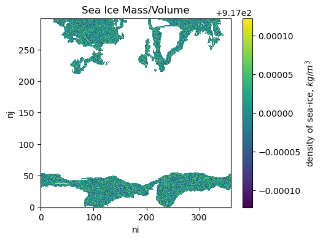
    


Using these densities, mass and volume terms balance : 

- $ sivol*rhoi = simass $  (sivol and simass are extensive)
- $ sisnthick*rhos = sisnmass $. (sisnthick and sisnmass are intensive)

We use [fixed salinity](https://github.com/ACCESS-NRI/access-esm1.6-configs/blob/c150adbad53b3dc8ed4079fe2136cbb767fa0a63/ice/cice_in.nml#L46) 
for sea ice of 4 g/kg. Therefore: 

- $ sisalt = simass * 0.004 $


Sea ice freeboad, thickness and snow thickness should balance to rounding error following Archimedes
principal of buoyancy. 
On the LHS we have mass of snow and sea ice together. 
On the RHS we have mass of sea water displaced, calculated as the volume of sea ice below the surface multiplied by density of water

$simass+sisnmass = (sithick-sifb)*rhow$

sithick, sisnthick, sifb are all weighted by ice fraction in time, and presented as $kg/m^2$


```python
plt.figure(figsize=(5,4))
(ds.simass+ds.sisnmass-(ds.sithick-ds.sifb)*ds.siconc/100*rhow).plot()
plt.title('Difference between mass of (sea ice + snow) and mass of water displaced')
plt.show()
```


    
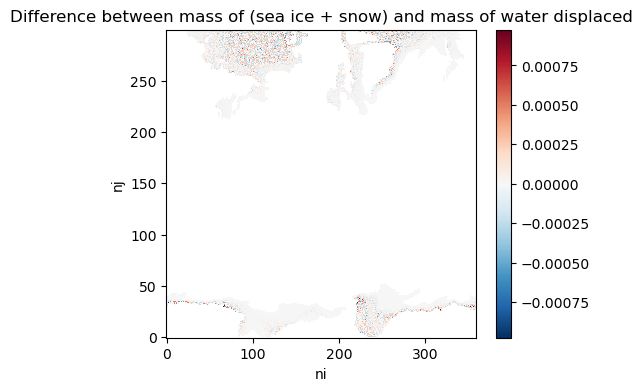
    


# Temperatures

Heat flux and sea ice surface temperature are calculated within the atmosphere model, and are not prognostic in the sea ice model component. Therefore sea ice surface temperature (`sitemptop`) and snow-ice interface temperature (`sitempsnic`) are not available as sea ice diagnostics. There is an extensive sea ice surface temperature in the atmosphere diagnostics (`surface_temperature` - UM stash code - s00i508)

Note that the atmoshpere diagnostic for `surface_temperature` uses Tfreeze (-1.8C) for ocean

$surface\_temperature = \frac{\displaystyle\sum {siconca * T_{surfa}}+\displaystyle\sum {(1-siconca) * T_{freezea}}}{N}$
For spencer / martin, is the above statement correct? How does the UM calculate Tfreeze ?
and is therefore different to data request for `sitemptop` (where open ocean would be masked)


```python
atm_ds = xr.open_dataset(f'{PATH}/atmosphere/netCDF/aiihca.pa-242501_mon.nc', decode_times=xr.coders.CFDatetimeCoder(use_cftime=True))
```


```python
plt.figure(figsize=(4,3))
((atm_ds['fld_s00i508'].where(atm_ds['fld_s00i031']>=0))-273.15).plot()
plt.title('Sea ice surface temperature diagnostic')
```


    Text(0.5, 1.0, 'Sea ice surface temperature diagnostic')


    
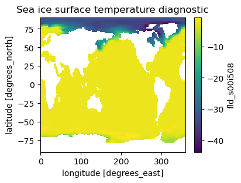
    


Sea ice bottom temperature (`sitempbot`) is available and is equal to the freezing point of sea water. The freezing point is calculated as :

$Tf = - sss * depressT$ where [depressT](https://github.com/ACCESS-NRI/cice5/blob/d8e6797b4b576fa953fcb7704bc62fed4f480017/drivers/access/ice_constants.F90#L42) is 0.054°/ppt

<!-- depressT is hardcoded into MOM5 at the same value - see https://github.com/ACCESS-NRI/MOM5/blob/627a321f7490afc69b4a8e777992bcfb1f58b5ae/src/mom5/ocean_tracers/ocean_frazil.F90#L450C6-L450C8 -->

# Heat Fluxes

There is no process for penetrating shortwave through sea ice (`sifswdbot` is zero). 
The sea ice thermodynamic model is zero-layer, so top and bottom conductive heat flux are equal (`siflcondtop = siflcondbot`)

There is no heat flux diagnostic for frazil melt potential but there is a diagnostic for
_Sea-Ice Mass Change Through Growth in Supercooled Open Water (Frazil)_ (`sidmassgrowthwat`)

We report surface fluxes as atmospheric diagnostics only:

| Var Name| Description|Stash Code|
|----|:----|----|
|rsds|Surface Downwelling Shortwave Radiation|s01i235|
|rsus|Surface Upwelling Shortwave Radiation|s01i211 |
|rlds|Surface Downwelling Longwave Radiation|s02i207|
|rlus|Surface Upwelling Longwave Radiation| ? |
|hfss|Surface Upward Sensible Heat Flux| s03i217 |
|hfls|Surface Upward Latent Heat Flux| s03i234 |

These are extensive diagnostics on the atmoshpere grid, the intensive form is not provided (i.e. 
_sifllattop, sifllwdtop, sifllwutop, siflsenstop, siflswdtop, siflswutop_ are not provided)

`siflsensbot`, `siflcontop` and `siflcondbot` are available (note they intensive diagnostic, energy flow per sea ice area)

# Salt / Water Fluxes

The sea ice diagnostic `siflfwbot` (Freshwater Flux from Sea Ice) is intensive, and different from
the ocean diagnostic `fsitherm` (Water Flux into Sea Water Due to Sea Ice Thermodynamics) 
which is extensive. We do not include snow melt in `siflfwbot`. We attempt to balance sea and ice diagnostics of salt and water fluxes below. They are close but not an exact match. 

We use split `fsitherm` into `wfimelt` and `wfiform` for water fluxes associated with melting (of sea ice and snow) and forming sea ice. (i.e. $fsitherm = wfimelt + wfiform$)

Open some ocean diagnostics:


```python
wfimelt = xr.open_dataset(f'{PATH}/ocean/ocean-2d-wfimelt-1monthly-mean-ym_2425_01.nc', decode_times=xr.coders.CFDatetimeCoder(use_cftime=True), decode_timedelta=True)
wfiform = xr.open_dataset(f'{PATH}/ocean/ocean-2d-wfiform-1monthly-mean-ym_2425_01.nc', decode_times=xr.coders.CFDatetimeCoder(use_cftime=True), decode_timedelta=True)
ocean_tarea = xr.open_dataset(f'{PATH}/ocean/ocean-2d-area_t.nc', decode_times=xr.coders.CFDatetimeCoder(use_cftime=True))
```

First we compare ocean and sea ice diganostics for sea ice formation


```python
plt.figure(figsize=(10,4))
for i,hemi in enumerate([sh,nh], start =1):
    plt.subplot(1,2,i)
    ((monthly_ds.sidmassgrowthwat+monthly_ds.sidmassgrowthbot)*monthly_ds.tarea
        ).sel(nj=hemi['slice']).sum(['ni','nj']).plot(label='Sea Ice Growth from Seawater')
         
    (-1*wfiform.wfiform*ocean_tarea.area_t
        ).isel(yt_ocean=hemi['slice']).sum(['xt_ocean','yt_ocean']).plot(label='Ocean Freshwater Removed')

    plt.legend()
    plt.ylabel('Freshwater change (kg)')
    plt.title(hemi['title'])

plt.show()

```


    
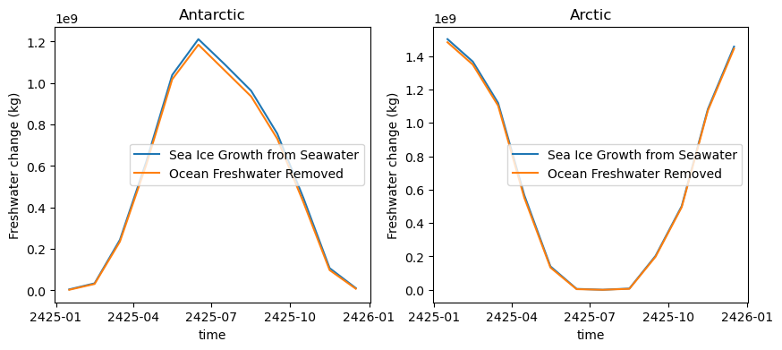
    


And we compare ocean and sea ice diganostics for melt


```python
plt.figure(figsize=(10,4))
for i,hemi in enumerate([sh,nh], start =1):
    plt.subplot(1,2,i)
    ((
     monthly_ds.sisndmassmelt
     + monthly_ds.sidmassmelttop
     + monthly_ds.sidmassmeltbot
     + monthly_ds.sidmassmeltlat
     )*monthly_ds.tarea).sel(nj=hemi['slice']).sum(['ni','nj']).plot(label='Sea Ice Melt Into Ocean')
     
    (-1*wfimelt.wfimelt*ocean_tarea.area_t
        ).isel(yt_ocean=hemi['slice']).sum(['xt_ocean','yt_ocean']).plot(label='Ocean Diagnostic')

    plt.legend()
    plt.ylabel('Freshwater change (kg)')
    plt.title(hemi['title'])

plt.show()
```


    
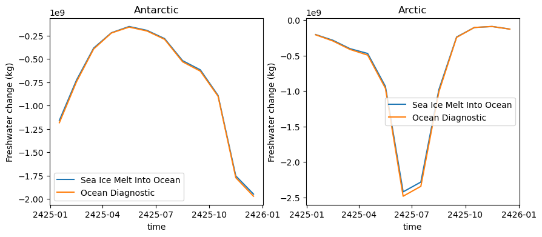
    


Salt is only transferred between the ocean and sea ice, there is no salt fluxes into or out of the atmosphere. ACCESS-ESM1.6 uses fixed salinity in sea ice, therefore all mass change in sea ice has a corresponding salt flux in the ocean (even though mass change can occur without a freshwater flux, e.g. if due to sno->ice conversion or evaporation/sublimation). 

The sea ice diagnostic `sidmassth` equals the ocean diagnostic `sfc_salt_flux_ice` divided by 0.004. This is should be true in all areas - we see differences in the order of $ 1e-6 kg/m^2 $ (~5%) in cells around the outer ice edge.


```python
salt = xr.open_dataset(f'{PATH}/ocean/ocean-2d-sfc_salt_flux_ice-1monthly-mean-ym_2425_01.nc', decode_times=xr.coders.CFDatetimeCoder(use_cftime=True), decode_timedelta=True)
```


```python
plt.pcolor((monthly_ds.sidmassth.isel(time=0).values+(salt.sfc_salt_flux_ice/0.004).isel(time=0).values))
plt.colorbar()
```


    <matplotlib.colorbar.Colorbar at 0x14ff1d3ff3d0>


    
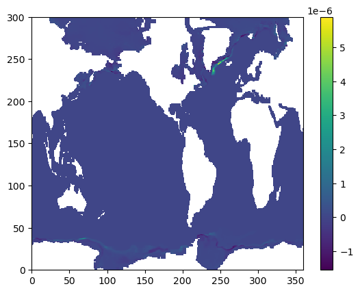
    


```python
plt.figure(figsize=(10,4))
for i,hemi in enumerate([sh,nh], start=1):
    plt.subplot(1,2,i)
    (monthly_ds.sidmassth*monthly_ds.tarea).sel(nj=hemi['slice']).sum(['ni','nj']).plot(label='Sea Ice Mass Change from Thermodynamics')
    
    (-1*salt.sfc_salt_flux_ice/0.004*ocean_tarea.area_t).isel(yt_ocean=hemi['slice']).sum(['xt_ocean','yt_ocean']).plot(label='Salt Flux / 0.004')

    plt.legend()
    plt.ylabel('Sea ice mass change (kg)')
    plt.title(hemi['title'])

plt.show()
```


    
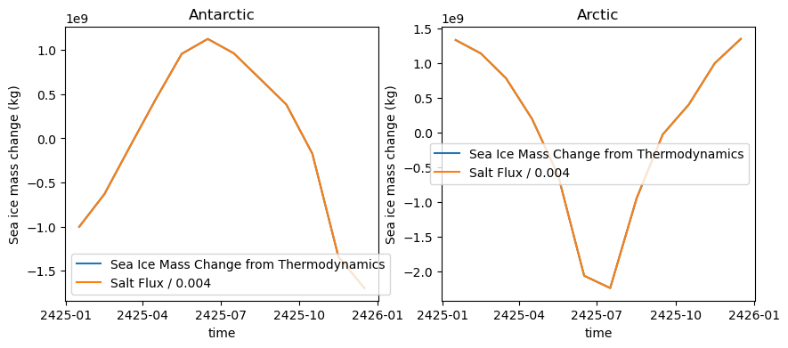
    


# Dynamics

By convention, diagnostics follow the same spatial discretisation as prognostic calculations within the model. CICE5 uses a generalised orthogonal B-grid as described in Murray 1996 or Smith, Korta and Meltz 1995. The ice and snow area, volume and energy are given at the centre of the cell, whilst velocity is defined at the corners. For diagnostics which combined quantities at cell centres and corners, e.g. mass transport, these are reported at the centre of the cell.

At cell centers: 
| Var Name| Description|
|----|:----|
|sidmassdyn	    |Sea-Ice Mass Change from Dynamics|
|sidmasstranx	|X-Component of Sea-Ice Mass Transport|
|sidmasstrany	|Y-Component of Sea-Ice Mass Transport|

`sidmassdyn` is the change in mass in a cell due to dynamics. Sea ice mass transport (`sidmasstran`)
is calculated as a rate of transport through the right (positive x) and top (positive y) edge of the cell.
The `sidmasstran` terms are calculated as $velocity * celledgelength*rhoi$, where velocity is a mean of the 
velocity in the relevant corners of the cell to reflect a average velocity across the edge.

These quantities are all reported on the corner points :

| Var Name| Description|
|----|:----|
|sicompstren		|	Compressive Sea Ice Strength |
|sistrxdtop		|	X-Component of Atmospheric Stress on Sea Ice |
|sistrxubot		|	X-Component of Ocean Stress on Sea Ice |
|sistrydtop		|	Y-Component of Atmospheric Stress on Sea Ice |
|sistryubot		|	Y-Component of Ocean Stress on Sea Ice |

Sea ice mass change from dynamics sums to zero (with rounding error) for each hemisphere as sea ice mass is conserved during sea ice dynamics processes.


```python
plt.figure(figsize=(5,4))
for hemi in [sh,nh]:
    (monthly_ds.sidmassdyn*monthly_ds.tarea).isel(nj=hemi['slice']).sum(['ni','nj']).plot(label = hemi['title']+' Sea Ice Mass Change')
plt.ylabel('Change in Mass, kg')
plt.legend(loc='center left', bbox_to_anchor=(1, 0.5))
plt.title('Mass change from sea ice dynamics')
plt.show()
```


    
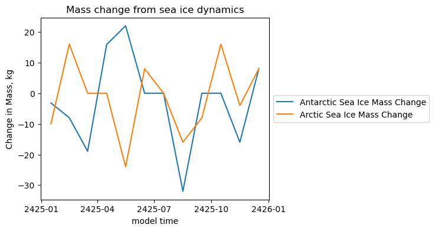
    


<!-- I would expect snow mass is also conserved by sea ice dynamics, however `sisndmassdyn` does not sum to zero. Nor does dvsdtd )-->


Snow is not conserved during sea ice dynamics


```python
for hemi in [sh,nh]:
    (monthly_ds.sisndmassdyn*monthly_ds.tarea).isel(nj=hemi['slice']).sum(['ni','nj']).plot(label = hemi['title']+' Snow Mass Change')

plt.ylabel('Change in Mass, kg')
plt.legend(loc='center left', bbox_to_anchor=(1, 0.5))
plt.title('Snow Mass change from sea ice dynamics')
plt.show()
```


    
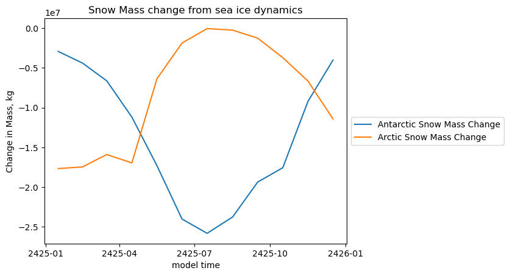
    


# Thermodynamics

The diagnostic for evaporation and sublimation can be positive in some model cells (i.e. mass gain) whilst as the sum for each hemisphere is negative (mass loss). This is for two reasons, firstly (`sidmassevapsubl`) can include condensation and deposition (desublimation). In addition, the evaporation flux is calculated within the atmosphere model, on the atmosphere grid, and conservatively regrid to the sea ice grid. Conservative regridding can lead to sign changes in some cells.

Diagnostics for Sea ice mass change are extensive

| Var Name| Description|
|----|:----|
| sidmassth |		Sea-Ice Mass Change from Thermodynamics |

is the sum of 

| Var Name| Description|
|----|:----|
|sidmassgrowthbot|	Sea-Ice Mass Change Through Basal Growth |
|sidmassgrowthsi|		Sea-Ice Mass Change Through Snow-to-Ice Conversion |
|sidmassgrowthwat|	Sea-Ice Mass Change Through Growth in Supercooled Open Water (Frazil) |
|sidmassmeltbot|		Sea-Ice Mass Change Through Bottom Melting |
|sidmassmeltlat|		Sea-Ice Mass Change Through Lateral Melting|
|sidmassmelttop|	    Sea-Ice Mass Change Through Surface Melting|
|sidmassevapsubl|	Sea-Ice Mass Change Through Evaporation and Sublimation|


```python
plt.figure(figsize=(5,4))
for hemi in [sh,nh]:
    ((   monthly_ds.sidmassgrowthwat
     + monthly_ds.sidmassgrowthbot
     + monthly_ds.sidmassgrowthsi
     + monthly_ds.sidmassevapsubl
     + monthly_ds.sidmassmelttop
     + monthly_ds.sidmassmeltbot
     + monthly_ds.sidmassmeltlat
    )*monthly_ds.tarea).isel(nj=hemi['slice']).sum(['ni','nj']).plot(label = hemi['title']+' Sum')
    (monthly_ds.sidmassth*monthly_ds.tarea).isel(nj=hemi['slice']).sum(['ni','nj']).plot(
        label = hemi['title']+' sidmasstherm', linestyle='--')

plt.title('Change in mass due to thermodynamics')
plt.ylabel('sea ice mass change, $kg/m^2$')
plt.legend()
plt.show()
```


    
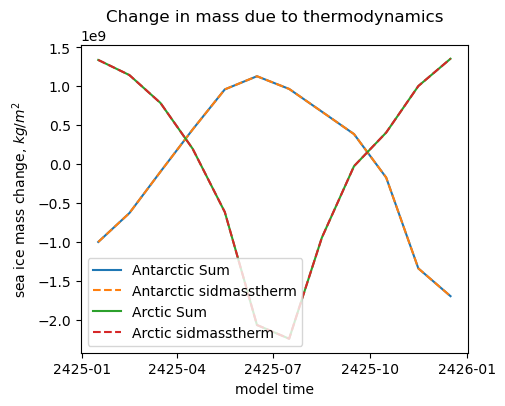
    


Similarly, `siflfwbot` should balances with the relevant `sidmass` terms. This is not an exact match, so maybe the sidmassterms are missing snow into the ocean due to ridging and rain on sea-ice which do get included into `siflfwbot`. Rain passes straight through the sea ice and into the ocean, so `sipr` is not provided.


```python
plt.figure(figsize=(10,4))
for i,hemi in enumerate([sh,nh], start=1):
    plt.subplot(1,2,i)

    ((   monthly_ds.sidmassgrowthwat
     + monthly_ds.sidmassgrowthbot
     + monthly_ds.sidmassmelttop
     + monthly_ds.sidmassmeltbot
     + monthly_ds.sidmassmeltlat
     + monthly_ds.sisndmassmelt
    )*monthly_ds.tarea).isel(nj=hemi['slice']).sum(['ni','nj']).plot(label = hemi['title']+' Sum')
    (-1*monthly_ds.siflfwbot*monthly_ds.tarea).isel(nj=hemi['slice']).sum(['ni','nj']).plot(label = hemi['title']+' siflfwbot')
    
    plt.ylabel('mass change, $kg/m^2$')
    plt.legend()

plt.suptitle('Change in mass due to siflfwbot')
plt.show()
```


    
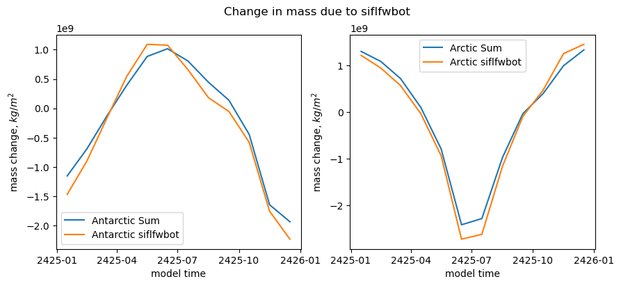
    


# Snow

We do not provide snow area fraction (`sisnconc`) or snow thickness (`sisnthick`) as they are prognostic only in the atmosphere model.

There is no process for blown snow on sea ice, so `sisndmasswind` (Snow Mass Rate of Change Through Wind Drift of Snow) is not reported. There are no melt ponds.

Variables for snow are generally masked for when there is sea ice (i.e. intensive)


There is no overall CMIP diagnostic for snow mass rate of change, however the sum of the following diagnostics should be the rate of snow accumulation for each hemisphere. 

| Var Name| Description|
|----|:----|
|sisndmassmelt		|Snow Mass Rate of Change Through Melt|
|sisndmasssi		|    Snow Mass Rate of Change Through Snow-to-Ice Conversion|
|sisndmasssnf		|Snow Mass Change Through Snowfall|
|sisndmasssubl		|Snow Mass Rate of Change Through Evaporation or Sublimation|


```python
plt.figure(figsize=(10,4))
for i,hemi in enumerate([sh,nh], start=1):
    plt.subplot(1,2,i)

    (( + monthly_ds.sisndmassmelt
      + monthly_ds.sisndmasssi
      + monthly_ds.sisndmasssnf
      + monthly_ds.sisndmasssubl
     )*monthly_ds.tarea).isel(nj=hemi['slice']).sum(['ni','nj']).plot(label = 'Snow diags sum (kg)')
    ((monthly_ds.dvsdtt/86400*rhos/100)*monthly_ds.tarea).isel(nj=hemi['slice']).sum(['ni','nj']).plot(
        label = 'dvsdtt * density (kg)', linestyle='--')
    plt.legend()
    plt.title(hemi['title'])
plt.show()

```


    
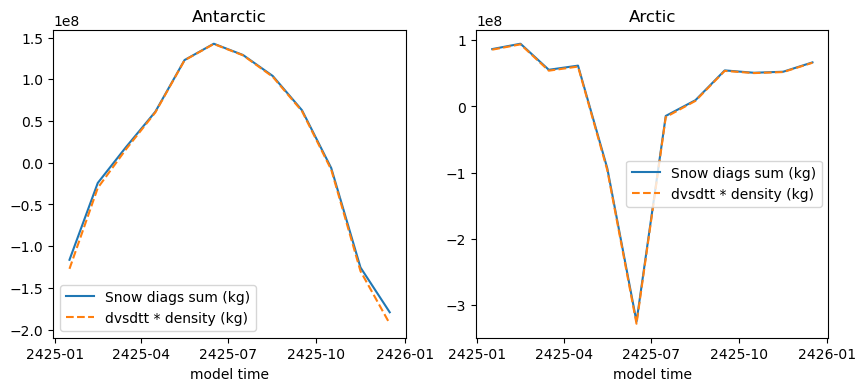
    


In CICE, Snow-to-Ice conversion only occurs when the weight of the snow pushes the sea ice below the water level 
(i.e. freeboard is negative) and the mass of snow is directly converted to a mass of sea ice. The process is adiabiatic,
there is no energy exchanged in the process. However `sidmassgrowthsi` is not equal to `sidmassgrowthsi` is extensive and `sisndmasssi` is intensive:


### Hemispheric Scalars

Diagnostics which do not have a spatial coordinate are only available via post-processings:

| Var Name| Description|
|----|:----|
|siareaacrossline			|	Sea-Ice Area Flux Through Straits|
|simassacrossline			|	Sea-Ice Mass Flux Through Straits|
|siarean		|	Sea-Ice Area North|
|siareas		|	Sea-Ice Area South|
|siextentn		|Sea-Ice Extent North|
|siextents		|Sea-Ice Extent South|
|sisnmassn		|	Snow Mass on Sea Ice North|
|sisnmasss		|	Snow Mass on Sea Ice South|
|sivoln		|	Sea-Ice Volume North|
|sivols		|	Sea-Ice Volume South|


```python

```
